# ModularPlatform pro nový CRM modul

Datum: 2026-06-25

Tento dokument je psaný pro vývojáře, který přijde k ModularPlatform a má postavit nový modul, například CRM.

Není to jen seznam šipek. Každý diagram má:

- **co se děje lidsky**;
- **kdo je vlastník dat**;
- **jaký building block použít**;
- **ukázku kódu**;
- **edge cases**;
- **co nepoužívat**.

## 0. Hlavní mapa: když v CRM chci něco udělat, kam sáhnu

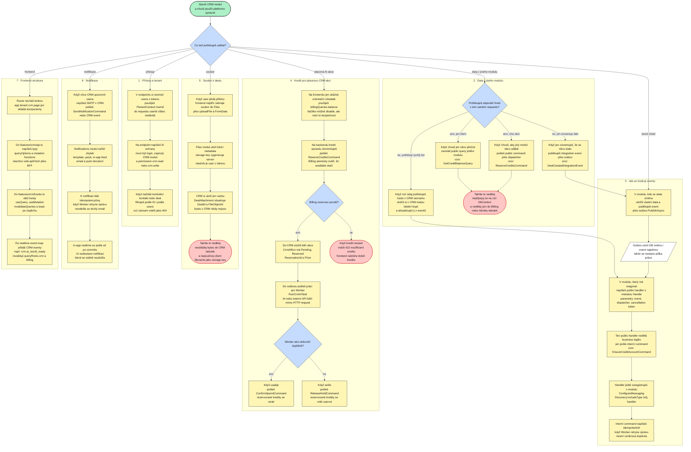

### Jak ten obrázek číst

- Vlevo jsou situace, které nový CRM vývojář reálně řeší.
- Uprostřed je to, co má napsat v CRM modulu: endpoint, command/query handler, CRM schema a případně outbox zprávu.
- Vpravo jsou hotové platformové moduly, které se nemají psát znovu.
- Dole je frontend struktura: route je tenká, data patří do `features/crm/api.ts`, hooky do `hooks.ts`, UI do `components`.
- Žlutý box je akce, bílý šikmý box je uložený stav/fronta, zelený ovál je vstupní bod.

### Nejkratší pravidlo

CRM vlastní CRM data. Všechno ostatní si bere z base:

| Chci v CRM | Použiju |
|---|---|
| zjistit usera nebo tenant | `ITenantContext`, Identity, Tenancy |
| zkontrolovat permission | `.RequirePermission(...)` |
| zkontrolovat, že tenant má CRM | `.RequireModule("crm")` |
| poslat notifikaci | Notifications modul |
| nahrát soubor | Files modul |
| zjistit nebo utratit kredit | Billing modul |
| spustit AI nebo import | Outbox + Worker |
| ukázat dlouhý status | Operations modul |
| aktualizovat UI po změně | Realtime event + React Query invalidace |
| export/erase PII | GDPR exporter/eraser v CRM |
| získat data z jiného modulu | public query/command contract, event nebo lokální projekce |

## 0.0 UseCases.md

Detailní katalog všech use cases a edge cases je samostatně v `UseCases.md` v rootu repozitáře. Tento architektonický dokument nechává jen hlavní mapu a praktické diagramy, aby se dal dobře otevřít v Markchart.

## 0.1 Jak získám data z jiného modulu

Tohle je nejdůležitější pravidlo pro ModularPlatform:

> Modul nesmí sahat na Core typy ani DbContext jiného modulu.

CRM tedy nesmí udělat `BillingDbContext.CreditAccounts` ani `IdentityDbContext.Users`. Když potřebuje data nebo reakci z jiného modulu, jsou čtyři správné způsoby.

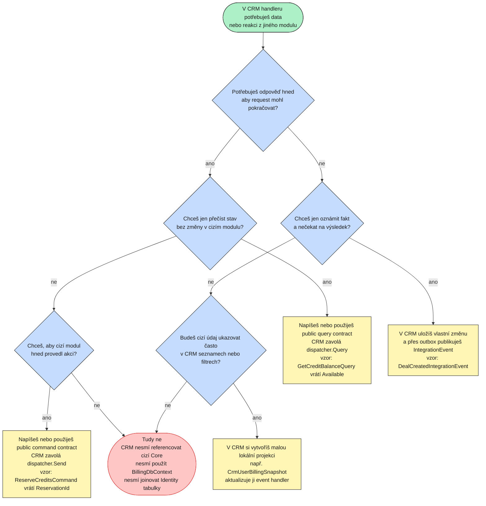

### Varianta A: chci odpověď hned, jen čtu data

Příklad: CRM chce ukázat, jestli user má dost kreditu na AI akci.

Správný tvar je public query contract vlastněný Billing modulem:

```csharp
// v Billing.Contracts nebo jiném public seam
public sealed record GetCreditBalanceQuery(Guid UserId)
    : IQuery<CreditBalanceResponse>;

public sealed record CreditBalanceResponse(
    Guid AccountId,
    Guid UserId,
    long Posted,
    long Available);
```

CRM handler:

```csharp
var balance = await dispatcher.Query(new GetCreditBalanceQuery(command.UserId), ct);

if (balance.Available < command.Price)
{
    throw new BusinessRuleException(
        "crm.ai.insufficient_credits",
        "Not enough credits for this CRM action.");
}
```

Pravidlo: CRM neví, kde Billing data leží. CRM zná jen public query.

### Varianta B: chci, aby jiný modul něco provedl hned

Příklad: CRM chce rezervovat kredity pro placenou AI akci.

Správný tvar je public command contract:

```csharp
public sealed record ReserveCreditsCommand(
    Guid UserId,
    long Amount,
    int? HoldMinutes = null) : ICommand<ReserveCreditsResponse>;

public sealed record ReserveCreditsResponse(Guid ReservationId, long Available);
```

CRM accept handler:

```csharp
var reservation = await dispatcher.Send(
    new ReserveCreditsCommand(command.UserId, Amount: 25, HoldMinutes: 30), ct);

var run = new CrmAiRun
{
    UserId = command.UserId,
    ContactId = command.ContactId,
    Status = "Pending",
    ReservationId = reservation.ReservationId,
    Price = 25,
    CreatedAt = clock.UtcNow,
};

outbox.DbContext.AiRuns.Add(run);
await outbox.PublishAsync(new RunCrmAiTask(run.Id, command.UserId));
await outbox.SaveChangesAndFlushMessagesAsync();
```

Poznámka k aktuálnímu stavu kódu: některé Billing credit commands jsou dnes v Billing Core namespace. Pro skutečné CRM cross-module použití je potřeba je vystavit přes `Billing.Contracts` nebo přes public credit port. CRM nesmí referencovat `ModularPlatform.Billing.Features.*`.

### Varianta C: nechci odpověď hned, jen oznamuju fakt

Příklad: v CRM vznikl deal a jiné moduly mohou reagovat.

CRM.Contracts:

```csharp
public sealed record DealCreatedIntegrationEvent(
    Guid EventId,
    DateTimeOffset OccurredAt,
    Guid TenantId,
    Guid UserId,
    Guid DealId,
    string DealName) : IIntegrationEvent;
```

CRM handler publikuje event přes outbox:

```csharp
await outbox.PublishAsync(new DealCreatedIntegrationEvent(
    EventId: Guid.CreateVersion7(),
    OccurredAt: clock.UtcNow,
    TenantId: tenantId,
    UserId: command.UserId,
    DealId: deal.Id,
    DealName: deal.Name));

await outbox.SaveChangesAndFlushMessagesAsync();
```

Jiný modul si event zpracuje později ve Workeru. CRM na to nečeká.

### Varianta D: potřebuju cizí data často v CRM listech

Příklad: CRM chce u každého dealu ukazovat „má user aktivní subscription tier“ nebo segment z jiného modulu.

Nedělat cross-module join při každém listu.

Správně:

1. Vlastník dat publikuje event, když se stav změní.
2. CRM si uloží lokální projekci jen těch polí, která potřebuje.
3. CRM list čte jen vlastní CRM schema.

Příklad projekce:

```csharp
internal sealed class CrmUserBillingSnapshot : AuditableEntity, ITenantScoped
{
    public Guid UserId { get; set; }
    public Guid? TenantId { get; set; }
    public string? SubscriptionTier { get; set; }
    public long LastKnownAvailableCredits { get; set; }
    public DateTimeOffset UpdatedAt { get; set; }
}
```

Event handler v CRM:

```csharp
public sealed class BillingCreditsChangedHandler
{
    public Task Handle(
        CreditsToppedUpIntegrationEvent message,
        IDispatcher dispatcher,
        CancellationToken ct) =>
        dispatcher.Send(new UpdateCrmBillingSnapshotCommand(
            message.UserId,
            message.NewPosted,
            message.OccurredAt), ct);
}
```

Tím CRM list zůstává rychlý a neporušuje hranice modulů.

## 0.2 Jak se eventy chainují a hookují

Event chain v ModularPlatform má tři části:

1. Modul publikuje public integration event přes outbox.
2. Consumer modul má public Wolverine handler s metodou `Handle(...)`.
3. Ten handler je jen tenký shell a dispatchne interní command.

```mermaid
flowchart LR
    classDef proc fill:#fff6b6,stroke:#1a1a1a,color:#1a1a1a
    classDef dec fill:#c6dcff,stroke:#1a1a1a,color:#1a1a1a
    classDef term fill:#adf0c7,stroke:#1a1a1a,color:#1a1a1a
    classDef data fill:#ffffff,stroke:#1a1a1a,color:#1a1a1a
    classDef err fill:#ffc6c6,stroke:#d93636,color:#1a1a1a

    PUBLISHER["V publisher modulu napíšeš handler<br/>ten uloží vlastní data<br/>a zavolá outbox.PublishAsync event"]:::proc
    EVENT[/"Outbox uloží DB změnu i event<br/>v jedné transakci<br/>když commit spadne, event neodejde"/]:::data
    WORKER["Worker event doručí consumerům<br/>Wolverine inbox hlídá deduplikaci<br/>retry řeší infrastruktura"]:::proc
    SHELL["V consumer modulu napíšeš public handler<br/>public sealed class XHandler<br/>Handle(event, IDispatcher, CancellationToken)"]:::proc
    COMMAND["Handler jen zavolá interní command<br/>dispatcher.Send(new NěcoCommand(...))<br/>business logika není v public shellu"]:::proc
    SAVE[/"Interní command uloží změnu<br/>jen do svého schematu<br/>např. Billing vytvoří CreditAccount"/]:::data
    REGISTER["Consumer handler zaregistruješ<br/>v ConfigureMessaging<br/>options.Discovery.IncludeType XHandler"]:::proc
    DONE(["Reakce hotová<br/>publisher o consumerovi vůbec nevěděl"]):::term

    PUBLISHER --> EVENT --> WORKER --> SHELL --> COMMAND --> SAVE --> REGISTER --> DONE
```

### Reálný pattern z base: registrace usera

Identity po registraci publikuje:

```csharp
public sealed record UserRegisteredIntegrationEvent(
    Guid EventId,
    DateTimeOffset OccurredAt,
    Guid UserId,
    Guid TenantId,
    string Email,
    string? DisplayName) : IIntegrationEvent;
```

Billing se hookne na event a vytvoří credit account:

```csharp
public sealed class ProvisionCreditAccountHandler
{
    public Task Handle(UserRegisteredIntegrationEvent message, IDispatcher dispatcher, CancellationToken ct) =>
        dispatcher.Send(new EnsureCreditAccountCommand(message.UserId, message.TenantId), ct);
}
```

Notifications se hookne na stejný event a pošle welcome:

```csharp
public sealed class SendWelcomeHandler(ILogger<SendWelcomeHandler> logger)
{
    public async Task Handle(UserRegisteredIntegrationEvent message, IDispatcher dispatcher, CancellationToken ct)
    {
        var data = new Dictionary<string, string>
        {
            ["locale"] = "en",
            ["email"] = message.Email,
            ["displayName"] = message.DisplayName ?? message.Email,
        };

        await dispatcher.Send(
            new SendNotificationCommand(message.UserId, "welcome", ["email", "inapp"], data,
                IdempotencyKey: $"welcome:{message.UserId:N}"), ct);
    }
}
```

Oba consumery reagují na jeden fakt `UserRegisteredIntegrationEvent`. Identity neví o Billingu ani Notifications.

### Jak handler zaregistrovat

V modulu, který event konzumuje:

```csharp
public void ConfigureMessaging(WolverineOptions options)
{
    options.Discovery.IncludeType<Messaging.ProvisionCreditAccountHandler>();
    options.Discovery.IncludeType<Messaging.SendWelcomeHandler>();
}
```

Pro CRM:

```csharp
public void ConfigureMessaging(WolverineOptions options)
{
    options.Discovery.IncludeType<Messaging.BillingCreditsChangedHandler>();
    options.Discovery.IncludeType<Messaging.RunCrmAiTaskHandler>();
    options.Discovery.IncludeType<Messaging.SendCrmFollowUpReminderHandler>();
}
```

### Proč public shell + interní command

Wolverine potřebuje public handler. Business logika má ale zůstat v modulu jako command handler.

Proto:

```csharp
public sealed class DealCreatedHandler
{
    public Task Handle(DealCreatedIntegrationEvent message, IDispatcher dispatcher, CancellationToken ct) =>
        dispatcher.Send(new IndexDealForSearchCommand(message.DealId), ct);
}
```

a skutečná logika je:

```csharp
internal sealed class IndexDealForSearchHandler(CrmDbContext db)
    : ICommandHandler<IndexDealForSearchCommand, Unit>
{
    public async Task<Unit> Handle(IndexDealForSearchCommand command, CancellationToken ct)
    {
        // business logika consumer modulu
        return Unit.Value;
    }
}
```

### Event edge cases

- Event handler může běžet víckrát: command musí být idempotentní.
- Chybějící template nebo volitelné nastavení nemá vždy poisonnout inbox. Někdy se loguje a skipne.
- Event payload má být fakt, ne velký dump PII dat.
- Event nečeká na odpověď. Pokud potřebuješ odpověď hned, použij query/command contract.
- Každý consumer musí být explicitně registrovaný v `ConfigureMessaging`.

## 0.3 Jak přesně zkontrolovat kredit pro akci

Jsou dvě úrovně kontroly:

1. **Frontend UX kontrola**: zobrazím balance a případně disable tlačítko.
2. **Backend skutečná kontrola**: rezervuju kredit atomicky v Billingu.

Frontend kontrola nikdy nestačí.

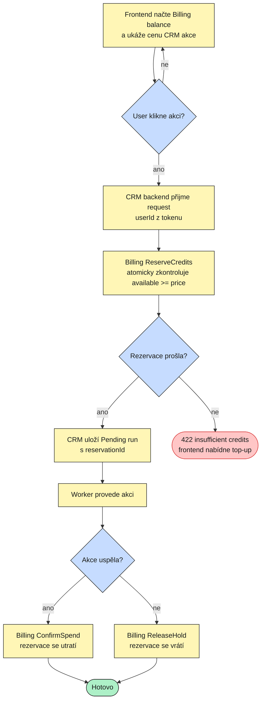

### Frontend UX

```tsx
const { data: balance } = useQuery(billingQueries.balance());
const price = 25;
const canRun = (balance?.available ?? 0) >= price;

return (
  <Button disabled={!canRun || draftMutation.isPending}>
    Draft email
  </Button>
);
```

### Backend security a correctness

```csharp
try
{
    var reservation = await dispatcher.Send(
        new ReserveCreditsCommand(command.UserId, Amount: 25, HoldMinutes: 30), ct);

    var run = new CrmAiRun
    {
        UserId = command.UserId,
        ContactId = command.ContactId,
        Status = "Pending",
        ReservationId = reservation.ReservationId,
        Price = 25,
        CreatedAt = clock.UtcNow,
    };

    outbox.DbContext.AiRuns.Add(run);
    await outbox.PublishAsync(new RunCrmAiTask(run.Id, command.UserId));
    await outbox.SaveChangesAndFlushMessagesAsync();

    return new DraftEmailResponse(run.Id);
}
catch (BusinessRuleException ex) when (ex.ErrorCode == "credit.insufficient_balance")
{
    throw new BusinessRuleException(
        "crm.ai.insufficient_credits",
        "Not enough credits for this CRM action.");
}
```

### Worker dokončení

```csharp
try
{
    var result = await ai.DraftEmailAsync(run.ContactId, ct);

    run.Status = "Succeeded";
    run.ResultJson = result.Json;
    run.TokenUsage = result.TokenUsage;
    await db.SaveChangesAsync(ct);

    await dispatcher.Send(new ConfirmSpendCommand(command.UserId, run.ReservationId), ct);
}
catch
{
    await dispatcher.Send(new ReleaseHoldCommand(command.UserId, run.ReservationId), ct);
    run.Status = "Failed";
    await db.SaveChangesAsync(ct);
    throw;
}
```

Pozor: pořadí může být produktové rozhodnutí. Když uložíš výsledek a potom spadne confirm spend, retry musí umět pokračovat confirmem. Proto musí `CrmAiRun` držet `ReservationId`, `Status` a ideálně stav účtování.

Lepší model:

```text
CrmAiRun
  Status: Pending | Running | Succeeded | Failed
  BillingStatus: Reserved | Confirmed | Released
  ReservationId
  Price
  TokenUsage
```

### Kreditové edge cases

- Balance na frontendu je stale: backend reservation je source of truth.
- Dva taby spustí dvě akce současně: Billing atomický guard povolí jen to, na co je kredit.
- AI selže: release hold.
- Worker spadne po AI success, před confirmem: retry najde run s výsledkem a dokončí confirm.
- Worker spadne po confirmu, před realtime: realtime se může ztratit; UI musí umět refetch/poll.
- Hold expiruje během dlouhé AI akce: confirm může selhat; akce má skončit Failed nebo se musí rezervace držet dost dlouho.

## 1. Co znamená ModularPlatform base

ModularPlatform je SaaS základ. Nový modul nemá znovu stavět věci, které už platforma umí.

CRM modul má řešit CRM doménu:

- kontakty;
- firmy;
- dealy;
- aktivity;
- CRM AI běhy;
- vazby CRM objektů na soubory.

CRM modul nemá znovu řešit:

- login a JWT;
- tenanty a entitlementy;
- kredity a ledger;
- file storage;
- notifikace;
- queue/outbox;
- realtime stream;
- audit;
- GDPR orchestraci;
- background jobs framework.

### Architektura jedním obrázkem

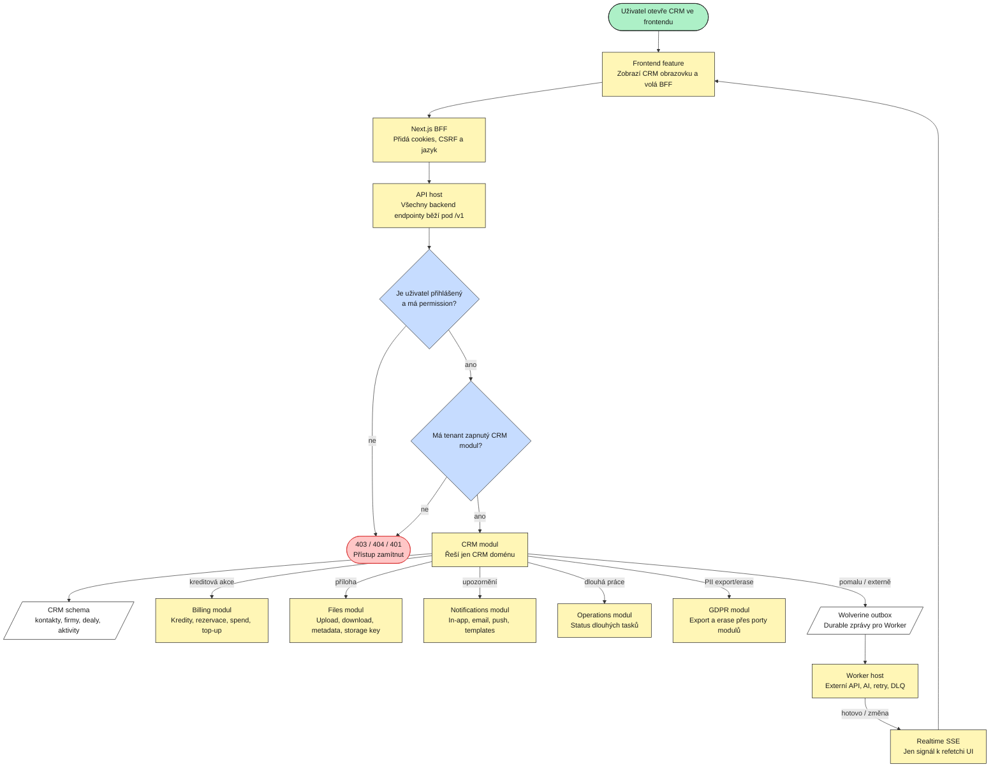

### Slovy

Když CRM něco potřebuje, nepíše vlastní infrastrukturu. Použije existující modul:

- přístup řeší Identity + Tenancy;
- kredity řeší Billing;
- soubory řeší Files;
- notifikace řeší Notifications;
- dlouhé tasky řeší Worker a případně Operations;
- UI refresh řeší Realtime;
- GDPR orchestruje GDPR modul, ale data exportuje/maže CRM samo.

## 2. Jak poznat, kam patří nová věc

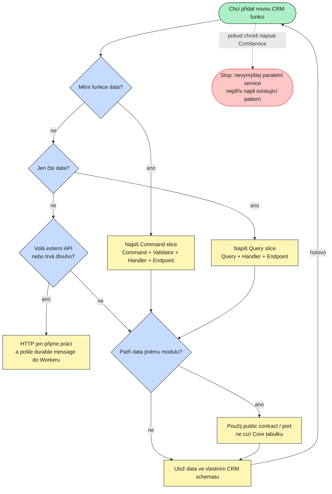

### Praktické pravidlo

V ModularPlatform se business logika nepíše do obecných service tříd typu `CrmService`. Píše se do command/query handlerů ve vertical slice.

**Použít:**

```text
Features/Contacts/CreateContact/
  CreateContactCommand.cs
  CreateContactValidator.cs
  CreateContactHandler.cs
  CreateContactEndpoint.cs
```

**Nepoužívat:**

```text
Services/CrmService.cs
```

## 3. Struktura nového CRM modulu

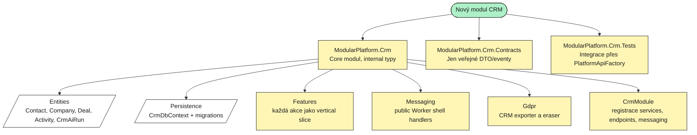

### Doporučená složka

```text
src/modules/Crm/
  ModularPlatform.Crm/
    CrmModule.cs
    Entities/
    Persistence/
    Features/
    Messaging/
    Gdpr/
  ModularPlatform.Crm.Contracts/
  ModularPlatform.Crm.Tests/
```

### `CrmModule.cs`

```csharp
public sealed class CrmModule : IModule
{
    public string Name => "Crm";

    public void RegisterServices(IServiceCollection services, IConfiguration configuration)
    {
        var write = configuration.GetConnectionString("Write")
            ?? throw new InvalidOperationException("Missing ConnectionStrings:Write");
        var read = configuration.GetConnectionString("Read") ?? write;

        services.AddCqrs(typeof(CrmModule).Assembly);
        services.AddValidatorsFromAssembly(typeof(CrmModule).Assembly, includeInternalTypes: true);

        services.AddModuleDbContext<CrmDbContext>(Name, write);
        services.AddModuleReadDbContext<CrmDbContext>(read);

        services.AddScoped<IExportPersonalData, CrmPersonalDataExporter>();
        services.AddScoped<IErasePersonalData, CrmPersonalDataEraser>();
    }

    public void MapEndpoints(IEndpointRouteBuilder endpoints)
    {
        endpoints.MapCreateContact();
        endpoints.MapListContacts();
        endpoints.MapAttachFileToDeal();
        endpoints.MapDraftEmail();
    }

    public void ConfigureMessaging(WolverineOptions options)
    {
        options.Discovery.IncludeType<RunCrmAiTaskHandler>();
    }
}
```

### Edge cases

- Core typy neexportovat jako `public`, pokud nemusí.
- `Contracts` nesmí tahat EF, Web, Persistence ani Core typy.
- Endpointy mapují relativní routy, například `/crm/contacts`, ne `/v1/crm/contacts`.
- Modul se musí registrovat ve všech hostech: Api, Worker, Jobs, MigrationService.

## 4. Přístup: kdo smí použít CRM

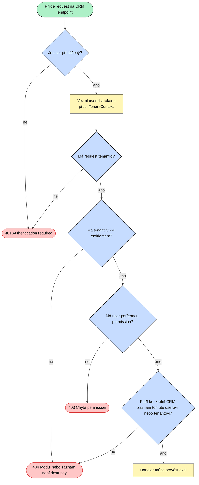

### Co to znamená v kódu

Endpoint:

```csharp
app.MapPost("/crm/contacts", async (
        CreateContactRequest request,
        ITenantContext tenant,
        IDispatcher dispatcher,
        CancellationToken ct) =>
    {
        var userId = tenant.UserId
            ?? throw new UnauthorizedException("auth.required", "Authentication required.");

        var result = await dispatcher.Send(
            new CreateContactCommand(userId, request.Email, request.DisplayName), ct);

        return Results.Created((string?)null, ApiResponse<CreateContactResponse>.Ok(result));
    })
    .RequireAuthorization()
    .RequireModule("crm")
    .RequirePermission(PlatformPermissions.CrmWrite);
```

Handler pro konkrétní záznam:

```csharp
var contact = await db.Contacts
    .FirstOrDefaultAsync(c => c.Id == command.ContactId && c.UserId == command.UserId, ct)
    ?? throw new NotFoundException("crm.contact_not_found", "Contact not found.");
```

### Použít

- `ITenantContext.UserId`
- `ITenantContext.TenantId`
- `.RequireAuthorization()`
- `.RequireModule("crm")`
- `.RequirePermission(...)`
- explicitní owner filter v query

### Nepoužívat

```json
{
  "userId": "client-sent-user-id"
}
```

Klient nesmí říkat, za koho se akce provádí.

### Edge cases

- User pošle ID cizího kontaktu: vrátit 404, ne informaci, že záznam existuje.
- Tenant přijde o entitlement během session: `.RequireModule("crm")` to zachytí hned na dalším requestu.
- Frontend schová CRM z navigace, ale backend guard musí stejně existovat.

## 5. CRM data a PII

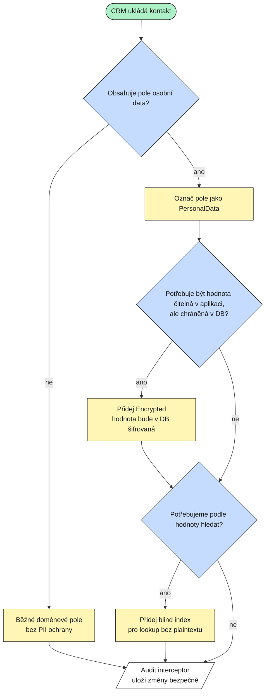

### Příklad entity

```csharp
internal sealed class Contact : AuditableEntity, ITenantScoped, IUserOwned, IDataSubject
{
    public Guid UserId { get; set; }
    public Guid? TenantId { get; set; }

    [PersonalData]
    [Encrypted]
    public string Email { get; set; } = string.Empty;

    public string EmailHash { get; set; } = string.Empty;

    [PersonalData]
    public string DisplayName { get; set; } = string.Empty;

    public DateTimeOffset CreatedAt { get; set; }

    Guid IDataSubject.SubjectId => UserId;
}
```

### Handler lookup přes blind index

```csharp
var emailHash = blindIndex.Hash(command.Email.Trim().ToUpperInvariant());

if (await db.Contacts.AnyAsync(c => c.UserId == command.UserId && c.EmailHash == emailHash, ct))
{
    throw new ConflictException("crm.contact.email_exists", "Contact with this email already exists.");
}
```

### Nepoužívat

- plaintext email lookup nad encrypted sloupcem;
- navigation property na `Identity.User`;
- ruční audit log pro CRM změny;
- raw SQL.

## 6. Uložení kontaktu

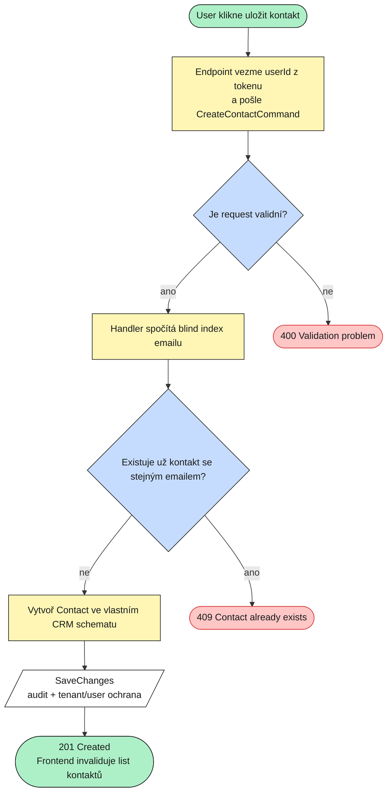

### Command + request

```csharp
internal sealed record CreateContactCommand(
    Guid UserId,
    string Email,
    string DisplayName) : ICommand<CreateContactResponse>;

internal sealed record CreateContactResponse(Guid Id);

internal sealed record CreateContactRequest(string Email, string DisplayName);
```

### Validator

```csharp
internal sealed class CreateContactValidator : AbstractValidator<CreateContactCommand>
{
    public CreateContactValidator()
    {
        RuleFor(x => x.Email)
            .NotEmpty()
            .EmailAddress()
            .WithErrorCode("crm.contact.email_invalid");

        RuleFor(x => x.DisplayName)
            .NotEmpty()
            .MaximumLength(200)
            .WithErrorCode("crm.contact.display_name_required");
    }
}
```

### Handler

```csharp
internal sealed class CreateContactHandler(
    CrmDbContext db,
    IBlindIndexHasher blindIndex,
    IClock clock)
    : ICommandHandler<CreateContactCommand, CreateContactResponse>
{
    public async Task<CreateContactResponse> Handle(CreateContactCommand command, CancellationToken ct)
    {
        var emailHash = blindIndex.Hash(command.Email.Trim().ToUpperInvariant());

        if (await db.Contacts.AnyAsync(c => c.UserId == command.UserId && c.EmailHash == emailHash, ct))
        {
            throw new ConflictException("crm.contact.email_exists", "Contact with this email already exists.");
        }

        var contact = new Contact
        {
            UserId = command.UserId,
            Email = command.Email.Trim(),
            EmailHash = emailHash,
            DisplayName = command.DisplayName.Trim(),
            CreatedAt = clock.UtcNow,
        };

        db.Contacts.Add(contact);
        await db.SaveChangesAsync(ct);

        return new CreateContactResponse(contact.Id);
    }
}
```

### Edge cases

- Dva requesty najednou se stejným emailem: přidat DB unique constraint a chytit unique violation jako conflict.
- Email je PII: neukládat lookup plaintextem.
- User refreshne list: frontend po success invaliduje query.

## 7. Čtení kontaktů

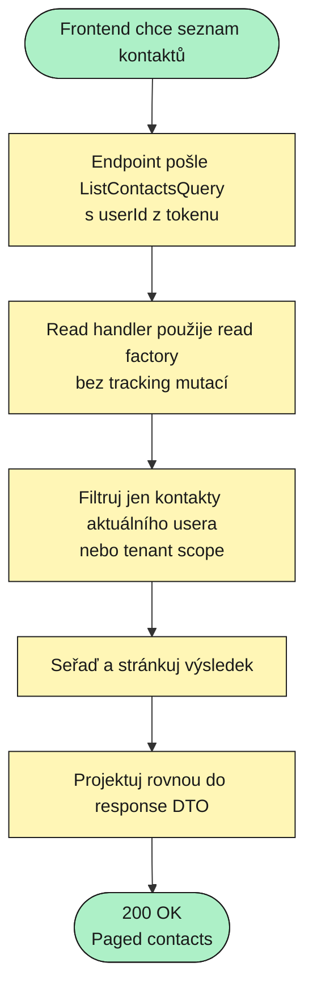

### Handler

```csharp
internal sealed class ListContactsHandler(IReadDbContextFactory<CrmDbContext> readFactory)
    : IQueryHandler<ListContactsQuery, PagedResponse<ContactListItem>>
{
    public async Task<PagedResponse<ContactListItem>> Handle(ListContactsQuery query, CancellationToken ct)
    {
        await using var db = readFactory.Create();

        return await db.Contacts
            .Where(c => c.UserId == query.UserId)
            .OrderBy(c => c.DisplayName)
            .Select(c => new ContactListItem(c.Id, c.DisplayName, c.Email, c.CreatedAt))
            .ToPagedResponseAsync(query.Page, query.PageSize, ct);
    }
}
```

### Nepoužívat

- query handler, který volá `SaveChanges`;
- query handler, který publikuje event;
- load celé entity a mapování až v paměti, když stačí `Select`.

## 8. Notifikace z CRM

Příklad: CRM přiřadí deal obchodníkovi a chce mu poslat upozornění.

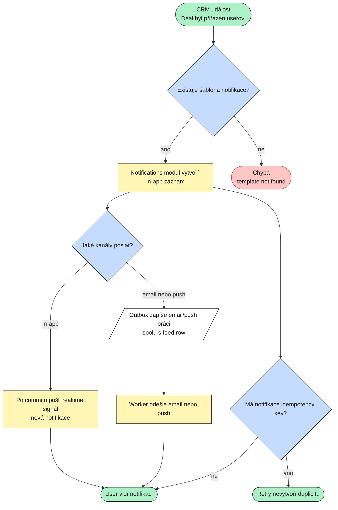

### Použití z CRM

Pokud je pro to public contract/command:

```csharp
await dispatcher.Send(new SendNotificationCommand(
    UserId: assignedUserId,
    TemplateKey: "crm.deal_assigned",
    Channels: ["inapp", "email"],
    Data: new Dictionary<string, string>
    {
        ["dealName"] = deal.Name,
        ["email"] = assignedUserEmail,
        ["locale"] = "en",
    },
    IdempotencyKey: $"crm.deal_assigned:{deal.Id}:{assignedUserId}"), ct);
```

### Proč nepoužít vlastní SMTP

Notifications už řeší:

- šablony;
- locale fallback;
- in-app feed;
- email/push work přes outbox;
- idempotency key;
- realtime až po commitu;
- retry přes Worker.

### Edge cases

- Chybí template: seednout `crm.deal_assigned`.
- Email channel bez emailu: data musí obsahovat adresu.
- Worker retry: idempotency key zabrání duplicitnímu emailu.
- Realtime před commitem by vytvořil phantom notifikaci, proto se posílá až po commitu.

## 9. Upload souboru k dealu

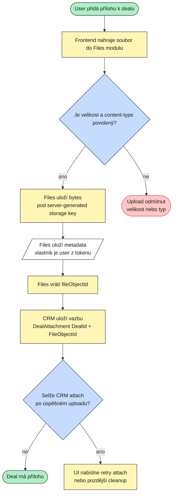

### Frontend

```ts
const uploaded = await uploadFile(file);
await attachFileToDeal({ dealId, fileId: uploaded.id });
```

### CRM entita

```csharp
internal sealed class DealAttachment : AuditableEntity, ITenantScoped, IUserOwned
{
    public Guid UserId { get; set; }
    public Guid? TenantId { get; set; }
    public Guid DealId { get; set; }
    public Guid FileObjectId { get; set; }
    public DateTimeOffset CreatedAt { get; set; }
}
```

### Handler

```csharp
internal sealed class AttachFileToDealHandler(CrmDbContext db, IClock clock)
    : ICommandHandler<AttachFileToDealCommand, Unit>
{
    public async Task<Unit> Handle(AttachFileToDealCommand command, CancellationToken ct)
    {
        var ownsDeal = await db.Deals
            .AnyAsync(d => d.Id == command.DealId && d.UserId == command.UserId, ct);
        if (!ownsDeal)
        {
            throw new NotFoundException("crm.deal_not_found", "Deal not found.");
        }

        db.DealAttachments.Add(new DealAttachment
        {
            UserId = command.UserId,
            DealId = command.DealId,
            FileObjectId = command.FileObjectId,
            CreatedAt = clock.UtcNow,
        });

        await db.SaveChangesAsync(ct);
        return Unit.Value;
    }
}
```

### Edge cases

- Upload projde, CRM attach selže: soubor existuje ve Files, ale není navázaný. UI má nabídnout retry attach nebo cleanup.
- Soubor někdo smaže: CRM attachment může ukazovat na missing file; UI má umět zobrazit „soubor není dostupný“.
- Ověření vlastnictví file: ideálně public Files query/port, ne přímý join do Files tabulek.
- Nikdy nepoužívat klientský filename jako storage key.

## 10. Kredity pro placenou CRM akci

Příklad: CRM AI draft emailu stojí 25 credits.

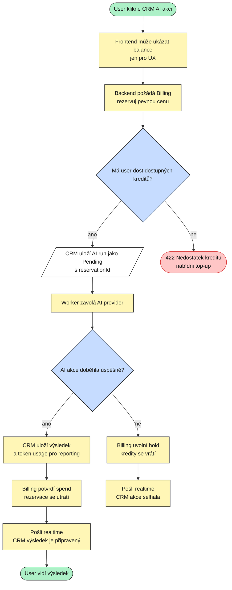

### Frontend check není security

```tsx
const { data: balance } = useQuery(billingQueries.balance());
const price = 25;
const canRun = (balance?.available ?? 0) >= price;

return (
  <Button disabled={!canRun || draftMutation.isPending}>
    Draft email
  </Button>
);
```

Backend musí stejně zavolat Billing reservation. Balance se může změnit mezi renderem a klikem.

### Backend koncept

```csharp
var reservation = await dispatcher.Send(
    new ReserveCreditsCommand(command.UserId, Amount: 25, HoldMinutes: 30), ct);

var run = new CrmAiRun
{
    UserId = command.UserId,
    ContactId = command.ContactId,
    Status = "Pending",
    ReservationId = reservation.ReservationId,
    CreatedAt = clock.UtcNow,
};

outbox.DbContext.AiRuns.Add(run);
await outbox.PublishAsync(new RunCrmAiTask(run.Id, command.UserId));
await outbox.SaveChangesAndFlushMessagesAsync();
```

### Důležitá architektonická poznámka

V aktuálním Billingu jsou některé credit commandy v Billing Core namespace. CRM Core nesmí přímo referencovat cizí Core.

Před finální implementací placených CRM akcí je potřeba udělat public seam:

- přesunout veřejné credit commands/queries do `Billing.Contracts`;
- nebo definovat platformový credit port.

Preferovaně `Billing.Contracts`, protože platforma používá command/query styl.

### Token billing edge case

Současný Billing potvrzuje celou rezervaci.

Když rezervuješ 25, `ConfirmSpend` utratí 25.

Pokud chceš přesné účtování podle tokenů, musí Billing dostat novou schopnost:

```text
ConfirmSpendAmount(reservationId, actualAmount)
```

nebo:

```text
AdjustReservation(reservationId, actualAmount)
```

Bez toho CRM nesmí rozdíl „vracet“ mimo ledger.

### Edge cases

- User měl kredit při renderu, ale mezitím ho utratil: reservation vrátí 422.
- AI provider spadne: release hold.
- Worker retry: nesmí vzniknout druhý CRM výsledek.
- Confirm spend spadne po uložení výsledku: retry musí podle stavu doběhnout confirm.
- Hold expiruje před koncem AI: task musí skončit Failed nebo mít jasnou retry politiku.

## 11. Dlouhé tasky a Worker

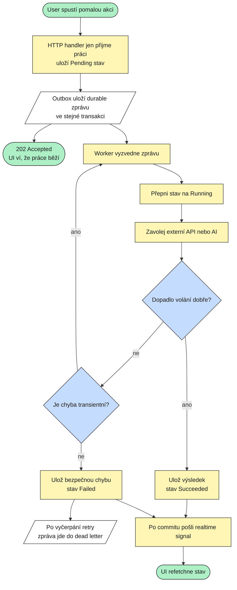

### Accept handler

```csharp
internal sealed class DraftEmailHandler(IDbContextOutbox<CrmDbContext> outbox, IClock clock)
    : ICommandHandler<DraftEmailCommand, DraftEmailResponse>
{
    public async Task<DraftEmailResponse> Handle(DraftEmailCommand command, CancellationToken ct)
    {
        var run = new CrmAiRun
        {
            UserId = command.UserId,
            ContactId = command.ContactId,
            Kind = "draft_email",
            Status = "Pending",
            CreatedAt = clock.UtcNow,
        };

        outbox.DbContext.AiRuns.Add(run);

        await outbox.PublishAsync(new RunCrmAiTask(run.Id, command.UserId));
        await outbox.SaveChangesAndFlushMessagesAsync();

        return new DraftEmailResponse(run.Id);
    }
}
```

### Worker shell

```csharp
public sealed class RunCrmAiTaskHandler
{
    public Task Handle(RunCrmAiTask message, IDispatcher dispatcher, CancellationToken ct) =>
        dispatcher.Send(new ProcessCrmAiTaskCommand(message.RunId, message.UserId), ct);
}
```

### Worker command handler

```csharp
internal sealed class ProcessCrmAiTaskHandler(
    CrmDbContext db,
    ICrmAiGateway ai,
    IRealtimePublisher realtime,
    IClock clock)
    : ICommandHandler<ProcessCrmAiTaskCommand>
{
    public async Task<Unit> Handle(ProcessCrmAiTaskCommand command, CancellationToken ct)
    {
        var run = await db.AiRuns
            .FirstOrDefaultAsync(r => r.Id == command.RunId && r.UserId == command.UserId, ct);
        if (run is null)
        {
            return Unit.Value;
        }

        if (run.Status is "Succeeded" or "Failed")
        {
            return Unit.Value;
        }

        run.Status = "Running";
        await db.SaveChangesAsync(ct);

        var result = await ai.DraftEmailAsync(run.ContactId, ct);

        run.Status = "Succeeded";
        run.ResultJson = result.Json;
        run.TokenUsage = result.TokenUsage;
        run.CompletedAt = clock.UtcNow;

        await db.SaveChangesAsync(ct);

        await realtime.PublishToUserAsync(
            command.UserId,
            "crm.ai_result_ready",
            new { runId = run.Id },
            ct);

        return Unit.Value;
    }
}
```

### Edge cases

- Worker zpráva může přijít znovu: handler musí být idempotentní.
- Externí API timeout: nepolykat, Wolverine retry/DLQ má pracovat.
- Do outbox zprávy neposílat velké PII payloady, posílat ID.
- Realtime až po commitu.
- Stuck Running: přidat reconcile job nebo Operations status.

## 12. Operations status

Operations použij, když user potřebuje sledovat dlouhý job obecně.

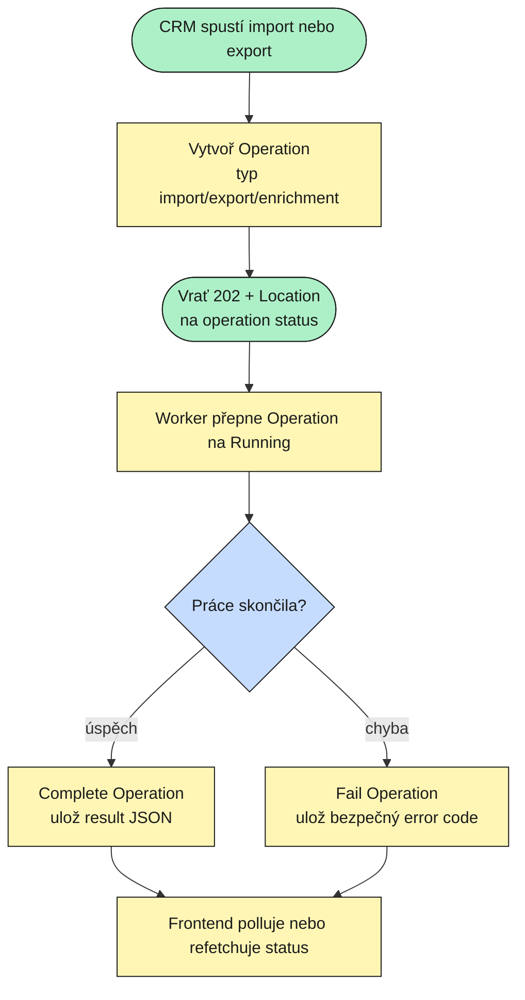

### Kdy Operations a kdy CRM vlastní stav

- `CrmAiRun`: když výsledek je CRM doménový artefakt.
- `Operation`: když UI potřebuje obecný progress/status dlouhé práce.
- Obojí: když chceš obecný status i doménový výsledek.

## 13. Realtime

Realtime je signál k refetchi. Není to zdroj pravdy.

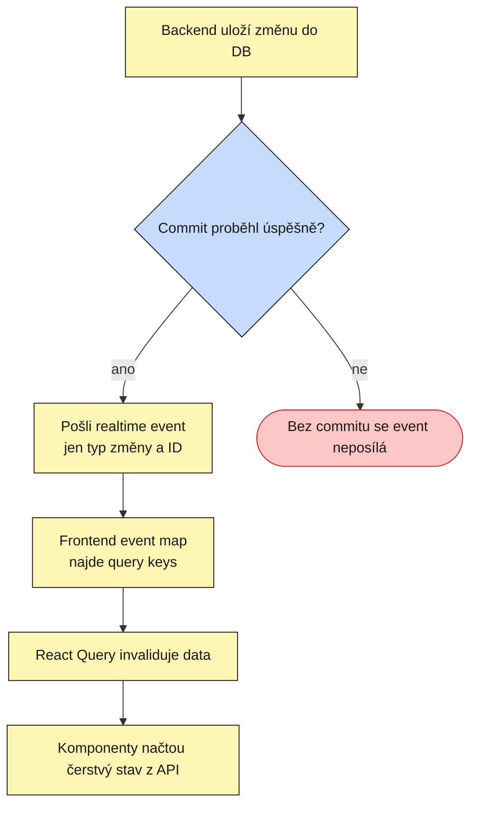

### Backend

```csharp
await db.SaveChangesAsync(ct);

await realtime.PublishToUserAsync(
    userId,
    "crm.contact_updated",
    new { contactId },
    ct);
```

### Frontend event map

```ts
export const eventQueryInvalidations = {
  "crm.contact_updated": [[...queryRoots.crm, "contacts"]],
  "crm.ai_result_ready": [[...queryRoots.crm, "aiRuns"], [...queryRoots.billing]],
};
```

### Nepoužívat

- vlastní WebSocket pro CRM;
- realtime payload jako kompletní data;
- realtime před DB commitem.

## 14. GDPR a audit

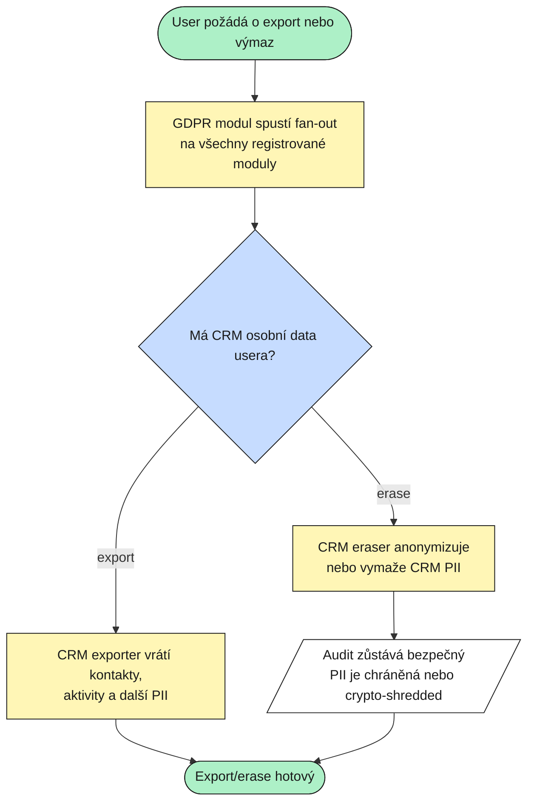

### Registrace v modulu

```csharp
services.AddScoped<IExportPersonalData, CrmPersonalDataExporter>();
services.AddScoped<IErasePersonalData, CrmPersonalDataEraser>();
```

### Exporter

```csharp
internal sealed class CrmPersonalDataExporter(CrmDbContext db) : IExportPersonalData
{
    public string ModuleName => "crm";

    public async Task<IReadOnlyDictionary<string, object?>> ExportAsync(Guid userId, CancellationToken ct)
    {
        var contacts = await db.Contacts
            .Where(c => c.UserId == userId)
            .Select(c => new { c.Id, c.DisplayName, c.Email, c.CreatedAt })
            .ToListAsync(ct);

        return new Dictionary<string, object?>
        {
            ["contacts"] = contacts,
        };
    }
}
```

### Audit pravidlo

Audit je automatický, pokud používáš tracked entity a `SaveChanges`.

Nepoužívat `ExecuteUpdate` pro běžné CRM business změny, protože audit interceptor obchází.

## 15. Frontend architektura

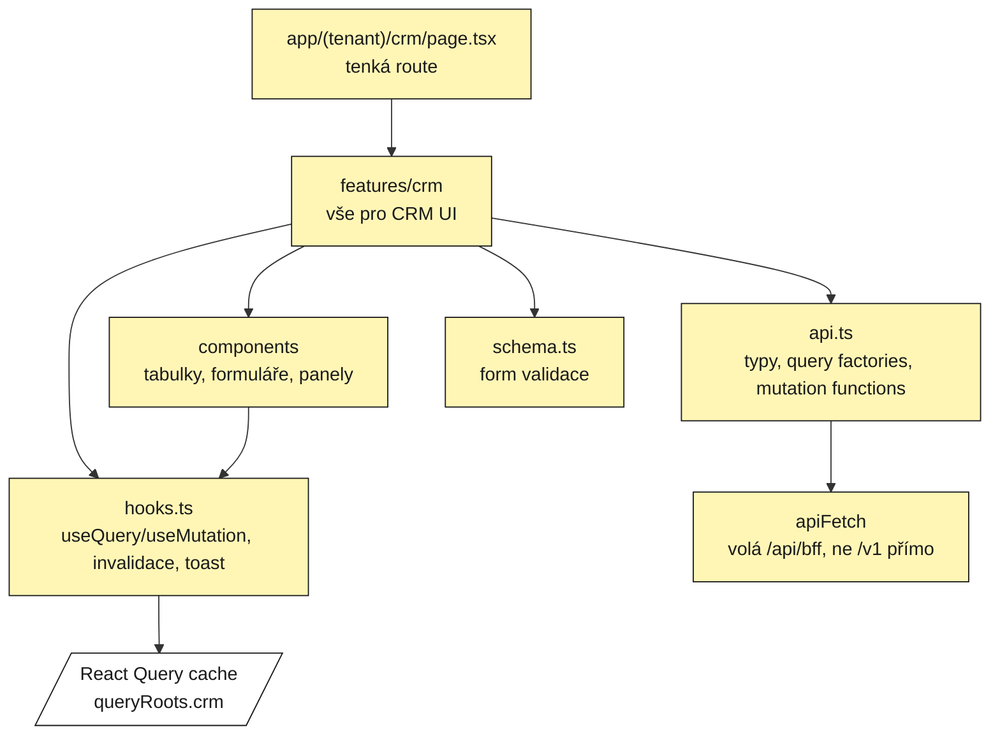

### Struktura

```text
frontend/app/(tenant)/crm/page.tsx

frontend/features/crm/
  api.ts
  hooks.ts
  schema.ts
  components/
    contacts-table.tsx
    contact-form.tsx
    deal-detail.tsx
    deal-attachments.tsx
    crm-ai-panel.tsx
```

### Query root

```ts
export const queryRoots = {
  crm: ["crm"] as const,
  // ...
} as const;
```

### `features/crm/api.ts`

```ts
import { queryOptions } from "@tanstack/react-query";
import { apiFetch } from "@/lib/api/client";
import { queryRoots } from "@/lib/api/query-keys";
import type { Paged } from "@/lib/api/types";

export interface ContactListItem {
  id: string;
  displayName: string;
  email: string;
  createdAt: string;
}

export interface CreateContactRequest {
  displayName: string;
  email: string;
}

export const crmQueries = {
  contacts: (page = 1, pageSize = 20) =>
    queryOptions({
      queryKey: [...queryRoots.crm, "contacts", page, pageSize],
      queryFn: () =>
        apiFetch<Paged<ContactListItem>>(
          `crm/contacts?page=${page}&pageSize=${pageSize}`,
        ),
      staleTime: 30_000,
    }),
};

export function createContact(request: CreateContactRequest) {
  return apiFetch<{ id: string }>("crm/contacts", {
    method: "POST",
    body: request,
  });
}
```

### `features/crm/hooks.ts`

```ts
"use client";

import { useMutation, useQuery, useQueryClient } from "@tanstack/react-query";
import { toast } from "sonner";
import { queryRoots } from "@/lib/api/query-keys";
import { createContact, crmQueries } from "@/features/crm/api";

export function useContacts(page = 1, pageSize = 20) {
  return useQuery(crmQueries.contacts(page, pageSize));
}

export function useCreateContact() {
  const queryClient = useQueryClient();

  return useMutation({
    mutationFn: createContact,
    onSuccess: () => {
      toast.success("Contact created");
      void queryClient.invalidateQueries({
        queryKey: [...queryRoots.crm, "contacts"],
      });
    },
  });
}
```

### Frontend edge cases

- Po create invalidovat list.
- Po update invalidovat list i detail.
- Po delete zavřít detail/modal a invalidovat list.
- Button disable během pending mutation.
- Backend 401 přesměruje přes BFF login flow.
- Backend 422/409 ukázat jako business error, ne generic crash.

## 16. Frontend navigace a oprávnění

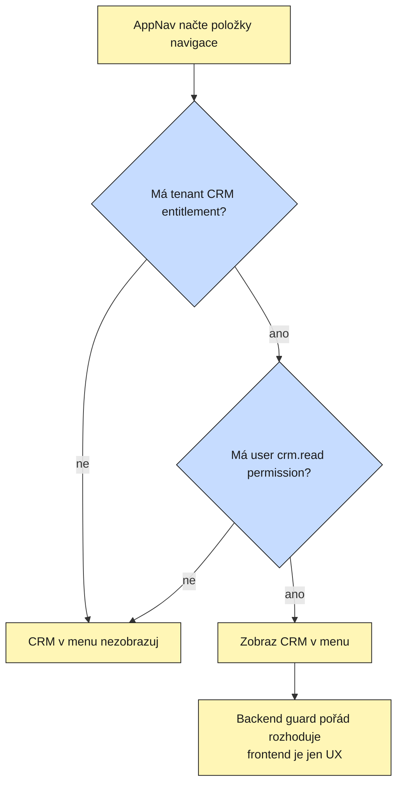

### Nav item

```ts
{
  key: "crm",
  href: "/crm",
  labelKey: "crm",
  icon: UsersIcon,
  moduleKey: "crm",
  permission: "crm.read",
}
```

Backend stejně musí mít:

```csharp
.RequireAuthorization()
.RequireModule("crm")
.RequirePermission(PlatformPermissions.CrmRead)
```

## 17. Kompletní flow: CRM AI draft emailu

```mermaid
flowchart TB
    classDef proc fill:#fff6b6,stroke:#1a1a1a,color:#1a1a1a
    classDef dec fill:#c6dcff,stroke:#1a1a1a,color:#1a1a1a
    classDef term fill:#adf0c7,stroke:#1a1a1a,color:#1a1a1a
    classDef data fill:#ffffff,stroke:#1a1a1a,color:#1a1a1a
    classDef err fill:#ffc6c6,stroke:#d93636,color:#1a1a1a

    CLICK(["User klikne Draft email"]):::term
    UI["Frontend zobrazí cenu<br/>a aktuální balance"]:::proc
    POST["POST /crm/ai/draft-email"]:::proc
    ACCESS{"Projde auth, entitlement,<br/>permission a owner check?"}:::dec
    CONTACT{"Existuje kontakt<br/>a patří userovi?"}:::dec
    CREDIT["Billing rezervuje 25 credits"]:::proc
    ENOUGH{"Rezervace prošla?"}:::dec
    RUN[/"CRM uloží AI run<br/>Pending + reservationId"/]:::data
    OUTBOX[/"Outbox uloží RunCrmAiTask"/]:::data
    ACCEPT(["202 Accepted<br/>UI ukáže Pending"]):::term
    WORKER["Worker načte run a kontakt"]:::proc
    IDEMP{"Už je run hotový?"}:::dec
    AI["Zavolá AI provider"]:::proc
    OKAI{"AI odpověděla?"}:::dec
    SAVE["Ulož draft a token usage"]:::proc
    SPEND["Billing potvrdí spend"]:::proc
    RELEASE["Billing uvolní rezervaci"]:::proc
    READY["Realtime crm.ai_result_ready<br/>frontend refetchne detail"]:::proc
    FAIL["Ulož Failed stav<br/>bez interních detailů"]:::proc
    NOACCESS(["401 / 403 / 404"]):::err
    NOCREDIT(["422 Nedostatek kreditu"]):::err
    DONE(["User vidí hotový draft"]):::term

    CLICK --> UI --> POST --> ACCESS
    ACCESS -->|"ne"| NOACCESS
    ACCESS -->|"ano"| CONTACT
    CONTACT -->|"ne"| NOACCESS
    CONTACT -->|"ano"| CREDIT --> ENOUGH
    ENOUGH -->|"ne"| NOCREDIT
    ENOUGH -->|"ano"| RUN --> OUTBOX --> ACCEPT
    OUTBOX --> WORKER --> IDEMP
    IDEMP -->|"ano"| READY
    IDEMP -->|"ne"| AI --> OKAI
    OKAI -->|"ano"| SAVE --> SPEND --> READY --> DONE
    OKAI -->|"ne"| RELEASE --> FAIL --> READY
```

### Co je na tom důležité

- Frontend balance je jen UX.
- Backend dělá skutečnou kreditovou rezervaci.
- Run je uložený před Worker zprávou ve stejné outbox transakci.
- Worker je idempotentní.
- AI selhání vrací kredity.
- Realtime jen invaliduje UI, výsledek se čte přes API.

## 18. Co použít a co nepoužít

| Potřeba | Použít | Nepoužívat |
|---|---|---|
| Kdo je user | `ITenantContext.UserId` | `userId` z request body |
| Kdo je tenant | `ITenantContext.TenantId` | tenant id z klienta |
| Modul zapnutý pro tenant | `.RequireModule("crm")` | vlastní check v každém handleru |
| Permission | `.RequirePermission(...)` | ruční DB lookup v endpointu |
| Write | `ICommand<T>` handler | `CrmService` |
| Read | `IQuery<T>` + read factory | mutace v query |
| DB změna + event | `IDbContextOutbox` | `SaveChanges` a potom publish |
| Pomalá práce | Worker message | čekat v HTTP requestu |
| Kredity | Billing reservation/confirm/release | vlastní credits sloupec v CRM |
| Notifikace | Notifications modul | vlastní SMTP/push |
| Soubory | Files modul | blob bytes v CRM |
| Realtime | `IRealtimePublisher` po commitu | vlastní WebSocket |
| GDPR | exporter/eraser port | GDPR modul čte CRM tabulky |
| Audit | EF audit interceptor | vlastní audit tabulka |
| Frontend API | `apiFetch` přes BFF | `fetch("/v1/...")` |
| Frontend server state | React Query | ruční globální store |

## 19. Checklist pro nový CRM modul

Backend:

- [ ] Vytvořit `ModularPlatform.Crm`.
- [ ] Vytvořit `ModularPlatform.Crm.Contracts`.
- [ ] Vytvořit `ModularPlatform.Crm.Tests`.
- [ ] Přidat `CrmModule`.
- [ ] Přidat `CrmDbContext`.
- [ ] Registrovat modul v Api, Worker, Jobs, MigrationService.
- [ ] Přidat `Modules:Crm:Enabled=true`.
- [ ] Přidat permissions.
- [ ] Přidat `.RequireModule("crm")` na endpointy.
- [ ] Přidat `.RequirePermission(...)` na endpointy.
- [ ] Přidat GDPR exporter/eraser, pokud CRM ukládá PII.
- [ ] Přidat migraci.
- [ ] Přidat testy pro CRUD, tenant izolaci, permissiony, kredity a Worker failure.

Frontend:

- [ ] Přidat `queryRoots.crm`.
- [ ] Přidat `frontend/features/crm/api.ts`.
- [ ] Přidat `frontend/features/crm/hooks.ts`.
- [ ] Přidat `frontend/features/crm/components`.
- [ ] Přidat route `frontend/app/(tenant)/crm/page.tsx`.
- [ ] Přidat nav item s `moduleKey: "crm"`.
- [ ] Přidat i18n labels.
- [ ] Přidat realtime event invalidace.
- [ ] Po mutacích invalidovat query.
- [ ] Vyřešit loading, empty, error a pending stavy.

## 20. Kde v repo hledat vzory

- Modul wiring: `src/modules/Marketing/ModularPlatform.Marketing/MarketingModule.cs`
- Write + outbox: `src/modules/Identity/.../RegisterUser`
- Read query: `src/modules/Identity/.../GetProfile`
- Billing credits: `src/modules/Billing/.../Features/Credits`
- Notifications: `src/modules/Notifications/.../SendNotification`
- Files upload: `src/modules/Files/.../Upload`
- Long-running operation: `src/modules/Operations/.../StartDemoOperation`
- Worker AI-like flow: `src/modules/Marketing/.../Vibe`
- Frontend API/hooks: `frontend/features/marketing`, `frontend/features/billing`, `frontend/features/files`
- Frontend nav/entitlements: `frontend/features/entitlements`
- Realtime invalidace: `frontend/lib/realtime/event-map.ts`

## 21. Miro-ready poznámka

V této session není dostupný Miro `diagram_create` nástroj, takže jsem nevytvořil native Miro board. Diagramy výše jsou ale psané jako Miro flowchart: s procesy, rozhodnutími, stavy, chybami a popsanými šipkami. Do Miro se dají přepsat po blocích:

- overview architektury;
- access flow;
- CRM AI credit flow;
- upload file flow;
- notifications flow;
- frontend architecture flow.

Pro Miro nepřenášet jen šipky. Každý box má mít krátkou větu typu „Billing rezervuje 25 credits“, ne název metody.
