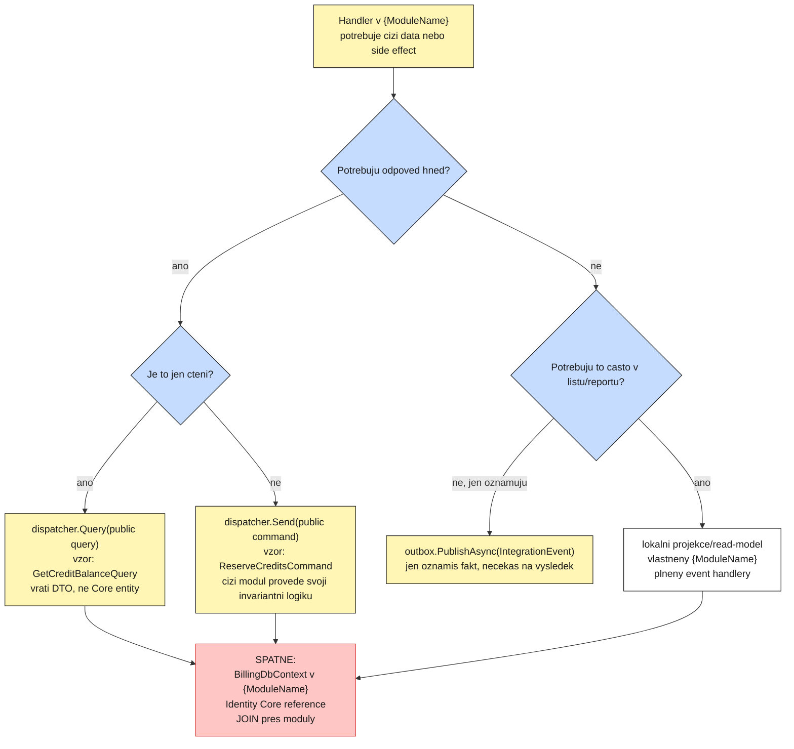
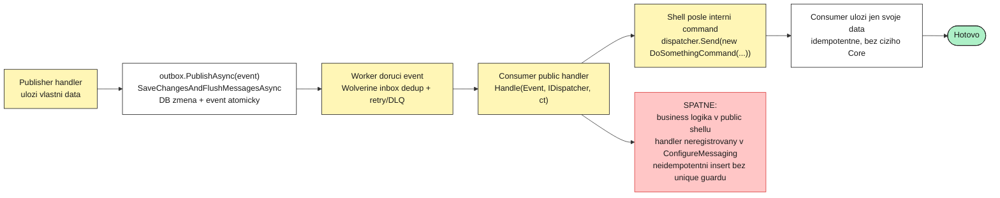
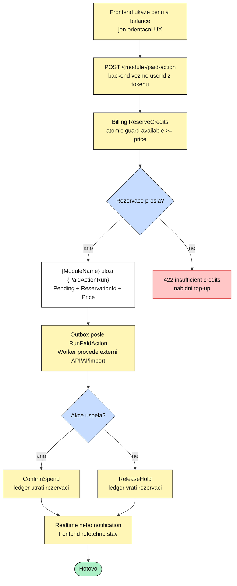
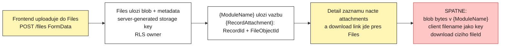
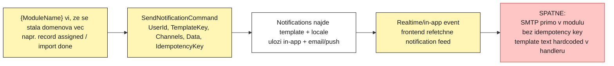
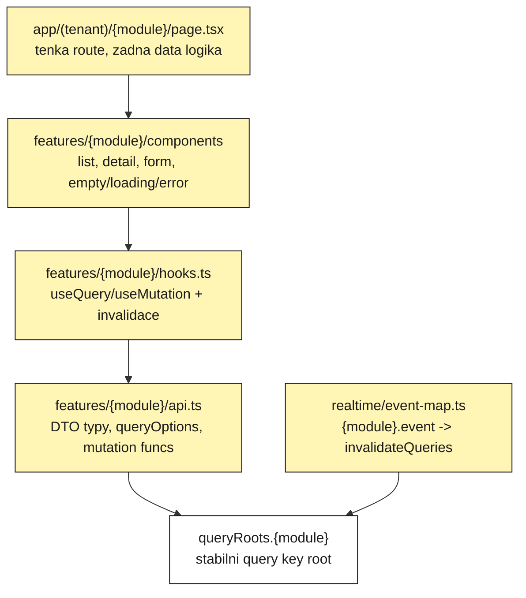

# ModularPlatform pro libovolny novy produktovy modul

Datum: 2026-06-25

Tento dokument je navod pro vyvojare, ktery prijde k ModularPlatform a ma postavit **libovolny produktovy modul**.
Neni to CRM specifikace, neni to navrh CRM modulu a v base dnes CRM modul neni.

Ber to jako sablonu pro jakykoli domenovy modul:

- Helpdesk chce resit tickety, prilohy, notifikace a SLA.
- Marketing chce resit kampane, segmenty, AI generovani a exporty.
- Projects chce resit projekty, ukoly, soubory a realtime zmeny.
- CRM by chtelo resit kontakty, dealy, aktivity a enrichment.

CRM je jen jeden priklad dosazeni placeholderu. Stejny postup plati pro Helpdesk, Marketing, Projects,
Scheduling, Reporting nebo jiny produktovy modul. Kdyz stavis konkretni modul, vymenis nazvy a domenove entity,
ale porad pouzivas stejne base capability: Identity, Tenancy, Billing, Notifications, Files, Operations, GDPR,
Realtime, Worker, Outbox a audit.

Kdyz v prikladech vidis:

- `{ModuleName}` = PascalCase nazev modulu, napr. `Crm`, `Marketing`, `Helpdesk`;
- `{module}` = route/cache/event prefix, napr. `crm`, `marketing`, `helpdesk`;
- `{Record}` = domenova entita modulu, napr. `Contact`, `Campaign`, `Ticket`;
- `{PaidActionRun}` = beh placene nebo dlouhe akce, napr. AI draft, import, export, enrichment.

Detailni katalog use cases a edge cases je v `UseCases.md`. Tento soubor je hlavne architektonicka mapa a "kam sahnout" navod pro Markchart/Miro.

## 0. Hlavni mapa: kdyz v novem modulu chci neco udelat

```mermaid
flowchart TB
    classDef proc fill:#fff6b6,stroke:#1a1a1a,color:#1a1a1a
    classDef dec fill:#c6dcff,stroke:#1a1a1a,color:#1a1a1a
    classDef term fill:#adf0c7,stroke:#1a1a1a,color:#1a1a1a
    classDef data fill:#ffffff,stroke:#1a1a1a,color:#1a1a1a
    classDef err fill:#ffc6c6,stroke:#d93636,color:#1a1a1a

    START(["Stavis novy produktovy modul {ModuleName}<br/>Helpdesk, Marketing, Projects, CRM = jen priklady dosazeni"]):::term
    DECIDE{"Co ted modul potrebuje udelat?"}:::dec

    subgraph ACCESS["1 · Prihlaseny user, tenant a opravneni"]
        A1["V endpointu neberes userId z body<br/>pouzijes ITenantContext.UserId a TenantId z tokenu"]:::proc
        A2["Endpoint ochrani platforma<br/>RequireAuthorization + RequireModule('{module}')<br/>+ RequirePermission('{module}.read/write')"]:::proc
        A3["Konkretni zaznam hledas podle Id + owner scope<br/>cizi nebo neexistujici zaznam vratis jako 404"]:::proc
    end

    subgraph OWN["2 · Vlastni domenova data modulu"]
        O1["Modul vlastni jen svoje tabulky<br/>{Record}, {RecordActivity}, {PaidActionRun}, vazby"]:::proc
        O2["Business logika je vertical slice<br/>Features/{Feature}/{Action}<br/>Command/Query + Validator + Handler + Endpoint"]:::proc
        O3["Write = IDbContextOutbox nebo scoped DbContext<br/>Read = IReadDbContextFactory<br/>zadne service vrstvy typu {Module}Service"]:::proc
    end

    subgraph CROSS["3 · Data nebo akce z jineho modulu"]
        C0{"Potrebujes odpoved hned<br/>v tom samem requestu?"}:::dec
        C1["Jen cteni: zavolas public query contract<br/>napr. Billing GetCreditBalanceQuery<br/>nebo Identity public profile query"]:::proc
        C2["Chces, aby cizi modul hned neco udelal:<br/>dispatcher.Send public command<br/>napr. ReserveCreditsCommand"]:::proc
        C3["Jen oznamujes fakt:<br/>publikuj IntegrationEvent pres outbox<br/>consumeri zareaguji ve Workeru"]:::proc
        C4["Cizi udaj potrebujes casto v listu:<br/>udelaj lokalni read-model/projekci<br/>aktualizovanou z eventu"]:::proc
        C5(["Tudy ne<br/>zadny cizi Core reference<br/>zadny cizi DbContext<br/>zadny cross-module JOIN"]):::err
    end

    subgraph CREDIT["4 · Placená akce / tokeny / kredity"]
        K1["Frontend muze ukazat orientacni balance<br/>ale je to jen UX, ne security"]:::proc
        K2["Backend pred akci posle Billing reservation<br/>Billing atomicky overi available >= price"]:::proc
        K3{"Rezervace prosla?"}:::dec
        K4["Modul ulozi {PaidActionRun}<br/>Status=Pending, ReservationId, Price<br/>idempotency key pro retry"]:::data
        K5["Do outboxu posles praci pro Worker<br/>externi API/AI/import nebezi v HTTP requestu"]:::proc
        K6{"Worker dokoncil akci?"}:::dec
        K7["Uspelo: ConfirmSpend<br/>kredity jsou definitivne utracene"]:::proc
        K8["Selhalo: ReleaseHold<br/>kredity se vrati userovi"]:::proc
        K9(["Nedostatek kreditu<br/>422/BusinessRule insufficient credits<br/>UI nabidne top-up"]):::err
    end

    subgraph FILES["5 · Soubory a prilohy"]
        F1["Frontend nahraje soubor do Files modulu<br/>multipart FormData, size/type policy"]:::proc
        F2["Files vlastni blob + metadata<br/>storage key generuje server<br/>owner je user z tokenu"]:::proc
        F3["Novy modul si ulozi jen vazbu<br/>{RecordAttachment}: RecordId + FileObjectId<br/>bytes nikdy nejsou v domenove tabulce"]:::proc
        F4(["Tudy ne<br/>neukladej bytes do {ModuleName}<br/>nepouzivej client filename jako storage key"]):::err
    end

    subgraph NOTIF["6 · Notifikace"]
        N1["Modul neposila SMTP/push sam<br/>posle SendNotificationCommand<br/>nebo publikuje domenovy event"]:::proc
        N2["Notifications modul vyresi template, locale<br/>in-app feed, email/push a realtime"]:::proc
        N3["Vzdy dej IdempotencyKey<br/>retry Workera nesmi poslat duplicitni email"]:::proc
        N4["Realtime az po commitu<br/>UI nesmi videt phantom udalost<br/>kterou DB nepotvrdila"]:::proc
    end

    subgraph OPS["7 · Dlouha prace a status"]
        P1["Kratka akce: endpoint vrati 200/201"]:::proc
        P2["Dlouha akce: vytvor Operation<br/>vrat 202 + Location /operations/{id}"]:::proc
        P3["Worker meni status operace<br/>Pending -> Running -> Succeeded/Failed"]:::proc
        P4["Frontend polluje status<br/>nebo reaguje na realtime a refetchne detail"]:::proc
    end

    subgraph FRONT["8 · Frontend struktura"]
        FE1["Route je tenka<br/>app/(tenant)/{module}/page.tsx jen sklada feature komponenty"]:::proc
        FE2["features/{module}/api.ts<br/>typy, queryOptions, mutation functions<br/>vse pres apiFetch/BFF"]:::proc
        FE3["features/{module}/hooks.ts<br/>useQuery/useMutation<br/>invalidateQueries + toast po uspechu"]:::proc
        FE4["features/{module}/components<br/>formular, list, detail, empty/loading/error states"]:::proc
        FE5["realtime event-map<br/>{module}.record_updated invaliduje queryRoots.{module}"]:::proc
    end

    START --> DECIDE
    DECIDE -->|"kdo muze volat endpoint"| A1 --> A2 --> A3
    DECIDE -->|"ulozit/cist vlastni data"| O1 --> O2 --> O3
    DECIDE -->|"potrebuju jiny modul"| C0
    C0 -->|"ano, jen ctu"| C1 --> C5
    C0 -->|"ano, chci akci"| C2 --> C5
    C0 -->|"ne, oznamuju fakt"| C3
    C0 -->|"ne, rychly list/report"| C4
    DECIDE -->|"placena akce"| K1 --> K2 --> K3
    K3 -->|"ne"| K9
    K3 -->|"ano"| K4 --> K5 --> K6
    K6 -->|"ano"| K7
    K6 -->|"ne"| K8
    DECIDE -->|"soubor/priloha"| F1 --> F2 --> F3 --> F4
    DECIDE -->|"notifikace"| N1 --> N2 --> N3 --> N4
    DECIDE -->|"dlouha prace"| P1 --> P2 --> P3 --> P4
    DECIDE -->|"frontend"| FE1 --> FE2 --> FE3 --> FE4 --> FE5
```



## 1. Mentalni model

Novy modul resi jen svoji domenu. Platforma uz resi SaaS veci okolo.

| Kdyz v modulu chci... | Pouziju z base |
|---|---|
| zjistit aktualniho usera/tenant | `ITenantContext` |
| overit opravneni | `.RequirePermission(...)` |
| overit, ze tenant ma modul zapnuty | `.RequireModule("{module}")` |
| udelat write flow | `ICommand<T>` handler ve vertical slice |
| udelat read flow | `IQuery<T>` + `IReadDbContextFactory<TContext>` |
| publikovat fakt pro jine moduly | `IntegrationEvent` v `{ModuleName}.Contracts` + outbox |
| reagovat na event jineho modulu | public Wolverine handler + interni command |
| poslat notifikaci | Notifications modul |
| nahrat/stahnout soubor | Files modul |
| zkontrolovat/utratit kredit | Billing reservation/confirm/release |
| spustit dlouhou praci | Operations + Worker + outbox |
| aktualizovat UI realtime | `IRealtimePublisher` / Notifications / SSE event-map |
| exportovat/smazat PII | `IExportPersonalData` / `IErasePersonalData` implementace v modulu |
| audit zmen | automaticky pres `AuditInterceptor` na `SaveChanges` |

Co novy modul **nema** delat:

- vlastni login, JWT, refresh tokeny;
- vlastni ledger nebo token balance;
- vlastni file storage;
- vlastni SMTP/push sender;
- vlastni queue/outbox/retry loop;
- cteni cizich DbContextu;
- cross-module SQL join;
- obecny `{ModuleName}Service` s business logikou mimo CQRS slice.

## 2. Struktura noveho modulu

```text
src/modules/{ModuleName}/
  ModularPlatform.{ModuleName}/
    {ModuleName}Module.cs
    Persistence/
      {ModuleName}DbContext.cs
      {ModuleName}DbContextDesignTimeFactory.cs
      Configurations/
    Entities/
      {Record}.cs
      {PaidActionRun}.cs
      {RecordAttachment}.cs
    Features/
      Records/
        CreateRecord/
          CreateRecordCommand.cs
          CreateRecordValidator.cs
          CreateRecordHandler.cs
          CreateRecordEndpoint.cs
        ListRecords/
          ListRecordsQuery.cs
          ListRecordsHandler.cs
          ListRecordsEndpoint.cs
    Messaging/
      SomeExternalEventHandler.cs
    Gdpr/
      {ModuleName}PersonalDataExporter.cs
      {ModuleName}PersonalDataEraser.cs
  ModularPlatform.{ModuleName}.Contracts/
    IntegrationEvents.cs
    PublicDtos.cs
  ModularPlatform.{ModuleName}.Tests/
```

`Core` typy jsou `internal`. Public jsou jen contracty. Jiny modul smi znat jen `{ModuleName}.Contracts`, nikdy `{ModuleName}` Core.

```csharp
public sealed class ExampleModule : IModule
{
    public string Name => "Example";

    public void RegisterServices(IServiceCollection services, IConfiguration config)
    {
        services.AddCqrs(typeof(ExampleModule).Assembly);
        services.AddValidatorsFromAssembly(typeof(ExampleModule).Assembly, includeInternalTypes: true);

        var write = config.GetConnectionString("Write")
            ?? throw new InvalidOperationException("ConnectionStrings:Write is missing.");
        var read = config.GetConnectionString("Read") ?? write;

        services.AddModuleDbContext<ExampleDbContext>(Name, write);
        services.AddModuleReadDbContext<ExampleDbContext>(read);

        services.AddScoped<IExportPersonalData, ExamplePersonalDataExporter>();
        services.AddScoped<IErasePersonalData, ExamplePersonalDataEraser>();
    }

    public void MapEndpoints(IEndpointRouteBuilder endpoints)
    {
        endpoints.MapCreateRecord();
        endpoints.MapListRecords();
    }

    public void ConfigureMessaging(WolverineOptions options)
    {
        options.Discovery.IncludeType<Messaging.SomeExternalEventHandler>();
    }
}
```

## 3. Jak ziskat data z jineho modulu



Pouziti v handleru:

```csharp
var balance = await dispatcher.Query(
    new GetCreditBalanceQuery(command.UserId), ct);

if (balance.Available < command.Price)
{
    throw new BusinessRuleException(
        "{module}.insufficient_credits",
        "Not enough credits for this action.");
}
```

Pravidlo: `{ModuleName}` nevi, kde Billing drzi ledger. Zna jen public contract.

## 4. Jak chainovat a hookovat eventy



Event v contracts:

```csharp
public sealed record ExampleRecordCreatedIntegrationEvent(
    Guid EventId,
    DateTimeOffset OccurredAt,
    Guid TenantId,
    Guid UserId,
    Guid RecordId,
    string PublicName) : IIntegrationEvent;
```

Publisher:

```csharp
outbox.DbContext.Records.Add(record);

await outbox.PublishAsync(new ExampleRecordCreatedIntegrationEvent(
    EventId: Guid.CreateVersion7(),
    OccurredAt: clock.UtcNow,
    TenantId: command.TenantId,
    UserId: command.UserId,
    RecordId: record.Id,
    PublicName: record.Name));

await outbox.SaveChangesAndFlushMessagesAsync(ct);
```

Consumer:

```csharp
public sealed class ExampleRecordCreatedHandler
{
    public Task Handle(
        ExampleRecordCreatedIntegrationEvent message,
        IDispatcher dispatcher,
        CancellationToken ct) =>
        dispatcher.Send(new UpdateLocalProjectionCommand(
            message.UserId,
            message.RecordId,
            IdempotencyKey: $"example-record-created:{message.EventId:N}"), ct);
}
```

Registration:

```csharp
public void ConfigureMessaging(WolverineOptions options)
{
    options.Discovery.IncludeType<Messaging.ExampleRecordCreatedHandler>();
}
```

Edge cases:

- stejne eventy mohou byt doruceny vicekrat, command musi byt idempotentni;
- vice consumeru jednoho eventu dnes bezi combined, kazdy consumer musi byt bezpecny pro retry;
- event payload je fakt, ne dump cizich entity grafu;
- pokud potrebujes odpoved hned, event neni spravny nastroj;
- handler musi byt public a registrovany pres `Discovery.IncludeType`.

## 5. Kredity, tokeny a placena akce



Backend skeleton:

```csharp
var reservation = await dispatcher.Send(
    new ReserveCreditsCommand(command.UserId, Amount: command.Price, HoldMinutes: 30), ct);

var run = new ExamplePaidActionRun
{
    Id = Guid.CreateVersion7(),
    UserId = command.UserId,
    TenantId = command.TenantId,
    Status = PaidActionStatus.Pending,
    BillingStatus = BillingHoldStatus.Reserved,
    ReservationId = reservation.ReservationId,
    Price = command.Price,
    CreatedAt = clock.UtcNow,
};

outbox.DbContext.PaidActionRuns.Add(run);
await outbox.PublishAsync(new RunExamplePaidAction(run.Id, command.UserId));
await outbox.SaveChangesAndFlushMessagesAsync(ct);
```

Worker completion:

```csharp
try
{
    var result = await externalGateway.RunAsync(run.Id, ct);

    run.Status = PaidActionStatus.Succeeded;
    run.ResultJson = result.Json;
    await db.SaveChangesAsync(ct);

    await dispatcher.Send(new ConfirmSpendCommand(command.UserId, run.ReservationId), ct);
    run.BillingStatus = BillingHoldStatus.Confirmed;
    await db.SaveChangesAsync(ct);
}
catch
{
    await dispatcher.Send(new ReleaseHoldCommand(command.UserId, run.ReservationId), ct);
    run.Status = PaidActionStatus.Failed;
    run.BillingStatus = BillingHoldStatus.Released;
    await db.SaveChangesAsync(ct);
    throw;
}
```

Edge cases:

- balance na frontendu je stale, backend reservation je source of truth;
- dva taby spusti akci soucasne, Billing atomic guard nedovoli double spend;
- worker spadne po ulozeni vysledku a pred confirmem, retry musi umet confirm dokoncit;
- worker spadne po confirmu a pred realtime, UI musi umet refetch/poll;
- hold expiruje pred koncem akce, modul musi mit jasnou politiku Failed/retry/prodlouzeni holdu;
- nedostatek kreditu se nikdy neresí vlastnim sloupcem v modulu.

## 6. Soubory



Modulova vazba:

```csharp
internal sealed class ExampleRecordAttachment : AuditableEntity, ITenantScoped, IUserOwned
{
    public Guid TenantId { get; set; }
    public Guid UserId { get; set; }
    public Guid RecordId { get; set; }
    public Guid FileObjectId { get; set; }
    public DateTimeOffset CreatedAt { get; set; }
}
```

Edge cases:

- upload projde, attach selze: UI ma nabidnout retry attach nebo cleanup;
- cizi `FileObjectId` vypada jako 404 diky Files/RLS, modul nema leakovat existenci;
- smazany soubor muze zustat navazany, UI musi ukazat "soubor neni dostupny";
- GDPR erasure v modulu maze/anonymizuje vazby, Files/GDPR resi vlastni metadata podle sve odpovednosti.

## 7. Notifikace



```csharp
await dispatcher.Send(new SendNotificationCommand(
    UserId: assignedUserId,
    TemplateKey: "{module}.record_assigned",
    Channels: ["email", "inapp"],
    Data: new Dictionary<string, string>
    {
        ["recordName"] = record.Name,
        ["assignedBy"] = command.AssignedByDisplayName,
    },
    IdempotencyKey: $"{module}:record-assigned:{record.Id:N}:{assignedUserId:N}"), ct);
```

Edge cases:

- chybí template: podle flow bud NotFound pro HTTP, nebo log-and-skip pro volitelny cross-module handler;
- retry Workera nesmi poslat duplicitni email;
- user ma jiny locale, template musi mit fallback;
- notification data nesmi obsahovat zbytecne PII.

## 8. Frontend struktura



```text
frontend/app/(tenant)/{module}/page.tsx
frontend/features/{module}/
  api.ts
  hooks.ts
  components/
    record-list.tsx
    record-detail.tsx
    record-form.tsx
```

```ts
export const queryRoots = {
  example: ["example"] as const,
};

export const exampleQueries = {
  records: (page: number, pageSize: number) =>
    queryOptions({
      queryKey: [...queryRoots.example, "records", page, pageSize],
      queryFn: () =>
        apiFetch<Paged<ExampleRecordListItem>>(
          `example/records?page=${page}&pageSize=${pageSize}`,
        ),
    }),
};
```

Mutation:

```ts
export function useCreateExampleRecord() {
  const queryClient = useQueryClient();

  return useMutation({
    mutationFn: createExampleRecord,
    onSuccess: () => {
      toast.success("Created");
      queryClient.invalidateQueries({ queryKey: [...queryRoots.example, "records"] });
    },
  });
}
```

Frontend pravidla:

- UI guardy jsou jen UX, backend `.RequirePermission` a `.RequireModule` jsou autorita;
- po mutaci invaliduj vsechny dotcene query roots, typicky `{module}` + `billing` u placene akce;
- po 401 zahod session/cache a redirect na login;
- neukladej PII do localStorage;
- realtime event pouze invaliduje/refetchuje, durable pravda je v API.

## 9. GDPR a PII

Pokud modul uklada osobni data, musi implementovat vlastni exporter/eraser.

```csharp
internal sealed class ExamplePersonalDataExporter(ExampleDbContext db) : IExportPersonalData
{
    public string ModuleName => "example";

    public async Task<object> ExportAsync(Guid userId, CancellationToken ct)
    {
        var records = await db.Records
            .Where(x => x.UserId == userId)
            .Select(x => new { x.Id, x.Name, x.CreatedAt })
            .ToListAsync(ct);

        return new { records };
    }
}
```

Edge cases:

- GDPR orchestruje Gdpr modul, ale data zna a maze vlastnik, tedy `{ModuleName}`;
- audit/ledger append-only data se nema fyzicky mazat, PII se anonymizuje nebo crypto-shredne;
- `[PersonalData]` stringy patri k `IDataSubject`, encrypted PII pouziva `[Encrypted]` + blind index pro lookup;
- exporter failure nema shodit cely export, Gdpr vraci per-module error marker.

## 10. Checklist pro novy modul

- [ ] Rozhodnout, ze jde opravdu o novy produktovy modul, ne building-block nebo slice existujiciho modulu.
- [ ] Vytvorit trio `ModularPlatform.{ModuleName}`, `.Contracts`, `.Tests`.
- [ ] Core typy nechat `internal`; public dat jen do `.Contracts`.
- [ ] Pridat `{ModuleName}Module : IModule`.
- [ ] Pridat `{ModuleName}DbContext` a design-time factory.
- [ ] Pridat module registration do Api, Worker, Jobs, MigrationService a architecture tests.
- [ ] Pridat `Modules:{ModuleName}:Enabled=true`.
- [ ] Endpointy mapovat relativne, napr. `/{module}/records`, nikdy `/v1/{module}/records`.
- [ ] Na endpointy dat `.RequireModule("{module}")` a `.RequirePermission(...)`.
- [ ] User/tenant brat jen z `ITenantContext`, nikdy z body/route.
- [ ] Write flow psat jako `ICommand<T>`, read flow jako `IQuery<T>`.
- [ ] Mutace s eventem ulozit pres outbox a `SaveChangesAndFlushMessagesAsync`.
- [ ] Cross-module data brat pres public query/command contract, event nebo lokalni projekci.
- [ ] Zadny cross-module JOIN a zadny cizi Core reference.
- [ ] Pokud jsou PII, pridat exporter/eraser a `[PersonalData]`/`[Encrypted]` podle typu dat.
- [ ] Pokud jsou soubory, ukladat bytes pres Files a v modulu jen vazbu na `FileObjectId`.
- [ ] Pokud je placena akce, pouzit Billing reservation/confirm/release.
- [ ] Pokud je dlouha akce, pouzit Operations + Worker.
- [ ] Frontend dat do `features/{module}` a query keys pod `queryRoots.{module}`.
- [ ] Po mutacich invalidovat relevantni query roots.
- [ ] Pridat testy pro happy path i edge cases z `UseCases.md`.

## 11. Priklady dosazeni placeholderu

Kdyz stavis konkretni modul, jen dosadis vlastni domenu do stejnych placeholderu.
Architektura zustava stejna.

| Placeholder | CRM priklad | Helpdesk priklad | Marketing priklad | Projects priklad |
|---|---|---|---|---|
| `{ModuleName}` | `Crm` | `Helpdesk` | `Marketing` | `Projects` |
| `{module}` | `crm` | `helpdesk` | `marketing` | `projects` |
| `{Record}` | `Contact`, `Deal` | `Ticket`, `Conversation` | `Campaign`, `Audience` | `Project`, `Task` |
| `{RecordAttachment}` | `DealAttachment` | `TicketAttachment` | `CampaignAsset` | `TaskAttachment` |
| `{PaidActionRun}` | `CrmAiRun` | `TicketAiRun` | `CampaignGenerationRun` | `ProjectExportRun` |
| permission | `crm.read`, `crm.write` | `helpdesk.read`, `helpdesk.write` | `marketing.read`, `marketing.write` | `projects.read`, `projects.write` |
| route | `/crm/contacts` | `/helpdesk/tickets` | `/marketing/campaigns` | `/projects/tasks` |
| frontend | `frontend/features/crm/*` | `frontend/features/helpdesk/*` | `frontend/features/marketing/*` | `frontend/features/projects/*` |

Pointa: `MODULE_ARCHITECTURE.md` popisuje modularni vzor. CRM, Helpdesk, Marketing i Projects jsou jen priklady
dosazeni stejneho vzoru.
