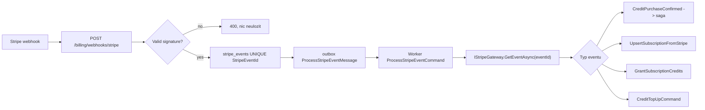

# ModularPlatform UseCases

Datum: 2026-06-25

Tento dokument je katalog pro noveho vyvojare, ktery stavi libovolny produktovy modul nad ModularPlatform.
Neni to specifikace CRM ani jine konkretni domeny.

Format je zamerne prakticky:

- **UC** = use case, co chce produkt nebo modul udelat.
- **Pouzijes** = hotova cast platformy, kterou mas zavolat.
- **Napises** = co patri do noveho modulu.
- **EC** = edge cases primo k danemu UC, ne obecny seznam bokem.

Pravidlo pro cteni: kdyz delas novy produktovy modul, modul vlastni jen svoji domenu. Identity, tenanty, kredity, soubory, notifikace, GDPR, realtime, outbox, worker a audit uz existuji v base.

Poznamka k nazvum: `ExampleModule` a `example` jsou v dokumentu jen placeholdery. Stejny postup plati pro libovolny modul, napr. Projects, Helpdesk, Marketing, Scheduling nebo CRM. Kdyz delas jiny modul, prepis prefixy `example`, `ExampleModule`, `ModularPlatform.ExampleModule` a routy `/example` na svoji domenu.

## Identity

### UC01 Registrace usera

**Status:** Implemented + Verified 2026-06-25 — EC001/EC002 overuje `Duplicate_email_registration_is_conflict_and_creates_exactly_one_user`, EC003 overuje `Register_endpoint_uses_the_auth_rate_limit_policy`, EC004 overuje `Registration_does_not_store_the_plaintext_email_in_the_tenant_name`, EC005 overuji `Registering_a_user_provisions_a_credit_account_via_the_event` a `Register_creates_welcome_notification_after_seeder_has_seeded_the_template`.

**Pouzijes:** `POST /identity/users`.

**Co se stane:** Identity vytvori usera, zalozi tenant, vyda tokeny a pres outbox publikuje `UserRegisteredIntegrationEvent`.

**Napises v novem modulu (napr. ExampleModule):** nic do registrace. Pokud ExampleModule potrebuje onboarding, napises handler na `UserRegisteredIntegrationEvent`.

**Mentalni model:** Registrace je vstup do platformy, ne do ExampleModule. Identity resi email, heslo, tenant a tokeny. ExampleModule se maximalne dozvi fakt "vznikl user/tenant" a zalozi si vlastni vychozi ExampleModule data.

**Kdy novy modul neco dela:** jen pokud produkt potrebuje napr. default pipeline, ukazkovy seznam kontaktu nebo ExampleModule onboarding checklist. To se dela jako consumer eventu, ne jako kod uvnitr `RegisterUserHandler`.

```csharp
public sealed class CreateExampleModuleWorkspaceOnUserRegisteredHandler
{
    public Task Handle(
        UserRegisteredIntegrationEvent message,
        IDispatcher dispatcher,
        CancellationToken ct) =>
        dispatcher.Send(new EnsureExampleModuleWorkspaceCommand(
            UserId: message.UserId,
            TenantId: message.TenantId,
            IdempotencyKey: $"user-registered:{message.UserId:N}"), ct);
}
```

**Priklad commandu v novem modulu:** `EnsureExampleModuleWorkspaceCommand` musi byt idempotentni. Idealni je unique index na `UserId`/`TenantId` nebo vlastni stable idempotency key. Event muze prijit znovu po retry.

**Co nepises:** vlastni registracni endpoint v ExampleModule, vlastni hash hesla, vlastni tenant provisioning, vlastni JWT, primy zapis do Identity/Tenancy tabulek.

**Proc event payload obsahuje email/display name:** existujici welcome flow ho potrebuje. Novy ExampleModule handler by mel pouzit hlavne `UserId`/`TenantId`; PII do vlastnich durable eventu neposilej, pokud ji opravdu nepotrebujes.

**EC:**

- EC001 duplicitni email vrati konflikt pres blind index → ExampleModule nikdy nehleda usera podle plaintext emailu v Identity DB.
- EC002 soubezna registrace stejneho emailu skonci unique constraintem, ne dvema usery → ExampleModule onboarding handler musi pocitat s tim, ze event dostane jen pro uspesne commitnuty user.
- EC003 register endpoint musi byt rate-limited, protoze dela drahou auth praci → ExampleModule nepridava vlastni registracni variantu bez stejne ochrany.
- EC004 tenant name nesmi obsahovat email ani PII → ExampleModule onboarding si bere tenant id, neodvozuje workspace nazev z emailu.
- EC005 downstream handlery na registraci musi byt idempotentni, protoze event muze byt retrynuty → `EnsureExampleModuleWorkspaceCommand` ma unique guard / idempotency key.

### UC02 Login

**Status:** Implemented + Verified 2026-06-25 — EC006 overuje `Unknown_email_and_wrong_password_return_identical_401_invalid_credentials`, EC007 overuje `Locks_out_after_threshold_failures_and_rejects_correct_credentials`, EC008 overuji `Login_is_rejected_when_the_account_is_soft_deleted` a `Erasure_tombstones_the_row_blanks_the_password_and_kills_the_ciphertext`, EC009 je pokryte frontend scenari `wrong password shows generic error` + `non-existent email shows same generic error (no enumeration)`, EC010 overuje `Permission_gated_endpoint_rejects_non_admins_and_admins_can_grant_roles`.

**Pouzijes:** `POST /identity/auth/login`.

**Co se stane:** Identity overi heslo, zkontroluje lockout, vyda access token a refresh token.

**Napises v novem modulu (napr. ExampleModule):** nic. ExampleModule nikdy neoveruje heslo a nikdy nevydava JWT.

**Mentalni model:** Login je security flow. ExampleModule az potom dostane request s platnym bearer tokenem. ExampleModule se nepta "je heslo spravne?", ale "co rika token a ma user permission na tuto ExampleModule akci?".

**Co dela Identity:** email lookup jde pres blind index, neznamy email i spatne heslo delaji stejne drahou Argon2 verify cestu a vraci stejny `auth.invalid_credentials`. Lockout se ukaze jen callerovi, ktery zna spravne heslo.

**Co dela frontend:** `loginAction` vola Identity, ulozi access/refresh token do server session a z access tokenu vytahne `roles`/`permissions` pro UI. ExampleModule komponenty potom pouzivaji session permissions jen pro UX guardy; backend endpointy porad rozhoduji samy.

```tsx
const canCreateContact = user.permissions.includes("example.contacts.create");
return canCreateContact ? <CreateContactButton /> : null;
```

**Co dela backend noveho modulu:** v handleru beres usera/tenant z `ITenantContext`, ne z login requestu ani z body.

```csharp
var userId = tenantContext.UserId
    ?? throw new UnauthorizedException("auth.unauthenticated", "Sign in required.");
```

**Co nepises:** `LoginExampleModuleUserHandler`, vlastni password table, vlastni lockout, rozdilne hlasky "email neexistuje" vs "spatne heslo", role lookup v ExampleModule DB pri kazdem requestu.

**EC:**

- EC006 neexistujici email a spatne heslo musi vypadat stejne → ExampleModule ani frontend nesmi z chyby odvozovat account existence.
- EC007 opakovane spatne pokusy zamknou ucet → lockout patri Identity; ExampleModule nema vlastni pocitadlo login pokusu.
- EC008 soft-deleted nebo erased user se nesmi prihlasit → ExampleModule requesty takoveho usera neuvidi jako validni session.
- EC009 frontend nesmi ukazovat text typu "email existuje" → login UI vzdy generic "spatny email nebo heslo".
- EC010 admin bootstrap patri do Identity login flow, ne do ExampleModule → ExampleModule jen definuje vlastni permissions, neprideluje system admin roli.

### UC03 Refresh session

**Status:** Implemented + Verified 2026-06-25 — EC011 overuje `Refresh_reuse_revokes_whole_family_and_is_audited`, EC012 overuje `Parallel_refresh_with_same_token_yields_one_winner_no_server_error`, EC013 overuji `Refresh_is_rejected_when_the_account_is_soft_deleted` a `Erasure_revokes_all_of_the_subjects_refresh_tokens`, EC014 overuje `Refreshed_token_carries_role_changes_while_the_old_access_token_stays_a_snapshot`, EC015 je implementovane ve frontend BFF flow `refreshSession`/`clearSession` + browser `apiFetch` 401 redirect.

**Pouzijes:** `POST /identity/auth/refresh`.

**Co se stane:** Refresh token se rotuje a token claims se znovu nactou z aktualnich roli a permissions.

**Napises v novem modulu (napr. ExampleModule):** nic, jen pocitas s tim, ze permissions jsou snapshot v access tokenu.

**Mentalni model:** Access token je fotka opravneni v case vydani. Refresh je okamzik, kdy se fotka obnovi. Kdyz admin prida userovi `example.contacts.delete`, stare taby to neuvidi magicky hned; uvidi to po refreshi tokenu, novem loginu nebo po expiraci stareho access tokenu.

**Co dela Identity:** refresh token je jednorazovy. Pri refreshi se stary token oznaci jako consumed, vyda se novy refresh token ve stejne family a access token se vyda s aktualnimi rolemi/permissions.

**Co dela BFF/frontend:** kdyz server-side fetch vidi expirovany access token, zkusi refresh. Kdyz refresh selze, session se vycisti. Browser `apiFetch` pri 401 presmeruje na `/login?reason=expired`.

**Co dela UI noveho modulu:** po 401 nedrzi stare ExampleModule query jako pravdu. Po navratu na login nebo po refresh failure se user-specific cache bere jako neduveryhodna.

```ts
// ExampleModule komponenta nema resit refresh token.
// Volas normalne apiFetch/useQuery; BFF/browser vrstva vyresi refresh nebo redirect.
const contacts = useContacts();
```

**Co dela backend noveho modulu:** endpoint se diva na aktualni claims v requestu. Pokud token jeste obsahuje starou permission, backend ji pro tento request bere jako snapshot. Pro okamzite revokace citlivych akci navrhni kratkou expiraci nebo server-side revocation policy v Identity, ne lokalni ExampleModule hack.

**Co nepises:** vlastni refresh endpoint v ExampleModule, vlastni token family table, polling Identity DB pro permissions v kazdem ExampleModule requestu, specialni "force refresh" business logiku v ExampleModule handleru.

**EC:**

- EC011 replay stareho refresh tokenu revoke celou token family → ExampleModule pri 401 nenabizi retry donekonecna; user se musi znovu prihlasit.
- EC012 pri soubeznem refreshi vyhraje jen jeden request → frontend/BFF musi pocitat s tim, ze paralelni taby mohou dostat 401 a udelat redirect.
- EC013 refresh po erasure nebo soft-delete vraci 401 → novy modul nesmi zobrazit cached PII po session invalidaci.
- EC014 zmena role se projevi az po refreshi/loginu nebo expiraci stareho access tokenu → UI permissions jsou snapshot, backend permission guard je stale autorita.
- EC015 frontend musi po 401 zahodit session a cache → neukazuj stale ExampleModule data z React Query/local state po auth failure.

### UC04 Logout

**Status:** Implemented + Verified 2026-06-25 — EC016 overuje `Logout_with_another_users_refresh_token_is_a_silent_noop`, EC017 overuje `Logout_with_an_unknown_refresh_token_is_a_silent_success`, EC018 overuje `Logout_without_authentication_is_rejected`, EC019 je implementovane ve frontend `logoutAction` (`session.destroy`, CSRF cookie delete) a pokryte scenari `user menu sign-out redirects to login` / `after logout session cookie is cleared and protected routes redirect to login`, EC020 overuje `Logout_revokes_the_session_family`.

**Pouzijes:** `POST /identity/auth/logout`.

**Co se stane:** Identity revoke refresh-token family. Logout je idempotentni.

**Napises v novem modulu (napr. ExampleModule):** nic.

**Mentalni model:** Logout je security revocation + UX cleanup. Server zneplatni refresh token family, frontend zahodi session/cookies/cache. ExampleModule nema vlastni predstavu "user je odhlaseny"; jen vidi, ze dalsi request nema validni token.

**Co dela Identity:** endpoint vezme `UserId` z access tokenu a refresh token z body. Pokud token patri userovi, revokuje celou family. Pokud je token neznamy nebo patri nekomu jinemu, vrati tichy success, aby nevznikl token-enumeration signal.

**Co dela frontend:** `logoutAction` udela best-effort POST na Identity, potom session znici vzdy. Maze i CSRF cookie. ExampleModule UI ma po logoutu opustit tenant layout a neponechat user-specific cache jako viditelnou pravdu.

```ts
await logoutAction();
toast.success(t("signedOut"));
router.push("/login");
router.refresh();
```

**Co dela ExampleModule:** nic v backendu. Pokud ma ExampleModule dlouhe obrazovky, po logoutu se k nim user dostane znovu jen pres novou session a nove API fetches. Background worker bezici pro drive zahajenou operaci se neridi logoutem; ridi se operation/owner stavem.

**Co nepises:** `/example/logout`, localStorage auth flag, smazani jen client tokenu bez server revoke, logout ktery bere `userId` z body, mazani ExampleModule dat pri logoutu.

**EC:**

- EC016 cizi refresh token nesmi odhlasit jineho usera → handler kontroluje `token.UserId == command.UserId`.
- EC017 neznamy refresh token je tichy success → logout je idempotentni a neprozrazuje token existenci.
- EC018 logout bez autentizace vraci 401 → user id jde z access tokenu, ne z body.
- EC019 frontend po logoutu cisti user-specific cache → session destroy + route refresh; ExampleModule query cache nesmi zustat zobrazena jako prihlaseny stav.
- EC020 client-side smazani tokenu neni nahrada server revoke → vzdy zkus Identity logout, i kdyz je request best-effort.

### UC05 Zobrazit profil

**Status:** Implemented + Verified 2026-06-25 — EC021 overuje `Anonymous_caller_with_no_tenant_claim_is_rejected_not_granted_global_visibility`, EC022 overuje `My_profile_is_not_returned_after_the_account_is_soft_deleted`, EC023 overuje `Email_and_display_name_are_ciphertext_at_rest_but_plaintext_through_the_api`, EC024 overuje `A_user_reading_through_the_tenant_filter_sees_only_their_own_tenant_data`, EC025 overuje `My_profile_ignores_any_client_supplied_user_id`.

**Pouzijes:** `GET /identity/users/me`, na frontendu `accountQueries.profile()`.

**Co se stane:** Identity vezme user id z tokenu a vrati profil.

**Napises v novem modulu (napr. ExampleModule):** nic. Nepises vlastni `/example/me`.

**Mentalni model:** "Kdo jsem?" je Identity otazka. ExampleModule nema mit vlastni profil usera, pokud opravdu nepotrebuje ExampleModule-specificke preference. Pro email, display name a locale pouzij Identity DTO.

**Frontend pouziti:** ExampleModule page muze cist profile query pro hlavicku, avatar fallback nebo locale-aware UI. Query key patri pod Identity root, ne pod ExampleModule.

```ts
const profile = useQuery(accountQueries.profile());
const displayName = profile.data?.displayName ?? profile.data?.email;
```

**Backend pouziti:** kdyz ExampleModule potrebuje caller id, nevola profil endpoint. Vezme `tenantContext.UserId`. Profil endpoint je pro UI/read DTO, ne pro autorizacni rozhodnuti uvnitr handleru.

```csharp
var userId = tenant.UserId
    ?? throw new UnauthorizedException("auth.required", "Authentication required.");
```

**PII detail:** `Email` a `DisplayName` jsou encrypted at rest a citelne pres model converter/API. ExampleModule si je nema kopirovat do vlastnich tabulek jen proto, ze chce zobrazit jmeno. Pokud delas ExampleModule projekci kvuli performance, musi byt PII encrypted/erasable a synchronizovana pres povoleny pattern.

**Co nepises:** `/example/me`, request body `userId`, cross-module join na `users`, cteni Identity Core entity, vlastni cache profilu bez GDPR/erasure cleanup.

**EC:**

- EC021 request bez tokenu vraci 401 → ExampleModule page bez session redirectuje/loginuje, nesklada fake profile.
- EC022 erased/deleted user nema vratit normalni profil → ExampleModule UI nesmi ukazovat cached profile po auth/profile 404/401.
- EC023 encrypted `Email` a `DisplayName` se ctou pres converter → ExampleModule necte ciphertext ani neobchazi Identity API.
- EC024 tenant filter nesmi byt obejity → profil query je scoped tokenem; ExampleModule nepouziva system context pro user UI.
- EC025 klient nikdy neposila user id pro vlastni profil → endpoint ignoruje body/route id; ExampleModule handler taky bere caller id z tokenu.

### UC06 Editace profilu

**Status:** Implemented + Verified 2026-06-25 — EC026 overuje `Update_profile_normalizes_blank_display_name_and_persists_locale`, EC027 overuje `Update_profile_rejects_unsupported_locale`, EC028 je implementovane ve frontend `ProfileForm` pres `queryClient.invalidateQueries({ queryKey: accountQueries.profile().queryKey })`, EC029 overuje `Concurrent_profile_updates_are_serialized_without_server_errors`, EC030 zustava bez eventu/outboxu v `UpdateProfileHandler` a update vraci jen `UserProfileResponse`.

**Pouzijes:** `PATCH /identity/users/me`, na frontendu `updateProfile`.

**Co se stane:** Identity ulozi `DisplayName` a `Locale`.

**Napises v novem modulu (napr. ExampleModule):** nic. Pokud ExampleModule zobrazuje jmeno usera, cte public profile DTO nebo drzi projekci.

**Mentalni model:** Profil je self-service nastaveni uzivatele. ExampleModule nema menit profil, pokud zrovna nestavis account/profile obrazovku. ExampleModule muze profil zobrazit, ale owner zmen je Identity.

**Frontend pouziti:** po update invaliduj `accountQueries.profile()`. Pokud ExampleModule header/sidebar zobrazuje jmeno, automaticky se prepocita z Identity cache.

```ts
await queryClient.invalidateQueries({
  queryKey: accountQueries.profile().queryKey,
});
```

**Locale:** zmena locale je UI preference. Frontend po ulozeni muze nastavit `NEXT_LOCALE` cookie a reloadnout/refreshnout UI. ExampleModule komponenty nesmi mit vlastni paralelni locale setting.

**Proc neni event:** `UpdateProfileHandler` nic nepublikuje, protoze dnes neni skutecny downstream consumer. Nepridavej event "pro jistotu". Pokud ExampleModule opravdu potrebuje local projection display name, nejdriv pridej jasny consumer a GDPR erase/update pravidla.

**Concurrent edit:** handler pouziva tracked entity + xmin/concurrency retry. ExampleModule nema pridavat manualni rowversion ani vlastni lock kolem Identity profilu.

**Co nepises:** edit profilu v ExampleModule modulu, update Identity Core entity z ExampleModule, locale preference v ExampleModule tabulce, event bez consumeru, raw SQL update profilu.

**EC:**

- EC026 prazdne nebo whitespace display name se normalizuje na `null` → ExampleModule UI musi umet fallback na email/inicialy.
- EC027 locale musi projit validaci → ExampleModule neprijima libovolny locale string mimo platform supported locales.
- EC028 po ulozeni invaliduj `accountQueries.profile()` → jinak header/sidebar ukaze stare jmeno nebo locale.
- EC029 soubezne editace serializuje xmin a retry behavior → ExampleModule nedela vlastni optimistic overwrite Identity profilu.
- EC030 profile update nepousti event, dokud neni skutecny consumer → zadne "profile changed" eventy jen do budoucna.

### UC07 Zmena hesla

**Status:** Implemented + Verified 2026-06-25 — EC031 overuje `Change_password_rejects_wrong_current_password`, EC032 overuje `Change_password_rejects_weak_new_password`, EC033 overuje `Successful_password_change_revokes_existing_refresh_tokens_and_accepts_only_the_new_password`, EC034 je implementovane ve frontend `ChangePasswordForm` pres `logoutAction()` a redirect na `/login?reason=password-changed`, EC035 overuje `Change_password_ignores_any_client_supplied_user_id`.

**Pouzijes:** `POST /identity/users/me/change-password`.

**Co se stane:** Identity overi current password, ulozi nove heslo a revoke sessions.

**Napises v novem modulu (napr. ExampleModule):** nic, jen frontend po uspechu posle usera na login.

**Mentalni model:** Zmena hesla je credential rotation. Po uspechu uz zadna stara session nema pokracovat, ani ta aktualni v otevrenem ExampleModule tabu. User se prihlasi znovu a dostane nove tokeny.

**Co dela Identity:** overi current password, odmita stejne nove heslo, ulozi Argon2 hash a tracked save revokuje vsechny aktivni refresh tokeny usera.

**Co dela frontend:** po uspesne zmene hesla vycisti BFF session pres `logoutAction()` a presmeruje na login. ExampleModule cache z predchozi session se nema dal zobrazovat.

```ts
await changePassword({ currentPassword, newPassword });
toast.success(t("password.changed"));
await logoutAction();
router.push("/login?reason=password-changed");
```

**Chyby ve formulari:** `user.current_password_invalid` patri na field `currentPassword`. Slabe heslo nebo mismatch potvrzeni chyti frontend schema/backend validator a zobrazi se u poli.

**Co dela backend noveho modulu:** nic. Pokud bezi ExampleModule worker z predchozi akce, jeho behavior se ridi vlastnim stavem operace/ownerem, ne tim, ze user zmenil heslo.

**Co nepises:** change password v ExampleModule modulu, endpoint s `userId` v body, zachovani otevrene ExampleModule session po password rotation, vlastni password policy mimo Identity.

**EC:**

- EC031 spatne current password vraci generic 401 → formular mapuje `user.current_password_invalid` na current password pole.
- EC032 slabe nove heslo vraci validation error → ExampleModule neudrzuje vlastni password rules.
- EC033 po uspechu uz stara session nema pokracovat → redirect na login, zadne pokracovani v ExampleModule workspace.
- EC034 frontend musi vycistit auth state a query cache → `logoutAction` + route refresh/login, user-specific cache se bere jako stale.
- EC035 zmena hesla nesmi byt dostupna pres cizi user id → endpoint bere usera z tokenu, nikdy z route/body.

### UC07b Zapomenute heslo a reset hesla

**Status:** Implemented + Verified 2026-06-28 — EC035a/EC035b/EC035c overuji `Forgot_password_returns_same_accepted_response_for_existing_and_unknown_email`, `Forgot_password_stores_only_token_hash_not_raw_token`, `Reset_password_with_valid_token_changes_password_consumes_tokens_and_revokes_sessions`, `Reset_password_rejects_expired_or_consumed_token`, `Reset_password_rejects_reused_token` a `Password_reset_endpoints_use_the_auth_rate_limit_policy`.

**Pouzijes:** `POST /identity/auth/forgot-password`, `POST /identity/auth/reset-password`, frontend routy `/forgot-password` a `/reset-password?token=...`.

**Co se stane:** user bez prihlaseni pozada o reset link. Identity pro existujici aktivni ucet vytvori jednorazovy token, ulozi jen hash tokenu, pres outbox publikuje `EmailDeliveryRequested` a pri resetu zmeni heslo, spotrebuje token a revoke vsechny refresh tokeny usera.

**Napises v novem modulu (napr. ExampleModule):** nic. Reset hesla je platform auth flow, ne domenova funkce produktu.

**Mentalni model:** forgot endpoint nikdy nerika, jestli email existuje. Pro syntakticky validni email vraci stejny accepted response. Pokud ucet existuje, email prijde. Pokud neexistuje, UI ukaze stejnou neutralni hlasku.

**Co dela Identity:** lookup emailu jde pres blind index. Raw reset token se nikdy neuklada do DB, jen jeho SHA-256 hash. Stare nevyuzite reset tokeny usera se pri novem requestu spotrebuji, aby byl platny jen posledni link.

**Co dela Notifications:** Identity neposila `SendNotificationCommand`, protoze ten by ulozil reset link do in-app feedu. Identity publikuje primo `EmailDeliveryRequested` z `Notifications.Contracts`; Worker potom doruci email.

**Co dela frontend:** login formular ma link "Forgot password?". Forgot page po accepted requestu ukaze neutralni success. Reset page bere token z query stringu, zada nove heslo a po uspechu redirectuje na `/login?reason=password-reset`.

```ts
const result = await forgotPasswordAction(email);
if (result.ok) showNeutralAcceptedMessage();

await resetPasswordAction(token, newPassword);
router.push("/login?reason=password-reset");
```

**Co dela backend noveho modulu:** nic. Pokud ExampleModule vidi 401 po resetu hesla, zachazi s tim stejne jako s expirovanou session: zahodit user-specific cache a poslat usera na login.

**Co nepises:** vlastni reset endpoint v ExampleModule, vlastni password reset table, plaintext token v DB, reset link v in-app notifikaci, rozdilne hlasky pro existujici/neexistujici email.

**EC:**

- EC035a neexistujici email vraci stejny accepted response jako existujici email → UI nesmi delat account enumeration.
- EC035b raw token je jen v emailu, DB drzi jen hash → nikdy neloguj ani neukladej reset URL do domenovych tabulek.
- EC035c expired/consumed/unknown token vraci stejne `auth.password_reset_invalid` → zadne rozliseni "token existoval, ale vyprsel".
- EC035d successful reset revoke vsechny refresh tokeny → stare taby a stare sessions musi znovu na login.
- EC035e reset nesmi pouzit `SendNotificationCommand` → reset link by se jinak ulozil do in-app feedu.
- EC035f forgot/reset endpointy pouzivaji auth rate-limit policy → chrani drahe auth/security flow.

### UC07c Ověření e-mailu

**Status:** Implemented + Verified 2026-06-28 — EC035g/EC035h/EC035i overuji `Register_creates_unverified_user_and_hash_only_verification_token`, `Profile_exposes_email_confirmation_status`, `Verify_email_with_valid_token_marks_user_confirmed_and_consumes_tokens`, `Verify_email_rejects_expired_or_consumed_token` a `Resend_email_verification_consumes_old_tokens_and_already_verified_is_noop`.

**Pouzijes:** `POST /identity/auth/verify-email`, `POST /identity/users/me/email-verification`, `GET /identity/users/me`, frontend `/verify-email?token=...` a account profile verification card.

**Co se stane:** registrace zalozi usera jako `EmailConfirmed = false`, vytvori jednorazovy verification token, ulozi jen hash tokenu a pres outbox posle email s linkem. Verify endpoint token spotrebuje a nastavi `EmailConfirmed = true`.

**Napises v novem modulu (napr. ExampleModule):** nic. Ověření adresy je Identity/account concern.

**Mentalni model:** email adresa je credential/contact point. Dokud neni overena, UI to ukazuje userovi a nabizi resend. Productovy modul nema drzet vlastni "email verified" stav; cte Identity profile/session stav nebo explicitni projection, pokud to opravdu potrebuje pro UX.

**Co dela Identity:** register i resend pouzivaji `EmailDeliveryRequested` z `Notifications.Contracts`, ne `SendNotificationCommand`, aby se verification link neulozil do in-app feedu. Starší nevyuzite verification tokeny se pri resend spotrebuji.

**Co dela frontend:** profile page ukazuje verification card jen kdyz `emailConfirmed === false`. Verify page zpracuje token z query stringu a po uspechu posle usera na login/account flow.

```ts
if (!profile.emailConfirmed) {
  await requestEmailVerification();
}

await verifyEmailAction(token);
```

**Co nepises:** email verification v ExampleModule, plaintext token v DB, verification link v in-app notification, feature-specific bypass typu "tento modul email overovat nebude".

**EC:**

- EC035g novy user startuje jako `EmailConfirmed = false` → UI nesmi tvrdit, ze email je trusted.
- EC035h raw token je jen v emailu, DB drzi hash → zadne logovani/verejne ulozeni verification URL.
- EC035i expired/consumed/unknown token vraci `auth.email_verification_invalid` → neprozrazuj stav tokenu.
- EC035j resend pro jiz overeneho usera je no-op accepted → nespamuj emaily pro confirmed account.
- EC035k resend spotrebuje stare outstanding tokeny → platny je jen posledni verification link.
- EC035l product modul cte stav z Identity, ale nevlastni ho → zadna druha `EmailConfirmed` tabulka.

### UC08 Admin priradi roli

**Status:** Implemented + Verified 2026-06-25 — EC036 overuje `Permission_gated_endpoint_rejects_non_admins_and_admins_can_grant_roles`, EC037 overuje `Assign_role_returns_not_found_for_unknown_user_or_role`, EC038 overuje `Concurrent_identical_role_grants_are_idempotent_not_a_500`, EC039 overuje `Refreshed_token_carries_role_changes_while_the_old_access_token_stays_a_snapshot`, EC040 je architektonicky pokryte tim, ze role assignment patri do Identity `AssignRole`/`user_roles`; ExampleModule prida jen permission constants, ne vlastni UserRole store.

**Pouzijes:** `POST /identity/admin/users/{userId}/roles`.

**Co se stane:** Identity prida userovi roli a tim i permissions do dalsiho token snapshotu.

**Napises v novem modulu (napr. ExampleModule):** jen nove permission constants typu `example.read`, `example.write`, pokud ExampleModule potrebuje vlastni gate.

**Mentalni model:** Role a permission assignment vlastni Identity. ExampleModule definuje slovnik permissions pro svoje endpointy, ale nepridava vlastni role tabulky ani user-role vazby.

**Permission noveho modulu:** novy permission pridej do `PlatformPermissions`. Seeder ho na startupu zalozi v Identity a system `admin` role ho dostane automaticky.

```csharp
public const string ExampleModuleContactsRead = "example.contacts.read";
public const string ExampleModuleContactsWrite = "example.contacts.write";
public const string ExampleModuleDealsManage = "example.deals.manage";
```

**Endpoint guard noveho modulu:** endpoint gated pres permission claim z tokenu.

```csharp
app.MapPost("/example/contacts", ...)
   .RequirePermission(PlatformPermissions.ExampleModuleContactsWrite)
   .WithTags("ExampleModule");
```

**Assign role flow:** admin vola Identity `POST /identity/admin/users/{userId}/roles`. Po assignu se permission objevi az v novem/refreshed access tokenu target usera. Stary token zustava snapshot.

**Co dela ExampleModule frontend:** po admin zmene role invaliduj admin/user detail query. Necekaj, ze otevreny tab target usera okamzite vidi novou permission bez refresh/loginu.

**Co nepises:** `ExampleModuleUserRole`, `ExampleModulePermission`, DB lookup role v kazdem ExampleModule requestu, hardcoded role names v handleru misto permission constants, permission strings rozesete po endpoint files bez constu.

**EC:**

- EC036 endpoint vyzaduje admin permission → role assignment je gated `identity.manage_roles`; ExampleModule admin endpointy maji vlastni `example.*` permission.
- EC037 neexistujici user nebo role vraci 404 → ExampleModule neprideluje role sam a nema obchazet Identity not-found pravidla.
- EC038 duplicate assign je idempotentni → stejny role grant dvakrat nesmi spadnout; ExampleModule admin UI muze po retry dostat stejny vysledek.
- EC039 uz vydany access token muze zustat stale do expirace → nova ExampleModule permission se projevi po refresh/loginu.
- EC040 ExampleModule nepise vlastni `UserRole` tabulku → permission vocabulary ano, assignment store ne.

### UC09 Admin odebere roli

**Status:** Implemented + Verified 2026-06-25 — EC041 a EC042 overuje `Revoke_role_is_idempotent_and_removes_permission_only_from_new_tokens`; EC043 je pokryte frontend hookem `useRevokeRole`, ktery po uspechu invaliduje `queryRoots.admin`, takze admin user detail query pod timto rootem refetchne; EC044 overuje `Revoke_role_is_a_tracked_delete_that_writes_audit`; EC045 je pokryte implementaci `RevokeRoleHandler`, ktery pouziva tracked `Remove` + `SaveChangesAsync`, ne bulk `ExecuteUpdate`.

**Pouzijes:** `DELETE /identity/admin/users/{userId}/roles/{role}`.

**Co se stane:** Identity odebere roli. Nove tokeny uz permission nemaji.

**Napises v novem modulu (napr. ExampleModule):** nic.

**Mentalni model:** Odebrani role meni budouci token snapshots. Nezabije okamzite kazdy existujici access token v otevrenych tabech. Pro normalni ExampleModule permission je to OK; pro high-risk akci res kratkou expiraci tokenu nebo explicitni revocation politiku mimo ExampleModule.

**Co dela Identity:** najde role assignment a smaze ho tracked `Remove` + `SaveChangesAsync`. Kdyz role nebo assignment neexistuje, je to no-op.

**Co dela frontend:** admin UI po revoke invaliduje `queryRoots.admin`, aby user detail/audit/list neukazoval stale role.

```ts
void queryClient.invalidateQueries({ queryKey: queryRoots.admin });
```

**Co dela ExampleModule endpoint:** nic specialniho. Dal pouziva `.RequirePermission(...)`. Jakmile user dostane novy token bez permission, endpoint zacne vracet 403.

**Audit:** security zmeny typu role revoke se nesmi delat bulk `ExecuteUpdate`/`ExecuteDelete`, protoze by obesly audit interceptor. Pouzij tracked entity.

**Co nepises:** ExampleModule role revoke endpoint, manualni mazani claims z ciziho tokenu, bulk delete role assignmentu, klientsky predpoklad "permission zmizela okamzite ve vsech tabech".

**EC:**

- EC041 odebrani neexistujici role assignment je no-op → admin UI muze retrynout bez vytvoreni chyby.
- EC042 stary access token muze jeste chvili fungovat → citlive ExampleModule akce musi pocitat se snapshot claims.
- EC043 frontend po zmene roli refetchuje user detail → invaliduj `queryRoots.admin` nebo konkretni user detail.
- EC044 security zmeny musi byt auditovane pres tracked save → role revoke ma zustat ve forenzni historii.
- EC045 nepouzivat bulk `ExecuteUpdate` na auditovane security rows → bulk operace by obesly audit/xmin.

### UC10 Admin zobrazi user detail

**Status:** Implemented + Verified 2026-06-25 — EC046 a EC050 overuje `Get_user_detail_requires_permission_and_returns_projected_current_roles`; EC047 overuje `Get_user_detail_is_tenant_scoped_and_hides_soft_deleted_users` cross-tenant casti; EC048 overuje stejny test pres soft-deleted usera; EC049 je pokryte tim, ze endpoint vraci `UserDetailResponse` DTO/projekci a frontend pouziva `UserDetailResponse`, zadny ExampleModule ani frontend nebere Identity Core typ.

**Pouzijes:** `GET /identity/admin/users/{userId}`.

**Co se stane:** Identity vrati detail usera pro admin pohled.

**Napises v novem modulu (napr. ExampleModule):** ExampleModule drzi jen `UserId`, ne `User` Core entity.

**Mentalni model:** `UserId` je cross-module reference. Detail usera zustava Identity read model. ExampleModule muze user id ulozit u vlastnich entit (`OwnerUserId`, `AssignedToUserId`), ale kdyz chce zobrazit email/jmeno/role, cte DTO z Identity nebo vlastni synchronizovanou projekci.

**Tenant admin vs platform admin:** tento endpoint je tenant/admin role-management pohled, ne globalni platform directory. Normalni tenant filter plati. Cross-tenant list patri do platform-admin endpointu, ne do ExampleModule obrazovky.

**Frontend pouziti:** admin UI pouzije query pod `queryRoots.admin`, ne `queryRoots.example`, protoze data vlastni Identity admin feature.

```ts
const user = useQuery(identityAdminQueries.userDetail(userId));
```

**Backend pouziti v novem modulu:** pokud ExampleModule endpoint vraci deal s assigned userem, vrat `AssignedToUserId` nebo vlastni DTO/projekci. Nevracej EF `User` entity ani nedelaj join do Identity Core tabulek.

```csharp
public sealed record DealDetailResponse(
    Guid DealId,
    string Name,
    Guid? AssignedToUserId);
```

**Kdy projekce dava smysl:** pokud ExampleModule list potrebuje na kazdem radku zobrazit assigned display name a je to performance hot path, vytvor ExampleModule-owned projection synchronizovanou povolenym event/query patternem. Projekce je cache, ne source of truth, a musi umet GDPR erase.

**Co nepises:** reference na `ModularPlatform.Identity.Entities.User`, cross-module `Include`, SQL join do `users`, globalni user directory v tenant ExampleModule UI, cachovani erased PII bez cleanupu.

**EC:**

- EC046 bez permission vraci 403 → ExampleModule admin obrazovka musi mit vlastni permission guard a nesmi spolehat jen na skryty link.
- EC047 tenant admin a platform admin scope nejsou totez → ExampleModule tenant UI nema cross-tenant user directory.
- EC048 soft-deleted user se zobrazuje jen tam, kde to endpoint explicitne dela → bezny ExampleModule assigned-user display musi umet missing/erased stav.
- EC049 novy modul nesmi referencovat Identity Core → pouzij `UserId`, DTO nebo projection, nikdy Core entity.
- EC050 pro UI pouzij DTO nebo projekci → frontend typy z `identity-admin/api.ts`, ne backend entity shape.

### UC11 Machine token

**Status:** Implemented + Verified 2026-06-25 — EC051, EC052, EC053, EC054 a EC055 overuje `Admin_mints_a_tenant_scoped_machine_token`: token ma `role=machine`, nema normalni `UserId` context v `HttpTenantContext`, nema implicitni permission claims, ma expiraci, zapisuje tracked `MachineTokenIssuance` metadata + audit row a plaintext JWT neni ulozeny v tabulce ani audit JSON; `A_non_admin_cannot_mint_a_machine_token` overuje permission gate pro vydani.

**Pouzijes:** `POST /identity/admin/machine-tokens`.

**Co se stane:** Identity vyda token pro integraci nebo automat.

**Napises v novem modulu (napr. ExampleModule):** jen endpointy, ktere machine token smi volat, a permissions pro ne.

**Mentalni model:** Machine token je ne-lidsky principal pro integraci/edge agenta. Ma tenant scope a `role=machine`, ale neni to normalni user session. Nemas `ITenantContext.UserId` jako lidskeho vlastnika akce.

**Kdy ho pouzijes v ExampleModule:** napr. externi import agent posila stav synchronizace, device gateway posila lead, nebo backend integrace vola tenant-scoped ExampleModule endpoint. Nepouzivej ho pro akce, ktere maji byt pripisane konkretni osobe bez explicitniho "performed by machine" modelu.

**Endpoint rozhodnuti:** human-only endpointy machine principalum zakaz pres `DenyMachinePrincipals()`. Machine endpointy naopak gateuj samostatnou permission/role policy a ukladavej `MachineSubjectId`/name jako actor metadata.

```csharp
app.MapPost("/example/import-agent/push", ...)
   .RequireRole(AuthorizationClaims.MachineRole)
   .RequireModule("example");

app.MapPost("/example/deals/{id}/checkout", ...)
   .RequirePermission(PlatformPermissions.ExampleModuleDealsManage)
   .DenyMachinePrincipals();
```

**Audit actor:** kdyz machine token spusti ExampleModule akci, audit/log musi ukazat machine actor, ne predstirat konkretni user id. Pokud flow potrebuje human approval, udelej explicitni approval command lidskym userem.

**Secret handling:** issued JWT plaintext se zobrazi jen pri vydani. ExampleModule ho neuklada do vlastnich tabulek, notes, audit ani durable eventu. Integrace si ho ulozi ve svem secret store.

**Co nepises:** machine token jako nahradu user loginu, implicitni `example.*` permissions pro kazdy machine token, plaintext token do ExampleModule configu, endpoint ktery predpoklada `UserId` u machine principalu.

**EC:**

- EC051 machine token nema automaticky znamenat normalni user context → ExampleModule handler nesmi vyzadovat `UserId`, pokud endpoint povoluje machine principal.
- EC052 token musi mit omezene permissions → machine endpointy musi byt explicitne opt-in, ne "authenticated == allowed".
- EC053 vydani tokenu musi byt auditovatelne → Identity uklada issuance metadata; ExampleModule audituje az svoje machine akce.
- EC054 token musi mit expiraci/rotaci → integrace musi pocitat s obnovou tokenu a nesmi mit nekonecny secret.
- EC055 token se neuklada plaintext do ExampleModule dat → token nepatri do ExampleModule notes/config/audit/event payloadu.

### UC12 Audit usera v tenant scope

**Status:** Implemented + Verified 2026-06-25 — EC056 overuji `User_pii_is_enveloped_in_audit_and_decryptable_by_an_admin` a `Erasing_the_subject_makes_audit_pii_unrecoverable`; EC057 a tenant-scope cast EC058 overuje `Tenant_audit_requires_permission_and_does_not_cross_tenant`; EC058/EC059 jsou implementovane oddelenim tenant endpointu `/identity/admin/users/{userId}/audit` a platform endpointu `/identity/platform/users/{userId}/audit`, bez centralniho cross-module audit modulu; EC060 je pokryte `GetUserAuditTrailHandler`, ktery cte `db.AuditEntries` pres EF/LINQ a nepouziva raw SQL.

**Pouzijes:** `GET /identity/admin/users/{userId}/audit`.

**Co se stane:** Identity vrati audit trail usera pro admina.

**Napises v novem modulu (napr. ExampleModule):** per-module audit endpoint jen pro ExampleModule entity, pokud je potreba.

**Mentalni model:** Audit je platform capability, ale data jsou per-module. Identity audit endpoint cte `identity_audit_entries`. ExampleModule audit endpoint ma cist `example_audit_entries`. Centralni "audit vsech modulu pres vsechny tabulky" by porusil boundary law.

**Kdy audit v novem modulu potrebujes:** napr. admin chce videt zmeny kontaktu, dealu nebo AI runu v danem modulu. Endpoint patri do toho modulu a vraci jen entity, ktere modul vlastni.

```csharp
app.MapGet("/example/admin/contacts/{contactId:guid}/audit", ...)
   .RequirePermission(PlatformPermissions.AuditRead)
   .RequireModule("example");
```

**Handler pattern:** pouzij ExampleModule read DbContext, filtruj `EntityType`/`EntityId`, tenant/user scope over v ExampleModule domene, a PII reveal delej pres `IPersonalDataProtector`. Po crypto-shred se PII vrati jako `[erased]`.

```csharp
var rows = await db.AuditEntries
    .Where(a => a.EntityType == "ExampleModuleContact" && a.EntityId == contactId.ToString())
    .OrderByDescending(a => a.Timestamp)
    .ToListAsync(ct);
```

**PII pravidlo:** pokud ExampleModule entity maji `[PersonalData]`, audit interceptor ulozi protected envelope, ne plaintext. Admin forensic read ho muze odhalit jen dokud subject key existuje; po erasure uvidi erased marker.

**Co nepises:** centralni Audit module, raw SQL do `*_audit_entries`, cteni `identity_audit_entries` z ExampleModule, decrypt PII bez `IPersonalDataProtector`, audit endpoint bez permission.

**EC:**

- EC056 po crypto-shred se PII v auditu zobrazi jako `[erased]` → ExampleModule audit UI musi tento terminalni stav normalne zobrazit.
- EC057 audit read vyzaduje permission → typicky `audit.read` + modulovy/tenant guard.
- EC058 audit neni centralni cross-module DB → kazdy modul expose vlastni audit read, pokud ho potrebuje.
- EC059 ExampleModule audit nesmi cist cizi module audit tabulky → Identity/Billing/Files audit zustava u vlastnich modulu.
- EC060 raw SQL pro audit je zakazany → pouzij EF/LINQ nad vlastnim DbContextem a DTO projection.

### UC13 Platform admin listuje usery

**Status:** Implemented + Verified 2026-06-25 — EC061 a EC063 overuje `Platform_user_list_requires_permission_and_returns_limited_page`; EC064 a soft-delete guard overuje `Platform_user_list_filters_by_tenant_and_hides_soft_deleted_users`; EC062 je implementovane v explicitnim `Features/PlatformAdmin/ListPlatformUsers` handleru pres `IgnoreQueryFilters()` + znovu pridany `DeletedAt == null`; EC065 je implementovane explicitnim structured logem `Platform user list accessed tenantId={TenantId} limit={Limit} offset={Offset}` bez PII.

**Pouzijes:** `GET /identity/platform/users`.

**Co se stane:** Platform admin vidi usery napric tenanty.

**Napises v novem modulu (napr. ExampleModule):** nic. Bezny ExampleModule list nikdy nema obchazet tenant filter.

**Mentalni model:** Toto je control-plane obrazovka pro provozovatele platformy. Neni to ExampleModule adresar lidi v jedne firme. Bezne ExampleModule UI zustava tenant-scoped a nikdy nepotrebuje `IgnoreQueryFilters`.

**Kdy se pouzije:** platform admin resi support, tenant provisioning, audit nebo cross-tenant administraci. Volitelny `tenantId` filtr jen zuzi platform-wide list, ale permission je porad platform permission.

**Frontend pouziti:** platform UI pouziva `platformQueries.users`, query key je pod `queryRoots.admin`.

```ts
const users = useQuery(platformQueries.users({
  tenantId,
  limit: 50,
  offset,
}));
```

**Backend detail:** handler pouziva `IgnoreQueryFilters()` vedome, proto musi explicitne znovu pridat `DeletedAt == null` a optional tenant filtr. Jinak by platform list zacal ukazovat soft-deleted/erased rows.

```csharp
var filtered = db.Users
    .IgnoreQueryFilters()
    .Where(u => u.DeletedAt == null);

if (query.TenantId is { } tenantId)
{
    filtered = filtered.Where(u => EF.Property<Guid?>(u, "TenantId") == tenantId);
}
```

**Alternativa pro novy modul:** kdyz ExampleModule potrebuje "uzivatele v mem tenantovi", udelej tenant-scoped ExampleModule/Identity query nebo vlastni ExampleModule projection. Nevolej platform list z tenant UI.

**Co nepises:** cross-tenant ExampleModule user list, `IgnoreQueryFilters` v beznem ExampleModule handleru, neomezeny export vsech useru, log s PII v list access eventu.

**EC:**

- EC061 endpoint je jen platform-admin → gate `platform.users.list`, ne tenant admin permission.
- EC062 `IgnoreQueryFilters` se pouziva jen v explicitnim platform-admin flow → normalni ExampleModule handler ho nepouziva.
- EC063 list ma limit a paging → zadny unbounded `GET all users`.
- EC064 filtr tenantem musi byt explicitni → pokud zuzis na tenant, filtruj shadow `TenantId`, ne klientskou domnenku.
- EC065 pristup do platform listu je audit/log concern → loguj pristup bez PII, s tenantId/limit/offset.

### UC14 Platform admin cte platform audit usera

**Status:** Implemented + Verified 2026-06-25 — EC066 a EC067 overuje `Platform_audit_requires_platform_permission_and_keeps_erased_pii_unreadable`; EC068 overuje spolu s `Tenant_audit_requires_permission_and_does_not_cross_tenant`, protoze tenant endpoint zustava `/identity/admin/users/{userId}/audit` a platform endpoint je explicitni `/identity/platform/users/{userId}/audit`; EC069 je pokryte tim, ze platform endpoint jen dispatchuje `GetUserAuditTrailQuery(CrossTenant: true)` a handler cte Identity `db.AuditEntries`, ne cizi module Core ani cizi audit tabulky; EC070 zustava zachovane pres `IPersonalDataProtector`, crypto-shred a `[erased]` marker.

**Pouzijes:** `GET /identity/platform/users/{userId}/audit`.

**Co se stane:** Platform admin vidi audit mimo tenant scope.

**Napises v novem modulu (napr. ExampleModule):** nic.

**Mentalni model:** Platform audit je forenzni cross-tenant pohled pro provozovatele platformy. Neni to tenant admin funkce a neni to obecny audit vsech modulu. Tady jde porad jen o Identity audit trail usera.

**Rozdil proti UC12:** tenant admin route `/identity/admin/users/{userId}/audit` overuje tenant scope. Platform route `/identity/platform/users/{userId}/audit` posle `CrossTenant: true` a vyzaduje platform-level permissions.

```csharp
app.MapGet("/identity/platform/users/{userId:guid}/audit", ...)
   .RequireAuthorization(policy => policy
      .RequireClaim("permission", PlatformPermissions.AuditRead)
      .RequireClaim("permission", PlatformPermissions.PlatformUsersList));
```

**Co stale plati:** handler cte Identity `AuditEntries`, ne Billing/ExampleModule/Files audit. PII reveal jde pres `IPersonalDataProtector`; po crypto-shred se vraci `[erased]`.

**ExampleModule dopad:** pokud budes chtit platform-wide ExampleModule audit, neni to "vezmu vsechny audit tabulky". Musi vzniknout explicitni ExampleModule platform audit endpoint s jasnym permission, scope a retention pravidly.

**Co nepises:** ExampleModule volani Identity platform audit pro ExampleModule entity, centralni SQL union pres `*_audit_entries`, decrypt PII mimo protector, platform audit v tenant sidebaru.

**EC:**

- EC066 jen platform permission → typicky `audit.read` + `platform.users.list`, ne bezny tenant admin.
- EC067 erased PII zustane unreadable → platform admin nema obejit crypto-shred.
- EC068 neplest s tenant admin audit endpointem → `/identity/admin/...` a `/identity/platform/...` maji jiny scope.
- EC069 zadne cross-module joiny → Identity platform audit cte jen Identity audit rows.
- EC070 respektovat retention a GDPR pravidla → audit retention a erased marker nejsou UI volba.

## Tenancy

### UC15 Zjistit moje entitlements

**Status:** Implemented — overeno testy `EntitlementsTests` + `EntitlementGuardCoverageTests` a frontend
`pnpm typecheck`.

**Pouzijes:** `GET /tenant/me/entitlements`.

**Co se stane:** Frontend zjisti, ktere moduly ma tenant zapnute.

**Napises v novem modulu (napr. ExampleModule):** navigation guard a backend `.RequireModule("example")`.

**Mentalni model:** Entitlement rika "ma tento tenant tento modul koupeny/zapnuty?". Permission rika "smi tento user udelat tuto akci?". Pro ExampleModule potrebujes oboji: tenant musi mit ExampleModule enabled a user musi mit ExampleModule permission.

**Frontend nav:** pridej ExampleModule do `NAV_ITEMS` s `moduleKey: "example"`. `AppNav` ho schova, pokud `GET /tenant/me/entitlements` neobsahuje enabled ExampleModule.

```ts
{
  key: "example",
  href: "/example",
  labelKey: "example",
  icon: UsersIcon,
  moduleKey: "example",
}
```

**Server page guard:** stranka `/example` musi udelat stejny check i pri deep linku. Kdyz tenant ExampleModule nema, vrat `notFound()`.

```tsx
const ent = await queryClient.fetchQuery(entitlementQueries.me());
if (!isModuleEnabled(ent, "example")) notFound();
```

**Backend endpoint guard:** kazdy ExampleModule endpoint pridej pod live entitlement guard. To je security vrstva; menu guard je jen UX.

```csharp
app.MapPost("/example/contacts", ...)
   .RequireModule("example")
   .RequirePermission(PlatformPermissions.ExampleModuleContactsWrite);
```

**Cache:** po platform-admin zmene entitlementu invaliduj `queryRoots.entitlements`, aby sidebar a route guards nacetly aktualni stav. Backend guard funguje hned na dalsi request i pri stale UI.

**Co nepises:** vlastni `TenantEntitlement` tabulku v ExampleModule, localStorage flag `exampleEnabled`, ochranu jen skrytim menu, hardcoded "ExampleModule je zapnute pro vsechny".

**EC:**

- EC071 chybejici entitlement schova ExampleModule menu → frontend `isModuleEnabled(entitlements, "example")` vraci false.
- EC072 backend stale blokuje endpoint, i kdyz UI menu nekdo obejde → `.RequireModule("example")` vrati 404/not entitled shape.
- EC073 po admin zmene invaliduj entitlement cache → `useSetEntitlement` invaliduje `queryRoots.entitlements`.
- EC074 menu guard neni security → security je live backend entitlement guard, ne navigace.
- EC075 novy modul ma byt defaultne vypnuty, dokud neni entitlement → cerstvy tenant nema ExampleModule, dokud ho platform/admin flow nezapne.

### UC16 Platform admin vytvori tenant

**Status:** Implemented — overeno `PlatformAdminTests`.

**Pouzijes:** `POST /tenant/admin/tenants`.

**Co se stane:** Tenancy vytvori tenant a publikuje `TenantProvisionedIntegrationEvent`.

**Napises v novem modulu (napr. ExampleModule):** nic, pripadne handler na tenant provisioned pro vlastni seed.

**Mentalni model:** Tenant je workspace/platform boundary. Tenancy ho vytvari, pridava default entitlements a publikuje fakt "tenant vznikl". ExampleModule tenant nikdy neprovisionuje samo.

**Default entitlements:** novy tenant dostane jen default product modules. ExampleModule zustava vypnute, dokud ho admin nezapne pres entitlement. Seed ExampleModule dat proto nesmi predpokladat, ze kazdy tenant ma ExampleModule aktivni.

**Kdy novy modul reaguje:** pokud modul potrebuje tenant-level defaults, napr. default pipeline stages nebo default settings, pridej public Wolverine handler a internal command.

```csharp
public sealed class SeedExampleModuleTenantHandler
{
    public Task Handle(
        TenantProvisionedIntegrationEvent message,
        IDispatcher dispatcher,
        CancellationToken ct) =>
        dispatcher.Send(new EnsureExampleModuleTenantDefaultsCommand(
            TenantId: message.TenantId,
            IdempotencyKey: $"tenant-provisioned:{message.TenantId:N}"), ct);
}
```

**Idempotency:** seed command ma mit unique key podle `TenantId` nebo upsert logiku. Event muze byt retrynuty a handler nesmi zalozit default pipeline dvakrat.

**Entitlement check v seed:** pokud seed dava smysl jen pro enabled ExampleModule, command nejdriv zkontroluje entitlement. Pokud seed ma byt pripraven dopredu, musi byt neviditelny, dokud `.RequireModule("example")` nepusti endpointy.

**Co nepises:** `CreateTenantCommand` v ExampleModule, vlastni tenant registry, zapis do `tenants`/`tenant_entitlements` mimo Tenancy, seed bez unique guardu, default zapnuti ExampleModule pro vsechny tenanty bez produktu/entitlement rozhodnuti.

**EC:**

- EC076 jen platform admin → bez `platform.tenants.manage` vraci endpoint 403.
- EC077 duplicate tenant key/subdomain → stejny subdomain vrati 409 a nevznikne druhy tenant.
- EC078 provisioning musi byt atomicky → po uspechu existuje tenant i default entitlements ve stejne platform flow.
- EC079 ExampleModule neprovisionuje tenant bokem → ExampleModule si tenant nevytvari; pokud potrebuje seed, reaguje na `TenantProvisionedIntegrationEvent`.
- EC080 ExampleModule seed handler musi byt idempotentni → pouzij unique key / upsert podle `TenantId`, protoze event muze prijit znovu.

### UC17 Platform admin listuje tenanty

**Status:** Implemented — overeno `PlatformAdminTests`.

**Pouzijes:** `GET /tenant/admin/tenants`.

**Co se stane:** Admin UI vidi seznam tenantu.

**Napises v novem modulu (napr. ExampleModule):** nic.

**Mentalni model:** `GET /tenant/admin/tenants` je platform registry list. Je pro provozovatele SaaS, ne pro bezneho uzivatele ExampleModule uvnitr jednoho tenant workspace.

**Frontend pouziti:** platform admin UI pouzije `platformQueries.tenants`. Query patri pod admin root.

```ts
const tenants = useQuery(platformQueries.tenants({
  limit: 50,
  offset,
}));
```

**Response shape:** list vraci jen registry summary: tenant id, subdomain, name, status, placement, createdAt. Nevraci secrets, placement internals, entitlement detail ani ExampleModule config.

**Paging:** handler clampuje `limit` na rozumny rozsah a pouziva `offset`. Platform UI nesmi nacitat vsechny tenanty naraz.

**Cache:** po `provisionTenant` nebo `setEntitlement` invaliduj `queryRoots.admin`, protoze tenant list/detail/status se mohou zmenit.

**Alternativa pro novy modul:** pokud ExampleModule potrebuje "current tenant info" pro header nebo nastaveni, nepouzij platform list. Udelej tenant-scoped endpoint nebo cti entitlements/current tenant view, podle toho co opravdu potrebujes.

**Co nepises:** ExampleModule dropdown vsech tenantu, cross-tenant ExampleModule switcher pro normalni usery, response s infra/secrets, unbounded export, local copy tenant registry v ExampleModule.

**EC:**

- EC081 paging a limit → endpoint vraci `limit`, `offset`, `total` a neprekryvajici se stranky.
- EC082 platform-admin only → bez `platform.tenants.manage` vraci endpoint 403.
- EC083 nepouzivat v beznem ExampleModule tenant UI → je to platform-admin registry list, ne tenant ExampleModule obrazovka.
- EC084 list nesmi leakovat citliva data → response shape neobsahuje secrets, infra internals, moduly ani entitlements detail.
- EC085 stale list po provision nebo entitlement change → `useProvisionTenant` i `useSetEntitlement` invaliduji `queryRoots.admin`.

### UC18 Tenant detail

**Status:** Implemented — overeno `PlatformAdminTests`.

**Pouzijes:** `GET /tenant/admin/tenants/{tenantId}`.

**Co se stane:** Platform admin otevre jeden tenant a dostane registry detail plus live entitlements. Je to
obrazovka pro spravu workspace: nazev, subdomain, status, placement a seznam modulu (`modules[]`).

**Mentalni model:** Tenant detail neni ExampleModule nastaveni. Je to platform registry. ExampleModule z toho smi vzit odpoved na otazku
"existuje tenhle tenant a jake moduly ma zapnute?", ale ExampleModule domena si svoje nastaveni drzi sama.

**Frontend pouziti:**

```tsx
const { data: tenant, isLoading } = useTenantDetail(tenantId);

return (
  <EntitlementToggles
    tenantId={tenantId}
    modules={tenant?.modules}
    isLoading={isLoading}
  />
);
```

**Backend / ExampleModule pouziti:** V ExampleModule backendu tenhle endpoint typicky nevolas. Pokud jsi v requestu bezneho uzivatele,
pouzijes `ITenantContext.TenantId` a `.RequireModule("example")`. Pokud delas platform-admin obrazovku, pouzijes
`GetTenantQuery(tenantId)` pres dispatcher nebo hotovy HTTP endpoint.

**Response shape:** `TenantDetail` obsahuje `id`, `subdomain`, `name`, `status`, `placement`, `createdAt` a
`modules[]` (`key`, `enabled`, `tier`). Neobsahuje payment secrets, ExampleModule config, user list ani data z ExampleModule tabulek.

**Cache:** Detail se cacheuje pres `platformQueries.tenantById(tenantId)`. Po `setEntitlement` invaliduj admin root
i entitlement query keys; existujici `useSetEntitlement` to uz dela.

**Co nepises:** ExampleModule endpoint `GET /example/tenant/{tenantId}/platform-detail`, vlastni kopii `tenant_entitlements`,
join ExampleModule tabulek na `tenants`, nebo UI pro normalni ExampleModule usery, ktere by ukazovalo platform placement.

**EC:**

- EC086 tenant not found -> 404 → chybejici tenant vraci `tenant.not_found`; UI ukaze empty/not found stav, ne prazdy
  ExampleModule workspace.
- EC087 platform-admin scope → bez `platform.tenants.manage` vraci endpoint 403; bezny ExampleModule user se k registry detailu
  nedostane.
- EC088 detail neni ExampleModule config source → ExampleModule nastaveni jako pipeline stages, custom fields nebo notification rules
  patri do ExampleModule modulu, ne do Tenancy.
- EC089 entitlements jsou persisted stav → `modules[]` je live pohled pres `IEntitlementResolver`; FE switch ma ukazat
  presne tohle, ne hardcoded seznam z klienta.
- EC090 novy modul nesmi prepisovat tenant metadata → modul pouziva `TenantId` jako foreign id/reference, ale nemeni
  `subdomain`, `placement` ani `status`.

**Pozor:** po `SetEntitlement` musi UI invalidovat detail/list/status; jinak admin uvidi stale moduly. ExampleModule take
neodvozuje connection string ani region z `placement`; pokud base zavede silo routing, resi to platforma.

### UC19 Zapnout nebo vypnout modul tenantovi

**Status:** Implemented — overeno `PlatformAdminTests`, `EntitlementsTests` a frontend `useSetEntitlement`.

**Pouzijes:** `PUT /tenant/admin/tenants/{tenantId}/entitlements/{moduleKey}`.

**Co se stane:** Platform admin zapne nebo vypne modul pro konkretni tenant. Tenancy zkontroluje, ze `moduleKey`
je znamy, najde tenant, zalozi nebo upravi `TenantEntitlement`, nastavi `Enabled/Tier`, vymaze stare `ValidTo` a ulozi
zmenu auditovane pres EF/outbox commit.

**Mentalni model:** Entitlement je produktovy vypinac. Nerika, kdo smi v ExampleModule delat konkretni akci; to resi permissions
uvnitr modulu. Entitlement rika jen "tenhle workspace ma ExampleModule vubec dostupne".

**Backend pouziti v novem ExampleModule modulu:** Kazdy ExampleModule endpoint, ktery patri do placeneho ExampleModule produktu, dostane guard:

```csharp
app.MapPost("/example/contacts", async (
        CreateContactRequest request,
        IDispatcher dispatcher,
        CancellationToken ct) =>
    {
        var result = await dispatcher.Send(
            new CreateContactCommand(request.Name, request.Email), ct);
        return Results.Ok(ApiResponse<CreateContactResponse>.Ok(result));
    })
    .RequireAuthorization()
    .RequireModule("example")
    .RequirePermission("example.contacts.write")
    .WithName("CreateExampleModuleContact");
```

**Frontend pouziti v platform admin UI:**

```tsx
await setEntitlement({
  tenantId,
  moduleKey: "example",
  enabled: true,
  tier: "pro",
});
```

`useSetEntitlement` uz invaliduje admin queries i `queryRoots.entitlements`, takze admin detail a bezne nav menu pri
dalsim requestu vidi novy stav.

**Kdy pridavas novy modul key:** backend key pridej do `ProductModuleKeys`. Pokud ma byt modul defaultne dostupny
novym tenantum, pridej ho i do `DefaultEntitled`. Pokud ho ma admin videt ve switchich, dopln i frontend
`KNOWN_MODULE_KEYS`. Dnes je `example` znamy backend key, ale neni defaultne zapnuty.

**Co nepises:** vlastni `IsExampleModuleEnabled` sloupec v ExampleModule tabulkach, entitlement ulozeny v JWT, per-request DB check rucne v
handleru, nebo mazani ExampleModule dat pri vypnuti modulu.

**EC:**

- EC091 preklep v module key → `examplem` vrati 422 `tenant.module_unknown` a nevytvori typo radek v
  `tenant_entitlements`.
- EC092 vypnuti ExampleModule nema mazat ExampleModule data → toggle meni jen dostupnost modulu. Kontakty, deals a soubory zustanou v ExampleModule
  tabulkach pro pripadne pozdejsi znovuzapnuti nebo export.
- EC093 UI musi refetchnout entitlements → `useSetEntitlement` invaliduje `queryRoots.admin` i
  `queryRoots.entitlements`; jinak by sidebar porad ukazoval stary stav.
- EC094 backend guard je autorita → `.RequireModule("example")` cte entitlement live pres `IEntitlementResolver` a pri
  vypnutem modulu vraci 404-style `tenant.module_not_entitled`, i kdyz nekdo zavola endpoint primo.
- EC095 zmena entitlementu musi byt auditovatelna → update `TenantEntitlement` zapisuje `tenancy_audit_entries`; pro
  admin akce nepouzivej bypass pres raw SQL nebo neauditovane tabulky.

### UC20 Tenant invite

**Status:** Implemented — overeno `RegistrationJoinTests`.

**Pouzijes:** `POST /tenant/admin/tenants/{tenantId}/invites`.

**Co se stane:** Platform admin vytvori jednorazovy invite token pro tenant, ktery ma registraci v rezimu
`InviteOnly`. Handler vygeneruje 256-bit raw token, do DB ulozi jen jeho SHA-256 hash, nastavi expiraci a raw token
vrati pouze jednou v response.

**Mentalni model:** Invite neni ExampleModule objekt. Je to vstupenka do workspace. ExampleModule muze chtit tlacitko "pozvat clena tymu",
ale samotny token mintuje Tenancy a join validuje Identity registrace pres `ITenantRegistrationGate`.

**Frontend pouziti v platform/admin UI:**

```tsx
const result = await createTenantInvite({
  tenantId,
  expiresInDays: 7,
});

await navigator.clipboard.writeText(result.inviteToken);
```

Token ukaz uzivateli hned po vytvoreni. Pozdeji ho z DB nevyctes, protoze ulozeny je jen hash.

**Jak se pouzije pri registraci:** Novy user se registruje na tenant subdomain / tenant kontextu a posle raw invite
token v registration requestu. `TenantRegistrationGate` token zahashuje, najde neexpirovany neconsumeovany invite pro
stejny `TenantId`, nastavi `ConsumedAt` a pusti join.

```json
{
  "email": "eva@acme.test",
  "password": "Sup3rSecret!",
  "inviteToken": "raw-token-from-admin-dialog"
}
```

**Notifikace:** Pokud produkt chce poslat invite e-mailem, ExampleModule nema generovat token samo. Spravny flow je: ExampleModule/admin
akce zavola platform invite command a potom posle notifikaci pres Notifications modul se stejnym raw tokenem, dokud ho
ma jeste v pameti. Neskladuj raw invite token do ExampleModule tabulky.

**Co nepises:** vlastni `example_invites`, plaintext token v DB, token platny pro vsechny tenanty, reusable invite link,
nebo registraci, ktera bere `tenantId` z body misto tenant/subdomain kontextu.

**EC:**

- EC096 expired invite → expired token neprojde pres `TenantRegistrationGate`; validator dovoli expiraci jen 1-30 dni.
- EC097 invite reuse → token je single-use. Po prvnim joinu je `ConsumedAt` nastavene a dalsi pokus se zamitne.
- EC098 invite pro cizi tenant → lookup je podle `(TenantId, TokenHash)`, takze token z tenant A neotevre tenant B.
- EC099 invite email/notifikace patri do platform flow → ExampleModule muze jen spustit pozvani, ale token mintuje Tenancy a
  odeslani jde pres Notifications, ne pres vlastni mailer v ExampleModule.
- EC100 ExampleModule negeneruje invite tokeny → jediny zdroj je `POST /tenant/admin/tenants/{tenantId}/invites`; raw token se
  neuklada a nejde pozdeji znovu zobrazit.

### UC21 Platform billing status

**Status:** Implemented — overeno `PlatformBillingStatusTests` a frontend `PlatformBillingCard`.

**Pouzijes:** `GET /tenant/admin/platform-billing`.

**Co se stane:** Platform admin vidi stav subscription/billingu pro svuj tenant: aktualni plan (`free` kdyz neni
nastaveny tier), zapnute moduly, payment provider, `checkoutReady` a pripadny `actionRequired` error code.

**Mentalni model:** Tohle je platform-plane billing. Rika, jestli tenant plati ModularPlatform/base produkt a jake
platform modules ma dostupne. Neni to tenant-plane checkout pro ExampleModule zakazniky a neni to kreditovy balance uzivatele.

**Frontend pouziti:**

```tsx
const { data, isLoading } = usePlatformBillingStatus();

if (data?.checkoutReady) {
  // enable "Upgrade / manage plan"
}

if (data?.actionRequired) {
  // show admin-readable config problem, e.g. payment.gateway_not_configured
}
```

`PlatformBillingCard` zobrazuje `plan`, `provider`, `checkoutReady/actionRequired` a `modules[]`. Pro novy ExampleModule admin
dashboard muzes stejnou query pouzit jen jako platform stav, ne jako ExampleModule feature config.

**Backend pouziti:** Handler bere tenant z `ITenantContext.TenantId`, cte entitlements pres `IEntitlementResolver` a
payment gateway resi pres `IPaymentGatewayResolver` s `PaymentPlane.Platform`. Provider problem se nepropaguje jako
500; status vrati `checkoutReady=false`.

**Kdy to volat:** pred zobrazenim checkout/upgrade akce, v platform admin overview nebo tenant detailu. Nevolej to pred
kazdou ExampleModule akci; runtime autorita pro ExampleModule endpoint je `.RequireModule("example")` a billing autorita pro tokeny je Billing.

**Co nepises:** ExampleModule polling kazdych par sekund, check `checkoutReady` jako security gate, Stripe SDK call z frontendu,
nebo zamenu s `GET /billing/credits/balance`.

**EC:**

- EC101 missing platform payment config → status vrati `checkoutReady=false` a `actionRequired`, typicky
  `payment.gateway_not_configured`.
- EC102 provider down → status neprovadi checkout; `ValidateCredentialsAsync` failure se mapuje na
  `checkoutReady=false`, ne na crash admin dashboardu.
- EC103 UI musi ukazat actionable stav → `PlatformBillingCard` zobrazuje on/off badge a `actionRequired`, aby admin
  vedel, co opravit.
- EC104 platform-plane billing a tenant-plane billing nejsou totez → status pouziva `PaymentPlane.Platform`; ExampleModule prodej
  vlastnich balicku pouzije Billing tenant-plane endpointy.
- EC105 nespoustet checkout naslepo bez statusu → frontend ma cist status pred povolenim checkout akce a pri
  `checkoutReady=false` misto redirectu ukazat opravitelny problem.

### UC22 Platform checkout

**Status:** Implemented — overeno `PlatformCheckoutTests`.

**Pouzijes:** `POST /tenant/me/platform-checkout`.

**Co se stane:** Prihlaseny human user spusti platform-plane checkout za SaaS plan. Request posle jen `planKey`;
server najde cenu a menu v `Platform:Payments:Plans:{planKey}`, vyresi gateway pres `PaymentPlane.Platform`, vytvori
provider checkout a vrati `providerPaymentId` + `redirectUrl`.

**Mentalni model:** Checkout start neni potvrzeni platby. Je to jen vytvoreni redirectu k providerovi. Entitlement se
zmeni az po potvrzeni providerem/webhookem/reconcile flow. Browser redirect zpet do aplikace je UX signal, ne pravda.

**Frontend pouziti:**

```tsx
const result = await apiFetch<{
  providerPaymentId: string;
  redirectUrl: string;
}>("tenant/me/platform-checkout", {
  method: "POST",
  body: { planKey: "pro" },
});

window.location.href = result.redirectUrl;
```

Pred zobrazenim tlacitka si precti UC21 `GET /tenant/admin/platform-billing`. Kdyz `checkoutReady=false`, tlacitko
nespoustej a ukaz `actionRequired`.

**Backend pravidla:** Endpoint bere tenant z tokenu (`ITenantContext.TenantId`), zakazuje machine principal
(`DenyMachinePrincipals`) a cenu nikdy nebere z body. `amountMinorUnits`, `currency`, `description`, success/cancel URL
jsou server-side config.

**Co udela ExampleModule po navratu z checkoutu:** ExampleModule nebo platform dashboard jen znovu nacte entitlements/status. Nezapina
`example` nebo `pro` plan podle query parametru v URL. Pokud webhook prijde pozdeji, UI ukaze pending/refresh stav.

**Co nepises:** `amount` v requestu, `tenantId` v body, manualni enable entitlement po redirectu, checkout pro machine
token, nebo prime volani Stripe/GoPay SDK z ExampleModule frontendu.

**EC:**

- EC106 tenant bez provider config → checkout vrati 422, kdyz `PaymentPlane.Platform` nema gateway nebo credentials.
- EC107 unknown plan key → `planKey` mimo config vrati 422 `tenancy.platform_plan_unknown`; klient nemuze poslat vlastni
  cenu.
- EC108 webhook prijde pozdeji nez navrat usera → checkout vraci jen redirect; stav/entitlement se cte pozdeji z
  platformy.
- EC109 entitlement se zapne az po potvrzeni → samotne vytvoreni checkoutu nemeni `tenant_entitlements`; test overuje,
  ze po startu checkoutu neni `Tier='pro'`.
- EC110 ExampleModule nikdy nebere checkout success jako trvaly entitlement → ExampleModule respektuje jen live entitlement guard/status,
  ne URL `success` nebo `providerPaymentId`.

## Billing

### UC23 Nastavit tenant payment gateway

**Status:** Implemented — overeno `PaymentGatewayConfigTests`; frontend pokryto `PaymentGatewayConfigCard`
pres `useConfigurePaymentGateway`.

**Pouzijes:** `PUT /billing/payment-gateway`.

**Co se stane:** Tenant admin nastavi vlastni tenant-plane platebni branu. Billing vezme `TenantId` z tokenu, upsertne
`payment_configurations` pro `PaymentPlane.Tenant`, vygeneruje webhook token a provider credentials ulozi do
`tenant_secrets` pres `ISecretProtector`.

**Mentalni model:** Tohle je brana tenant -> jeho zakaznici/uzivatele. Priklad: ExampleModule tenant chce prodavat placene
reporty nebo kreditove balicky svym lidem. Neni to platform subscription z UC21/UC22.

**Request priklad:**

```json
{
  "provider": "stripe",
  "currency": "EUR",
  "stripeApiKey": "sk_live_...",
  "stripeWebhookSecret": "whsec_...",
  "sandbox": false
}
```

Pro GoPay se misto Stripe secrets posilaji `goPayGoid`, `goPayClientId`, `goPayClientSecret`.

**Backend pravidla:** Endpoint ma `.RequirePermission(PlatformPermissions.BillingManage)` a `.RequireModule("billing")`.
Handler nikdy nebere `tenantId` z body. V Production validuje realne credentials pred aktivaci, aby prvni checkout
nespadl az pozdeji.

**Secrets:** Plaintext credentials smi existovat jen v requestu a v pameti handleru. Do DB jde sealed ciphertext
(`tenant_secrets.Ciphertext`, `KeyVersion`, `WrappedDek`). Secret nesmi jit do auditu, outbox payloadu, logu ani ExampleModule
tabulky.

**Frontend pouziti:** `PaymentGatewayConfigCard` je na tenant `/billing` strance jen pro session s `billing.manage`.
Po ulozeni vola `PUT /billing/payment-gateway`, invaliduje `queryRoots.billing` i `queryRoots.admin` a nikdy znovu
nezobrazuje ulozeny secret. U update formu ukaz jen prazdna secret pole / "configured" stav, ne hodnotu klice.

**Co nepises:** `example_payment_settings` s API key, plaintext secret v JSONB configu, provider fallback na jiny tenant,
fake provider v produkci, nebo vlastni payment SDK volani mimo `IPaymentGatewayResolver`.

**EC:**

- EC111 jen opravneny admin → bez `billing.manage` nebo bez billing entitlementu vraci endpoint 403/404 podle guardu.
- EC112 secret se nesmi ulozit plaintext → Stripe key/webhook secret a GoPay secret jsou ulozene jako sealed ciphertext
  v `tenant_secrets`, ne jako string v configu.
- EC113 unsupported provider → neznamy provider jako `paypal` vrati 422 `billing.gateway.unknown_provider`.
- EC114 fake gateway jen v test/dev rezimu → Production host `fake` odmita pres `billing.gateway.fake_not_allowed`.
- EC115 po zmene invalidovat billing config UI → `useConfigurePaymentGateway` invaliduje billing/admin query roots a
  formular po save resetuje secret inputy, takze plaintext secrets nezustavaji v UI cache.

### UC24 Vytvorit tenant checkout

**Status:** Implemented — overeno `CreateTenantCheckoutTests`; ExampleModule vola platformni endpoint, ne payment SDK.

**Pouzijes:** `POST /billing/payments/checkout`.

**Co se stane:** Billing vytvori one-off checkout na platebni brane konkretniho tenant workspace. Resolver pouzije
`PaymentPlane.Tenant`, nacte provider config z UC23, vytvori checkout u providera a vrati `providerPaymentId` +
`redirectUrl`.

**Mentalni model:** Tohle je tenant-plane platba: uzivatel nebo zakaznik plati tenantovi. Platforma jen poskytuje
bezpecny gateway wrapper. ExampleModule muze tento endpoint pouzit, kdyz chce prodat vlastni ExampleModule vec, ale nesmi si samo spravovat
provider SDK ani webhook state.

**Request priklad:**

```json
{
  "amountMinorUnits": 25000,
  "currency": "CZK",
  "description": "ExampleModule premium report"
}
```

**Frontend pouziti:**

```tsx
const checkout = await apiFetch<{
  providerPaymentId: string;
  redirectUrl: string;
}>("billing/payments/checkout", {
  method: "POST",
  body: {
    amountMinorUnits: price.amountMinorUnits,
    currency: price.currency,
    description: "ExampleModule premium report",
  },
});

window.location.assign(checkout.redirectUrl);
```

**Backend / ExampleModule pouziti:** ExampleModule by typicky nemelo brat cenu primo z klienta. Pokud ExampleModule prodava vlastni produkt,
ExampleModule backend ma nejdriv vybrat server-authoritative price/package a az potom zavolat Billing command/endpoint s castkou.
Tento obecny endpoint validuje jen technicky amount/currency; business pravidlo "tento report stoji 250 CZK" patri do
ExampleModule nebo do billing catalogue.

**Co se stane po platbe:** Samotny checkout nic negrantuje. Provider callback jde do UC25 webhooku, kde Billing
refetchne stav platby a az potom spusti ledger/sagu nebo jiny potvrzovaci flow.

**Co nepises:** Stripe/GoPay SDK ve frontend ExampleModule, `providerPaymentId` jako dukaz zaplaceni, fallback na platform gateway,
nebo ulozeni vlastniho checkout state bez idempotency/reconciliation.

**EC:**

- EC116 provider config missing → cisty 422 `payment.gateway_not_configured`, zadny fallback na cizi tenant gateway.
- EC117 amount nebo currency invalid → FluentValidation vrati 400 pred volanim providera; `amountMinorUnits` musi byt
  > 0 a `currency` ma presne 3 znaky.
- EC118 checkout expired → provider stav se resi pres webhook/re-fetch; novy modul ma vytvorit novy checkout, ne drzet vlastni
  expiraci jako pravdu.
- EC119 provider failure ma byt user-friendly error → runtime failure gateway se mapuje na 422 `payment.gateway_inactive`,
  ne 500.
- EC120 ExampleModule nevola Stripe/GoPay SDK primo → ExampleModule dostane jen `providerPaymentId` a `redirectUrl`; potvrzeni platby ceka
  na webhook/reconcile.

### UC25 Tenant payment webhook

**Status:** Implemented — overeno `TenantWebhookTests`; webhook je anonymni provider callback, ale handler veri/re-fetchuje pres tenant gateway.

**Pouzijes:** `POST /billing/webhooks/{provider}/{tenantId}/{token?}`.

**Co se stane:** Payment provider zavola anonymni webhook pro konkretni tenant. Endpoint precte raw body, Stripe
signature header, query parametry a posle `ProcessTenantWebhookCommand`. Handler potom vyresi tenant gateway, overi
nebo refetchne provider stav a teprve pri `Paid` publikuje potvrzovaci message do Billing sagy.

**Mentalni model:** Webhook je jediny duveryhodny prechod "checkout se stal platbou". Frontend redirect ani
`providerPaymentId` nestaci. Handler je schvalne tolerantni k chybam providera: spatny podpis, unknown tenant nebo
malformed payload se acknou 200 a ignoruji, aby provider retry smycka nespoustela nekonecne 5xx.

**Route shape:**

```http
POST /v1/billing/webhooks/stripe/{tenantId}
POST /v1/billing/webhooks/gopay/{tenantId}/{token}
POST /v1/billing/webhooks/fake/{tenantId}?id=fake_...
```

**Co se v handleru deje:**

1. GoPay token se porovna se stored `PaymentConfiguration.WebhookToken`.
2. Gateway se vyresi pres `IPaymentGatewayResolver` pro `PaymentPlane.Tenant`.
3. Provider notification se overi/refetchne pres gateway.
4. Jen pokud snapshot rika `Paid` a metadata obsahuji `purchase_type=package`, `purchase_id`, `user_id`,
   `credit_amount`, outbox publikuje `CreditPurchaseConfirmed`.
5. `CreditPurchaseSaga` grantne kredity pres idempotency key `purchase:{purchaseId}`.

**Napises v novem modulu (napr. ExampleModule):** obvykle nic. Pokud ExampleModule zavadi vlastni placenou akci, musi mit vlastni durable stav a provider
metadata, ale potvrzeni platby ma porad jit pres Billing/webhook pattern, ne pres browser success page.

**Co nepises:** authenticated webhook endpoint, rate limit na provider callback, 500 pri spatnem podpisu, grant kreditu
primo v endpointu, nebo custom "already processed" tabulku mimo saga/ledger idempotency.

**EC:**

- EC121 spatny token nebo signature → GoPay token mismatch a Stripe bad signature se acknowledge+ignore, nic se
  neprovede.
- EC122 duplicate webhook → stejny paid webhook nevytvori druhy ledger entry; saga/ledger pouzije idempotency key
  `purchase:{purchaseId}`.
- EC123 unknown tenant → 200 OK a ignore, zadny fallback na jinou gateway a zadne leakovani tenant existence providerovi.
- EC124 out-of-order event → unpaid webhook nic negrantuje; pozdejsi paid webhook purchase dokonci.
- EC125 handler musi byt idempotentni → grant jde pres `CreditPurchaseSaga`, ne pres rucni DB update nebo endpoint
  side effect.

### UC26 Stripe platform webhook

**Status:** Implemented — overeno `StripeWebhookTests`, `BillingCommerceTests`, `DeadLetterTests`, `StripeReconcileTests`.

**Pouzijes:** `POST /billing/webhooks/stripe`.

**Co se stane:** Stripe zavola platform webhook. HTTP endpoint overi podpis nad raw body, ulozi event do
`stripe_events` pod unique `StripeEventId` a ve stejne transakci pres Wolverine outbox enqueue-ne
`ProcessStripeEventMessage`. Samotne money/subscription zmeny dela az Worker.

**Mentalni model:** Tohle je Stripe platform/router webhook, ne tenant GoPay/Stripe callback z UC25. Je to obecny
Stripe event pipeline pro package purchases, subscriptions, invoice credits a reconcile. HTTP cast je jen ingest.

**Flow:**



**Router pravidlo:** Worker refetchuje live Stripe event pres `IStripeGateway`. Neveri poradi webhooku ani minimal
payloadu. `checkout.session.completed` pro delayed payment methods grantuje jen kdyz `PaymentStatus` je `paid` nebo
`no_payment_required`; unpaid/failed eventy negrantuji.

**Reconcile:** Kdyz event zustane `ProcessedAt IS NULL` dele nez 30 minut, `ReconcileStripeCommand` ho znovu posle do
outboxu. Stejny job porovnava local subscription mirror proti live Stripe stavu a opravuje drift.

**Napises v novem modulu (napr. ExampleModule):** nic. ExampleModule muze jen reagovat na finalni Billing event/status/credit balance. Pokud potrebujes vlastni
paid workflow, kopiruj pattern: ingest minimalne, work durable ve Workeru, idempotency key, reconcile.

**Co nepises:** ledger grant v HTTP webhook endpointu, trust minimal Stripe payloadu, raw SQL nad `stripe_events`,
custom retry loop, nebo vlastni Stripe SDK volani mimo `IStripeGateway`.

**EC:**

- EC126 invalid signature → 400 pred persistenci, nic se neulozi a Stripe vi, ze event nebyl prijaty.
- EC127 redelivery → stejny signed event id je ingest exactly-once pres unique `stripe_events`; concurrent duplicate
  prohraje unique race a vrati 200 no-op.
- EC128 unknown event type → Worker refetchne event, oznaci `ProcessedAt`, ale neprovede ledger side effect.
- EC129 event router refetchuje live state → test posila minimal payload; handler bere skutecny event z
  `IStripeGateway`, aby byl out-of-order safe.
- EC130 stuck event resi retry/DLQ/reconcile → failing worker message jde do retry/DLQ; reconcile znovu enqueue-ne
  stare unprocessed eventy a paid stuck purchases regrantuje idempotentne.

### UC27 Credit balance

**Status:** Implemented — overeno `CreditBalanceTests`, `LedgerBackstopTests`, `RlsTests`; response vraci `posted/pending/available`.

**Pouzijes:** `GET /billing/credits/balance` nebo `GetCreditBalanceQuery` z `ModularPlatform.Billing.Contracts`.

**Co se stane:** Billing vrati autoritativni ulozenou projekci kreditu pro prihlaseneho usera:
`posted`, `pending`, `available`. Hodnota `available` je presne to, co pozdejsi reservation dovoli utratit.

**Mentalni model:** Balance je read model pro UX. Ukazuje uzivateli "mas zhruba tolik k utraceni", ale neni to lock.
Dva requesty muzou prijit soucasne, proto placena ExampleModule akce nesmi delat jen `if (balance.available >= price)`.

**Frontend pouziti:**

```tsx
const { data: balance, isLoading } = useCreditBalance();

return <MoneyAmount value={balance?.available ?? 0} />;
```

`CreditBalanceCard` uz pouziva `billingQueries.balance()` a realtime provider invaliduje billing root po credit eventech,
takze karta po reserve/confirm/release refetchne.

**Backend / ExampleModule pouziti:** Pro zobrazeni stavu volej `GetCreditBalanceQuery` z `Billing.Contracts`.
Pro placenou akci pouzij lifecycle:

```csharp
var reservation = await dispatcher.Send(
    new ReserveCreditsCommand(userId, amount: 25, HoldMinutes: 10), ct);

try
{
    await dispatcher.Send(new RunExampleModuleAiEnrichmentCommand(contactId), ct);
    await dispatcher.Send(new ConfirmSpendCommand(userId, reservation.ReservationId), ct);
}
catch
{
    await dispatcher.Send(new ReleaseHoldCommand(userId, reservation.ReservationId), ct);
    throw;
}
```

**Response shape:** `CreditBalanceResponse(accountId, userId, posted, pending, available)`. `posted` = historicky
pripsano minus confirmed spend podle projekce, `pending` = drzeni/holds, `available = posted - pending`.

**Co nepises:** vlastni `example_credit_balance`, vypocet balance z ledgeru v ExampleModule, client-side security check, nebo spend bez
reservation.

**EC:**

- EC131 chybejici account → registrace provisionuje zero account; primy query bez accountu vraci
  `credit.account_not_found`.
- EC132 UI balance je orientacni, neni security → placene akce musi jit pres reserve/confirm/release, ne pres UI hodnotu.
- EC133 po reserve/confirm/release invaliduj balance → endpoint vraci ulozenou projekci po kazde mutaci; FE pouziva
  billing query invalidaci/realtime refresh.
- EC134 balance je user/tenant scoped → endpoint bere usera z tokenu; RLS brani cteni ciziho accountu.
- EC135 ExampleModule nepocita balance z ledgeru → ExampleModule vola `GET /billing/credits/balance` nebo Billing query, protoze ledger je
  auditni kniha, ne rychly read model.

### UC28 Credit ledger

**Status:** Implemented — overeno `CreditLedgerReadTests`, `LedgerLifecycleTests`, `GdprIntegrationTests`.

**Pouzijes:** `GET /billing/credits/entries`.

**Co se stane:** Billing vrati paged append-only ledger prihlaseneho usera, newest first. Handler nejdriv najde
`CreditAccount` podle `UserId` z tokenu a pak vrati jen entries pro tento account.

**Mentalni model:** Ledger je auditni kniha transakci. Je skvela pro "proc mam tolik kreditu?", export a support.
Neni to rychly stav pro rozhodovani, jestli ExampleModule akce muze bezet. Na to je UC27 balance a UC30 reservation.

**Frontend pouziti:**

```tsx
const [page, setPage] = useState(1);
const ledger = useQuery(billingQueries.ledger(page, 20));
```

`CreditLedgerTable` uz lokalizuje zname typy (`Topup`, `Spend`, `Reservation`, `Release`, `Expiry`, `Adjustment`,
`Refund`) a neznami typ fallbackuje na raw value, aby FE nespadl pri novem typu.

**Response shape:** kazda polozka ma `id`, `direction` (`Credit`/`Debit`), `amount`, `type`, `transactionId`,
`idempotencyKey`, `createdAt`. `transactionId` seskupuje logicky set polozek; `idempotencyKey` rika, ktera business
operace entry vytvorila.

**Backend / ExampleModule pouziti:** ExampleModule obvykle jen odkazuje na Billing ledger nebo embedne tabulku. Pokud potrebujes u ExampleModule
akce zobrazit "tato AI analyza stala 25 kreditu", uloz do noveho modulu vlastni business audit s `reservationId`/operation id a
ledger nech jako financni knihu.

**Co nepises:** vlastni vypocet `available` z entries, edit ledger radku, delete ledger pri GDPR erasure, nebo
cross-user ledger admin list bez explicitni admin slice.

**EC:**

- EC136 paging → `GET /billing/credits/entries?page=&pageSize=` vraci `PagedResponse`; nenacitej cely ledger najednou.
- EC137 ledger append-only → money flow pridava `credit_entries`; zmeny stavu jdou pres nove entries/holds, ne prepis
  ledgeru.
- EC138 GDPR erase ledger fyzicky nemaze → Billing ledger/account rows zustavaji kvuli AML/tax a integrite knihy.
- EC139 ledger PII se anonymizuje podle pravidel → Billing ledger dnes nema free-text PII; erasure probiha
  crypto-shreddingem subject key.
- EC140 ExampleModule neduplikuje ledger → ExampleModule vola endpoint/query, nema vlastni tabulku ani vypocet ledgeru.

### UC29 Credit top-up

**Status:** Implemented — overeno `CreditTopUpAuthorizationTests`, `BillingLedgerTests`, `CreditAmountBoundsTests`.

**Pouzijes:** `POST /billing/credits/topup`.

**Co se stane:** Billing pripise kredity na ucet prihlaseneho usera idempotentne. Vytvori bucket, ledger entry
`Topup`, zvedne projekci `posted/available`, publikuje `CreditsToppedUpIntegrationEvent` a po commitu posle realtime
`billing.credits_changed`.

**Mentalni model:** Top-up je grant primitive. Pouziva ho admin/backoffice, purchase saga, subscription invoice grant
nebo webhook router po realne platbe. Neni to self-service endpoint, kde si bezny user muze sam pridat kredity.

**HTTP request priklad pro admin hand-grant:**

```json
{
  "amount": 750,
  "bucketExpiryDays": null,
  "idempotencyKey": "support-ticket-123"
}
```

Endpoint prefixuje client key na `client:{key}`, aby se nikdy nesrazil se system keys jako `purchase:{id}` nebo
`sub-invoice:{invoiceId}`.

**Backend / ExampleModule pouziti:** V ExampleModule placenem workflow top-up typicky nepouzivas. Pokud uzivatel zaplatil balicek, nech to
projit pres package checkout/webhook/sagu. Pokud support potrebuje kompenzaci, pouzij Billing admin flow s
`billing.manage`.

**Internal command pouziti:** Kdyz jsi v Billing workeru a mas duveryhodny payment event, dispatchnes:

```csharp
await dispatcher.Send(new CreditTopUpCommand(
    userId,
    amount,
    BucketExpiryDays: null,
    IdempotencyKey: $"purchase:{purchaseId}"), ct);
```

**Co nepises:** ExampleModule tlacitko "add credits" pro normalni usery, top-up bez idempotency key, top-up pred potvrzenou
platbou, nebo rucni update `credit_accounts.Available`.

**EC:**

- EC141 idempotency key required → validator vraci 400; HTTP endpoint prefixuje klientsky key jako `client:{key}`.
- EC142 duplicate top-up nesmi dat dvoji kredit → per-account unique idempotency key vraci `alreadyApplied=true` a
  posted zustane stejny.
- EC143 amount musi byt kladny → validator odmita `<= 0` i oversized hodnoty nad `1_000_000_000`.
- EC144 account provision race → handler pri UNIQUE(UserId) race reloadne account; concurrent ensure test drzi invariant.
- EC145 top-up endpoint musi byt permission-gated → HTTP endpoint vyzaduje `billing.manage` a `.RequireModule("billing")`;
  bezny user dostane 403 a nemuze si mintnout produkt zdarma.

### UC30 Reserve credits

**Status:** Implemented — overeno `ReserveCreditsTests`, `LedgerLifecycleTests`, `BillingConcurrencyTests`, `CreditAmountBoundsTests`.

**Pouzijes:** `POST /billing/credits/reservations` nebo command.

**Co se stane:** Billing atomicky zkontroluje `available >= amount`, snizi `Available`, zvysi `Pending`, zalozi
`CreditHold` ve stavu `Active`, zapise ledger entry `Reservation` a po commitu posle realtime refresh balance.

**Mentalni model:** Reservation je jediny spravny zpusob jak "zkontrolovat kredit na akci". Neni to jen check. Je to
check + blokace v jedne DB operaci, takze dva paralelni ExampleModule requesty neutrati stejne kredity dvakrat.

**HTTP request priklad:**

```json
{
  "amount": 25,
  "holdMinutes": 10
}
```

**Backend / ExampleModule pouziti:** V ExampleModule handleru zavolas Billing command pred drahou akci a ulozis vysledek k vlastni ExampleModule
operaci.

```csharp
var reservation = await dispatcher.Send(
    new ReserveCreditsCommand(userId, Amount: 25, HoldMinutes: 10), ct);

var run = new ExampleModuleAiRun
{
    Id = Guid.CreateVersion7(),
    UserId = userId,
    ContactId = contactId,
    CreditReservationId = reservation.ReservationId,
    CreditAmount = 25,
    Status = ExampleModuleAiRunStatus.Reserved,
};
db.ExampleModuleAiRuns.Add(run);
await db.SaveChangesAsync(ct);
```

**Co ulozit v ExampleModule:** `ReservationId`, `Amount`, vlastni operation id, stav (`Reserved`, `Completed`, `Failed`,
`Released`) a idempotency/business key vlastni akce. Neulozuj kopii credit balance.

**Namespace:** `ReserveCreditsCommand`, `ReserveCreditsResponse`, `ConfirmSpendCommand` a `ReleaseHoldCommand` jsou
v `ModularPlatform.Billing.Contracts`, aby novy modul nereferencoval Billing Core.

**Proc je to safe:** Handler pouziva EF `ExecuteUpdate` s `WHERE Available >= amount`. Update row zamkne a guard se
vyhodnoti atomicky v DB. Kdyz neni dost kreditu, nevznikne hold ani ledger entry.

**Dalsi krok:** Po skutecnem uspechu ExampleModule akce vola UC31 Confirm spend. Pri chybe, timeoutu nebo cancelu vola UC32
Release hold. Pokud je akce long-running, reservation id patri do Operations statusu nebo ExampleModule job state.

**Co nepises:** `GET balance -> if enough -> run action -> subtract later`, vlastni hold tabulku v ExampleModule, rezervaci bez
nasledneho confirm/release, nebo HTTP work, ktery drzi request otevreny dele nez hold.

**EC:**

- EC146 insufficient credits -> business error → 422 `credit.insufficient_balance`, bez hold/ledger side effectu.
- EC147 concurrent reserve nesmi double-spend → atomic EF `ExecuteUpdate` guard `WHERE Available >= amount` serializuje
  paralelni requesty v DB.
- EC148 amount musi byt kladny → validator odmita `<= 0`, oversized hodnoty nad `1_000_000_000` a nekladne
  `holdMinutes`.
- EC149 hold muze expirovat → expiry sweep prevede lapsed hold na `Expired` a vrati availability; ExampleModule reconcile nesmi
  donekonecna cekat ve stavu `Reserved`.
- EC150 novy modul nesmi delat read-then-write balance → vola `ReserveCreditsCommand`/endpoint a uklada jen
  `ReservationId`, ne vlastni vypocet balance.

### UC31 Confirm spend

**Status:** Implemented — overeno `ConfirmSpendTests`, `BillingLedgerTests`, `LedgerLifecycleTests`, `CreditBalanceTests`.

**Pouzijes:** `POST /billing/credits/reservations/confirm`.

**Co se stane:** Billing prevede aktivni reservation do skutecne utraty. Najde hold pro useruv account, overi ze je
`Active` a neexpiroval, nakresli kredity z bucketu FIFO podle expirace, zapise ledger entry `Spend`, snizi `Posted` i
`Pending`, publikuje `CreditsSpentIntegrationEvent` a po commitu posle realtime refresh.

**Mentalni model:** Confirm je bod "akce se opravdu povedla, kredity smime spalit". Nevolej ho pred AI/API/export
uspechem. Pokud confirm probehne a pak teprve selze ExampleModule zapis, uz jsi utratil kredity; proto si poradi kroku navrhni
tak, aby confirm byl az po durable uspechu nebo v dobre kontrolovanem workeru.

**HTTP request priklad:**

```json
{
  "reservationId": "018f..."
}
```

**Backend / ExampleModule pouziti:**

```csharp
await dispatcher.Send(
    new ConfirmSpendCommand(userId, exampleRun.CreditReservationId), ct);

exampleRun.Status = ExampleModuleAiRunStatus.Completed;
exampleRun.CompletedAt = clock.UtcNow;
```

U long-running ExampleModule akce confirm typicky vola Worker po uspesnem dokonceni, ne HTTP accept endpoint. Pokud worker
spadne po externim uspechu pred confirmem, reconcile podle ExampleModule run stavu muze confirm zopakovat; je idempotentni.

**Idempotence:** Opakovany confirm stejne reservation vrati aktualni stav a nezapise druhy `Spend`. Unique
`spend:{reservationId}` a xmin retry chrani concurrent retry.

**Co nepises:** confirm pred skutecnym uspechem, confirm pro cizi `reservationId`, manualni decrement `Posted`, nebo
catch-all, ktery pri confirm chybe tise oznaci ExampleModule akci jako hotovou.

**EC:**

- EC151 duplicate confirm je idempotentni → concurrent confirm zapise jen jeden `Spend` a opakovany call vrati aktualni
  `posted/available`.
- EC152 hold not found nebo released → unknown reservation je 404, released/expired/non-active hold je 422 bez spendu.
- EC153 bucket draw musi zachovat invariant → confirm kresli buckets FIFO a drzi `available = posted - pending`; pri
  bucket underflow vraci `credit.bucket_underflow`.
- EC154 worker retry nesmi utratit dvakrat → `spend:{reservationId}` idempotency key + xmin retry chrani retry i race.
- EC155 confirm se nesmi volat pred skutecnym uspechem → ExampleModule/worker vola confirm az po uspesne externi akci; jinak vola
  release.

### UC32 Release hold

**Status:** Implemented — overeno `ReleaseHoldTests`, `LedgerLifecycleTests`, `CreditBalanceTests`.

**Pouzijes:** `POST /billing/credits/reservations/release`.

**Co se stane:** Billing zrusi aktivni reservation a vrati blokovane kredity do `Available`. Zapise ledger entry
`Release`, nastavi hold na `Released`, snizi `Pending`, zvysi `Available` a po commitu posle realtime refresh.

**Mentalni model:** Release je failure/cancel vetev. Pokud ExampleModule akce po reservation neprobehla, nechces userovi spalit
kredity. Release je idempotentni, takze ho smi volat catch blok, retry worker i reconcile.

**HTTP request priklad:**

```json
{
  "reservationId": "018f..."
}
```

**Backend / ExampleModule pouziti v catch:**

```csharp
try
{
    await dispatcher.Send(new RunExampleModuleAiEnrichmentCommand(run.Id), ct);
    await dispatcher.Send(new ConfirmSpendCommand(userId, run.CreditReservationId), ct);
}
catch
{
    await dispatcher.Send(new ReleaseHoldCommand(userId, run.CreditReservationId), ct);
    run.Status = ExampleModuleAiRunStatus.Failed;
    throw;
}
```

**Reconcile pouziti:** Pokud ExampleModule run zustane dlouho `Reserved` a neni hotovy, job ma bud pokracovat v praci, nebo hold
release-nout. Nedrz donekonecna vlastni ExampleModule stav `Reserved`; Billing hold muze mezitim expirovat.

**Co se stane po confirmu:** Release po confirmed reservation neobnovi kredit. Handler vrati aktualni available a
nevytvori `Release` ledger entry, protoze spend uz je skutecny.

**Co nepises:** ignorovani failure vetve, manualni `Available += amount`, release cizi reservation, nebo druhy vlastni
timeout mechanismus misto Billing hold expiry/reconcile.

**EC:**

- EC156 duplicate release je idempotentni → opakovany release vraci 200 a neprida druhy `Release` entry.
- EC157 release po confirm nesmi vratit kredit → confirmed hold se jen nahlasi jako uz resolved, bez obnovy available.
- EC158 kazda failure vetev musi release resit → ExampleModule failure/retry branch vola `ReleaseHoldCommand`.
- EC159 stuck `Reserved` stav potrebuje reconcile → expiry sweep materializuje lapsed active holds jako `Expired` a vrati
  availability; ExampleModule job ma mit vlastni kontrolu stuck runu.
- EC160 UI refetchuje balance po release → handler po commit publikuje `billing.credits_changed`.

### UC33 Public packages

**Status:** Implemented — overeno `PublicPackageCatalogueTests`, `BillingCommerceTests`.

**Pouzijes:** `GET /billing/packages`.

**Co se stane:** Billing vrati koupitelne credit packages pro aktualni tenant: aktivni tenant packages plus pripadne
platform-global packages. Seradi je stabilne podle `Price`, `Name`, `Id`.

**Mentalni model:** Public package catalogue je zdroj pravdy pro to, co si uzivatel muze koupit. Frontend ho nacte,
zobrazi karty a checkout spusti podle vraceneho `id`. Ceny, currency a credit amount se nehardcoduji v ExampleModule.

**Frontend pouziti:**

```tsx
const { data: packages, isLoading } = usePackages();

return packages?.map((pkg) => (
  <PackageCard key={pkg.id} pkg={pkg} />
));
```

**Response shape:** `id`, `name`, `creditAmount`, `price`, `currency`, `bucketExpiryDays`. `bucketExpiryDays=null`
znamena, ze kredity z balicku neexpiruji.

**Checkout navaznost:** Po vyberu balicku nevolas obecny UC24 one-off checkout. Pouzijes package checkout
`POST /billing/packages/{packageId}/checkout`, protoze ten zalozi purchase sagu a metadata pro grant kreditu.

**Backend / ExampleModule pouziti:** ExampleModule bezne nepotrebuje vlastni package katalog. Pokud ma ExampleModule obrazovku "dobij kredity",
embedne Billing packages komponentu nebo vola `GET /billing/packages` a pouzije vracene ids.

**Co nepises:** hardcoded package ids, cached price table v ExampleModule, checkout inactive package, nebo vlastni grant po
kliknuti na package kartu.

**EC:**

- EC161 disabled package se neprodava → public list vraci jen `Active=true`; checkout inactive package odmita.
- EC162 stabilni sort order → public list radi `Price`, potom `Name`, potom `Id`, aby UI neskakalo.
- EC163 cena a kredit jsou Billing source of truth → response nese `creditAmount`, `price`, `currency`,
  `bucketExpiryDays`.
- EC164 stale cache po admin edit → po update inactive public endpoint package nevrati; FE ma invalidovat billing package
  query.
- EC165 ExampleModule nehardcoduje package ids → ExampleModule bere ids a ceny z `GET /billing/packages` a checkoutuje vraceny `id`.

### UC34 Admin package list

**Status:** Implemented — `AdminPackageCatalogueTests` overuji permission, disabled rows, paging metadata, stabilni order a oddeleni public/admin listu.

**Pouzijes:** `GET /billing/admin/packages`.

**Co se stane:** Admin vidi paged management katalog: aktivni i neaktivni packages, svoje tenant rows plus
platform-global rows. Response navic obsahuje `active` a `stripePriceId`.

**Mentalni model:** Admin list je spravcovsky pohled. Neni to to same jako public `GET /billing/packages`, protoze admin
potrebuje videt i disabled balicky, upravovat je a auditovat zmeny.

**Frontend/admin pouziti:**

```tsx
const packages = useQuery(adminPackageQueries.list({ page, pageSize: 20 }));
```

V aktualnim frontend API jsou admin package hooks v `frontend/features/platform/hooks.ts`, ne v beznem tenant billing
UI. Po create/update invaliduj admin packages i public packages, protoze zmena `active` meni oba pohledy.

**Backend pravidlo:** Endpoint je `.RequirePermission(PlatformPermissions.BillingManage)`, ale schvalne nema
`.RequireModule("billing")`. System/platform admin muze nemit tenant kontext a entitlement guard by mu vratil 404.
Sprava katalogu je permission, ne tenant feature access.

**Scope:** Tenant admin vidi svoje tenant packages plus global rows. System platform admin bez tenant id vidi global
katalog. Public list z UC33 filtruje jen purchasable active rows.

**Co nepises:** public UI postavene nad admin listem, client-side filtrovani disabled package misto UC33, nebo
RequireModule guard na system admin endpoint.

**EC:**

- EC166 admin permission → endpoint vyzaduje `billing.manage`, bez nej vraci 403.
- EC167 include disabled → admin list vraci i `active=false` packages, aby je slo znovu zapnout nebo auditovat.
- EC168 paging/order → `page/pageSize` vraci `PagedResponse`, order je `Price`, potom `Name`, potom `Id`.
- EC169 audit admin change → admin create/update package jde pres audited `CreditPackage` entitu; zmena katalogu je
  domenova mutace, ne read side effect listu.
- EC170 oddelit admin list a public list → admin list vidi disabled, public `GET /billing/packages` vraci jen aktivni
  purchasable packages.

### UC35 Create package

**Status:** Implemented — `CreateCreditPackageTests` overuji validace, duplicate name, active flag a viditelnost v admin/public listu.

**Pouzijes:** `POST /billing/admin/packages`.

**Co se stane:** Admin vytvori novy credit package v katalogu sveho tenant workspace, nebo v global katalogu pokud bezi
system/platform admin bez tenant kontextu. Handler normalizuje `currency` na uppercase, ulozi tracked `CreditPackage`
a vrati `id`.

**Mentalni model:** Package je Billing product row. ExampleModule nema vytvaret vlastni cenik kreditu; pokud chce ovlivnit, co se
prodava, pouzije Billing admin katalog.

**Request priklad:**

```json
{
  "name": "Starter 250",
  "creditAmount": 250,
  "price": 9.99,
  "currency": "EUR",
  "bucketExpiryDays": null,
  "active": true,
  "stripePriceId": "price_..."
}
```

**Frontend/admin pouziti:** `useCreatePackage()` vola `createCreditPackage(input)` a po uspechu invaliduje admin package
query. Pokud `active=true`, invaliduj i public `billingQueries.packages()`, aby se balicek hned ukazal kupujicim.

**Backend pravidla:** Endpoint je `.RequirePermission(PlatformPermissions.BillingManage)`, bez `.RequireModule("billing")`
ze stejneho duvodu jako UC34. Duplicate name se odmita v ramci jednoho katalogu (`TenantId + Name`).

**Co nepises:** package create z bezne ExampleModule obrazovky, cena v ExampleModule configu, package bez auditovatelne Billing entity, nebo
automaticky active package bez explicitniho `active` inputu.

**EC:**

- EC171 amount/price validation → `creditAmount > 0`, `price >= 0`; invalid vstupy vraci 400 pred ulozenim.
- EC172 currency validation → 3 pismena ISO tvaru; handler normalizuje na uppercase.
- EC173 duplicate key/name → v jednom katalogu nejde zalozit package se stejnym jmenem; vraci
  `billing.package.name_taken`.
- EC174 disabled/default stav podle business rozhodnuti → `active` je explicitni input; `active=false` zalozi disabled
  package viditelny jen v admin listu.
- EC175 po create invalidovat admin i public list → po create se novy package objevi v admin listu; pokud je active,
  objevi se i v public listu. FE musi invalidovat oba query cache klice.

### UC36 Update package

**Status:** Implemented — `UpdateCreditPackageTests` overuji not found/foreign scope, historical purchase snapshot, public disable, concurrency a audit.

**Pouzijes:** `PUT /billing/admin/packages/{packageId}`.

**Co se stane:** Admin upravi tracked `CreditPackage`: jmeno, credit amount, price, expiry, active flag a
`stripePriceId`. Handler najde package jen ve scope callerova katalogu (`TenantId`), odmita duplicate name a ulozi
zmenu auditovane.

**Mentalni model:** Update meni budoucnost, ne historii. Pokud uz nekdo spustil purchase checkout, `CreditPurchaseSaga`
ma snapshot amount/price z doby nakupu. Pozdejsi zmena package nesmi prepsat rozjete ani historicke purchases.

**Request priklad:**

```json
{
  "name": "Starter 250",
  "creditAmount": 250,
  "price": 8.99,
  "bucketExpiryDays": null,
  "active": false,
  "stripePriceId": "price_new"
}
```

**Frontend/admin pouziti:** `useUpdatePackage()` vola `updateCreditPackage(id, input)`. Po uspechu invaliduj admin
package list a public package list. Kdyz `active=false`, karta musi zmizet z UC33 public katalogu, ale zustat v UC34
admin katalogu.

**Backend pravidla:** Endpoint je permission-gated pres `billing.manage`, bez `.RequireModule("billing")`. Tracked save
znamena xmin/concurrency retry + audit interceptor. Nepouzivej `ExecuteUpdate`, protoze bys obesel audit.

**Co nepises:** update historicke purchase sagy, fyzicke mazani disabled package, update ciziho tenant package, nebo
client-side "disable" jen skrytim karty bez server update.

**EC:**

- EC176 not found → neznamy nebo cizi tenant package vraci 404 bez existence leaku.
- EC177 zmena ceny nesmi prepsat historicke purchases → checkout zalozi snapshot v `credit_purchase_sagas`; pozdejsi
  update package ho nemeni.
- EC178 disabled package zmizi z public listu → `active=false` se v admin listu drzi, public `GET /billing/packages` ho
  nevrati.
- EC179 concurrent update → tracked save + xmin/concurrency retry serializuje paralelni update bez 500.
- EC180 audit change → update jde pres tracked `CreditPackage` a pise `billing_audit_entries`.

### UC37 Purchase package checkout

**Status:** Implemented — `PurchaseCreditPackageTests` + existujici `BillingCommerceTests` overuji disabled/not found, duplicate click, gateway unavailable, timeout a confirmed-webhook grant.

**Pouzijes:** `POST /billing/packages/{packageId}/checkout`.

**Co se stane:** Billing zalozi accept krok nakupu: najde aktivni package v tenant/global katalogu, vytvori provider
checkout na tenant gateway, do metadata vlozi `purchase_type=package`, `purchase_id`, `user_id`, `credit_amount`,
`tenant_id`, a pres outbox posle `CreditPurchaseStarted`. Worker z toho materializuje `CreditPurchaseSaga`.

**Mentalni model:** Tohle jeste nepridava kredity. Je to jen pending purchase + redirect. Kredity se grantnou az kdyz
tenant webhook z UC25 potvrdi `Paid` a saga zavola UC29 top-up s idempotency key `purchase:{purchaseId}`.

**Frontend pouziti:**

```tsx
const checkout = useCheckoutPackage();

<Button
  disabled={checkout.isPending}
  onClick={() => checkout.mutate(pkg.id)}
>
  Buy
</Button>
```

`useCheckoutPackage()` po uspechu dela safe redirect na backend-provided `checkoutUrl`. Button musi byt disabled pri
pending stavu, protoze endpoint nema client idempotency key a dvojklik zalozi dve samostatne pending purchases.

**Response shape:** `purchaseId`, `checkoutSessionId`, `checkoutUrl`. `purchaseId` si UI muze ulozit pro UC38 status
polling. `checkoutSessionId` neni dukaz zaplaceni.

**Backend / ExampleModule pouziti:** ExampleModule vetsinou jen embedne Billing purchase flow. Pokud ExampleModule potrebuje vlastni paid product,
kopiruj tenhle pattern: pending durable state, provider metadata, webhook confirm, idempotent grant/side effect.

**Co nepises:** grant kreditu pri clicku, grant podle success redirectu, checkout inactive package, nebo vlastni Stripe
checkout metadata mimo Billing.

**EC:**

- EC181 package disabled/not found → unknown package vraci 404, inactive package vraci `billing.package_inactive`.
- EC182 duplicate checkout click → bez client idempotency key backend zalozi dve oddelene pending purchases; FE musi
  button disableovat. Bez confirmed webhooku se nic nepripise.
- EC183 provider unavailable → tenant bez payment gateway configu dostane `payment.gateway_not_configured`.
- EC184 saga timeout → `CreditPurchaseTimeout` presune pending purchase na `Abandoned`; late confirmation stale muze
  grantnout idempotentne.
- EC185 kredit se grantuje az po confirmed webhooku → checkout pouze vytvori provider session + pending saga; ledger
  entry vznikne az po paid webhooku.

### UC38 Purchase status

**Status:** Implemented — `PurchaseStatusTests` overuji owner scope a stavy `Pending` → `Abandoned` → late `Completed`.

**Pouzijes:** `GET /billing/purchases/{purchaseId}`.

**Co se stane:** Frontend cte user-facing stav purchase sagy. Saga row zustava v DB i po dokonceni, protoze slouzi jako
purchase status record. Endpoint filtruje podle `UserId` z tokenu.

**Mentalni model:** Po package checkoutu mas `purchaseId`, ale jeste nevis, jestli provider platbu potvrdil. Tenhle
endpoint rika, jestli purchase je `Pending`, `Abandoned` nebo `Completed`.

**Frontend pouziti po navratu z checkoutu:**

```tsx
const purchase = useQuery({
  queryKey: ["billing", "purchase", purchaseId],
  queryFn: () => apiFetch<CreditPurchaseResponse>(`billing/purchases/${purchaseId}`),
  refetchInterval: (query) =>
    query.state.data?.status === "Pending" ? 2_000 : false,
});
```

Kdyz saga row jeste neni materializovana Workerem, endpoint muze kratce vratit 404. UI to ma brat jako loading/pending
okno, ne jako definitivni fail, pokud prave prisel z checkout startu.

**Response shape:** `purchaseId`, `packageId`, `creditAmount`, `status`, `startedAt`, `resolvedAt`.

**Backend / ExampleModule pouziti:** ExampleModule to normalne nepouziva. Pokud chce zobrazit "dobiti kreditu se zpracovava", pouzij tenhle
endpoint nebo Billing UI. Necist `credit_purchase_sagas` naprimo.

**Co nepises:** stav podle URL `success`, cross-user status endpoint, ExampleModule DB join na purchase sagas, nebo mazani saga
row po `Completed`.

**EC:**

- EC186 foreign purchase -> 404 → endpoint filtruje podle `UserId` z tokenu, takze cizi purchase nefunguje jako
  existence oracle.
- EC187 pending/confirmed/abandoned states → status se cte ze saga row; `Pending`, `Abandoned`, `Completed`.
- EC188 late webhook after timeout → pozdni `CreditPurchaseConfirmed` po `Abandoned` preklopi purchase na `Completed` a
  zachova penize.
- EC189 frontend polling interval a loading → FE polluje `GET /billing/purchases/{purchaseId}`; pred materializaci saga
  row muze kratce dostat 404/loading.
- EC190 ExampleModule necita Billing DB → ExampleModule pouziva endpoint/response, ne `credit_purchase_sagas` tabulku.

### UC39 Subscription plans

**Status:** Implemented — `SubscriptionPlansTests` overuji enabled/valid filtr, empty config, stabilni `planKey` a neexponovani provider price id.

**Pouzijes:** `GET /billing/subscriptions/plans`.

**Co se stane:** Billing vrati enabled + valid subscription plany z konfigurace `Billing:Subscriptions:Plans`. Klient
vidi jen stabilni `planKey`, `creditsPerPeriod` a `bucketExpiryDays`; provider `StripePriceId` zustava server-side.

**Mentalni model:** Subscription plan je katalog predplatneho, ne stav uzivatelova predplatneho. Stav aktualniho usera
ctes pres UC41. Plan catalogue rika "co lze koupit".

**Frontend pouziti:**

```tsx
const { data: plans } = useSubscriptionPlans();

plans?.map((plan) => (
  <SubscriptionPlanCard key={plan.planKey} plan={plan} />
));
```

**Backend / ExampleModule pouziti:** Pokud ExampleModule potrebuje mapovat plan na capability, ukladej `planKey`, ne Stripe price id.
Napriklad `pro` muze odemknout ExampleModule AI limit, ale samotna platba a grant kreditu patri do Billing.

**Co nepises:** raw parse `IConfiguration` v ExampleModule, price id v klientovi, plan sort podle frontend pole, nebo hardcoded
list planu mimo Billing response.

**EC:**

- EC191 config missing/invalid → endpoint vrati jen validni plany; kdyz neni zadny validni enabled plan, vrati prazdny
  list.
- EC192 disabled plan → `Enabled=false` plan se v API neukaze.
- EC193 stale frontend cache → FE ma cachovat/refetchovat `GET /billing/subscriptions/plans` jako konfiguracni katalog.
- EC194 plan key musi byt stabilni → response radi podle `planKey`; ExampleModule uklada jen `planKey`, ne Stripe price id.
- EC195 ExampleModule neparsuje raw Billing config → API neposila `StripePriceId`; ExampleModule pouziva response DTO.

### UC40 Subscription checkout

**Status:** Implemented — `SubscriptionCheckoutTests` + existujici subscription lifecycle testy overuji plan guard, active-sub conflict, double checkout a out-of-order webhook.

**Pouzijes:** `POST /billing/subscriptions/checkout`.

**Co se stane:** Billing vytvori Stripe checkout session pro vybrany `planKey`. Lokalni subscription row se nezaklada
predem; vznikne az pozdeji z `customer.subscription.*` webhooku nebo reconcile podle Stripe object state.

**Mentalni model:** Subscription checkout je jen redirect. Stripe je source of truth. Kdyz user checkout opusti, v nasi
DB nezustane orphan `Pending` subscription. Stav ctes pres UC41 `GET /billing/subscriptions/me`.

**Frontend pouziti:**

```tsx
const subscribe = useSubscribeCheckout();

<Button
  disabled={subscribe.isPending}
  onClick={() => subscribe.mutate(plan.planKey)}
>
  Subscribe
</Button>
```

`useSubscribeCheckout()` dela safe redirect na Stripe URL. Po navratu z checkoutu refetchni subscription stav a balance;
neber URL success jako aktivni subscription.

**Backend pravidla:** Endpoint bere `UserId` z tokenu, zakazuje machine principals, vyzaduje billing entitlement a
odmita checkout, pokud existuje lokalni non-canceled subscription mirror. Metadata `user_id`, `plan_key` a `tenant_id`
se stampuji na session/subscription, aby pozdejsi webhook umel stav obnovit.

**Co nepises:** local pending subscription row, entitlement/ExampleModule capability podle checkout redirectu, client-supplied
price id, nebo druhy checkout button bez pending disable.

**EC:**

- EC196 existing active subscription → non-canceled local mirror blokuje dalsi checkout pres
  `billing.subscription.already_active`.
- EC197 checkout session expired → checkout nevytvari lokalni pending subscription; opustena/expired session nezanecha
  orphan row.
- EC198 webhook out-of-order → `UpsertSubscriptionFromStripeCommand` reconciliuje ze Stripe object state i kdyz
  `updated` prijde pred `created`.
- EC199 double checkout okno pred webhookem → dva rychle checkouty vytvori dve provider sessions, ale zadnou lokalni
  subscription pred webhookem.
- EC200 UI disable pending state → ExampleModule/frontend ma po kliknuti disableovat tlacitko a po navratu refetchovat
  `/billing/subscriptions/me`.

### UC41 My subscription

**Status:** Implemented — `MySubscriptionTests` overuji empty state, `PastDue`, `CancelAtPeriodEnd` a cteni reconciliovaneho mirroru.

**Pouzijes:** `GET /billing/subscriptions/me`.

**Co se stane:** Billing vrati aktualni subscription stav.

**Napises v novem modulu (napr. ExampleModule):** ctes jen pro UI nebo entitlement rozhodnuti pres policy.

**EC:**

- EC201 no subscription -> empty state → endpoint vraci 404 `billing.subscription.not_found`.
- EC202 past_due state → Stripe `past_due/unpaid/paused` se mapuje na `PastDue`.
- EC203 cancel at period end → response nese `cancelAtPeriodEnd`.
- EC204 stale webhook state resi reconcile → lokalni mirror se aktualizuje pres `UpsertSubscriptionFromStripeCommand`/reconcile ze Stripe object state.
- EC205 no ExampleModule-local subscription copy → ExampleModule cte `/billing/subscriptions/me`, nedrzi vlastni subscription tabulku.

### UC42 Cancel subscription

**Status:** Implemented — `CancelSubscriptionTests` overuji no active, provider failure a idempotent cancel-at-period-end.

**Pouzijes:** `POST /billing/subscriptions/cancel`.

**Co se stane:** Billing zavola provider a zmeni stav subscription.

**Napises v novem modulu (napr. ExampleModule):** invalidace subscription a entitlement UI.

**EC:**

- EC206 no active subscription → endpoint vraci 404 `billing.subscription.not_found`.
- EC207 provider failure → provider exception se preklada na domenovou 422 `billing.subscription.provider_failed`.
- EC208 idempotent cancel → opakovany cancel pri `cancelAtPeriodEnd=true` zustava OK a drzi stejny lokalni intent.
- EC209 entitlement revocation timing → default je cancel at period end, status zustava `Active` dokud provider webhook/reconcile nepotvrdi terminal state.
- EC210 invalidovat subscription i entitlements → FE/ExampleModule po cancel refetchuje subscription a entitlement UI; realtime z webhooku invaliduje subscription state.

### UC43 Billing portal

**Status:** Implemented + tested — `BillingPortalTests`.

**Pouzijes:** `POST /billing/portal`.

**Co se stane:** Billing najde Stripe customer id z posledniho subscription zaznamu uzivatele a vytvori hosted Customer Portal session.

**Napises v novem modulu (napr. ExampleModule):** zavolas endpoint bez body, vezmes `data.url` a udelas browser redirect. ExampleModule nikdy neposila `customerId` ani nesklada Stripe portal URL samo.

**EC:**

- EC211 missing customer id → uzivatel jeste nema provider customer id, endpoint vraci 422 `billing.no_billing_account`.
- EC212 provider down → Stripe vyjimka se prelozi na domenovou 422 `billing.portal.provider_failed`, nepropadne jako 500.
- EC213 return URL validation → `Billing:Stripe:SuccessUrl` musi byt absolutni `http(s)` URL, jinak 422 `billing.portal.invalid_return_url`.
- EC214 portal session expired → URL je kratkodoba provider session; pri expiraci ExampleModule znovu zavola `POST /billing/portal` a dostane novou URL.
- EC215 ExampleModule nevytvari portal session samo → customer id se bere ze serverove DB podle tokenu, request nema body a nejde podvrhnout cizi customer id.

### UC44 Promo code

**Status:** Implemented + tested — `PromoCodeTests`.

**Pouzijes:** `GET /billing/promo-codes/{code}/validate`.

**Co se stane:** Billing normalizuje UI vstup, zepta se provideru na aktivni promo code a vrati discount shape pro nahled v UI.

**Napises v novem modulu (napr. ExampleModule):** input s debounce, po 200-500 ms volas validate endpoint. Vysledek je jen UX hint; pri checkoutu se stejne spolehas na provider validaci.

**EC:**

- EC216 invalid/expired code → provider nic nevrati, endpoint vraci 404 `billing.coupon.invalid`.
- EC217 code not applicable → pre-check to nebere jako pravdu pro konkretni kosik; finalni aplikovatelnost resi Stripe Checkout.
- EC218 provider rate limit → Stripe vyjimka se prelozi na 422 `billing.coupon.provider_failed`, UI muze zkusit pozdeji.
- EC219 frontend debounce → ExampleModule nedela request na kazdy keypress; vola az po kratke pauze a rusi stare requesty.
- EC220 checkout stejne validuje na backendu → subscription/package checkout posila `AllowPromotionCodes`, provider znovu overi code a discount math.

### UC45 Stripe reconcile

**Status:** Implemented + tested — `StripeReconcileTests`.

**Pouzijes:** `BillingStripeReconcileJob`.

**Co se stane:** Jobs host pusti `ReconcileStripeCommand`, ktery requeue stuck Stripe events, opravuje subscription drift podle live Stripe state a znovu grantuje prokazatelne zaplacene stuck purchases.

**Napises v novem modulu (napr. ExampleModule):** pro vlastni ExampleModule externi systemy kopiruj pattern: capped sweep, per-item try/catch, provider je source of truth, oprava jde pres stejne commandy jako normalni webhook.

**EC:**

- EC221 stuck `stripe_events` → `ProcessedAt IS NULL` a starsi nez 30 min se znovu publikuji pres outbox jako `ProcessStripeEventMessage`.
- EC222 subscription drift → lokalni non-canceled subscription se porovna s live provider stavem; pri driftu Stripe vyhrava a bezi `UpsertSubscriptionFromStripeCommand`.
- EC223 provider API down → chyba jednoho Stripe lookupu se zaloguje jako warning, sweep pokracuje dalsimi subscriptions/purchases.
- EC224 cap per run → stuck events 200, subscriptions 500, stuck purchases 200; run nikdy nezkusi nekonecny backlog najednou.
- EC225 warning metrics/logs → cap reached a drift se loguji warningem, drift inkrementuje `platform.billing.stripe_drift`.

### UC46 Expirace kreditu

**Status:** Implemented + tested — `LedgerLifecycleTests`.

**Pouzijes:** `BillingExpireCreditsJob`.

**Co se stane:** Jobs host dispatchne `ExpireCreditsCommand`, ktery materializuje expirovane holdy a bucket zmeny do ledgeru a projekce uctu.

**Napises v novem modulu (napr. ExampleModule):** nic. ExampleModule nikdy neupravuje bucket remaining ani hold status; jen cte balance/ledger.

**EC:**

- EC226 expired buckets → bucket s volnym `Remaining` po `ExpiresAt` dostane `Expiry` ledger entry a snizi `Posted`/`Available`.
- EC227 hold overlapping bucket → kdyz bucket kryje aktivni rezervaci, sweep ho preskoci, aby nesrazil balance pod nulu.
- EC228 idempotency key per expiration → ledger pouziva `expire-hold:{holdId}` a `expire-bucket:{bucketId}`, opakovany sweep je no-op.
- EC229 UTC cron → `BillingModule.RegisterJobs` nastavuje Quartz cron pres `InTimeZone(TimeZoneInfo.Utc)` a job ma `DisallowConcurrentExecution`.
- EC230 novy modul nesmi upravovat bucket remaining → zmena bucketu jde jen pres Billing commandy; modul nema endpoint ani tabulkovy zapis na bucket remaining.

### UC47 Provision credit account

**Status:** Implemented + tested — `CrossModuleEventTests`, `LedgerBackstopTests`.

**Pouzijes:** Billing handler na `UserRegisteredIntegrationEvent`.

**Co se stane:** Identity publikuje `UserRegisteredIntegrationEvent`; Billing public Wolverine handler dispatchne internal `EnsureCreditAccountCommand` a vytvori zero-balance credit account.

**Napises v novem modulu (napr. ExampleModule):** kopiruj pattern pro svoje onboarding projekce: public event handler bere jen contract event + `IDispatcher`, vsechna logika zustava v internal commandu.

**EC:**

- EC231 duplicate event → UNIQUE `CreditAccount.UserId` + handler no-op zajisti presne jeden ucet.
- EC232 worker retry → opakovane zavolani public handleru je idempotentni a neprepise existujici balance.
- EC233 account already exists → `EnsureCreditAccountCommand` nic nemeni, kdyz uz ucet existuje.
- EC234 multiple handlers on same event → stejny registration event obslouzi Billing i Notifications; kazdy subscriber musi byt idempotentni.
- EC235 public handler dispatchuje internal command → `ProvisionCreditAccountHandler` je public shell pro Wolverine, business logika je v internal `EnsureCreditAccountCommand`.

## Notifications

### UC48 Poslat notifikaci

**Status:** Implemented + tested — `NotificationsIntegrationTests`.

**Pouzijes:** `POST /notifications/send` nebo `SendNotificationCommand` z `ModularPlatform.Notifications.Contracts`.

**Co se stane:** Notifications vyrenderuje template, ulozi in-app feed row a email/push prida do Wolverine outboxu.

**Napises v novem modulu (napr. ExampleModule):** command/event s recipientem, template key, daty a `idempotencyKey`. Pokud volas z backendu jineho modulu, referencuj `ModularPlatform.Notifications.Contracts`, nikdy Notifications Core. Pres HTTP posilej jen opravneny/admin caller; bezny user si nema posilat notifikace cizim userum.

**EC:**

- EC236 missing template → handler vraci 404 `notification.template_not_found`; welcome handler tuhle chybu bere jako non-fatal.
- EC237 invalid channel → validator povoli jen `email`, `push`, `inapp`, jinak `notification.channel.invalid`.
- EC238 duplicate send retry → `IdempotencyKey` ma UNIQUE index; opakovany keyed send vrati OK a nevytvori druhou row/email/push.
- EC239 recipient z tokenu nebo validni target → HTTP endpoint vyzaduje `notifications.send`; RLS dovoli row jen pro vlastniho usera, cross-user send dela worker/system command.
- EC240 publish realtime az po commitu → email/push jsou v transakcnim outboxu, realtime `notification` event se publikuje az po uspesnem `SaveChangesAndFlushMessagesAsync`.

### UC49 Zobrazit moje notifikace

**Status:** Implemented + tested — `NotificationsIntegrationTests`, `GdprIntegrationTests`.

**Pouzijes:** `GET /notifications/me`.

**Co se stane:** User vidi owner-scoped, paged feed z `notifications`, newest first, volitelne jen unread.

**Napises v novem modulu (napr. ExampleModule):** nic specialniho; FE pouzije platform endpoint, invaliduje/refetchuje feed po mark-read nebo po realtime eventu.

**EC:**

- EC241 paging → `page/pageSize` jde pres `PageRequest`, odpoved je `PagedResponse`.
- EC242 unread filter → `unreadOnly=true` filtruje `ReadAt == null`.
- EC243 foreign notification hidden → query bere `UserId` z tokenu a RLS drzi owner scope; cizi notifikace se ve feedu neobjevi.
- EC244 erased PII v title/body → GDPR erasure nechava row, ale blankuje `Title`/`Body`; encrypted live columns po shredu nevraci plaintext.
- EC245 stale cache po mark-read → po mark-read FE invaliduje feed/unread-count; pri ztracenem SSE ma fallback refetch.

### UC50 Unread count

**Status:** Implemented + tested — `NotificationsIntegrationTests`.

**Pouzijes:** `GET /notifications/me/unread-count`.

**Co se stane:** Frontend dostane owner-scoped pocet `ReadAt == null` notifikaci.

**Napises v novem modulu (napr. ExampleModule):** jen badge v navigaci; nedrz druhy counter v ExampleModule DB, vzdy refetchuj platform count.

**EC:**

- EC246 count stale po mark-read → po `mark-read`/`mark-all-read` invaliduj unread-count query; endpoint po read vraci nizsi count.
- EC247 SSE event lost -> refetch fallback → realtime je UX hint, pravda je `GET /notifications/me/unread-count`.
- EC248 count owner-scoped → query bere usera z tokenu; cizi notifikace count nezvysi.
- EC249 loading skeleton → FE ukaze badge skeleton/placeholder, neukazuje stary count jako pravdu behem refetch.
- EC250 neudrzovat druhy unread counter v ExampleModule → ExampleModule si count neuklada, maximum cache s invalidaci.

### UC51 Mark notification read

**Status:** Implemented + tested — `NotificationsIntegrationTests`.

**Pouzijes:** `POST /notifications/{notificationId}/read`.

**Co se stane:** Notifications najde notifikaci podle `notificationId` a `UserId` z tokenu, a pokud je unread, nastavi `ReadAt`.

**Napises v novem modulu (napr. ExampleModule):** mutation invaliduje list a unread count; optimistic update je OK, ale pri erroru rollback.

**EC:**

- EC251 foreign id -> 404 → handler filtruje `Id && UserId`, cizi id vypada jako `notification.not_found`.
- EC252 already read -> idempotent/no-op → pokud `ReadAt` uz je vyplnene, endpoint vrati OK a nic nemeni.
- EC253 double click → opakovany POST na stejne id zustane OK a nevytvori druhy side effect.
- EC254 stale feed → FE po OK invaliduje `/notifications/me` i `/unread-count`.
- EC255 optimistic update rollback pri erroru → pri 404/401 vratis polozku v UI zpet do unread stavu.

### UC52 Mark all read

**Status:** Implemented + tested — `NotificationsIntegrationTests`.

**Pouzijes:** `POST /notifications/me/read-all`.

**Co se stane:** Notifications atomicky nastavi `ReadAt` na vsech mych unread notifikacich.

**Napises v novem modulu (napr. ExampleModule):** button disable behem pending, po OK invaliduj feed i unread-count.

**EC:**

- EC256 empty feed → endpoint vrati OK a `marked=0`.
- EC257 concurrent new notification → bulk update oznaci jen radky splnujici `ReadAt == null` v okamziku update; nova pozdejsi notifikace zustane unread.
- EC258 stale unread count → po OK refetch unread-count, jinak badge zustane stary.
- EC259 bulk update audit caveat podle implementace → `ExecuteUpdate` bypassuje audit/xmin; je to zamerne pro read-flag flip.
- EC260 retry nesmi rozbit stav → druhy POST je no-op s `marked=0`.

### UC53 Welcome notification

**Status:** Implemented + tested — `NotificationsIntegrationTests`.

**Pouzijes:** `SendWelcomeHandler` na `UserRegisteredIntegrationEvent`.

**Co se stane:** Worker zachyti `UserRegisteredIntegrationEvent` a pres `SendNotificationCommand` posle welcome email + in-app.

**Napises v novem modulu (napr. ExampleModule):** podobny handler pro ExampleModule onboarding jen pokud je potreba; handler musi byt public shell a dispatchovat existujici command.

**EC:**

- EC261 missing welcome template → handler chyti `NotFoundException`, zaloguje warning a nedeadletteruje registration event.
- EC262 duplicate event → `IdempotencyKey = welcome:{userId}` zajisti jednu welcome row.
- EC263 handler retry → opakovany handler call je no-op diky idempotency key.
- EC264 user erased before delivery → `SendNotificationCommand`/PII protector nesmi obnovit shredded DEK; GDPR eraser blankuje existujici rows.
- EC265 handler musi byt explicitne registrovany → `NotificationsModule.ConfigureMessaging` vola `IncludeType<SendWelcomeHandler>()`.

### UC54 Purchase completed notification

**Status:** Implemented + tested — `NotificationsIntegrationTests.CreditPurchaseCompleted_event_creates_purchase_completed_notification` a `Purchase_completed_handler_is_idempotent_and_missing_template_is_non_fatal`.

**Pouzijes:** Notifications handler na `CreditPurchaseCompletedIntegrationEvent`.

**Co se stane:** Billing po uspesnem nakupu publikuje `CreditPurchaseCompletedIntegrationEvent`. Notifications ma public Wolverine handler `SendPurchaseCompletedHandler`, ktery nevezme zadnou Billing tabulku, ale jen payload eventu (`UserId`, `PurchaseId`, `CreditAmount`). Handler zavola `SendNotificationCommand` z `ModularPlatform.Notifications.Contracts` s template `purchase_completed`, channel `inapp` a `IdempotencyKey = purchase-completed:{purchaseId}`. Tim se pouzije normalni Notifications flow: render template, ulozit in-app row, pripadne predat email/push pres outbox.

**Napises v novem modulu (napr. ExampleModule):** kdyz ExampleModule dokonci obchod nebo AI beh, nevkladej notifikaci primo. ExampleModule publikuje treba `DealWonIntegrationEvent` nebo `AiRunCompletedEvent`. V Notifications napises handler `SendDealWonHandler`, ktery z eventu posklada `data` pro template a zavola `SendNotificationCommand(..., IdempotencyKey: $"deal-won:{dealId:N}")`. Dulezite je, ze ExampleModule zustane vlastnik obchodu a Notifications zustane vlastnik doruceni.

**Vzor kodu:**

```csharp
public sealed class SendDealWonHandler(ILogger<SendDealWonHandler> logger)
{
    public async Task Handle(DealWonIntegrationEvent message, IDispatcher dispatcher, CancellationToken ct)
    {
        try
        {
            await dispatcher.Send(new SendNotificationCommand(
                message.UserId,
                "deal_won",
                ["inapp"],
                new Dictionary<string, string>
                {
                    ["locale"] = "en",
                    ["dealName"] = message.DealName,
                },
                IdempotencyKey: $"deal-won:{message.DealId:N}"), ct);
        }
        catch (NotFoundException)
        {
            logger.LogWarning("Deal-won notification skipped: template missing for {DealId}.", message.DealId);
        }
    }
}
```

**Nepouzijes:** zadny direct insert do `notifications`, zadny call do Billing Core, zadny vlastni retry loop. Retry dela Wolverine, dedup dela `SendNotificationCommand.IdempotencyKey`.

**EC:**

- EC266 Billing event duplicate → dva eventy se stejnym `PurchaseId` maji stejny `IdempotencyKey`, tak vznikne jen jedna notifikace.
- EC267 notifikace musi mit idempotency key → key je `purchase-completed:{purchaseId:N}` a patri do `SendNotificationCommand`, ne do rucni tabulky.
- EC268 purchase event order → handler necte aktualni Billing stav a nespoléha na poradi eventu; bere event jako hotovy fakt.
- EC269 missing template → `NotFoundException` se zachyti a zaloguje; jeden chybejici seed nesmi otravit Wolverine inbox.
- EC270 retry nesmi poslat dva emaily → duplicitni send rollbackne na UNIQUE idempotency key jeste pred outbox handoffem, tak stejny retry nevytvori dalsi feed row ani dalsi delivery message.

### UC55 Email delivery

**Status:** Implemented + tested — `ChannelDeliveryHandlersTests` + existing `SendNotification_persists_an_inapp_row_and_enqueues_channel_delivery_via_the_outbox`.

**Pouzijes:** `EmailDeliveryHandler`.

**Co se stane:** `SendNotificationHandler` pri channel `email` nevykona SMTP v HTTP requestu. Jen publikuje `EmailDeliveryRequested` do Wolverine outboxu. Worker potom spusti `EmailDeliveryHandler`, ten vezme uz vyrenderovany `ToAddress`, `Subject`, `Body` a zavola `IEmailSender.SendAsync(...)`. Kdyz sender hodi exception, handler ji nechyta, aby Wolverine mohl udelat retry a pripadne DLQ.

**Napises v novem modulu (napr. ExampleModule):** nic specialniho. ExampleModule nikdy neposila email samo. ExampleModule zavola notification slice/event a jen rekne `channels = ["email"]` nebo `["email", "inapp"]`. Email delivery patri Notifications modulu.

**Vzor kodu:**

```csharp
await dispatcher.Send(new SendNotificationCommand(
    userId,
    "deal_assigned",
    ["email", "inapp"],
    new Dictionary<string, string>
    {
        ["email"] = assigneeEmail,
        ["dealName"] = dealName,
    },
    IdempotencyKey: $"deal-assigned:{dealId:N}:{assigneeUserId:N}"), ct);
```

**Co si pohlidas:** email adresa jde do `data["email"]`, subject/body se berou z template, a PII v body zustava v durable envelope jen po omezenou dobu podle Wolverine retention. Pokud SMTP spadne, nesmis delat `try/catch` a oznacit to za hotove; exception musi spadnout do Wolverine retry/DLQ.

**Nepouzijes:** `SmtpClient` primo v ExampleModule handleru, zadny HTTP request cekajici na SMTP, zadny custom retry loop.

**EC:**

- EC271 SMTP down → `IEmailSender.SendAsync` hodi exception; handler ji pusti ven.
- EC272 transient retry → retry dela Wolverine durable messaging, proto handler nema vlastni catch ani loop.
- EC273 permanent bounce → nepatri do ExampleModule. Provider adapter/sender ji vyhodi jako delivery failure; po retriech skonci v DLQ nebo se pozdeji doplni specialni bounce event podle provideru.
- EC274 PII v email body → PII je v `EmailDeliveryRequested.Body`; platforma ma bounded durable-envelope retention (`KeepAfterMessageHandling`, DLQ expirace). Nedavej tam vic osobnich dat, nez email potrebuje.
- EC275 DLQ monitoring → sleduje `MessagingHealthJob` pres `platform.messaging.dead_letters`; modul nema vlastni dead-letter tabulku.

### UC56 Push delivery

**Status:** Implemented + tested — `ChannelDeliveryHandlersTests`.

**Pouzijes:** `PushDeliveryHandler`.

**Co se stane:** `SendNotificationHandler` pri channel `push` publikuje `PushDeliveryRequested` do outboxu. Worker spusti `PushDeliveryHandler`, ktery zavola `IPushSender.SendAsync(userId, title, body)`. Dnesni provider je `NoOpPushSender`, takze base umi cely durable pipeline bez externiho FCM/Expo uctu. Realny provider se pozdeji vymeni za implementaci `IPushSender`.

**Napises v novem modulu (napr. ExampleModule):** nic navic. ExampleModule jen pozada o notification s `channels = ["push"]` nebo `["push", "inapp"]`. ExampleModule nema znat device tokeny ani FCM/Expo.

**Vzor kodu:**

```csharp
await dispatcher.Send(new SendNotificationCommand(
    userId,
    "deal_due",
    ["push", "inapp"],
    new Dictionary<string, string>
    {
        ["dealName"] = dealName,
    },
    IdempotencyKey: $"deal-due:{dealId:N}"), ct);
```

**Co si pohlidas:** push je best-effort delivery channel. Trvaly fakt musi zustat v ExampleModule nebo v in-app notification/feedu. Push samotny nesmi byt jedine misto, kde user zjisti dulezitou vec.

**Nepouzijes:** zadny vlastni push client v ExampleModule, zadne device tokeny v ExampleModule tabulkach, zadny fire-and-forget provider call z HTTP requestu.

**EC:**

- EC276 push provider no-op/dev → base registruje `NoOpPushSender`, takze se pipeline da vyvijet a testovat bez provideru.
- EC277 missing device token → dnes neni token registry v base; realny `IPushSender` to ma resit jako no-op pro daneho usera, ne jako ExampleModule chybu.
- EC278 provider failure → provider exception se nechyta v handleru; Wolverine retry/DLQ rozhodne, co dal.
- EC279 duplicate push retry → pro dulezite zpravy pridej `IdempotencyKey` uz na `SendNotificationCommand`; bez toho je push channel at-least-once.
- EC280 user revoked notifications consent → consent/token filtering patri do budouciho `IPushSender` nebo Notifications preferenci, ne do ExampleModule modulu.

## Files

### UC57 Upload souboru

**Status:** Implemented + tested — `FilesUploadTests` pokryva roundtrip, allowlist, size cap, owner scope a server-generated storage key.

**Pouzijes:** `POST /files`.

**Co se stane:** Frontend posle multipart `file` na `POST /files`. Endpoint vezme usera z tokenu, otevre stream a posle `UploadFileCommand`. Handler vygeneruje nove `fileId`, z nej serverovy `StorageKey = {userId:N}/{fileId:N}`, ulozi bytes pres `IFileStorage.PutAsync(...)` a potom ulozi metadata do `file_objects`. Response vrati `id`, `fileName`, `contentType`, `size` a `Location: /v1/files/{id}`.

**Napises v novem modulu (napr. ExampleModule):** po uploadu neukladas bytes ani storage key. ExampleModule si ulozi jen `FileObjectId` do vlastni join entity, napr. `DealAttachment(DealId, FileObjectId, UploadedByUserId)`. Kdyz user klikne download, ExampleModule pouzije `/files/{fileId}` nebo vlastni endpoint, ktery si overi ExampleModule permission a pak odkazuje na Files.

**Vzor frontendu:**

```ts
const body = new FormData();
body.append("file", file);

await api.post("/v1/files", body);
```

**Vzor ExampleModule vazby:**

```csharp
await dispatcher.Send(new AttachFileToDealCommand(
    dealId,
    uploadResponse.Id,
    tenant.UserId!.Value), ct);
```

**Co si pohlidas:** frontend validace velikosti/typu je jen UX. Backend validator je autorita. `file.FileName` je jen display name, nikdy storage path.

**Nepouzijes:** zadny direct write do S3/local disk z ExampleModule, zadny storage key z client filename, zadne cross-module join na `file_objects`.

**EC:**

- EC281 file > 10 MB → endpoint ma request-size limit a validator vrati 400/413; metadata se neulozi.
- EC282 disallowed content type → `FileUploadPolicy.AllowedContentTypes` je deny-by-default allowlist; backend odmita `application/x-msdownload`.
- EC283 client filename nesmi byt storage key → storage key je `{userId:N}/{fileId:N}`; test uploaduje `../example/contracts/q4.txt` a key neobsahuje filename ani `..`.
- EC284 blob upload uspeje, metadata failne -> cleanup/reconcile gap → handler po `SaveChanges` failure dela best-effort `storage.DeleteAsync(storageKey)` a loguje cleanup error. Pokud cleanup taky selze, zustane orphan blob; to je future reconcile job, ne ExampleModule logika.
- EC285 frontend validace je jen UX, backend je autorita → i kdyz frontend nezkontroluje typ/velikost, validator a request cap to zastavi server-side.

### UC58 List moje soubory

**Status:** Implemented + tested — `FilesUploadTests.List_is_paged_and_owner_scoped` a `List_search_filters_by_filename_and_deleted_files_disappear`.

**Pouzijes:** `GET /files`.

**Co se stane:** Files vrati metadata souboru pro prihlaseneho usera: `id`, `fileName`, `contentType`, `size`, `createdAt`. Handler pouziva read DbContext, filtruje `UserId == token user`, radi nejnovsi prvni a vraci `PagedResponse`. Kdyz posles `search`, filtruje se case-insensitive podle `FileName`; bytes se nikdy necitaji.

**Napises v novem modulu (napr. ExampleModule):** ExampleModule si udela vlastni list attachmentu z ExampleModule tabulky, napr. `DealAttachment`, kde ma `DealId` a `FileObjectId`. Files `GET /files` je obecny "moje soubory" list, ne ExampleModule attachment list. Pro deal detail nejdriv over ExampleModule permission na deal a az potom zobraz file ids prirazene k dealu.

**Vzor frontendu:**

```ts
const files = await api.get("/v1/files", {
  params: { page: 1, pageSize: 20, search: query || undefined },
});
```

**Vzor ExampleModule query:**

```csharp
var attachments = await db.DealAttachments
    .Where(x => x.DealId == dealId && x.UserId == tenant.UserId)
    .OrderByDescending(x => x.CreatedAt)
    .ToListAsync(ct);
```

**Co si pohlidas:** `GET /files` neni admin endpoint. Neexistuje parametr `userId`. Kdyz ExampleModule potrebuje "soubory na dealu", patri to do ExampleModule modelu jako vazba na `FileObjectId`.

**Nepouzijes:** cross-module JOIN na `file_objects`, route/body user id, ani frontend filtrovani jako security.

**EC:**

- EC286 paging → `PageRequest`/`PagedResponse`, testuje se `pageSize=2`.
- EC287 search/filter stale → search jde na server pres `ILIKE`, po zmene/delete je potreba invalidovat frontend cache.
- EC288 owner scope → handler ma explicitni `WHERE UserId == query.UserId` a tabulka je `IUserOwned`/RLS.
- EC289 deleted files → po `DELETE /files/{id}` metadata zmizi a list/search uz soubor nevrati.
- EC290 ExampleModule nema listovat cizi user files → ExampleModule listuje svoje join rows a Files download/list jeste samostatne overi owner scope.

### UC59 Download souboru

**Status:** Implemented + tested — `FilesUploadTests.Upload_then_download_round_trips_the_same_bytes_and_content_type`, `A_different_user_cannot_download_another_users_file`, `Download_returns_404_when_metadata_exists_but_blob_is_missing` a `StorageUnitTests`.

**Pouzijes:** `GET /files/{fileId}`.

**Co se stane:** Download endpoint vezme `fileId` z route a usera z tokenu. `GetFileQuery(fileId, userId)` vrati jen metadata vlastnene tim userem: `StorageKey`, display `FileName`, `ContentType`. Endpoint potom otevre stream pres `IFileStorage.GetAsync(storageKey)` a vrati `Results.Stream(...)` s ulozenym content type a file name. Response neni `ApiResponse`, je to realny stream.

**Napises v novem modulu (napr. ExampleModule):** v detailu dealu zobrazis attachment button/link s `FileObjectId`. Pred zobrazenim overis ExampleModule permission na deal. Samotny Files endpoint jeste znovu overi, ze file patri prihlasenemu userovi.

**Vzor frontendu:**

```ts
window.open(`/v1/files/${fileObjectId}`, "_blank");
```

**Vzor ExampleModule endpointu, kdyz chces vlastni routing:**

```csharp
// ExampleModule overi, ze user vidi deal a ten ma prirazeny FileObjectId.
// Bytes ale porad streamuje Files endpoint/building block, ne ExampleModule storage klient.
```

**Co si pohlidas:** storage key nikdy neposilas na frontend. Frontend zna jen `fileId`. Kdyz blob chybi, provider vrati `file.not_found`, ne 500.

**Nepouzijes:** primy S3/local path download z ExampleModule, client-provided storage key, ani rozbaleni celeho streamu do pameti.

**EC:**

- EC291 foreign file id -> 404 → `GetFileHandler` ma explicitni `WHERE Id == fileId && UserId == tokenUser`; cizi id vypada jako neexistujici.
- EC292 blob missing → metadata muze existovat, ale provider `GetAsync` vrati `file.not_found`; test maze blob a overuje 404.
- EC293 content type → stream response pouzije ulozeny `ContentType`, test roundtrip overuje `text/plain`.
- EC294 large stream failure → endpoint streamuje `Stream`, necte bytes cele do RAM; storage/provider exception propadne jako failure.
- EC295 storage key traversal guard → `StorageKey.Validate` odmita `..`, absolute path, backslash a invalid znaky; unit testy to drzi.

### UC60 Rename souboru

**Status:** Implemented + tested — `FilesUploadTests.Rename_updates_display_name_only_and_keeps_storage_key_unchanged` a `Rename_validates_file_name_and_keeps_foreign_ids_hidden`.

**Pouzijes:** `PATCH /files/{fileId}`.

**Co se stane:** Endpoint vezme `fileId` z route, `fileName` z body a usera z tokenu. `RenameFileHandler` najde soubor jen kdyz patri userovi, zmeni pouze `FileName` v metadata row a ulozi EF tracked entity. Blob ani `StorageKey` se nemení.

**Napises v novem modulu (napr. ExampleModule):** pokud ExampleModule zobrazuje attachmenty, po rename invaliduj ExampleModule attachment list i obecny Files list. ExampleModule nemeni `file_objects` napriamo; maximalne zavola Files endpoint a potom obnovi svoje view.

**Vzor frontendu:**

```ts
await api.patch(`/v1/files/${fileId}`, { fileName: nextName });
queryClient.invalidateQueries({ queryKey: ["files"] });
queryClient.invalidateQueries({ queryKey: ["deal", dealId, "attachments"] });
```

**Vzor ExampleModule:** kdyz chces rename z deal detailu, nejdriv over, ze user vidi deal a attachment patri k dealu. Potom zavolej `PATCH /files/{fileId}`. Neobchazej Files modul.

**Co si pohlidas:** rename je display metadata, ne presun blobu. Kdyz user posle stejny nazev znovu, je to bezpecna idempotentni aktualizace.

**Nepouzijes:** update `StorageKey`, direct update do `file_objects` z ExampleModule, ani route/body user id.

**EC:**

- EC296 empty filename → validator vraci `file.name.required`.
- EC297 too long filename → limit 512 znaku, validator vraci `file.name.too_long`.
- EC298 foreign id → handler hleda `Id && UserId`; cizi id je 404.
- EC299 concurrent rename → jde o tracked EF write, tak funguje platform `xmin`/`ConcurrencyRetryBehavior`; posledni uspesny rename vyhraje, bez zmeny storage key.
- EC300 ExampleModule nema prepisovat metadata napriamo → ExampleModule vola Files endpoint/slice, proto zustane audit, owner scope a validace na jednom miste.

### UC61 Delete souboru

**Status:** Implemented + tested — `FilesUploadTests.Delete_is_owner_scoped_removes_metadata_and_second_delete_is_404` + delete visibility in list tests.

**Pouzijes:** `DELETE /files/{fileId}`.

**Co se stane:** Endpoint vezme `fileId` z route a usera z tokenu. `DeleteFileHandler` najde jen soubor vlastneny userem. Nejdřív smaze blob pres `IFileStorage.DeleteAsync(storageKey)`, potom smaze metadata row `file_objects`. Kdyz blob delete selze, exception propadne ven a metadata zustanou, aby se dal problem dohledat a opravit.

**Napises v novem modulu (napr. ExampleModule):** kdyz user odstrani soubor z dealu, vetsinou nema ExampleModule hned mazat Files blob, ale odstranit/deaktivovat vazbu `DealAttachment`. Fyzicky `DELETE /files/{fileId}` volej jen kdyz ma user opravdu mazat svuj soubor z Files. Po uspesnem delete invaliduj ExampleModule attachment list i `GET /files`.

**Vzor frontendu:**

```ts
await api.delete(`/v1/files/${fileId}`);
queryClient.invalidateQueries({ queryKey: ["files"] });
queryClient.invalidateQueries({ queryKey: ["deal", dealId, "attachments"] });
```

**Vzor ExampleModule:** `RemoveDealAttachmentCommand` ma smazat vazbu. `DeleteFileCommand` pouzij jen pro product akci "smazat soubor", ne pro "odebrat z dealu".

**Co si pohlidas:** delete neni global admin delete. Cizi `fileId` je 404. Druhe smazani je taky 404, proto UI musi po uspesnem delete refreshnout cache.

**Nepouzijes:** mazani blobu primym storage key z ExampleModule, ponechani stale attachment row bez cleanupu, ani optimistic UI bez rollbacku.

**EC:**

- EC301 foreign id -> 404 → handler filtruje `Id && UserId`; cizi id se tvari jako neexistujici.
- EC302 already deleted → druhe `DELETE` vrati 404, proto frontend po prvnim 204 musi vyhodit item z cache.
- EC303 blob delete fails → handler loguje a vyhodi provider exception; metadata row zustane jako dohledatelny problem.
- EC304 vazba v novem modulu zustane orphan -> cleanup → modul ma vlastni vazbu deaktivovat/smazat, idealne v jedne command transakci; Files nema znat tabulky toho modulu.
- EC305 UI stale list → invaliduj `files` i ExampleModule attachment query po 204.

### UC62 Pripojit file k doménové entitě modulu

**Status:** Implemented + tested 2026-06-28 — `FilesUploadTests.File_can_be_linked_listed_idempotently_and_unlinked_without_deleting_the_file`, `File_links_are_owner_scoped_and_validate_owner_type` a GDPR erasure test pokryvaji UC62/EC306-EC310.

**Pouzijes:** Files upload + generic Files link API, nebo backend contracty z `ModularPlatform.Files.Contracts`.

**Co se stane:** Files modul vlastni blob, metadata souboru a obecnou vazbu `file_links`. Produktovy modul nejdriv overi, ze user vidi svoji domenovou entitu, napr. `Project`, `Deal`, `Campaign`, `ImportRun` nebo `Case`. Potom zavola Files link API a rekne: `ownerType = "example.record"`, `ownerId = recordId`, `fileObjectId = uploaded.id`. Files overi, ze soubor patri aktualnimu userovi, ulozi link a vrati metadata pro UI. Files schvalne neoveruje, jestli `ownerId` existuje v tabulce owner modulu; to je odpovednost owner modulu.

**Backend API base:**

```http
POST /v1/files/{fileId}/links
GET /v1/files/links?ownerType=example.record&ownerId={recordId}
DELETE /v1/files/links/{linkId}
```

**Request pro attach:**

```json
{
  "ownerType": "example.record",
  "ownerId": "018f..."
}
```

**Napises v novem modulu:** endpoint/command porad overi domenovy object. Napriklad `AttachFileToRecordCommand` overi `recordId && userId/tenantId`. Samotny vztah k souboru ulozis pres Files link API, ne pres vlastni storage key a ne pres join do `file_objects`.

**Vzor backend/BFF orchestrace v produktovem modulu:**

```csharp
var record = await db.Records
    .Where(x => x.Id == command.RecordId && x.UserId == command.UserId)
    .FirstOrDefaultAsync(ct)
    ?? throw new NotFoundException("example.record_not_found", "Record not found.");

var link = await dispatcher.Send(new LinkFileToOwnerCommand(
    command.FileObjectId,
    command.UserId,
    "example.record",
    record.Id), ct);
```

**Poznamka:** pokud volas z jineho Core modulu, referencuj `ModularPlatform.Files.Contracts`, ne `ModularPlatform.Files` Core. HTTP/BFF flow muze volat API primo.

**Frontend flow:**

```ts
const uploaded = await uploadFile(file);
await linkFileToOwner({
  fileObjectId: uploaded.id,
  ownerType: "example.record",
  ownerId: recordId,
});
queryClient.invalidateQueries({
  queryKey: [...queryRoots.files, "links", "example.record", recordId],
});
```

**Nepouzijes:** navigation property na FileObject, cross-module JOIN do `file_objects`, storage key v produktovem modulu, ani `fileUserId` z request body.

**EC:**

- EC306 owner foreign user -> 404 → produktovy modul musi pred linkem overit vlastni entitu pres `OwnerId && UserId/TenantId`; cizi record/deal/case/campaign se tvari jako neexistujici.
- EC307 file foreign user -> 404 → `LinkFileHandler` hleda `FileObjectId && UserId`; cizi file nejde nalinkovat ani kdyz user zna GUID.
- EC308 duplicate attachment → unique index `(UserId, OwnerType, OwnerId, FileObjectId)` + catch unique violation = idempotentni double-click.
- EC309 owner deleted → produktovy modul uz attach endpoint nema pustit; Files link list sam o sobe owner existenci nevi, proto detail page ma list volat az po overeni owner entity.
- EC310 GDPR erase musi odstranit vazby → Files eraser smaze `file_links` i `file_objects`; produktovy modul stale maze/anonymizuje vlastni domenova data.

## Operations, Worker, Jobs, Realtime

### UC63 Start dlouhe operace

**Status:** Implemented pattern + tested — `OperationsTests.Demo_operation_is_accepted_runs_on_the_worker_and_is_owner_scoped`.

**Pouzijes:** Operations pattern `POST /operations/demo` nebo vlastni ExampleModule run table.

**Co se stane:** HTTP request nesmi delat dlouhou praci. Accept handler vytvori `Operation` se stavem `Pending`, publikuje durable work message pres Wolverine outbox a commitne oboji pres `SaveChangesAndFlushMessagesAsync()`. Endpoint vrati `202 Accepted`, `operationId` a `Location` na status endpoint. Worker potom udela praci a prepne stav na `Running`/`Succeeded`/`Failed`.

**Napises v novem modulu (napr. ExampleModule):** `StartExampleModuleImportCommand` nebo `StartExampleModuleAiRunCommand`. Bud pouzijes `IOperationStore`, pokud ti staci obecny operation status, nebo vlastni ExampleModule run tabulku, pokud potrebujes domenove stavy/import statistiky.

**Vzor accept handleru:**

```csharp
internal sealed class StartExampleModuleImportHandler(
    IDbContextOutbox<ExampleModuleDbContext> outbox,
    IOperationStore operations)
    : ICommandHandler<StartExampleModuleImportCommand, StartExampleModuleImportResponse>
{
    public async Task<StartExampleModuleImportResponse> Handle(StartExampleModuleImportCommand command, CancellationToken ct)
    {
        var operationId = await operations.CreateAsync("example-import", command.UserId, ct);

        await outbox.PublishAsync(new RunExampleModuleImport(operationId, command.ImportId));
        await outbox.SaveChangesAndFlushMessagesAsync();

        return new StartExampleModuleImportResponse(operationId);
    }
}
```

**Vzor endpointu:** vracej `202 Accepted`, ne `200 OK`, a `Location` sklad pres named route/status endpoint, ne string hardcode.

**Co si pohlidas:** worker message musi byt idempotentni. Kdyz user klikne dvakrat, bud vytvoris dva nezavisle runy, nebo pouzijes idempotency key podle business akce.

**Nepouzijes:** `Task.Run`, dlouhy HTTP request, fire-and-forget bez outboxu, ani frontend timer jako source of truth.

**EC:**

- EC311 request nesmi cekat na dlouhou praci → endpoint jen zalozi stav a vrati 202.
- EC312 operation musi byt owner-scoped → `Operation` je `IUserOwned`, status query filtruje `UserId`.
- EC313 duplicate click → podle produktu bud dovol dva runy, nebo pridej idempotency key v ExampleModule accept commandu.
- EC314 outbox publish a DB save atomicky → pouzij `IDbContextOutbox.SaveChangesAndFlushMessagesAsync()`.
- EC315 response musi obsahovat status link/id → body ma `operationId`, header `Location` vede na `GET /operations/{id}` nebo ExampleModule status.

### UC64 Get operation status

**Status:** Implemented pattern + tested — `OperationsTests.Demo_operation_is_accepted_runs_on_the_worker_and_is_owner_scoped`, `Operation_status_is_owner_scoped_at_the_app_layer_even_when_rls_is_bypassed` a `A_terminal_operation_is_not_resurrected_by_a_duplicate_worker_transition`.

**Pouzijes:** `GET /operations/{operationId}` nebo ExampleModule status endpoint.

**Co se stane:** Frontend polluje status endpoint. Handler cte jen operation vlastnenou token userem a vraci `Id`, `Type`, `Status`, `ResultJson`, `ErrorCode`, `ErrorDetail`, `CompletedAt`. `Pending/Running` znamena "polluj dal", `Succeeded/Failed` je terminal state.

**Napises v novem modulu (napr. ExampleModule):** pokud pouzijes obecny Operations modul, frontend vola `/operations/{operationId}`. Pokud potrebujes domenovy detail, udelej ExampleModule endpoint `GET /example/imports/{id}` nebo `GET /example/runs/{id}`, ale drz stejny tvar: stav, result/error, completedAt.

**Vzor frontendu polling:**

```ts
const status = await api.get(`/v1/operations/${operationId}`);
if (status.data.status === "Pending" || status.data.status === "Running") {
  scheduleNextPoll({ backoff: true });
}
```

**Vzor ExampleModule DTO:**

```csharp
public sealed record ExampleModuleRunStatusResponse(
    Guid Id,
    string Status,
    string? ErrorCode,
    string? ErrorDetail,
    DateTimeOffset? CompletedAt);
```

**Co si pohlidas:** status endpoint nespousti praci znovu. Je to read-only query. Pokud worker spadne, status muze zustat `Running`; to resi UC67/UC68 monitoring/reconcile, ne frontend.

**Nepouzijes:** global operation lookup bez `UserId`, frontend-only status state, ani polling bez stop podminky.

**EC:**

- EC316 foreign operation -> 404 → handler filtruje `OperationId && UserId`, cizi id je `operation.not_found`.
- EC317 operation not found → stejny 404/error code, zadne info leak.
- EC318 stuck processing → status muze zustat `Running`; monitoring/reconcile musi najit stuck run, UI ukaze pending/timeout stav.
- EC319 terminal state guard → `IOperationStore` neprepisuje `Succeeded/Failed` zpet na `Running`.
- EC320 frontend polling backoff → pouzij interval/backoff a zastav polling na terminal state.

### UC65 List moje operace

**Status:** Implemented + tested — `OperationsTests.Operations_list_is_paged_owner_scoped_newest_first_and_has_empty_state`.

**Pouzijes:** `GET /operations`.

**Co se stane:** User vidi historii svych dlouhych tasku. Handler vraci jen jeho `operations`, radi nejnovsi prvni, strankuje pres `PageRequest` a vraci `PagedResponse<OperationListItem>`. List nevraci `ResultJson`, jen summary pro UI: id, type, status, errorCode, completedAt, createdAt.

**Napises v novem modulu (napr. ExampleModule):** pokud ti staci obecne operace, zobraz `GET /operations`. Pokud potrebujes domenu detailneji, udelej vlastni list `ExampleModuleRuns` s import statistykou, poctem radku, nazvem souboru atd.

**Vzor frontendu:**

```ts
const runs = await api.get("/v1/operations", {
  params: { page: 1, pageSize: 20 },
});
```

**Vzor ExampleModule list item:**

```csharp
public sealed record ExampleModuleRunListItem(
    Guid Id,
    string Status,
    int ProcessedRows,
    int FailedRows,
    DateTimeOffset CreatedAt);
```

**Co si pohlidas:** empty state je normalni stav. List je owner-scoped; nikdy neposilej `userId` query param. Po startu operace invaliduj list, aby se novy `Pending` run objevil hned.

**Nepouzijes:** globální operations list v tenant UI, frontend filtr jako security, ani list bez paging.

**EC:**

- EC321 paging → `page/pageSize`, testuje se `pageSize=2`.
- EC322 old operations retention → base zatim nema purge policy; pokud historie roste, pridej per-module retention rozhodnuti.
- EC323 owner scope → handler filtruje `UserId`; cizi user ma prazdny list.
- EC324 sort order → newest first podle `CreatedAt`.
- EC325 empty state → prazdny list vraci `items=[]`, `totalCount=0`, ne error.

### UC66 Worker dokonci praci

**Status:** Implemented pattern + tested — `OperationWorkerFailureTests` a `OperationsTests.A_terminal_operation_is_not_resurrected_by_a_duplicate_worker_transition`.

**Pouzijes:** Wolverine handler.

**Co se stane:** Worker handler dostane durable message, prepne operation na `Running`, provede skutecnou praci a pak zavola `CompleteAsync`. Kdyz prace spadne, chyti exception, zaloguje ji a zavola `FailAsync` s generickym user-facing errorem. Pokud nejde zapsat ani fail stav, exception propadne ven a Wolverine zpravu retryne / presune do DLQ.

**Napises v novem modulu (napr. ExampleModule):** public Wolverine handler + internal command/sluzbu pro domenu. Handler ma byt tenka public shell, protoze Wolverine scanuje public typy. Vlastni business prace patri do ExampleModule commandu nebo domain metody, ne do endpointu.

**Vzor workeru:**

```csharp
public sealed class RunExampleModuleImportHandler
{
    public async Task Handle(RunExampleModuleImport message, IOperationStore operations, IDispatcher dispatcher, CancellationToken ct)
    {
        try
        {
            await operations.MarkRunningAsync(message.OperationId, ct);
            var result = await dispatcher.Send(new ExecuteExampleModuleImportCommand(message.ImportId), ct);
            await operations.CompleteAsync(message.OperationId, result, ct);
        }
        catch
        {
            await operations.FailAsync(message.OperationId, "example.import_failed", "Import failed.", ct);
        }
    }
}
```

**Co si pohlidas:** handler musi byt idempotentni/order-independent. Kdyz externi call probehl, ale save spadl, retry muze zavolat externi system znovu; pro takove integrace pouzij idempotency key/reconciliation.

**Nepouzijes:** swallow exception bez terminal state, raw exception message do user detailu, ani worker business logiku bez testu na retry/failure.

**EC:**

- EC326 message retry → pokud `FailAsync`/commit selze, exception propadne ven a Wolverine retryne.
- EC327 duplicate message → `IOperationStore` ignoruje prechod terminal state zpet na Running.
- EC328 worker crash between external call and save → navrhni externi call idempotentne a pridej reconcile; jinak retry muze zopakovat side effect.
- EC329 terminal state no-op → `Succeeded/Failed` jsou finalni, test hlida duplicate transition.
- EC330 DLQ needs support/reconcile story → DLQ sleduje `MessagingHealthJob`; domenove stuck runy resi ExampleModule reconcile job.

### UC67 Cron job

**Status:** Implemented pattern — canonical examples `BillingStripeReconcileJob`, `BillingExpireCreditsJob`, `GdprRetentionSweepJob`; non-overlap overeno v Billing tests.

**Pouzijes:** `IModule.RegisterJobs` + Quartz.

**Co se stane:** Jobs host pri startu zavola `RegisterJobs` na kazdem enabled modulu. Modul zaregistruje Quartz job a trigger s cronem v UTC. Job je jen scheduler adapter: resolve `IDispatcher`, posle command a skonci. Business logika patri do command handleru, ne do `IJob`.

**Napises v novem modulu (napr. ExampleModule):** `ExampleModuleReconcileJob` jen dispatchne `ReconcileExampleModuleCommand`. Do `ExampleModuleModule.RegisterJobs` pridas cron config, napr. `Modules:ExampleModule:Jobs:ReconcileCron`.

**Vzor RegisterJobs:**

```csharp
public void RegisterJobs(IServiceCollectionQuartzConfigurator quartz, IConfiguration configuration)
{
    var cron = configuration["Modules:ExampleModule:Jobs:ReconcileCron"] ?? "0 0/15 * * * ?";
    var key = new JobKey("example-reconcile");
    quartz.AddJob<ExampleModuleReconcileJob>(key);
    quartz.AddTrigger(trigger => trigger.ForJob(key)
        .WithCronSchedule(cron, x => x.InTimeZone(TimeZoneInfo.Utc)));
}
```

**Vzor jobu:**

```csharp
[DisallowConcurrentExecution]
internal sealed class ExampleModuleReconcileJob(IDispatcher dispatcher) : IJob
{
    public Task Execute(IJobExecutionContext context) =>
        dispatcher.Send(new ReconcileExampleModuleCommand(MaxItems: 100), context.CancellationToken);
}
```

**Co si pohlidas:** Jobs host dnes pouziva in-memory Quartz store. `[DisallowConcurrentExecution]` brani overlapu jen v jedne instanci scheduleru. Pro HA nepoustej proste dve repliky; bud joby musi byt idempotentni, nebo se prejde na clustered Quartz AdoJobStore.

**Nepouzijes:** cron na event-driven praci, business logiku v `IJob`, local time zone, ani unbounded sweep bez capu.

**EC:**

- EC331 cron in UTC → vzdy `.WithCronSchedule(cron, x => x.InTimeZone(TimeZoneInfo.Utc))`.
- EC332 job nesmi obsahovat business logiku → job dispatchne command, logika je v handleru.
- EC333 multi-instance scheduling → default Quartz store neni cluster; single Jobs replica nebo idempotentni joby/cluster store.
- EC334 retry/idempotency → Quartz zopakuje dalsi tick, command musi byt idempotentni a bezpecny pri duplicitnim behu.
- EC335 cap per run → reconcile/sweep command ma limit typu `MaxItems`, aby jeden cron nezablokoval host.

### UC68 Messaging health

**Status:** Implemented + tested — `MessagingHealthEvaluationTests` a `JobFailureMetricsTests`.

**Pouzijes:** `MessagingHealthJob`.

**Co se stane:** Jobs host pravidelne spousti `MessagingHealthJob`. Job se pta Wolverine pres `IMessageStore.Admin.FetchCountsAsync()`, ne pres SQL nad internimi tabulkami. Aktualizuje OTel gauges `platform.messaging.dead_letters`, `platform.messaging.incoming_pending`, `platform.messaging.outgoing_pending` a zaloguje warning, kdyz existuje DLQ nebo pending count prekroci `Messaging:StuckThreshold`.

**Napises v novem modulu (napr. ExampleModule):** vlastni domenu reconcile, pokud stuck run potrebuje opravu. Messaging health rekne "neco je v DLQ / outbox se zasekl", ale modul musi umet rict "ktery import/run je v nekonzistentnim stavu a jak ho opravit".

**Vzor ExampleModule reakce:**

```csharp
internal sealed class ReconcileExampleModuleCommandHandler
{
    // Najdi stuck ExampleModuleRuns, over externi stav, znovu enqueue praci nebo oznac Failed.
}
```

**Co si pohlidas:** `Outgoing` je outbox backlog. `Scheduled` nejsou stuck messages; to jsou treba saga timeouts do budoucna. Dead-letter neni recovery mechanismus, jen signal pro operatora/reconcile.

**Nepouzijes:** raw SQL do `wolverine_*` tabulek, business opravu primo v `MessagingHealthJob`, ani alert bez runbooku.

**EC:**

- EC336 DLQ neni business recovery → DLQ signalizuje problem, domenovy reconcile musi vedet co opravit.
- EC337 alert bez akce nestaci → k alertu patri runbook: inspect, replay, nebo spustit domenovy reconcile.
- EC338 stuck threshold → `Messaging:StuckThreshold`, default 100.
- EC339 no raw SQL do Wolverine tables → pouzij `IMessageStore.Admin.FetchCountsAsync()`.
- EC340 metrics musi mit jasny owner → `platform.messaging.*` vlastni platform/Jops host; novy modul vlastni svoje domenove metrics, napr. `example.*` stuck/import metrics.

### UC69 Realtime stream

**Status:** Implemented + tested — `RealtimeSseTests` a `RealtimeReplayTests`.

**Pouzijes:** `GET /realtime/stream`.

**Co se stane:** Browser otevře auth-gated SSE stream `/v1/realtime/stream`. Server posila eventy pro prihlaseneho usera. Pri reconnectu browser posle `Last-Event-ID`; platforma nejdriv pusti best-effort replay z Redis Streamu nebo local ring bufferu a pak live events.

**Napises v novem modulu (napr. ExampleModule):** event type mapping na invalidaci `queryRoots.example`. Realtime event nema byt jediny zdroj dat; je to signal "refetchni query". Napriklad `example.deal_updated` invaliduje detail dealu a list deals.

**Vzor frontendu:**

```ts
const es = new EventSource("/v1/realtime/stream", { withCredentials: true });
es.addEventListener("example.deal_updated", (event) => {
  const payload = JSON.parse((event as MessageEvent).data);
  queryClient.invalidateQueries({ queryKey: ["example", "deal", payload.dealId] });
  queryClient.invalidateQueries({ queryKey: ["example", "deals"] });
});
```

**Vzor backend publish:** publikuj az po commitu. Pokud pouzivas outbox worker, publikuj v workeru po ulozeni stavu; pokud je to rychla in-request mutace, zavolej realtime az po `SaveChanges`.

```csharp
await realtime.PublishToUserAsync(userId, "example.deal_updated", new { dealId }, ct);
```

**Co si pohlidas:** replay je UX smoothing, ne guarantee. Durable pravda je DB/API. Kdyz user byl dlouho offline a replay buffer uz event nema, frontend stejne musi refetchnout pri focusu/navratu.

**Nepouzijes:** vlastni WebSocket pro ExampleModule, realtime event pred DB commitem, ani stav ulozeny jen v event payloadu.

**EC:**

- EC341 SSE disconnect → browser reconnectne a posle `Last-Event-ID`; server zkusi replay.
- EC342 replay je best-effort, ne durable truth → stale pouzivej API refetch jako pravdu.
- EC343 Redis fallback/local mode rozdily → Redis umi multi-instance fan-out + stream replay; local mode je jen single-instance dev/test ring buffer.
- EC344 event pred commitem nesmi odejit → publish az po commit, jinak UI refetchne phantom stav.
- EC345 frontend ma refetch fallback → refetch pri focusu, navigation a po mutacich, i kdyz realtime nic neprislo.

## GDPR, PII, Audit

### UC70 Export osobnich dat

**Status:** Implemented pattern + tested — `GdprIntegrationTests.Export_assembles_one_document_keyed_by_module_with_each_modules_section` a `ExportResilienceUnitTests`.

**Pouzijes:** `GET /gdpr/me/export`.

**Co se stane:** Endpoint vezme subject user id z tokenu (`/gdpr/me/export`, zadny route user id). `ExportUserDataHandler` zavola vsechny registrovane `IExportPersonalData` implementace a slozi jeden dokument keyed by `ModuleName`. Kdyz jeden exporter spadne, jeho sekce bude `{ "error": "export_failed" }` a ostatni moduly se exportuji dal.

**Napises v novem modulu (napr. ExampleModule):** `ExampleModulePersonalDataExporter` a registraci v `ExampleModuleModule.RegisterServices`.

**Vzor exporteru:**

```csharp
internal sealed class ExampleModulePersonalDataExporter(IReadDbContextFactory<ExampleModuleDbContext> readDb)
    : IExportPersonalData
{
    public string ModuleName => "ExampleModule";

    public async Task<IReadOnlyDictionary<string, object?>> ExportAsync(Guid userId, CancellationToken ct)
    {
        await using var db = readDb.Create();
        var contacts = await db.Contacts
            .Where(x => x.UserId == userId)
            .Select(x => new { x.Id, x.Name, x.Email, x.CreatedAt })
            .ToListAsync(ct);

        return new Dictionary<string, object?>
        {
            ["contacts"] = contacts,
        };
    }
}
```

**Registrace:**

```csharp
services.AddScoped<IExportPersonalData, ExampleModulePersonalDataExporter>();
```

**Co si pohlidas:** export shape je API contract. Men ho opatrne. Encrypted columns cti pres EF model converter/read context, ne raw SQL, aby se PII spravne dešifrovala nebo vratila `[erased]`.

**Nepouzijes:** endpoint `/gdpr/users/{id}/export` pro self-service, cross-module export z GDPR Core, raw SQL nad encrypted columns.

**EC:**

- EC346 exporter chybi -> ExampleModule data nejsou v exportu → kazdy PII modul musi registrovat `IExportPersonalData`.
- EC347 exporter throw nesmi shodit cely export → handler izoluje exporter exception a vlozi `error=export_failed`.
- EC348 export foreign user zakazan → subject id je vzdy `ITenantContext.UserId`, ne route/body.
- EC349 PII z encrypted columns se cte pres converter → pouzij EF/read DbContext, ne raw SQL.
- EC350 export format musi byt stabilni → sekce keyed by `ModuleName`, polozky pojmenuj stabilne (`contacts`, `deals`, `attachments`).

### UC71 Request erasure

**Status:** Implemented pattern + tested — `GdprIntegrationTests.Erasure_blanks_notification_pii_shreds_the_subject_key_and_retains_the_billing_ledger`, Identity erasure/session tests.

**Pouzijes:** `POST /gdpr/me/erase`.

**Co se stane:** Endpoint vezme subject user id z tokenu a `RequestErasureHandler` publikuje `UserErasureRequested` pres outbox. Worker `UserErasureRequestedHandler` zavola vsechny `IErasePersonalData` implementace a potom dispatchne `ShredSubjectKeyCommand`, ktery znici subject DEK. Crypto-shred je autoritativni erasure akt; residual rows se v modulech anonymizuji nebo mazou podle povinnosti.

**Napises v novem modulu (napr. ExampleModule):** `ExampleModulePersonalDataEraser` a registraci v `ExampleModuleModule.RegisterServices`.

**Vzor eraseru:**

```csharp
internal sealed class ExampleModulePersonalDataEraser(ExampleModuleDbContext db) : IErasePersonalData
{
    public string ModuleName => "ExampleModule";

    public async Task EraseAsync(Guid userId, CancellationToken ct)
    {
        var contacts = await db.Contacts
            .Where(x => x.UserId == userId)
            .ToListAsync(ct);

        foreach (var contact in contacts)
        {
            contact.Name = "";
            contact.Email = "";
        }

        await db.SaveChangesAsync(ct);
    }
}
```

**Registrace:**

```csharp
services.AddScoped<IErasePersonalData, ExampleModulePersonalDataEraser>();
```

**Co si pohlidas:** eraser musi byt idempotentni. Kdyz ho Worker zavola dvakrat, nesmi spadnout ani obnovit PII. U append-only / ucetnich dat anonymizuj PII, nemaž historickou integritu.

**Nepouzijes:** fyzicke mazani ledger/audit rows, vlastni erasure endpoint v ExampleModule, ani zavislost GDPR Core na ExampleModule Core.

**EC:**

- EC351 eraser chybi -> ExampleModule PII prezije → kazdy PII modul musi registrovat `IErasePersonalData`.
- EC352 jeden eraser failure nesmi blokovat crypto-shred vseho navzdy → handler loguje failure, crypto-shred provede, pak throwne pro retry failed eraseru.
- EC353 ledger/audit se nema fyzicky mazat, ale anonymizovat → append-only data se drzi, PII se znecitliví/crypto-shredne.
- EC354 erasure retry idempotentni → opakovany POST po shredded key je no-op; erasers musi byt idempotentni.
- EC355 po erasure login/refresh nesmi fungovat → Identity soft-delete/revoke flow brani loginu a refresh rotaci.

### UC72 Grant consent

**Status:** Implemented + tested — `GdprIntegrationTests.Consent_grant_then_withdraw_is_append_only_and_get_reflects_the_latest_state` a consent export/erasure test.

**Pouzijes:** `POST /gdpr/consents/grant`.

**Co se stane:** Endpoint vezme usera z tokenu a ulozi novy append-only `ConsentRecord` s `Granted = true`, `ConsentType`, `RecordedAt`, volitelne `PolicyVersion`. Nic se neupdatuje; historie je audit trail. Aktualni stav pro consent key je posledni zaznam podle `RecordedAt`.

**Napises v novem modulu (napr. ExampleModule):** ctes consent stav z GDPR endpointu nebo query, nevytvaris paralelni consent table. Pokud ExampleModule potrebuje napr. marketing consent, ptej se na consent key typu `example.marketing`.

**Vzor requestu:**

```http
POST /v1/gdpr/consents/grant
{
  "consentType": "example.marketing",
  "policyVersion": "2026-06"
}
```

**Vzor ExampleModule guardu:**

```csharp
var hasConsent = consents
    .Where(x => x.ConsentType == "example.marketing")
    .OrderByDescending(x => x.RecordedAt)
    .FirstOrDefault()?.Granted == true;
```

**Co si pohlidas:** duplicate grant znamena dalsi historicky zaznam, ne chyba. Pokud produkt chce whitelist consent keys, dopln centralni registry/validator; soucasny base kontroluje jen non-empty/max length.

**Nepouzijes:** vlastni ExampleModule consent table, user id v body, ani prepis stare consent row.

**EC:**

- EC356 duplicate grant → append-only historie; latest record je current state.
- EC357 unknown consent key → base nema whitelist; pokud je potreba, pridej registry/validator pred produktovym pouzitim.
- EC358 consent musi byt audit/export → `Gdpr.Consents` implementuje export a erasure.
- EC359 frontend stale consent state → po grant invaliduj `gdpr.consents`/feature guards.
- EC360 legal text/version → posilej `policyVersion`, aby bylo dohledatelne, s jakou verzi textu user souhlasil.

### UC73 Withdraw consent

**Status:** Implemented + tested — `GdprIntegrationTests.Consent_grant_then_withdraw_is_append_only_and_get_reflects_the_latest_state`.

**Pouzijes:** `POST /gdpr/consents/withdraw`.

**Co se stane:** GDPR prida novy append-only `ConsentRecord` s `Granted = false`. Stare grant rows zustanou jako historie. Aktualni stav je posledni zaznam pro dany `ConsentType`.

**Napises v novem modulu (napr. ExampleModule):** prestanes delat akce vyzadujici consent. Frontend invaliduje consent query a ExampleModule background joby pred provedenim znovu prectou aktualni consent state.

**Vzor requestu:**

```http
POST /v1/gdpr/consents/withdraw
{
  "consentType": "example.marketing",
  "policyVersion": "2026-06"
}
```

**Vzor ExampleModule checku v jobu:**

```csharp
if (!await consentReader.HasActiveConsentAsync(userId, "example.marketing", ct))
{
    return Unit.Value;
}
```

**Co si pohlidas:** withdrawal neni delete dat. Je to pravni/produktovy signal, ze dalsi zpracovani vyzadujici souhlas ma prestat. Data retention/erasure resi UC71.

**Nepouzijes:** mazani vsech ExampleModule dat pri withdraw, cache consentu bez expirace, ani background job spolehajici na stav nacteny pred hodinou.

**EC:**

- EC361 withdraw bez grant → validni append-only row `Granted=false`; current state je false.
- EC362 stale frontend → po withdraw invaliduj consent center i feature guards.
- EC363 background job musi znovu cist consent → pred kazdou consent-gated akcí znovu over current state.
- EC364 audit/export → consent historie je exportovana v `Gdpr.Consents`.
- EC365 consent withdrawal neni delete vsech dat → pouze zastavi dalsi zpracovani vyzadujici consent; erasure je samostatny flow.

### UC74 Get consents

**Status:** Implemented + tested — `Get_consents_has_empty_state_is_owner_scoped_and_returns_policy_version` a consent round-trip tests.

**Pouzijes:** `GET /gdpr/me/consents`.

**Co se stane:** Endpoint vrati append-only consent historii prihlaseneho usera, newest first, capped na 500 poslednich zaznamu. Response obsahuje `id`, `consentType`, `granted`, `recordedAt`, `policyVersion`. Prazdna historie je `[]`.

**Napises v novem modulu (napr. ExampleModule):** nic do backendu, pokud jen zobrazujes consent center. ExampleModule feature guardy cti aktualni stav tak, ze vezmes newest row pro dany `consentType`.

**Vzor frontendu:**

```ts
const history = await api.get("/v1/gdpr/me/consents");
const currentMarketing = history.data
  .filter((x) => x.consentType === "example.marketing")
  .sort((a, b) => Date.parse(b.recordedAt) - Date.parse(a.recordedAt))[0];
```

**Co si pohlidas:** legal text a lokalizace nejsou v response; response nese `policyVersion`. UI si podle consent key + locale + policyVersion nacte spravny text z vlastniho content/config layeru.

**Nepouzijes:** `GET /gdpr/users/{id}/consents`, frontend-only owner filter, ani unsupported consent key jako duvod pro cteni cizi historie.

**EC:**

- EC366 empty state → vraci `[]`, ne 404.
- EC367 locale/legal text → legal text je content/config; consent record drzi `policyVersion`.
- EC368 stale query → po grant/withdraw invaliduj `gdpr.consents`.
- EC369 owner scope → subject je token user, test overuje cizi consent se nevrati.
- EC370 unsupported consent key → base nema whitelist; UI muze neznamy key ignorovat nebo zobrazit fallback.

### UC75 PII v ExampleModule datech

**Status:** Base mechanismus + canonical examples hotove — Identity/Notifications pokryvaji account/feed PII,
Marketing Vibe pokryva user free-text chat a tool trace (`VibeMessage.Content`/`ToolCallsJson`) sifrovane v live
sloupcich. Overeno `VibeChatTests.Start_send_and_the_durable_worker_persists_an_assistant_reply_with_a_tool_call_trace`.

**Pouzijes:** `[PersonalData]`, `[Encrypted]`, `IDataSubject`, `IBlindIndexHasher`, GDPR crypto-shredder.

**Co se stane:** ExampleModule kontakt muze mit email, jmeno, telefon nebo poznamku s osobnimi udaji, ale v databazi nelezi jako cisty text. Live sloupec se ulozi jako encrypted envelope `penc:v2...`, audit PII hodnoty jsou chranene pres subject key a po GDPR erasure se daji znecitelnit crypto-shreddem. Aplikace pri normalnim cteni dostane plaintext; po shred vrati `[erased]`.

**Mentalni model:** `[Encrypted]` chrani aktualni hodnotu v tabulce, `[PersonalData]` rika auditu/GDPR "tohle je osobni udaj" a `IDataSubject.SubjectId` rika, komu ten udaj patri. U ExampleModule kontaktu typicky nechces subjectem delat samotny kontakt, ale ownera z tokenu (`UserId`), aby erasure uzivatele znicila jeho ExampleModule PII.

**Napises v novem modulu (napr. ExampleModule):** entity oznacis atributy, pridas hash sloupec pro lookup a v handleru nikdy nehledas podle encrypted hodnoty.

```csharp
internal sealed class ExampleModuleContact : AuditableEntity, ITenantScoped, IUserOwned, IDataSubject
{
    public Guid UserId { get; set; }

    [PersonalData]
    [Encrypted]
    public string Email { get; set; } = string.Empty;

    public string EmailHash { get; set; } = string.Empty;

    [PersonalData]
    [Encrypted]
    public string DisplayName { get; set; } = string.Empty;

    Guid IDataSubject.SubjectId => UserId;
}
```

**Lookup podle emailu:** encrypted sloupec nejde pouzit na `WHERE Email == ...`, protoze v DB je ciphertext. Napises normalizaci a ulozis blind index.

```csharp
var normalizedEmail = request.Email.Trim().ToUpperInvariant();
var emailHash = blindIndexHasher.Hash(normalizedEmail);

var contact = await db.Contacts
    .Where(x => x.UserId == tenant.UserId)
    .FirstOrDefaultAsync(x => x.EmailHash == emailHash, ct);
```

**Create/update:** pred ulozenim nastav plaintext do `Email`; interceptor ho pri `SaveChanges` zasifruje. Zaroven nastav `EmailHash`, protoze ten se pouziva na duplicate check a lookup. Hash neni plaintext email, ale porad se k nemu chovej jako k citlivemu technickemu identifikatoru.

```csharp
contact.Email = normalizedEmail;
contact.EmailHash = blindIndexHasher.Hash(normalizedEmail);
contact.DisplayName = request.DisplayName.Trim();

await db.SaveChangesAsync(ct);
```

**Cross-module event:** kdyz ExampleModule publikuje `ExampleModuleContactCreatedIntegrationEvent`, neposilej v nem email/body/poznamku jen proto, ze se to hodi consumerovi. Posli `ContactId`, `OwnerUserId`, pripadne ne-PII business stav. Consumer si PII dotahne pres povoleny query/contract, pokud k tomu ma opravneni.

```csharp
public sealed record ExampleModuleContactCreatedIntegrationEvent(
    Guid ContactId,
    Guid OwnerUserId,
    DateTimeOffset OccurredAtUtc) : IIntegrationEvent;
```

**Testy k novemu modulu:** pridej architecture test pro atributy, integracni test "DB obsahuje `penc:v2`, API vraci plaintext", duplicate email test pres `EmailHash` a GDPR erasure test, ze po shred API nevraci puvodni hodnotu. Marketing Vibe test overuje raw `vibe_messages.Content` i `ToolCallsJson` jako `penc:v2`.

**Nepouzijes:** plaintext search nad encrypted sloupcem, vlastni AES helper, event payload s nepotrebnou PII, route/body `userId` jako subject, ani `[PersonalData]` bez `IDataSubject`.

**EC:**

- EC371 encrypted column nejde hledat plaintextem → pro email/telefon vytvor normalizovanou hodnotu + blind index (`EmailHash`, `PhoneHash`) a query pis proti hashi.
- EC372 blind index key missing fail-fast → mimo Development musi byt `Gdpr:Encryption:BlindIndexKey` realny secret; jinak appka spadne pri startu, coz je spravne.
- EC373 po shred se hodnota cte `[erased]` → UI to bere jako terminalni privacy stav, ne jako chybu k retry.
- EC374 atribut `[PersonalData]` bez `IDataSubject` je arch bug → entity musi implementovat `IDataSubject`, jinak architecture test selze.
- EC375 neukladat PII do event payloadu zbytecne → durable envelope neni crypto-shreddable stejne jako DB radek; eventy maji nest ID/stav, ne email texty a dlouhe poznamky.

### UC76 Audit zmen

**Status:** Base pattern hotovy a otestovany v Identity/Billing/Notifications; ExampleModule modul jen pouzije tracked entities a pripadne prida vlastni audit read slice.

**Pouzijes:** `AuditInterceptor`, `AuditableEntity`, tracked EF entity, `PlatformPermissions.AuditRead`, per-module `{module}_audit_entries`.

**Co se stane:** Jakmile handler meni tracked entitu a zavola `SaveChanges`, platforma sama zapise audit radek do audit tabulky daneho modulu, napr. `example_audit_entries`. Na create/delete ulozi vsechny auditable sloupce; na update ulozi jen zmenene sloupce. Audit row obsahuje `EntityType`, `EntityId`, `Action`, `ChangedColumns`, `NewValues`, `UserId`, `TenantId`, `IpAddress`, `Timestamp`.

**Mentalni model:** audit neni samostatny ExampleModule service. Audit je side effect EF `SaveChanges`. Kdyz entitu nactes tracked, zmenis properties a ulozis, audit vznikne. Kdyz pouzijes `ExecuteUpdate`, `ExecuteDelete` nebo raw SQL, audit interceptor se nespusti.

**Napises v novem modulu (napr. ExampleModule):** entity dej `AuditableEntity`, zmeny delaj v command handleru pres tracked load a `SaveChanges`.

```csharp
internal sealed class ExampleModuleContact : AuditableEntity, ITenantScoped, IUserOwned
{
    public Guid UserId { get; set; }
    public string CompanyName { get; set; } = string.Empty;
    public string Stage { get; set; } = "lead";
}
```

```csharp
var contact = await db.Contacts
    .FirstOrDefaultAsync(x => x.Id == command.ContactId
                              && x.UserId == tenant.UserId, ct)
    ?? throw new NotFoundException("example.contact_not_found", "Contact not found.");

contact.Stage = command.Stage;
contact.CompanyName = command.CompanyName.Trim();

await db.SaveChangesAsync(ct);
```

**Jak to bude v auditu:** update ulozi napr. `ChangedColumns = ["Stage","CompanyName"]` a `NewValues` jen pro tyto zmenene hodnoty. `CreatedAt/CreatedBy/UpdatedAt/UpdatedBy` doplni interceptor automaticky u `AuditableEntity`.

**Audit read endpoint pro ExampleModule:** kdyz chces ukazat historii kontaktu, udelej samostatnou query slice, napr. `GetContactAuditTrail`. Query cte `db.AuditEntries` no-tracking, filtruje `EntityType == "ExampleModuleContact"` a `EntityId == contactId.ToString()`. Endpoint musi mit `.RequirePermission(PlatformPermissions.AuditRead)`.

```csharp
var entityId = query.ContactId.ToString();
var rows = await db.AuditEntries
    .Where(a => a.EntityType == "ExampleModuleContact" && a.EntityId == entityId)
    .OrderByDescending(a => a.Timestamp)
    .ToListAsync(ct);
```

**PII v auditu:** pokud je audited property `[PersonalData]`, audit JSON nedostane plaintext. Dostane protected envelope pres `IPersonalDataProtector`; admin forensic query ho umi odhalit, dokud existuje subject key. Po GDPR shred se ve vystupu ukaze `[erased]`.

**User context vs system context:** HTTP request zapise do audit row realneho usera/tenant/IP z tokenu. Worker nebo Jobs bezi casto jako system context, takze `UserId` muze byt prazdny. Kdyz ExampleModule potrebuje pozdeji vysvetlit "kdo spustil import", uloz iniciatora do vlastni operation/import entity a audituj tu entitu tracked save; nespolihaj, ze worker audit row bude mit stejneho usera jako puvodni klik v UI.

**Kdy pouzit `ExecuteUpdate`:** jen kdyz je zmena zamerne auditovana jinak nebo audit nepotrebujes. Typicky billing debit guard nebo GDPR scrub. U ExampleModule statusu, poznamek, prirazeni a vlastniku pouzij tracked entity, protoze tyhle zmeny budou chtit lidi dohledat.

**Testy k novemu modulu:** pridej test create/update audit row, test update uklada jen changed columns, test audit endpoint vyzaduje `audit.read`, test user/tenant scope a PII audit test, pokud ExampleModule audit obsahuje `[PersonalData]`.

**Nepouzijes:** vlastni `ExampleModuleAuditLog` service, manualni insert do audit table, audit v endpointu, raw SQL, ani `ExecuteUpdate` pro business zmeny, ktere maji byt forenzne dohledatelne.

**EC:**

- EC376 `ExecuteUpdate` bypassuje audit → pouzij ho jen jako vedome vyjimky; jinak tracked load + property set + `SaveChanges`.
- EC377 raw SQL bypassuje conventions → v ModularPlatform raw SQL nepis; rozbije audit, RLS/conventions a udrzovatelnost.
- EC378 PII v auditu encryptovat → `[PersonalData]` hodnota se v `NewValues` uklada jako protected envelope, ne plaintext.
- EC379 audit read permission → audit endpointy musi byt za `PlatformPermissions.AuditRead`, protoze umi ukazat citlive forenzni informace.
- EC380 system context vs user context → worker/job audit muze byt systemovy; puvodni iniciator dlouhe akce patri do operation/import entity, ne do domenky z audit `UserId`.

### UC77 Crypto-shred

**Status:** Base mechanismus hotovy a otestovany; ExampleModule modul musi dodat vlastni `IErasePersonalData`, pokud drzi PII.

**Pouzijes:** `POST /v1/gdpr/me/erase`, `UserErasureRequested`, `IErasePersonalData`, `ShredSubjectKeyCommand`, `subject_keys`.

**Co se stane:** Erasure neni "smaz vsechny radky". Platforma publikuje durable `UserErasureRequested`. Worker zavola vsechny `IErasePersonalData` implementace, aby si kazdy modul anonymizoval svoje zbytky. Nakonec GDPR modul shreduje subject key: v `subject_keys` nastavi `WrappedDek = null` a `DeletedAt`. Od te chvile nejde precist zadny encrypted/audit envelope pod timto subjectem.

**Mentalni model:** per-module eraser uklidi ciste texty nebo business radky, ktere musi zustat. Crypto-shred je autoritativni privacy akt pro encrypted PII a audit PII. Backupy nebo append-only audit nemusi fyzicky prepisovat stare ciphertexty, protoze bez DEK jsou nepouzitelne.

**Napises v novem modulu (napr. ExampleModule):** pokud ExampleModule drzi kontakty, poznamky, import snapshots nebo AI analyzy s PII, zaregistruj `IErasePersonalData` v `ExampleModuleModule.RegisterServices`.

```csharp
services.AddScoped<IErasePersonalData, ExampleModulePersonalDataEraser>();
```

```csharp
internal sealed class ExampleModulePersonalDataEraser(ExampleModuleDbContext db) : IErasePersonalData
{
    public string ModuleName => "ExampleModule";

    public async Task EraseAsync(Guid userId, CancellationToken ct)
    {
        await db.Contacts
            .Where(x => x.UserId == userId)
            .ExecuteUpdateAsync(s => s
                .SetProperty(x => x.Email, string.Empty)
                .SetProperty(x => x.EmailHash, string.Empty)
                .SetProperty(x => x.DisplayName, "[erased]")
                .SetProperty(x => x.Notes, string.Empty), ct);
    }
}
```

**Kdy pouzit `ExecuteUpdate` tady:** u erasure je set-based scrub spravne, i kdyz bypassuje audit/encryption interceptor. Nepises tam PII, ale tombstone konstanty. Operace musi byt idempotentni: opakovany erasure request nesmi vratit chybu a nesmi znovu vytvaret PII.

**Co nedelas v ExampleModule:** ExampleModule samo neshreduje `subject_keys`; to dela GDPR modul po fan-outu. ExampleModule take nema volat ostatni moduly. Jen uklidi svoji cast a necha event handler dobehnout.

**Flow v base:** request handler publikuje `UserErasureRequested` pres outbox. Worker zavola erasers. I kdyz jeden eraser spadne, crypto-shred stale probehne a message se retryne, aby se failed modul pozdeji docistil.

**Frontend UX:** po `POST /gdpr/me/erase` ber user account jako terminalni stav. Odhlas ho, zrus local cache, nepokousej se znovu nacitat ExampleModule detail. Pokud UI nekde uvidi `[erased]`, zobrazi privacy-safe placeholder a nepusti editaci erased profilu.

**Testy k novemu modulu:** vytvor kontakt s PII, zavolej erasure, over ze ExampleModule plaintext/lookup sloupce jsou anonymizovane, encrypted/audit read vraci `[erased]`, opakovany erasure je no-op a cizi user data zustanou nedotcena.

**Nepouzijes:** fyzicky delete ledger/audit rows, custom crypto shred v ExampleModule, mazani `subject_keys` radku, novy DEK po erasure, ani cross-module direct calls.

**EC:**

- EC381 tombstone se nesmi smazat → `subject_keys` radek s `WrappedDek = null` zustava permanentne, aby pozdejsi write nemohl vytvorit novy citelny DEK.
- EC382 post-erasure write PII nesmi remintnout readable key → protector po shredded key vraci redacted marker, ne novou sifrovatelnou hodnotu.
- EC383 `[erased]` nesmi rozbit validators/UI → UI musi umet read-only erased placeholder; update flow nema vynucovat validni email na erased hodnote.
- EC384 admin forensic read po shred vraci erased → audit endpoint nesmi spadnout ani vratit stary plaintext; protected envelope se mapuje na `[erased]`.
- EC385 cache s plaintext PII musi expirovat/refetchnout → po erasure invaliduj ExampleModule/profile/notifications cache a vycisti local storage, jinak UI ukaze stare PII z klienta.

### UC78 Retention sweep

**Status:** Base GDPR job hotovy a otestovany; pro ExampleModule je to vzor, ne misto pro cross-module mazani.

**Pouzijes:** `GdprRetentionSweepJob`, Quartz cron, vlastni `ExampleModuleRetentionSweepCommand`, vlastni ExampleModule job jen pro ExampleModule-owned data.

**Co se stane:** GDPR retention sweep bezi jako Quartz job a dispatchuje command, ale dnes nic nepuruje. Duvod je zamer: shredded `subject_keys` tombstones se musi drzet permanentne, protoze brani tomu, aby se po erasure vytvoril novy readable DEK pro stejny subject.

**Mentalni model:** erasure a retention nejsou to same. Erasure odstrani/anonymizuje PII konkretniho subjektu. Retention sweep je casovy uklid dat, ktera uz podle policy nepotrebujes. ExampleModule si muze mazat jen vlastni purgeable data, napr. stare import temporary rows, failed pull logs nebo expirovane AI drafty. Nesmí sahat na GDPR `subject_keys`, audit tombstones ani cizi moduly.

**Napises v novem modulu (napr. ExampleModule):** pokud modul ma purgeable data, udelej command a ten volej z jobu. Job je tenky; business logika je v handleru.

```csharp
internal sealed class ExampleModuleRetentionSweepJob(IDispatcher dispatcher) : IJob
{
    public Task Execute(IJobExecutionContext context) =>
        dispatcher.Send(new ExampleModuleRetentionSweepCommand(), context.CancellationToken);
}
```

```csharp
internal sealed class ExampleModuleRetentionSweepHandler(ExampleModuleDbContext db, IClock clock)
    : ICommandHandler<ExampleModuleRetentionSweepCommand, ExampleModuleRetentionSweepResponse>
{
    public async Task<ExampleModuleRetentionSweepResponse> Handle(ExampleModuleRetentionSweepCommand command, CancellationToken ct)
    {
        var cutoff = clock.UtcNow.AddDays(-30);

        var deleted = await db.ImportDrafts
            .Where(x => x.Status == ImportDraftStatus.Failed && x.CreatedAt < cutoff)
            .ExecuteDeleteAsync(ct);

        return new ExampleModuleRetentionSweepResponse(deleted);
    }
}
```

**Registrace jobu:** v `ExampleModuleModule.RegisterJobs` pridej trigger s cronem z configu, napr. `Modules:ExampleModule:Jobs:RetentionSweepCron`. Cron interpretuj jako UTC a dej cap per run, pokud ma tabulka rust hodne.

**Co purgeovat v ExampleModule:** do doc/spec si u kazde tabulky rekni, jestli je to legal/audit/business record nebo jen temporary cache. Temporary import chunks ano. ExampleModule contacts vetsinou ne, dokud existuje owner nebo legal/business retention. Audit rows ne.

**Testy k novemu modulu:** testuj, ze sweep smaze jen stare purgeable ExampleModule rows, nesmaze nove rows, je idempotentni, nesaha na subject key tombstones a Jobs host nabootuje s registovanou job dependency graph.

**Nepouzijes:** generic cross-module reaper, raw SQL delete, mazani `subject_keys`, mazani audit entries bez jasne policy, ani business logiku primo v `IJob`.

**EC:**

- EC386 tombstones se nemazou → shredded `subject_keys` jsou permanentni DEK re-mint guard; ExampleModule sweep se jich nikdy nedotyka.
- EC387 cron UTC → job planuj v UTC a pojmenuj config klic, napr. `Modules:ExampleModule:Jobs:RetentionSweepCron`.
- EC388 purge jen module-owned data → novy modul maze jen svoje tabulky; cross-module cleanup je poruseni boundary.
- EC389 legal retention vs user erase → pred delete rozlis temporary data od zaznamu, ktere musi zustat pro audit/legal/business historii.
- EC390 idempotentni sweep → opakovany run po prvnim cleanupu vrati 0 nebo stejny bezpecny vysledek, ne chybu.

## Marketing

### UC79 Spustit data pull

**Status:** Implementovany kanonicky Marketing 202 pattern; ExampleModule import/sync ho ma kopirovat.

**Pouzijes:** `POST /marketing/pulls`, `IDbContextOutbox`, durable `RunDataPull`, worker handler, gateway porty (`IGa4Gateway`, `IGscGateway`).

**Co se stane:** HTTP request jen prijme praci, ulozi `DataPull` ve stavu `Pending`, publikuje durable work message pres outbox a vrati `202 Accepted + Location`. Externi GA/GSC API se nevola v requestu. Worker pozdeji zmeni stav `Pending -> Running -> Completed/Failed`, ulozi snapshots a po commitu posle realtime invalidaci.

**Mentalni model:** tohle je vzor pro jakykoliv ExampleModule import z HubSpotu, CSV enrich, lead sync nebo externi scoring. User klikne "spustit", backend zalozi jednotku prace a UI polluje status. Vse pomale, retryovatelne a nespolehlive bezi ve Workeru.

**Endpoint:** owner ber z tokenu, defaultni datumy/casove okno pocitej pres `IClock`, vrat `202` a `Location` na status endpoint.

```csharp
app.MapPost("/example/imports", async (
        StartExampleModuleImportRequest request,
        ITenantContext tenant,
        IDispatcher dispatcher,
        LinkGenerator links,
        HttpContext http,
        CancellationToken ct) =>
    {
        var userId = tenant.UserId
            ?? throw new UnauthorizedException("auth.required", "Authentication required.");

        var result = await dispatcher.Send(
            new StartExampleModuleImportCommand(userId, request.Source, request.FileId), ct);

        var location = links.GetPathByName(http, "GetExampleModuleImportStatus", new { importId = result.ImportId })
            ?? $"/example/imports/{result.ImportId}";

        return Results.Accepted(location, ApiResponse<StartExampleModuleImportResponse>.Ok(result));
    })
    .RequireAuthorization()
    .RequireModule("example");
```

**Accept handler:** uloz `Pending` radek a durable message v jedne outbox transakci. Kdyz ulozeni projde, message existuje. Kdyz ulozeni spadne, message nevznikne.

```csharp
var import = new ExampleModuleImport
{
    UserId = command.UserId,
    Source = command.Source,
    Status = ImportStatus.Pending,
    ParamsJson = JsonSerializer.Serialize(new { command.FileId }),
};

outbox.DbContext.Imports.Add(import);
await outbox.PublishAsync(new RunExampleModuleImport(import.Id));
await outbox.SaveChangesAndFlushMessagesAsync();

return new StartExampleModuleImportResponse(import.Id);
```

**Worker shell:** public Wolverine handler ma byt tenky. Jen prelozi durable message na interni command, aby business logika zustala ve vertical slice.

```csharp
public sealed class RunExampleModuleImportHandler
{
    public Task Handle(RunExampleModuleImport message, IDispatcher dispatcher, CancellationToken ct) =>
        dispatcher.Send(new ExecuteExampleModuleImportCommand(message.ImportId), ct);
}
```

**Execute handler:** nacti import, ignoruj terminalni stavy, nastav `Running`, volej gateway port, uloz vysledek, nastav `Completed`. Pri exception nastav terminalni `Failed` + error code, at UI nepolluje donekonecna.

**Duplicate/idempotency:** pokud user rychle klikne dvakrat a import nemuze bezet dvakrat, pridej idempotency key/unique index podle `UserId + Source + FileId + Period`. Pokud duplicitni import je povoleny, nech to explicitne ve specu.

**Testy k novemu modulu:** test `202 + Location`, worker dokonci import, status prejde do terminal state, owner scoping vraci cizimu userovi 404, unsupported source je validation error, gateway exception skonci jako `Failed`.

**Nepouzijes:** externi API call v endpointu, fire-and-forget `Task.Run`, vlastni background thread, handler direct call, ani request body `userId`.

**EC:**

- EC391 external API down → execute handler chyti exception, zaloguje ji a nastavi `Failed` s obecným error codem; real detail zustava v logu.
- EC392 credentials missing → gateway port failne jako config chyba; status nesmi zustat `Running`.
- EC393 duplicate pull → rozhodni idempotency key; bud vrat existujici pending import, nebo povol novy import jako samostatnou praci.
- EC394 rate limit → gateway/worker retry patri do Workeru; HTTP accept porad vraci rychle `202`.
- EC395 worker retry and status → redelivery nesmi znovu spustit terminalni `Completed/Failed` import; terminalni stav je finalni.

### UC80 Get pull status

**Status:** Implementovano v Marketing; ExampleModule import/status endpoint ma kopirovat stejny read pattern.

**Pouzijes:** `GET /marketing/pulls/{dataPullId}`, `IReadDbContextFactory`, owner `UserId` z tokenu, `PullStatusResponse`.

**Co se stane:** Frontend po `202 Accepted` vola status endpoint, dokud stav neni terminalni. Response nese `Id`, `Source`, `Status`, `ErrorCode`, `CompletedAt`. Backend status jen cte; nespousti praci znovu.

**Mentalni model:** `GET status` je pravda pro UI. `Pending/Running` znamena "cekam, polluj dal". `Completed` znamena "hotovo, invaliduj list/snapshots/detail". `Failed` znamena "terminalni chyba, ukaz bezpecnou hlasku podle `ErrorCode`". Cizi nebo neexistujici id je vzdy 404, ne 403, aby se nedaly enumerovat ids.

**Napises v novem modulu (napr. ExampleModule):** query record musi mit `ImportId` i `UserId`. `UserId` bere endpoint z `ITenantContext`, nikdy z route/body.

```csharp
public sealed record GetExampleModuleImportStatusQuery(Guid ImportId, Guid UserId)
    : IQuery<ExampleModuleImportStatusResponse>;

public sealed record ExampleModuleImportStatusResponse(
    Guid Id,
    string Source,
    string Status,
    string? ErrorCode,
    DateTimeOffset? CompletedAt);
```

```csharp
var import = await db.Imports
    .Where(x => x.Id == query.ImportId && x.UserId == query.UserId)
    .FirstOrDefaultAsync(ct)
    ?? throw new NotFoundException("example.import_not_found", "Import not found.");

return new ExampleModuleImportStatusResponse(
    import.Id,
    import.Source,
    import.Status.ToString(),
    import.ErrorCode,
    import.CompletedAt);
```

**Endpoint:** zustava tenky, jen vezme usera z tokenu a zavola query.

```csharp
app.MapGet("/example/imports/{importId:guid}", async (
        Guid importId,
        ITenantContext tenant,
        IDispatcher dispatcher,
        CancellationToken ct) =>
    {
        var userId = tenant.UserId
            ?? throw new UnauthorizedException("auth.required", "Authentication required.");

        var result = await dispatcher.Query(new GetExampleModuleImportStatusQuery(importId, userId), ct);
        return Results.Ok(ApiResponse<ExampleModuleImportStatusResponse>.Ok(result));
    })
    .RequireAuthorization()
    .RequireModule("example")
    .WithName("GetExampleModuleImportStatus");
```

**Frontend polling:** po startu polluj kratce rychleji, pak backoff. Polling ukonci pri `Completed` nebo `Failed`. Na `Completed` invaliduj/importni data; na `Failed` zobraz lokalizovanou chybu podle `ErrorCode` a nech tlacitko "Retry" spustit novy import, ne znovu volat status.

**Stuck processing:** status endpoint nema sam opravovat stuck joby. Pokud import visi dlouho v `Running`, UI muze ukazat "trva dele nez obvykle" a backend ma mit reconciliation/job nebo retry politiku ve Workeru.

**Testy k novemu modulu:** owner dostane `200`, cizi user dostane `404`, neexistujici id `404`, failed import vraci `ErrorCode`, polling test pocka az worker prejde do terminal state.

**Nepouzijes:** status endpoint jako trigger worku, klientsky `userId`, 403 pro foreign id, nekonecny polling bez backoffu, ani raw exception text v response.

**EC:**

- EC396 foreign pull -> 404 → filtruj `Id && UserId`, aby cizi id vypadalo stejne jako neexistujici.
- EC397 not found → `NotFoundException("example.import_not_found", ...)`, ne `null` response.
- EC398 stuck processing → UI ma timeout/backoff; oprava stuck stavu patri do worker/reconciliation logiky, ne do GET endpointu.
- EC399 failed with reason → response nese stabilni `ErrorCode`, ne stacktrace ani provider message.
- EC400 frontend polling backoff → polluj jen po startu/status obrazovce, zastav na terminalnim stavu a invaliduj cache.

### UC81 List pulls

**Status:** Implementovano v Marketing; novy modul ma kopirovat paged owner-scoped list pro importy/runy. ExampleModule je jen priklad.

**Pouzijes:** `GET /marketing/pulls`, `PageRequest`, `PagedResponse<T>`, `IReadDbContextFactory`, owner `UserId` z tokenu.

**Co se stane:** User vidi historii svych pullu/importu od nejnovejsiho. Response je paged list, kazda polozka ma stejny shape jako status detail: id, source, status, errorCode, completedAt. Backend filtruje podle ownera a RLS je dalsi pojistka.

**Mentalni model:** list je pro prehled a retry UX. Neprovadi side effects, neopravuje failed/stuck prace a necte cizi historii. Frontend z nej kresli tabulku "posledni importy" a detail/status si muze otevrit pres `GET /example/imports/{id}`.

**Napises v novem modulu (napr. ExampleModule):** query dostane `UserId` a `PageRequest`; endpoint vezme `page/pageSize` z query stringu.

```csharp
public sealed record ListExampleModuleImportsQuery(Guid UserId, PageRequest Page)
    : IQuery<PagedResponse<ExampleModuleImportStatusResponse>>;
```

```csharp
return await db.Imports
    .Where(x => x.UserId == query.UserId)
    .OrderByDescending(x => x.CreatedAt)
    .Select(x => new ExampleModuleImportStatusResponse(
        x.Id,
        x.Source,
        x.Status.ToString(),
        x.ErrorCode,
        x.CompletedAt))
    .ToPagedResponseAsync(query.Page, ct);
```

**Endpoint:** nepousti `userId` z query stringu. Pagination parametry jsou jedine klientem ovlivnene vstupy.

```csharp
app.MapGet("/example/imports", async (
        int? page,
        int? pageSize,
        ITenantContext tenant,
        IDispatcher dispatcher,
        CancellationToken ct) =>
    {
        var userId = tenant.UserId
            ?? throw new UnauthorizedException("auth.required", "Authentication required.");

        var result = await dispatcher.Query(
            new ListExampleModuleImportsQuery(userId, new PageRequest(page, pageSize)), ct);

        return Results.Ok(ApiResponse<PagedResponse<ExampleModuleImportStatusResponse>>.Ok(result));
    });
```

**Frontend:** empty state je normalni `items: []`, ne chyba. Failed items v historii nech, protoze user potrebuje videt proc import neprosel a pripadne spustit novy. Po startu/complete importu invaliduj list query.

**Testy k novemu modulu:** prazdny list vraci 200 + empty page, newest-first sort, owner A nevidi owner B importy, failed import zustava v listu s errorCode, pagination drzi pageSize.

**Nepouzijes:** neomezeny list bez paging, client-side owner filter, sort podle nahodneho DB orderu, mazani failed polozek jen aby UI bylo ciste.

**EC:**

- EC401 paging → pouzij `PageRequest`/`PagedResponse`, nikdy nevracej celou historii bez limitu.
- EC402 sort order → default `CreatedAt desc`, aby nove importy byly nahore a UI neskakalo nahodne.
- EC403 owner scope → `WHERE UserId == token user`; cizi rows se nedostanou ani do countu.
- EC404 old failed items → failed importy nech v historii s `ErrorCode`, retry je nova akce.
- EC405 empty state → 200 s prazdnou page; frontend zobrazi prazdnou historii, ne error.

### UC82 List snapshots

**Status:** Implementovano v Marketing; novy modul ma kopirovat pattern pro ulozene projekce/snapshots z importu.

**Pouzijes:** `GET /marketing/snapshots`, `MetricSnapshot`, `IUserOwned`, `PageRequest`, optional filter, read model/projekce.

**Co se stane:** Worker po pullu prevede raw provider vysledek na normalizovane snapshots. UI pak necita raw JSON z externiho API, ale rychly read model: source, metricName, dimension, value, detailJson, recordedAt. Endpoint vraci paged list, owner-scoped a volitelne filtrovany podle source.

**Mentalni model:** snapshot je stav k precteni, ne prikaz a ne log chyby. U ExampleModule to muze byt napr. "importovane firmy", "enrichment score", "deduplikacni kandidat", "lead score v case" nebo "stav kontaktu z externiho systemu". Kdyz data budes ukazovat casto, preloz je ve workeru do vlastni tabulky misto toho, aby frontend pokazde parsoval raw import payload.

**Entity pattern:** high-volume read model muze dedit `Entity` misto `AuditableEntity`, pokud nepotrebujes audit kazdeho bodu. Musi byt `IUserOwned` nebo `ITenantScoped` podle toho, kdo snapshot vlastni.

```csharp
internal sealed class ExampleModuleSnapshot : Entity, IUserOwned
{
    public Guid UserId { get; set; }
    public Guid ImportId { get; set; }
    public string Source { get; set; } = string.Empty;
    public string SnapshotType { get; set; } = string.Empty;
    public string? Dimension { get; set; }
    public string DetailJson { get; set; } = "{}";
    public DateTimeOffset RecordedAt { get; set; }
    public int SchemaVersion { get; set; } = 1;
}
```

**List query:** filtruj ownera, volitelny source/type, sortuj od nejnovejsiho a vracej page.

```csharp
var snapshots = db.ExampleModuleSnapshots.Where(x => x.UserId == query.UserId);

if (!string.IsNullOrWhiteSpace(query.Source))
{
    snapshots = snapshots.Where(x => x.Source == query.Source);
}

return await snapshots
    .OrderByDescending(x => x.RecordedAt)
    .Select(x => new ExampleModuleSnapshotListItem(
        x.Id, x.Source, x.SnapshotType, x.Dimension, x.DetailJson, x.RecordedAt, x.SchemaVersion))
    .ToPagedResponseAsync(query.Page, ct);
```

**Unknown filter:** Marketing u neznameho `source` vraci empty page, ne validation error. Pro ExampleModule je to vhodne, pokud source filter pochazi z UI tab/filteru a nechces rozbijet list.

**Stale snapshot:** snapshot neni automaticky live data. Response by mela mit `RecordedAt` nebo `ImportedAt`, aby UI mohlo ukazat stari dat a nabidnout "spustit novy import".

**Schema version:** pokud `DetailJson` muze menit shape, pridej `SchemaVersion`. Frontend i AI analyzy pak vi, jak interpretovat stare snapshots.

**Testy k novemu modulu:** no snapshots vraci empty page, source/type filter funguje, owner scoping drzi, paging funguje, sort je `RecordedAt desc`, stary schemaVersion se neplete s novym.

**Nepouzijes:** raw provider payload jako UI contract, list bez paging, frontend-only filter nad cizimi daty, ani snapshot bez casu/schema, pokud se ma dlouho uchovavat.

**EC:**

- EC406 no snapshots → 200 + empty page; UI ukaze "zatim zadna data", ne error.
- EC407 stale snapshot → response nese `RecordedAt`/`ImportedAt`; UI pozna stara data a muze nabidnout refresh/import.
- EC408 paging → snapshots mohou rust rychle, vzdy pouzij `PageRequest`/`PagedResponse`.
- EC409 owner/tenant scope → filtruj `UserId`/`TenantId` v query a oznac entitu `IUserOwned`/`ITenantScoped`.
- EC410 schema version → u JSON detailu pridej `SchemaVersion`, aby stare ulozene projekce nerozbily novy frontend/AI reader.

### UC83 List analyses

**Status:** Implementovano v Marketing; novy modul ma kopirovat pattern pro ulozene AI insighty.

**Pouzijes:** `GET /marketing/analyses`, `MarketingAnalysis`, `IMarketingAiGateway`, `PageRequest`, owner `UserId` z tokenu.

**Co se stane:** Worker po completed pullu nacte snapshots, zavola AI gateway, ulozi `MarketingAnalysis` a az pak UI cte list analyz. List endpoint uz AI nevola; jen vraci ulozene zaznamy od nejnovejsiho.

**Mentalni model:** AI vystup je domenovy artefakt. Kdyz ExampleModule vygeneruje "deal risk analysis", "lead quality insight" nebo "next best action", uloz ho do DB s vazbou na vstupni import/kontakt/deal. Jinak ho neumi GDPR export, audit, detail endpoint ani historie UI.

**Entity pattern:** dej ownera, vazbu na zdroj dat, kratky summary pro list a strukturovany JSON pro detail.

```csharp
internal sealed class ExampleModuleAnalysis : AuditableEntity, IUserOwned
{
    public Guid UserId { get; set; }
    public Guid? ImportId { get; set; }
    public Guid? DealId { get; set; }
    public string AnalysisType { get; set; } = string.Empty;
    public string Summary { get; set; } = string.Empty;
    public string? InsightsJson { get; set; }
    public DateTimeOffset AnalyzedAt { get; set; }
}
```

**List query:** vracej jen metadata pro tabulku/list. Velky `InsightsJson` nech pro detail endpoint UC84.

```csharp
return await db.ExampleModuleAnalyses
    .Where(x => x.UserId == query.UserId)
    .OrderByDescending(x => x.AnalyzedAt)
    .Select(x => new ExampleModuleAnalysisListItem(
        x.Id,
        x.AnalysisType,
        x.Summary,
        x.AnalyzedAt))
    .ToPagedResponseAsync(query.Page, ct);
```

**Worker write:** AI gateway volej ve worker commandu, ne v list endpointu. Pokud nejsou snapshots/vstupy, analysis nevytvarej nebo vytvor explicitni failed/empty stav podle produktu.

**Failed analysis:** Marketing dnes failed AI analysis neuklada jako analysis row; chyba by se projevila worker retry/DLQ. U ExampleModule si vyber: bud failed zustane stav importu/runu, nebo pridej `Status`/`ErrorCode` na `ExampleModuleAnalysisRun`. Nevracej fake insight.

**Erased user data:** pokud erasure smazala vstupy, analysis list ma bud zmizet pres `IErasePersonalData`, nebo zustat jen anonymizovana. UI nesmi ukazovat cached insight s PII po erasure.

**Testy k novemu modulu:** empty list vraci 200, list je paged/newest-first, owner scope drzi, summary neobsahuje velky detail JSON, po GDPR erasure se PII insighty smazou/anonymizuji.

**Nepouzijes:** AI call v GET endpointu, transient-only AI odpoved bez ulozeni, raw prompt/output s PII v listu, ani client-side owner filter.

**EC:**

- EC411 empty list → 200 + empty page; user jeste nema zadne insighty.
- EC412 failed analysis → failed stav eviduj u runu/importu nebo analysis statusu; nevymyslej fake summary.
- EC413 stale data source → list item ma `AnalyzedAt` a idealne vazbu na `ImportId`/snapshot version, aby UI poznalo stary insight.
- EC414 paging → AI historie muze rust; pouzij `PageRequest` a nevracej velke JSON detaily v listu.
- EC415 erased user data → GDPR eraser musi AI vystupy s PII smazat/anonymizovat a frontend vycistit cache.

### UC84 Get analysis

**Status:** Implementovano v Marketing; ExampleModule detail analysis ma kopirovat owner-scoped read pattern.

**Pouzijes:** `GET /marketing/analyses/{analysisId}`, `IReadDbContextFactory`, `NotFoundException`, owner `UserId` z tokenu.

**Co se stane:** Backend vrati jeden ulozeny AI insight vcetne detailniho `InsightsJson`, vazby na data pull/import a `AnalyzedAt`. Cizi nebo neexistujici analysis id vraci 404. GET nic negeneruje a nevola AI.

**Mentalni model:** list analysis je rychly prehled, detail analysis je plny dokument. Tady muze byt delsi JSON pro UI sekce, actions, risks, citations/reference na snapshots. Pokud detail neni hotovy, nedelej polovicni magii v GET; stav hotovosti patri do run/status modelu.

**Query pattern:** query dostane `AnalysisId` a `UserId`. UserId vzdy z tokenu.

```csharp
public sealed record GetExampleModuleAnalysisQuery(Guid AnalysisId, Guid UserId)
    : IQuery<ExampleModuleAnalysisDetail>;
```

```csharp
var analysis = await db.ExampleModuleAnalyses
    .Where(x => x.Id == query.AnalysisId && x.UserId == query.UserId)
    .FirstOrDefaultAsync(ct)
    ?? throw new NotFoundException("example.analysis_not_found", "Analysis not found.");

return new ExampleModuleAnalysisDetail(
    analysis.Id,
    analysis.AnalysisType,
    analysis.Summary,
    analysis.InsightsJson,
    analysis.ImportId,
    analysis.AnalyzedAt);
```

**Response shape:** pro detail vrat `InsightsJson`, ale listu ho nedavej. Do detailu pridej source/import/schema metadata, aby UI dokazalo rict "tento insight vznikl z importu X v case Y".

**Partial result:** jestli AI umi streamovat nebo skladat vystup po castech, modeluj to jako `Status = Running/Completed/Failed` na analysis runu. Detail endpoint pro hotovy analysis nema skladat polovinu z cache a polovinu z workeru.

**PII redaction:** AI output muze obsahovat PII ze vstupu. Bud ho oznac jako `[PersonalData]`/encrypted podle UC75, nebo zajisti, ze ExampleModule `IErasePersonalData` analysis smaze/anonymizuje. Neposilej raw prompt/output do klienta, pokud obsahuje interní data nebo tajemstvi.

**Frontend cache:** detail invaliduj po `marketing.pull_completed`/ExampleModule realtime eventu, po retry a po GDPR erasure. Stary cached insight muze jinak ukazat PII nebo zastarale doporuceni.

**Testy k novemu modulu:** owner detail 200, foreign id 404, missing id 404, detail obsahuje `InsightsJson`, list detail JSON neobsahuje, erased user data se nevrati.

**Nepouzijes:** AI call v GET detailu, 403 pro foreign id, raw exception/prompt text, partial response bez statusu, ani dlouhodobou frontend cache bez invalidace.

**EC:**

- EC416 foreign analysis -> 404 → filtruj `Id && UserId`, aby nebyla enumerace cizich analysis ids.
- EC417 not found → `NotFoundException("example.analysis_not_found", ...)`, ne prazdny objekt.
- EC418 partial result → rozlis hotovy analysis detail od running analysis runu; GET detail nema vracet napul hotovy JSON bez statusu.
- EC419 PII redaction → AI output s PII musi byt encrypted/anonymizovatelny nebo mazany v ExampleModule eraseru.
- EC420 stale cache → invaliduj detail po novem insightu, retry, import refreshi a GDPR erasure.

### UC85 Start vibe conversation

**Status:** Implementovano v Marketing jako jednoduchy create; ExampleModule assistant ma kopirovat owner/title/thread pattern a doplnit credits podle produktu.

**Pouzijes:** `POST /marketing/vibe/conversations`, `VibeConversation`, `IDbContextOutbox`, `IUserOwned`, `ISoftDeletable`.

**Co se stane:** Backend vytvori prazdnou conversation owned by token user, ulozi title a vrati `201 Created + Location` na detail threadu. AI se tady jeste nevola; message/odpoved resi dalsi UC.

**Mentalni model:** conversation je kontejner. U ExampleModule assistantu to muze byt chat nad dealem, kontaktem, pipeline nebo obecny workspace chat. Start endpoint nema generovat odpoved, jen zalozit thread, aby UI melo stabilni `ConversationId`.

**Entity pattern:** owner z tokenu, title, soft delete pro sidebar, pripadne context vazba (`DealId`, `ContactId`, `PromptVersion`).

```csharp
internal sealed class ExampleModuleConversation : AuditableEntity, IUserOwned, ISoftDeletable
{
    public Guid UserId { get; set; }
    public Guid? DealId { get; set; }
    public string Title { get; set; } = string.Empty;
    public string PromptVersion { get; set; } = "example-assistant-v1";
    public DateTimeOffset? DeletedAt { get; set; }
}
```

**Handler:** default title res v handleru, ne ve frontendu. Commituj pres outbox context, i kdyz zatim nic nepublikujes, aby write seam zustal stejny.

```csharp
var title = string.IsNullOrWhiteSpace(command.Title)
    ? "New ExampleModule conversation"
    : command.Title.Trim();

var conversation = new ExampleModuleConversation
{
    UserId = command.UserId,
    DealId = command.DealId,
    Title = title,
    PromptVersion = "example-assistant-v1",
};

outbox.DbContext.Conversations.Add(conversation);
await outbox.SaveChangesAndFlushMessagesAsync();

return new StartExampleModuleConversationResponse(conversation.Id);
```

**Endpoint:** user z `ITenantContext`, `Created(location, ApiResponse.Ok(...))`, `.RequireModule("example")`.

**Credits/quota:** Marketing start conversation dnes credits neresí. U placeneho ExampleModule assistantu nedebituj tokeny uz za zalozeni prazdneho threadu, pokud to produkt nechce. Credit check obvykle patri az na "send message" / "run agent" command, kde vis model, token budget a realnou cenu. Pokud start conversation ma byt placeny, pouzij Billing reserve/spend command stejne jako u jinych placenych akci a udelej idempotency key podle conversation id.

**System prompt version:** uloz `PromptVersion` na conversation nebo message run. Bez toho pozdeji nevis, proc assistant odpovedel jinak po prompt update.

**Testy k novemu modulu:** created vraci Location, title blank dostane default, owner je z tokenu, cizi user nevidi conversation v list/detail, prompt version se ulozi, quota/credit check je testovany jen pokud ho produkt zapne.

**Nepouzijes:** AI call ve start endpointu, request body `userId`, hardcoded prompt bez verze, duplicate client-generated ids bez idempotency policy, ani mazani historie pri zavreni sidebaru.

**EC:**

- EC421 title/prompt validation → title trimni, omez delku, prompt version ukladej server-side.
- EC422 user quota/credits → start je typicky free; placeny debit dej az na message/agent run, pokud produkt neurci jinak.
- EC423 duplicate start → pokud klient retryne po timeoutu, zvaz idempotency key; jinak vzniknou dva prazdne thready.
- EC424 owner scope → `UserId` vzdy z tokenu a entity `IUserOwned`; cizi thread je 404.
- EC425 initial system prompt version → uloz verzi promptu, at jsou pozdejsi odpovedi auditovatelne.

### UC86 Send vibe message async

**Status:** Implementovano v Marketing jako async 202 agent turn; ExampleModule assistant ho ma kopirovat a doplnit billing podle ceny modelu.

**Pouzijes:** `POST /marketing/vibe/conversations/{id}/messages`, `IDbContextOutbox`, durable `RunVibeAgentTurn`, `ProcessVibeTurnCommand`, `IRealtimePublisher`, Billing reserve/spend pri placenem agentovi.

**Co se stane:** HTTP request overi, ze conversation patri userovi, ulozi user message, publikuje durable agent-turn message a vrati `202 Accepted + Location` na conversation. Worker nacte historii, zavola AI gateway, ulozi assistant message a az po commitu posle realtime event `message_ready`.

**Mentalni model:** send message neni "zavolej AI a cekej". Je to long-running command. Ulozeni user zpravy a zalozeni prace musi byt atomicke. Odpoved asistenta je dalsi radek v messages tabulce, ne transient HTTP body.

**Accept handler:** explicitne over ownera, uloz user message a publishni work message pres outbox.

```csharp
var owns = await db.Conversations
    .AnyAsync(x => x.Id == command.ConversationId && x.UserId == command.UserId, ct);
if (!owns)
{
    throw new NotFoundException("example.conversation_not_found", "Conversation not found.");
}

var message = new ExampleModuleMessage
{
    UserId = command.UserId,
    ConversationId = command.ConversationId,
    Role = "user",
    Content = command.Content,
    CreatedAt = clock.UtcNow,
};

db.Messages.Add(message);
await outbox.PublishAsync(new RunExampleModuleAgentTurn(command.ConversationId, command.UserId));
await outbox.SaveChangesAndFlushMessagesAsync();
```

**Worker command:** nacti thread, pokud posledni message uz je `assistant`, preskoc redelivery. Jinak postav history, zavolej gateway, uloz assistant message, commitni a az potom posli realtime push.

```csharp
if (messages[^1].Role == "assistant")
{
    return Unit.Value;
}

var result = await agent.RunTurnAsync(command.UserId, history, ct);

db.Messages.Add(new ExampleModuleMessage
{
    UserId = command.UserId,
    ConversationId = command.ConversationId,
    Role = "assistant",
    Content = result.Content,
    ToolCallsJson = result.ToolCallsJson,
    CreatedAt = clock.UtcNow,
});

await db.SaveChangesAsync(ct);
await realtime.PublishToUserAsync(command.UserId, "example.message_ready",
    new { command.ConversationId }, ct);
```

**Credits/tokeny:** pokud ExampleModule assistant stoji tokeny, placeni dej do worker commandu kolem realneho AI volani. Nejdriv `ReserveCredits` s idempotency key typu `example-agent:{conversationId}:{userMessageId}`, po uspesnem ulozeni assistant odpovedi `Confirm/Spend`; pri provider failure `Release`. Tak neodepises kredity za request, ktery nikdy nedosel k AI, a redelivery nedebituje dvakrat.

**Failure stav:** Marketing dnes pri provider exception neuklada failed assistant message; Wolverine retry/DLQ resi worker. U ExampleModule je UX lepsi, kdyz ulozis system/assistant message se statusem `Failed` nebo mas `AgentRun` status, aby UI nezustalo navzdy "pending".

**Validator:** content required + max length; pro ExampleModule pridej deny empty/whitespace, max tokens/characters a pripadne attachment count.

**Testy k novemu modulu:** conversation not found/foreign vraci 404, user message se ulozi, worker ulozi assistant reply, redelivery neduplikuj odpoved, provider failure uvolni reserved credits, realtime event prijde az po commitu.

**Nepouzijes:** LLM call v HTTP requestu, direct handler call, fire-and-forget task, debit bez idempotency key, push pred commitem, ani client-provided role.

**EC:**

- EC426 conversation not found → `NotFoundException`, ne auto-create thread.
- EC427 foreign conversation → stejny 404 jako missing; filtruj `Id && UserId`.
- EC428 AI provider down → worker retry/DLQ, release reserved credits a UI ma videt pending/failed stav.
- EC429 duplicate message retry → outbox/inbox dedup + worker idempotency guard; assistant odpoved nesmi vzniknout dvakrat.
- EC430 response status pending/failed → po acceptu UI ukaze pending assistant turn; terminal `Failed` modeluj, pokud nechces nekonecny spinner.

### UC87 Stream vibe message

**Status:** Implementovano v Marketing jako UX varianta vedle durable 202 path; ExampleModule ho pouzij jen kdyz token-by-token UX opravdu dava smysl.

**Pouzijes:** `POST /marketing/vibe/conversations/{id}/messages/stream`, SSE `ServerSentEvents`, `BeginStreamMessageCommand`, `CompleteStreamMessageCommand`, `IVibeAgentGateway.RunTurnStreamingAsync`.

**Co se stane:** Backend nejdriv overi ownera a ulozi user message. Teprve potom otevre SSE stream a posila assistant delty. Behem streamu sklada full text. Po dokonceni nebo disconnectu ulozi assistant message do DB, aby to, co user videl, nezustalo jen v browseru.

**Mentalni model:** streaming je UX transport, ne zdroj pravdy. Pravda je porad messages tabulka. Kdyz se klient odpoji, refresh detailu musi ukazat aspon ulozeny partial text nebo jasny failed state. Pokud nepotrebujes token-by-token efekt, pouzij UC86 durable async path.

**Begin command:** uloz user turn pred otevrenim streamu. Diky tomu 404/validation chyby prijdou jako normalni RFC 9457 response, ne jako rozbity SSE uprostred.

```csharp
var begin = await dispatcher.Send(
    new BeginExampleModuleStreamMessageCommand(conversationId, userId, request.Content), ct);
```

**Stream:** endpoint vola gateway streaming API, posila `delta` eventy a akumuluje full text.

```csharp
await foreach (var delta in gateway.RunTurnStreamingAsync(userId, history, ct))
{
    fullText.Append(delta);
    yield return new SseItem<string>(delta, "delta");
}
```

**Persist po streamu:** uloz assistant turn ve `finally` s disconnect-tolerant tokenem. Nepouzivej request aborted token pro final save, jinak se pri zavrenem tabu odpoved ztrati.

```csharp
finally
{
    var text = fullText.ToString();
    if (text.Length > 0)
    {
        await dispatcher.Send(
            new CompleteExampleModuleStreamMessageCommand(conversationId, userId, text),
            CancellationToken.None);
    }
}
```

**Credits/tokeny:** streaming je slozitejsi pro presne uctovani, protoze realne usage muze byt znamy az na konci. Rezervuj odhad pred gateway call, po final save confirmni podle skutecne usage, pri timeoutu/disconnectu release nebo confirmni jen vygenerovanou cast podle policy. Tuhle policy popis ve specu.

**Kdy streaming nepouzit:** kdyz odpoved spousti business side effect, zapisuje ExampleModule data, vola nastroje nebo musi byt retryovatelna. Tam je durable worker path bezpecnejsi; stream muze byt jen progress UI nad durable operaci.

**Testy k novemu modulu:** disconnect ulozi partial assistant message, provider timeout nevytvori phantom done, ownership 404 pred streamem, final `[DONE]` prijde po persistu, refresh conversation ukaze ulozeny vysledek.

**Nepouzijes:** business pravdu jen v SSE eventech, save po streamu s request cancellation tokenem, tool side effects jen v request streamu, ani streaming jako nahradu durable workflow pro kriticke akce.

**EC:**

- EC431 stream disconnect → `finally` ulozi partial text s `CancellationToken.None`, pokud uz nejake delty prisly.
- EC432 response partial → partial message musi byt oznacena nebo aspon bezpecne zobrazitelna po refreshi; UI nesmi tvrdit, ze je kompletni, pokud done neprisel.
- EC433 provider timeout → ukonci stream chybou/failed stavem a vyres credits release/partial confirm podle policy.
- EC434 persistence after stream failure → user message je ulozena pred streamem; assistant partial/failure se ulozi po streamu, aby thread nebyl nekonzistentni.
- EC435 no business truth only in stream → ExampleModule zmeny, tool calls a platby musi byt v DB/ledgeru, ne jen v SSE delte.

### UC88 List conversations

**Status:** Implementovano v Marketing jako owner-scoped paged list serazeny podle posledni aktivity — overeno
`VibeChatTests.Conversation_list_and_thread_messages_are_paged` a
`VibeChatTests.Sending_a_message_moves_the_conversation_to_the_top_of_the_list`. ExampleModule ma zkopirovat stejnou
owner/soft-delete/paging/`LastMessageAt` logiku.

**Pouzijes:** `GET /marketing/vibe/conversations?page=&pageSize=`, `VibeConversation`, `IUserOwned`,
`ISoftDeletable`, `IReadDbContextFactory`, `PageRequest`, `PagedResponse<T>`.

**Co se stane:** User vidi seznam svych ne-smazanych assistant sessions pro sidebar nebo historii. Deleted/archived threads se defaultne nevraci. Backend cte jen metadata, ne celou message history.

**Mentalni model:** conversation list neni chat detail. Ma byt rychly, maly a stabilni: id, title, createdAt/updatedAt/lastMessageAt, pripadne status pending/failed. Messages patri do UC89.

**Entity:** conversation je `IUserOwned` a `ISoftDeletable`; query filter skryje `DeletedAt != null`.

```csharp
internal sealed class ExampleModuleConversation : AuditableEntity, IUserOwned, ISoftDeletable
{
    public Guid UserId { get; set; }
    public string Title { get; set; } = string.Empty;
    public DateTimeOffset? LastMessageAt { get; set; }
    public DateTimeOffset? DeletedAt { get; set; }
}
```

**Marketing list query:** filtruje ownera, sortuje podle `LastMessageAt ?? CreatedAt desc` a vraci
`PagedResponse<ConversationListItem>`. To je base vzor pro bounded sidebar list.

```csharp
return await db.Conversations
    .Where(x => x.UserId == query.UserId)
    .OrderByDescending(x => x.LastMessageAt ?? x.CreatedAt)
    .Select(x => new ExampleModuleConversationListItem(
        x.Id,
        x.Title,
        x.LastMessageAt ?? x.CreatedAt))
    .ToPagedResponseAsync(query.Page, ct);
```

**Archived/deleted:** delete ze sidebaru delej jako soft delete. Pokud potrebujes archive, pridej `ArchivedAt` nebo `Status`; nemichej to s hard delete, protoze messages/history/GDPR export muzou jeste potrebovat data.

**Frontend:** `useVibeConversations(page, pageSize)` cte `MarketingPaged<ConversationListItem>` a komponenta pouziva
`items`, ne root array. Sidebar zobrazuje `lastMessageAt ?? createdAt` jako posledni aktivitu. Empty state je normalni.
Po start conversation, send message, assistant ready a delete invaliduj conversation list. Pokud mas pending odpoved,
list item muze ukazat spinner podle posledniho message/run statusu.

**Testy k novemu modulu:** empty list 200, owner A nevidi owner B, soft-deleted thread zmizi, newest activity sort, pagination, po send message se `LastMessageAt` zmeni.

**Nepouzijes:** nacitani cele message historie pro sidebar, frontend-only owner filter, hard delete jako default, neomezeny list bez page limitu.

**EC:**

- EC436 paging → Marketing uz pouziva `PageRequest`/`PagedResponse`; novy modul nesmi vracet unbounded sidebar list.
- EC437 owner scope → `WHERE UserId == token user` + `IUserOwned`; cizi conversation se nikdy neobjevi.
- EC438 archived/deleted state → soft-deleted/archived threads defaultne skryj, ale nemaz fyzicky bez retention policy.
- EC439 sort by recent activity → sortuj podle `LastMessageAt`/`UpdatedAt`, ne jen podle created date.
- EC440 empty state → 200 + empty list/page; UI ukaze prazdny sidebar.

### UC89 Get conversation

**Status:** Implementovano v Marketing jako owner-scoped detail s bounded message window — overeno
`VibeChatTests.Conversation_list_and_thread_messages_are_paged`. Novy modul ma kopirovat owner filter i
`messagePage/messagePageSize` pattern.

**Pouzijes:** `GET /marketing/vibe/conversations/{conversationId}?messagePage=&messagePageSize=`,
`IReadDbContextFactory`, explicitni `UserId` filter na conversation i messages, `PageRequest`.

**Co se stane:** Backend vrati conversation metadata a messages serazene podle `CreatedAt`. Foreign, deleted nebo missing id je 404. GET jen cte; negeneruje assistant odpoved a neopravuje pending stav.

**Mentalni model:** detail threadu je UI pravda po refreshi. Vse, co user poslal nebo assistant vratil, musi byt v messages tabulce. Pokud stream/worker zapsal partial/failed stav, detail ho musi umet zobrazit.

**ExampleModule query:** nejdriv over conversation ownera, potom nacti messages se stejnym owner filtrem.

```csharp
var conversation = await db.Conversations
    .Where(x => x.Id == query.ConversationId && x.UserId == query.UserId)
    .Select(x => new { x.Id, x.Title, x.CreatedAt })
    .FirstOrDefaultAsync(ct)
    ?? throw new NotFoundException("example.conversation_not_found", "Conversation not found.");

var messages = await db.Messages
    .Where(x => x.ConversationId == query.ConversationId && x.UserId == query.UserId)
    .OrderBy(x => x.CreatedAt)
    .Select(x => new ExampleModuleConversationMessage(
        x.Id, x.Role, x.Content, x.Status, x.ToolCallsJson, x.CreatedAt))
    .ToPagedResponseAsync(query.MessagesPage, ct);
```

**Large history:** Marketing vraci jen vyzadovanou message page a k tomu metadata `messagePage`, `messagePageSize`,
`totalMessageCount`. AI worker si muze nacist vlastni zkracenou/context history; UI detail nemusi tahat tisice zprav
najednou.

**Pending/failed assistant message:** pokud async UC86 uklada pending/failed status, detail ho musi vratit. UI pak po `message_ready` invaliduje detail a spinner zmizi.

**PII/GDPR:** messages jsou user free text, takze jsou PII. Oznac je `[PersonalData]`/encrypted nebo je maze/anonymizuje `IErasePersonalData`. Po erasure detail nesmi z cache ukazat stare content.

**Testy k novemu modulu:** owner detail 200, foreign/missing/deleted 404, messages ordered asc, large history page/window funguje, pending/failed message se zobrazi, erased user data se nevrati.

**Nepouzijes:** client-side owner filter, 403 pro foreign id, nekonecny unbounded message list v produkcnim ExampleModule, AI call v GET detailu, ani tool call secrets v `ToolCallsJson`.

**EC:**

- EC441 foreign id → 404 pres `Id && UserId`, aby se nedaly enumerovat cizi thready.
- EC442 not found → `NotFoundException("example.conversation_not_found", ...)`, ne prazdny thread.
- EC443 large message history → pouzij `messagePage/messagePageSize` nebo cursor window; netahej cely thread najednou.
- EC444 erased PII → messages/content/tool traces musi projit GDPR erase/anonymizaci a frontend cache se cisti.
- EC445 stale pending message → po realtime eventu nebo polling refreshi invaliduj detail; pending nesmi viset navzdy bez failed/timeout stavu.

### UC90 Delete conversation

**Status:** Implementovano v Marketing jako soft delete; novy modul ma kopirovat tracked soft-delete pattern.

**Pouzijes:** `DELETE /marketing/vibe/conversations/{conversationId}`, `ISoftDeletable`, tracked entity, `DeletedAt`, `IDbContextOutbox`.

**Co se stane:** Backend najde conversation podle `Id && UserId`, nastavi `DeletedAt` a ulozi tracked entity. Query filter ji potom skryje z listu/detailu. Messages fyzicky zustavaji, aby retention/GDPR/export/audit mohly fungovat podle pravidel.

**Mentalni model:** delete ze sidebaru je UX akce, ne GDPR erasure. User chce schovat thread; platforma porad muze potrebovat historii pro audit, export nebo pozdejsi retention sweep. Fyzicky delete delej jen s jasnou retention policy.

**Handler:** load pres owner filter, nastav `DeletedAt`, `SaveChanges`. Pouzij tracked write, ne `ExecuteUpdate`, aby audit zachytil delete akci.

```csharp
var conversation = await db.Conversations
    .FirstOrDefaultAsync(x => x.Id == command.ConversationId
                              && x.UserId == command.UserId, ct)
    ?? throw new NotFoundException("example.conversation_not_found", "Conversation not found.");

conversation.DeletedAt = clock.UtcNow;
await db.SaveChangesAsync(ct);
```

**Endpoint:** `204 NoContent`, owner z tokenu, `.RequireModule("example")`.

**Already deleted:** pokud query filter skryva deleted rows, opakovany delete vrati 404. To je OK a chrani enumeraci. Pokud UX potrebuje idempotentni 204, musi to byt explicitni produktove rozhodnuti.

**Pending worker:** kdyz je zrovna rozpracovana assistant odpoved, worker muze po soft delete jeste dopsat assistant message. V ExampleModule si vyber policy: bud worker pred save overi `DeletedAt == null` a skipne, nebo odpoved ulozi, ale thread zustane skryty. Pro UX je obvykle lepsi skipnout assistant reply do deleted threadu a release credits.

**Frontend invalidace:** po delete invaliduj conversation list a detail. Pokud user je na detailu deleted threadu, redirect na list/empty state.

**GDPR overlap:** GDPR erasure neni delete conversation. Erasure maze/anonymizuje PII pres `IErasePersonalData`; soft delete jen skryva thread.

**Testy k novemu modulu:** owner delete 204, foreign/missing/already-deleted 404, list thread nevraci, detail 404, audit row vznikne, pending worker policy je otestovana.

**Nepouzijes:** hard delete jako default, delete bez owner filteru, `ExecuteUpdate` pro auditovany sidebar delete, mazani messages jen kvuli UI, ani GDPR erase logiku v delete endpointu.

**EC:**

- EC446 foreign id → 404 pres `Id && UserId`, ne 403.
- EC447 already deleted → typicky 404 kvuli query filteru; idempotentni 204 jen pokud to spec vyzaduje.
- EC448 pending worker message → worker musi mit policy pro deleted thread: skip + release credits, nebo ulozit skryte; nenech phantom visible odpoved.
- EC449 stale list → po 204 invaliduj list/detail cache a realtime/polling nesmi thread vratit zpet.
- EC450 GDPR erase overlap → soft delete neni privacy erase; GDPR eraser stale musi messages anonymizovat/smazat podle UC77/UC91.

### UC91 Marketing GDPR

**Status:** Implementovano a testovano v Marketing; ExampleModule modul musi pridat stejne porty, jakmile drzi PII nebo user-owned data.

**Pouzijes:** `IExportPersonalData`, `IErasePersonalData`, `IReadDbContextFactory`, EF/LINQ, GDPR fan-out.

**Co se stane:** GDPR modul nevi nic o Core zadneho produktoveho modulu. Jen zavola vsechny registrovane exportery/erasery. Marketing exporter vraci sekce `pulls`, `snapshots`, `analyses`, `vibe_conversations`, `vibe_messages`; encrypted live columns se pri exportu ctou pres converter jako plaintext, dokud subject key existuje. Marketing eraser maze vsechny subject-owned rows, protoze nema legal retention. Novy modul musi udelat stejne rozhodnuti pro svoje tabulky.

**Mentalni model:** kazdy modul je vlastnik svych dat, takze je vlastnik i GDPR export/erase. GDPR modul je orchestrator, ne cross-module reaper. Pokud ExampleModule obsahuje kontakty, notes, AI chats, files vazby nebo importy, ExampleModule samo rekne, co exportuje a co maze/anonymizuje.

**Exporter:** read-only, owner filter, pojmenovane sekce. Nevracej provider raw payloady, secrets ani interni tool traces, pokud nejsou osobni data uzivatele k exportu.

```csharp
internal sealed class ExampleModulePersonalDataExporter(IReadDbContextFactory<ExampleModuleDbContext> readFactory)
    : IExportPersonalData
{
    public string ModuleName => "ExampleModule";

    public async Task<IReadOnlyDictionary<string, object?>> ExportAsync(Guid userId, CancellationToken ct)
    {
        await using var db = readFactory.Create();

        var contacts = await db.Contacts
            .Where(x => x.UserId == userId)
            .Select(x => new { x.Id, x.DisplayName, x.Email, x.CreatedAt })
            .ToListAsync(ct);

        var conversations = await db.Conversations
            .IgnoreQueryFilters()
            .Where(x => x.UserId == userId)
            .Select(x => new { x.Id, x.Title, x.DeletedAt, x.CreatedAt })
            .ToListAsync(ct);

        return new Dictionary<string, object?>
        {
            ["contacts"] = contacts,
            ["conversations"] = conversations,
        };
    }
}
```

**Eraser:** rozhodni per table: delete, anonymize, nebo retain legal row bez PII. Operace musi byt idempotentni, protoze fan-out muze retryovat.

```csharp
internal sealed class ExampleModulePersonalDataEraser(ExampleModuleDbContext db) : IErasePersonalData
{
    public string ModuleName => "ExampleModule";

    public async Task EraseAsync(Guid userId, CancellationToken ct)
    {
        await db.Messages.Where(x => x.UserId == userId).ExecuteDeleteAsync(ct);
        await db.Conversations.IgnoreQueryFilters().Where(x => x.UserId == userId).ExecuteDeleteAsync(ct);

        await db.Contacts
            .Where(x => x.UserId == userId)
            .ExecuteUpdateAsync(s => s
                .SetProperty(x => x.Email, string.Empty)
                .SetProperty(x => x.EmailHash, string.Empty)
                .SetProperty(x => x.DisplayName, "[erased]"), ct);
    }
}
```

**Registrace:** v `ExampleModuleModule.RegisterServices` pridej oba porty. Bez registrace GDPR fan-out ExampleModule neuvidi.

```csharp
services.AddScoped<IExportPersonalData, ExampleModulePersonalDataExporter>();
services.AddScoped<IErasePersonalData, ExampleModulePersonalDataEraser>();
```

**External provider data:** GDPR erase smaze/anonymizuje lokalni data. Pokud ExampleModule synchronizuje HubSpot/Salesforce, external deletion je samostatna product/legal integrace; v base GDPR portu jasne rozlis "local copy" vs "remote provider".

**Testy k novemu modulu:** export obsahuje ExampleModule sekci a konkretni seeded data, erase odstrani/anonymizuje vsechny ExampleModule tables pro subjecta, soft-deleted rows nezustanou pres `IgnoreQueryFilters`, cizi user data zustanou, opakovany erase je no-op.

**Nepouzijes:** GDPR modul sahajici primo do ExampleModule DbContextu, exporter bez owner filteru, raw SQL, vynechani soft-deleted rows z erasure, ani tvrzeni "smazano" pro data zustavajici u external providera.

**EC:**

- EC451 exporter missing → GDPR export nebude mit ExampleModule sekci; pridej `IExportPersonalData` a test.
- EC452 eraser missing → erasure nesmaze ExampleModule PII; pridej `IErasePersonalData` a test na nulove/anonymizovane rows.
- EC453 external provider data vs local data → base smaze lokalni ExampleModule copy; remote provider delete/resync musi byt explicitni integracni flow.
- EC454 delete vs anonymize → temporary/user-owned chaty muzes delete; legal/business rows anonymizuj a ponech bez PII.
- EC455 tests pro export/erase → seedni ExampleModule data, zavolej `/gdpr/me/export` a `/gdpr/me/erase`, over export sekce i cleanup vcetne soft-deleted rows.

## Cross-module komunikace

### UC92 Precti data z ciziho modulu

**Status:** Architekturni pravidlo hotove; pro nove cross-module reads vytvor public query contract v owner modulu.

**Pouzijes:** `*.Contracts` DTO/query, `IDispatcher.Query(...)`, owner modul handler, zadny cizi DbContext/Core reference.

**Co se stane:** ExampleModule potrebuje informaci, kterou vlastni jiny modul, napr. Billing credit balance, Tenancy entitlement nebo Identity user summary. ExampleModule nesaha do cizi tabulky a neodkazuje cizi Core entity. Zavola public query contract, handler bezi v owner modulu a vrati DTO.

**Mentalni model:** data maji vlastnika. Ten vlastnik rozhoduje scope, permission, tenant/user filtr a shape DTO. ExampleModule muze data pouzit, ale nesmi si je tajne joinovat z cizi DB. Pokud query contract chybi, nepras ho pres Core reference; nejdriv ho pridej do owner modulu.

**Contract v owner modulu:** do `ModularPlatform.Billing.Contracts`, `Identity.Contracts` nebo jineho `{Module}.Contracts` dej jen public recordy. Contracts nesmi referencovat Core. Billing credit balance uz takhle vystavuje realny public query contract:

```csharp
namespace ModularPlatform.Billing.Contracts;

public sealed record GetCreditBalanceQuery(Guid UserId)
    : IQuery<CreditBalanceResponse>;

public sealed record CreditBalanceResponse(
    Guid AccountId,
    Guid UserId,
    long Posted,
    long Pending,
    long Available);
```

**Handler v owner modulu:** Billing implementuje handler ve svem Core a resi svoji logiku/scope. ExampleModule nevi, jak ledger funguje.

```csharp
internal sealed class GetCreditBalanceHandler(IReadDbContextFactory<BillingDbContext> readFactory)
    : IQueryHandler<GetCreditBalanceQuery, CreditBalanceResponse>
{
    public async Task<CreditBalanceResponse> Handle(GetCreditBalanceQuery query, CancellationToken ct)
    {
        await using var db = await readFactory.CreateDbContextAsync(ct);

        var account = await db.CreditAccounts
            .FirstOrDefaultAsync(x => x.UserId == query.UserId, ct)
            ?? throw new NotFoundException("billing.account_not_found", "Credit account not found.");

        return new CreditBalanceResponse(
            account.Id,
            account.UserId,
            account.Posted,
            account.Pending,
            account.Available);
    }
}
```

**Volani z ExampleModule:** ExampleModule dostane `IDispatcher` a zavola query. Pro current user pouzij `ITenantContext.UserId`, ne route/body user id.

```csharp
var userId = tenant.UserId
    ?? throw new UnauthorizedException("auth.required", "Authentication required.");

var balance = await dispatcher.Query(new GetCreditBalanceQuery(userId), ct);
```

**Casto ctena data:** pokud ExampleModule potrebuje data v kazdem listu nebo pro filtrovani/sort, query-per-row je spatne. Vytvor ExampleModule read model/projekci a synchronizuj ji eventy z owner modulu. Query contract pouzij pro detail nebo jednotlive rozhodnuti.

**Permissions/scope:** owner modul musi osetrit, kdo smi data cist. Kdyz query slouzi jen current userovi, nedelej obecne `GetAnyUser...` bez permission. Pokud je to admin query, vyzaduj permission v owner handleru/endpoint patternu.

**Testy k novemu modulu:** ExampleModule handler vola dispatcher query, ne cizi DbContext; foreign/scope je osetren v owner modulu; architecture tests nesmi najit reference ExampleModule Core -> Billing Core.

**Nepouzijes:** cross-module JOIN, `BillingDbContext` v ExampleModule, `using ModularPlatform.Billing.Entities`, kopii ledger vypoctu, public DTO vracejici EF entity, ani query ktera meni stav.

**EC:**

- EC456 query contract chybi -> nejdriv ho navrhni v owner modulu `*.Contracts`; neber si cizi Core typy.
- EC457 query nesmi mutovat → handler jen cte, nepise audit/outbox a nepublikuje eventy.
- EC458 DTO nesmi byt Core entity → vrat record DTO, ne EF entity ani navigation graph.
- EC459 performance pro casty list → pro high-volume list si udelej vlastni ExampleModule projekci synchronizovanou eventy.
- EC460 permission/tenant scope musi resit owner modulu → owner handler zna pravidla a nesmi spolehat na ExampleModule filtr.

### UC93 Spust cizi akci hned

**Status:** Architekturni pravidlo hotove; pro nove cross-module commands vytvor public command contract v owner modulu.

**Pouzijes:** `*.Contracts` command DTO, `IDispatcher.Send(...)`, owner modul handler, idempotency key, jasne hranice transakce.

**Co se stane:** ExampleModule chce spustit akci, kterou vlastni jiny modul: poslat notifikaci, rezervovat kredity, validovat promo kod, vytvorit checkout. ExampleModule nema kopirovat business logiku. Zavola command vlastneneho modulu a pouzije jeho vysledek.

**Mentalni model:** command patri modulu, ktery vlastni invariant. Billing vi, jak korektne rezervovat kredity. Notifications vi, jak dedupovat send a rozdelit email/push/in-app pres outbox. ExampleModule jen orchestruje "co potrebuju udelat", neimplementuje cizi pravidla.

**Priklad notifikace:** ExampleModule po vytvoreni recordu chce poslat in-app/email. Importuj `ModularPlatform.Notifications.Contracts`, ne Notifications Core.

```csharp
await dispatcher.Send(new SendNotificationCommand(
    UserId: ownerUserId,
    TemplateKey: "example_record_created",
    Channels: ["inapp", "email"],
    Data: new Dictionary<string, string>
    {
        ["recordName"] = record.Name,
        ["email"] = ownerEmail,
        ["locale"] = "cs",
    },
    IdempotencyKey: $"example-record-created:{record.Id}"), ct);
```

**Priklad credits pro AI akci:** ExampleModule agent chce spotrebovat kredity. Neodecitas balance sam. Zavolas Billing reserve, spustis akci, potom confirm nebo release.

```csharp
var hold = await dispatcher.Send(
    new ReserveCreditsCommand(userId, amount: estimatedCredits, HoldMinutes: 15), ct);

try
{
    var result = await exampleAgent.RunAsync(command, ct);
    await SaveAssistantResultAsync(result, ct);
    await dispatcher.Send(new ConfirmSpendCommand(userId, hold.ReservationId), ct);
}
catch
{
    await dispatcher.Send(new ReleaseHoldCommand(userId, hold.ReservationId), CancellationToken.None);
    throw;
}
```

**Transakcni hranice:** `dispatcher.Send` do ciziho modulu neni jedna DB transakce s ExampleModule save, pokud nepises vse ve stejnem DbContextu/outboxu (coz pres moduly nedelas). Pokud potrebujes atomicke "uloz ExampleModule stav a oznam/uctuj", pouzij outbox/event nebo saga a idempotency. Necekave pady resis retry/reconciliation.

**Kdy command nedavat sync:** dlouha prace, externi API, AI, email delivery nebo polling workflow patri do workeru/operation/eventu. Sync command je pro kratke rozhodnuti nebo okamzitou rezervaci.

**Validace:** nech ji v owner modulu. ExampleModule si muze predvalidovat UX, ale finalni validation/error code musi vratit command owner.

**Testy k novemu modulu:** over, ze ExampleModule vola command s idempotency key, neprepocitava billing/notification rules; insufficient credits propadne jako business error; provider/worker failure release/compensate; duplicate retry nevytvori dvojitou notifikaci/debit.

**Nepouzijes:** cizi DbContext, copy-paste command handleru, rucni update billing balance, inline SMTP/push v ExampleModule, vice-modulovou "transakci" pres nahodne `SaveChanges`.

**EC:**

- EC461 command musi byt vlastneny cilovym modulem → ExampleModule orchestrace ano, cizi invariant zustava v owner handleru.
- EC462 idempotency pro penize/notifikace → pouzij stabilni key (`example-action:{entityId}`), jinak retry muze poslat/debitovat dvakrat.
- EC463 validation v cilovem modulu → owner modul vraci svoje error codes; ExampleModule je jen preda/namapuje.
- EC464 transakce pres vice modulu neni automaticka → pro multi-step flow pouzij outbox/sagu/compensaci.
- EC465 dlouha prace nepatri do sync commandu → externi API/AI/email delivery dej do durable workeru nebo operation status flow.

### UC94 Oznám fakt ostatnim

**Status:** Base pattern hotovy v Identity/Billing; novy modul ma kopirovat outbox integration event pattern.

**Pouzijes:** `IIntegrationEvent` v `ModularPlatform.ExampleModule.Contracts`, `IDbContextOutbox<ExampleModuleDbContext>`, `PublishAsync`, `SaveChangesAndFlushMessagesAsync`.

**Co se stane:** ExampleModule ulozi vlastni stav, napr. deal/contact/import, a ve stejne transakci publikuje fakt pro ostatni moduly. Worker pozdeji doruci event subscriberum. Kdyz DB commit selze, event se neodesle. Kdyz event doruceni selze, zustane v durable outboxu/retry.

**Mentalni model:** event je oznameni "tohle se uz stalo", ne prosba "udelej neco". ExampleModule nema vedet, kdo vsechno posloucha. Notifications muze poslat zpravu, Marketing muze aktualizovat projekci, Billing muze merit spotrebu. ExampleModule jen publikuje fakt.

**Contract:** event patri do `ModularPlatform.ExampleModule.Contracts`, aby ho ostatni moduly mohly referencovat bez ExampleModule Core.

```csharp
namespace ModularPlatform.ExampleModule.Contracts;

public sealed record DealCreatedIntegrationEvent(
    Guid EventId,
    DateTimeOffset OccurredAt,
    Guid DealId,
    Guid OwnerUserId,
    Guid TenantId) : IIntegrationEvent;
```

**Handler publish ve ExampleModule:** nejdriv priprav entitu, publishni event pres outbox a commitni pres `SaveChangesAndFlushMessagesAsync`.

```csharp
var deal = new Deal
{
    UserId = command.UserId,
    Name = command.Name.Trim(),
    Stage = DealStage.New,
};

outbox.DbContext.Deals.Add(deal);

await outbox.PublishAsync(new DealCreatedIntegrationEvent(
    EventId: Guid.CreateVersion7(),
    OccurredAt: clock.UtcNow,
    DealId: deal.Id,
    OwnerUserId: command.UserId,
    TenantId: tenant.TenantId!.Value));

await outbox.SaveChangesAndFlushMessagesAsync();
```

**Payload:** posilej hlavne IDs, cas a minimalni stav. Neposilej cele ExampleModule entity, dlouhe notes, PII ani provider raw payload. Consumer si detail dotahne pres povoleny query contract, pokud ho potrebuje.

**Ordering:** nepocitej, ze eventy prijdou v poradi. Kdyz publishnes `DealCreated` a pak `DealUpdated`, consumer musi byt idempotentni a order-independent nebo si dotahnout live stav.

**Testy k novemu modulu:** po create existuje DB row i outgoing envelope/event, pri failed save event nevznikne, payload neobsahuje PII, wire name je zmrazeny v message identity testech, handler subscriberu je idempotentni.

**Nepouzijes:** event jako request-response, present-tense `CreateDealEvent`, payload s celou entitou, publish pred ulozenim stavu, ani in-memory event bus mimo outbox.

**EC:**

- EC466 event je past-tense fact → `DealCreatedIntegrationEvent`, ne `CreateDealIntegrationEvent`.
- EC467 event payload minimalni, hlavne IDs → PII/detail si consumer dotahne pres query contract.
- EC468 publish az po DB state → publish pres outbox a commitni s `SaveChangesAndFlushMessagesAsync`.
- EC469 event handler order neni garantovany → consumers musi byt idempotentni/order-independent.
- EC470 event neni request-response → pokud ExampleModule potrebuje okamzity vysledek, pouzij command/query; event je oznameni ostatnim.

### UC95 Reaguj na event

**Status:** Base pattern hotovy v Billing/Notifications/Marketing; novy modul ma kopirovat public handler -> internal command.

**Pouzijes:** public Wolverine handler, `IDispatcher`, internal command, `IModule.ConfigureMessaging`, idempotency key/unique constraint.

**Co se stane:** Jiny modul publikuje integration event, Worker ho doruci do ExampleModule handleru. Handler sam nedela business logiku; jen prelozi event na internal ExampleModule command. Command provede projekci, notifikaci, import, billing reaction nebo jiny side effect.

**Mentalni model:** Wolverine skenuje public handler typy. Handler je adapter mezi public contractem a internim ExampleModule slice. Business logika zustava testovatelna v command handleru a ma vlastni idempotenci.

**Handler:** musi byt public a jeho `Handle(...)` podpis ma pouzivat public typy. Event typ je z ciziho `*.Contracts`.

```csharp
public sealed class UserRegisteredForExampleModuleHandler
{
    public Task Handle(UserRegisteredIntegrationEvent message, IDispatcher dispatcher, CancellationToken ct) =>
        dispatcher.Send(new CreateExampleModuleUserSnapshotCommand(
            message.UserId,
            message.TenantId,
            message.EventId), ct);
}
```

**Internal command:** tady je skutecna logika. Uloz si `EventId` nebo business unique key, aby retry neudelal duplicitu.

```csharp
internal sealed record CreateExampleModuleUserSnapshotCommand(
    Guid UserId,
    Guid TenantId,
    Guid SourceEventId) : ICommand;

internal sealed class CreateExampleModuleUserSnapshotHandler(ExampleModuleDbContext db)
    : ICommandHandler<CreateExampleModuleUserSnapshotCommand>
{
    public async Task<Unit> Handle(CreateExampleModuleUserSnapshotCommand command, CancellationToken ct)
    {
        if (await db.UserSnapshots.AnyAsync(x => x.SourceEventId == command.SourceEventId, ct))
        {
            return Unit.Value;
        }

        db.UserSnapshots.Add(new ExampleModuleUserSnapshot
        {
            UserId = command.UserId,
            TenantId = command.TenantId,
            SourceEventId = command.SourceEventId,
        });

        await db.SaveChangesAsync(ct);
        return Unit.Value;
    }
}
```

**Register messaging:** v `ExampleModuleModule.ConfigureMessaging` explicitne include handler type, jinak ho Wolverine nemusi najit podle modulove konfigurace.

```csharp
public void ConfigureMessaging(WolverineOptions options)
{
    options.Discovery.IncludeType<UserRegisteredForExampleModuleHandler>();
}
```

**Retry:** handler muze bezet znovu kvuli retry kombinovane obalky nebo worker restartu. Kazdy side effect musi byt idempotentni: unique index, idempotency key, upsert-like logic nebo "if already terminal, return".

**Ordering:** nepredpokladej, ze eventy jdou po sobe. Kdyz stav zalezi na realite owner modulu, dotahni live DTO pres query contract.

**Testy k novemu modulu:** event doruceni spusti handler, handler dispatchne command, opakovany event nevytvori duplicitu, handler je public a registrovany, failed command jde do retry/DLQ.

**Nepouzijes:** internal/private Wolverine handler, business logiku primo v handleru, handler bez idempotence, reliance na event ordering, ani direct reference na cizi Core.

**EC:**

- EC471 handler musi byt public → Wolverine skenuje exported types; internal handler se nemusi spustit.
- EC472 handler musi byt v `ConfigureMessaging` → include type explicitne v modulu.
- EC473 business logika patri do internal commandu → handler je jen adapter event -> command.
- EC474 retry spusti handler znovu → pocitej s duplicitnim dorucenim a reorderem.
- EC475 idempotency key nebo unique constraint → kazdy side effect z eventu musi byt exactly-once z pohledu domeny.

### UC96 Lokalni projekce cizich dat

**Status:** Implementovano jako canonical Marketing projection - `TenantProvisionedIntegrationEvent` vytvari/aktualizuje
`MarketingTenantSnapshot`, updater ignoruje starsi eventy a `ReconcileTenantSnapshotsCommand` opravuje projekci pres
public `ITenantDirectory` port. Overeno `TenantSnapshotProjectionTests`.

**Pouzijes:** integration event handler, ExampleModule read/projection table, `SourceEventId`, `SourceUpdatedAt`, reconciliation command.

**Co se stane:** Modul si ulozi malou kopii dat z jineho modulu, aby nemusel pri kazdem listu volat query nebo joinovat.
Marketing priklad: Tenancy vlastni tenant registry, ale Marketing si drzi `MarketingTenantSnapshot` se subdomain/name pro
rychle vlastni listy a repair flow. U jineho modulu to muze byt treba `ExampleModuleUserSnapshot` pro owner display,
`ExampleModuleBillingSnapshot` pro cached plan/tier nebo `ExampleModuleTenantEntitlementSnapshot` pro UI filtrovani.

**Mentalni model:** projekce je cache/read model. Source module je porad vlastnik pravdy. ExampleModule projekci pouziva pro rychlost a ergonomii, ale nesmi podle ni delat nevratna rozhodnuti bez revalidace u owner modulu.

**Entity:** drz jen minimum potrebne pro ExampleModule list. Pridej metadata, odkud data prisla.

```csharp
internal sealed class ExampleModuleUserSnapshot : Entity, ITenantScoped
{
    public Guid UserId { get; set; }
    public Guid TenantId { get; set; }
    public string DisplayName { get; set; } = string.Empty;
    public string? EmailHashOrMaskedEmail { get; set; }
    public Guid SourceEventId { get; set; }
    public DateTimeOffset SourceUpdatedAt { get; set; }
    public int SchemaVersion { get; set; } = 1;
}
```

**Updater command:** event handler dispatchne command, command upsertne projekci idempotentne. Pokud event je starsi nez aktualni `SourceUpdatedAt`, ignoruj ho.

```csharp
if (snapshot is not null && snapshot.SourceUpdatedAt >= command.SourceUpdatedAt)
{
    return Unit.Value;
}

if (snapshot is null)
{
    db.UserSnapshots.Add(new ExampleModuleUserSnapshot { UserId = command.UserId });
}

snapshot.DisplayName = command.DisplayName;
snapshot.SourceEventId = command.SourceEventId;
snapshot.SourceUpdatedAt = command.SourceUpdatedAt;
snapshot.SchemaVersion = 1;

await db.SaveChangesAsync(ct);
```

**Reconcile:** pokud event ztratis, handler byl v DLQ, nebo zmenis schema projekce, potrebujes command/job, ktery projde
modulove projections nebo prijme konkretni owner id a dotahne live data pres query/port owner modulu. Marketing to dela
pres `ReconcileTenantSnapshotsCommand(Guid? TenantId)`, ktery vola `ITenantDirectory.GetByIdAsync`. Nedelat generic
cross-module reaper.

**Minimal PII:** nedavej do projekce vic PII, nez list opravdu potrebuje. Email casto staci masked nebo hash. Pokud ulozis plaintext, musi platit UC75/UC91.

**Testy k novemu modulu:** event vytvori/aktualizuje projekci, duplicate event neni duplicita, out-of-order starsi event neprepise novejsi stav, reconcile opravi stale projekci, GDPR erase smaze/anonymizuje PII v projekci. Marketing testuje end-to-end event z registrace tenantu, duplicate/out-of-order upsert a reconcile pres `ITenantDirectory`.

**Nepouzijes:** projekci jako autoritativni billing/permission zdroj, cross-module join, kopii cele cizi entity, PII pro pohodli, ani read model bez repair cesty.

**EC:**

- EC476 projection stale → ukladej `SourceUpdatedAt` a pro kriticke rozhodnuti revaliduj owner query.
- EC477 event lost/replay gap -> reconcile → pridej reconciliation command/job pro opravu projekce.
- EC478 minimalni PII → projekce nese jen hodnoty potrebne pro ExampleModule UI; plaintext PII musi byt encrypted/erasable.
- EC479 schema version → pridej `SchemaVersion`, kdyz detail JSON/projection shape muze evolvovat.
- EC480 source module zustava owner → ExampleModule projection je cache, ne misto pro zapis zpet do owner domeny.

### UC97 Kratky request-response pres bus

**Status:** Implementovano jako opatrny Operations demo pattern - `POST /operations/demo-invoke` vola
`InvokeDemoCheckCommand`, ten pouzije `IMessageBus.InvokeAsync<DemoQuickCheckResult>` s kratkym timeoutem. Overeno
`OperationsTests.Demo_invoke_runs_short_worker_request_and_times_out_predictably` a validacnim testem.

**Pouzijes:** `IMessageBus.InvokeAsync<T>` jen pro kratkou worker-side praci s jasnym timeoutem.

**Co se stane:** ExampleModule posle message pres Wolverine bus a ceka na response. Hodi se jen pro rychlou izolovanou praci, ktera opravdu musi bezet pres bus, ale nepotrebuje user-facing status page. Pokud to muze trvat, padat na provideru, retryovat minuty nebo menit vic stavu, pouzij UC63/UC79 Operations/202 pattern.

**Mentalni model:** `InvokeAsync<T>` je request-response pres messaging, ne nahrada HTTP endpointu ani workflow enginu. User stale ceka. Timeout musi byt ocekavany stav, ne bug.

**Priklad:** ExampleModule chce rychle spocitat izolovanou worker-side validaci, ktera nema externi API a typicky trva <1s.
V base je konkretni priklad v Operations demo endpointu.

```csharp
public sealed record ScoreLeadNow(Guid LeadId, Guid UserId);
public sealed record LeadScoreResult(int Score, string Reason);

public sealed class ScoreLeadNowHandler
{
    public Task<LeadScoreResult> Handle(ScoreLeadNow message, CancellationToken ct)
    {
        // kratka CPU/DB prace, zadne dlouhe externi API
        return Task.FromResult(new LeadScoreResult(82, "High engagement"));
    }
}
```

```csharp
using var timeout = new CancellationTokenSource(TimeSpan.FromSeconds(3));
using var linked = CancellationTokenSource.CreateLinkedTokenSource(ct, timeout.Token);

var result = await bus.InvokeAsync<LeadScoreResult>(
    new ScoreLeadNow(leadId, userId),
    linked.Token);
```

**Kdy to nepouzit:** AI odpoved, import, file processing, Stripe/Google API, email/push delivery, polling stav, multi-step business workflow. Tam user dostane `202 + Location` a status endpoint.

**Idempotency:** i kratka prace muze byt retried. Pokud ma side effect, dej idempotency key nebo ji predelej na command/outbox/operation. Nejbezpecnejsi `InvokeAsync` handler je pure/read-only.

**UX:** pri timeoutu vrat userovi jasnou chybu nebo prejdi na async flow. Nenech frontend viset na spinneru bez moznosti retry.

**Testy k novemu modulu:** happy path vrati response, timeout vrati predvidatelnou chybu, handler retry nezdvoji side effect, dlouha prace ma samostatny 202 test misto Invoke. Operations demo testuje happy path, 422 `operations.invoke_timeout` a validaci pred invokem.

**Nepouzijes:** long-running workflow, externi provider call bez statusu, side effect bez idempotence, nekonecny timeout, ani `InvokeAsync` pro komunikaci, kterou umi normalni dispatcher query/command.

**EC:**

- EC481 timeout → nastav kratky timeout a mapuj ho na user-facing error nebo fallback async flow.
- EC482 dlouha prace musi jit do Operations → vse nad par sekund patri do 202/status patternu.
- EC483 idempotency → side effect v invoke handleru potrebuje idempotency key; idealne invoke nema side effects.
- EC484 retry semantics → message handler muze bezet znovu; nepocitej s exactly-once bez domenove ochrany.
- EC485 user feedback pri timeoutu → UI musi vedet, jestli ma retry nebo jestli byla zalozena async operace.

### UC98 Vice subscriberu na jeden event

**Status:** Base pravidla implementovana a uzamcena testy - `CrossModuleEventTests` overuje vice subscriberu
`UserRegisteredIntegrationEvent` (Billing + Notifications) a `PlatformMessagingPolicyTests` uzamyka aktualni
`MultipleHandlerBehavior.ClassicCombineIntoOneLogicalHandler`.

**Pouzijes:** Wolverine durable handlers, inbox dedup, idempotency keys, optional `MultipleHandlerBehavior.Separated` rozhodnuti.

**Co se stane:** Jeden event, napr. `UserRegisteredIntegrationEvent` nebo `DealCreatedIntegrationEvent`, muze poslouchat vic modulu. Kazdy subscriber ma vlastni side effect: Billing provisionuje ucet, Notifications posle welcome, ExampleModule vytvori snapshot. Wolverine event doruci durable; retry muze zopakovat cely handler set podle aktualniho behavioru.

**Mentalni model:** event bus neni choreografie v pevnem poradi. Handler nesmi rikat "pockam, az Notifications uz poslaly email" nebo "Billing handler urcite bezi pred ExampleModule". Pokud neco potrebujes, dotahni live stav pres query contract nebo si udelej vlastni idempotentni projekci.

**Priklad handleru v novem modulu:** kazdy handler dela jednu vec a je bezpecny pri redelivery.

```csharp
public sealed class DealCreatedAnalyticsHandler
{
    public Task Handle(DealCreatedIntegrationEvent message, IDispatcher dispatcher, CancellationToken ct) =>
        dispatcher.Send(new RecordDealCreatedMetricCommand(message.DealId, message.EventId), ct);
}

public sealed class DealCreatedNotificationHandler
{
    public Task Handle(DealCreatedIntegrationEvent message, IDispatcher dispatcher, CancellationToken ct) =>
        dispatcher.Send(new SendDealCreatedNotificationCommand(message.DealId, message.EventId), ct);
}
```

**Idempotency:** oba commandy maji vlastni unique key/source event id. Kdyz se event zpracuje znovu, metrics se nezapise dvakrat a notification se neposle dvakrat.

**Combined vs separated:** v aktualnim base neni `MultipleHandlerBehavior` prepnute na separated jako defaultni produktove rozhodnuti. Pocitej, ze chyba jednoho handleru muze retryovat i ostatni handlery pro stejnou obalku. Pokud potrebujes izolovane DLQ/retry per subscriber, je to explicitni architekturni zmena, ne lokalni hack.

**Commutative state:** navrhuj reakce tak, aby nezalezely na poradi: "ensure snapshot exists", "set latest known status if event newer", "insert if sourceEventId not seen". Ne "increment counter bez dedupu" nebo "predpokladam, ze predchozi event uz prisel".

**Testy k novemu modulu:** dva subscriberi na stejny event projdou, retry jednoho nezduplikuje side effects druheho, out-of-order event neprepise novejsi stav, failed subscriber jde do retry/DLQ viditelne.

**Nepouzijes:** handler A zavisly na side effectu handleru B, global ordering predpoklady, non-idempotent increment bez source key, catch-and-swallow exception jen aby retry nebyl.

**EC:**

- EC486 retry muze zopakovat vice handleru → vsechny side effects musi byt idempotentni, nejen ten ktery spadl.
- EC487 handler A nesmi spolehat na handler B → sdileny stav dotahni pres query/projekci, ne pres poradi handleru.
- EC488 dead-letter blokuje side-effect podle behavior → pri combined behavioru muze chyba jednoho subscriberu ovlivnit celou obalku; isolated retry vyzaduje explicitni separated decision.
- EC489 no global ordering → ruzne eventy se mohou zpracovat paralelne a mimo poradi.
- EC490 commutative state changes preferovat → upsert/ensure/set-if-newer je bezpecnejsi nez order-dependent increment.

### UC99 Event s minimem PII

**Status:** Base pravidlo aktivni a hlidane architecture testem -
`MessageWireIdentityTests.Integration_events_do_not_gain_pii_shaped_fields_without_an_explicit_allowlist` blokuje nove
PII/raw-looking fields v `IIntegrationEvent` payloadech, pokud nejsou vedome allowlistovane.

**Pouzijes:** `IIntegrationEvent` DTO, minimal IDs, optional non-PII status, message wire identity tests.

**Co se stane:** ExampleModule publikuje event, ktery muze zustat v durable outbox/inbox/DLQ delsi dobu nez DB radek. Proto payload nesmi zbytecne obsahovat email, note body, chat content, raw provider payload ani dlouhe PII texty. Event nese identifikatory a fakt, consumer si citlive detaily dotahne pres povoleny query contract.

**Dobry event:** minimalni, past-tense, bez PII.

```csharp
public sealed record DealWonIntegrationEvent(
    Guid EventId,
    DateTimeOffset OccurredAt,
    Guid DealId,
    Guid OwnerUserId,
    Guid TenantId,
    decimal Amount,
    string Currency) : IIntegrationEvent;
```

**Spatny event:** nese vsechno, co bylo po ruce.

```csharp
// Nepouzivat: email, customer note, full deal object a raw AI text budou lezet v durable envelope.
public sealed record DealWonIntegrationEvent(
    Guid DealId,
    string CustomerEmail,
    string CustomerPrivateNote,
    string AiSummaryJson,
    DealDto FullDeal) : IIntegrationEvent;
```

**Kdy PII v eventu tolerovat:** jen kdyz je to nutne pro send path, napr. email delivery message potrebuje `ToAddress` a body. I tam se spolehni na platform retention pro durable envelopes a neposilej vic nez delivery potrebuje.

**Consumer potrebuje PII:** dej mu query contract s permission/scope. Event nese `DealId`; consumer zavola `GetDealNotificationDataQuery`, pokud je to povolene. Tak zustane PII v DB s encryption/erasure pravidly, ne v message envelope.

**Wire compatibility:** prejmenovani event typu nebo namespace je breaking change pro durable messages. Kdyz musis zmenit payload breaking zpusobem, pridej novy event typ `DealWonV2IntegrationEvent` nebo kompatibilni optional fields a aktualizuj frozen wire name testy vedome.

**Testy k novemu modulu:** event payload neobsahuje PII fields, serialization wire name je zmrazeny, consumer umi dotahnout detail pres query, stary event shape zustava kompatibilni nebo ma V2 migration rozhodnuti.

**Nepouzijes:** full entity DTO v eventu, user email/body/notes bez nutnosti, event rename bez wire-name testu, breaking required field bez verze, ani event jako cache celeho stavu.

**EC:**

- EC491 email/body v durable envelope muze zit dele nez chces → neposilej je, pokud nejsou primo nutne pro delivery.
- EC492 payload se neda crypto-shreddnout stejne jako DB → PII patri do encrypted DB row, ne do obecneho integration eventu.
- EC493 consumer si PII nacte pres povoleny contract → event nese ID, owner modul rozhodne scope a DTO.
- EC494 event wire name musi zustat kompatibilni → rename namespace/type je reviewed breaking change.
- EC495 event verze pri breaking change → pouzij optional field nebo novy V2 event, ne tichy shape break.

### UC100 Module jobs

**Status:** Base pattern hotovy v Billing/GDPR/Identity a hlidany architecture testem -
`ModuleJobArchitectureTests.Module_quartz_jobs_are_thin_non_overlapping_dispatcher_adapters` vyzaduje
`[DisallowConcurrentExecution]` a constructor pouze s `IDispatcher`.

**Pouzijes:** `IModule.RegisterJobs`, Quartz `IJob`, `IDispatcher`, UTC cron config, `[DisallowConcurrentExecution]`.

**Co se stane:** Jobs host pri startu projde moduly a zavola `RegisterJobs`. ExampleModule si tam zaregistruje cron job pro veci jako retention sweep, import reconciliation, stale operation cleanup nebo projection repair. Job sam nic nepocita; jen dispatchne command.

**Mentalni model:** Quartz je scheduler, ne business layer. Vsechna logika je v command handleru, aby sla spustit i z testu/manual admin flow a aby mela stejne validation/idempotency pravidla.

**Job class:** tenka adapter trida.

```csharp
[DisallowConcurrentExecution]
internal sealed class ExampleModuleReconcileImportsJob(IDispatcher dispatcher) : IJob
{
    public Task Execute(IJobExecutionContext context) =>
        dispatcher.Send(new ReconcileExampleModuleImportsCommand(), context.CancellationToken);
}
```

**RegisterJobs:** cron ber z configu a nastav UTC timezone.

```csharp
public void RegisterJobs(IServiceCollectionQuartzConfigurator quartz, IConfiguration configuration)
{
    var cron = configuration["Modules:ExampleModule:Jobs:ReconcileImportsCron"] ?? "0 0 */6 * * ?";
    var key = new JobKey("example-reconcile-imports");

    quartz.AddJob<ExampleModuleReconcileImportsJob>(key);
    quartz.AddTrigger(trigger => trigger.ForJob(key)
        .WithCronSchedule(cron, x => x.InTimeZone(TimeZoneInfo.Utc)));
}
```

**Command handler:** musi byt idempotentni a mit cap per run. Job muze bezet znovu po restartu nebo po rucnim triggeru.

```csharp
internal sealed class ReconcileExampleModuleImportsHandler(ExampleModuleDbContext db, IClock clock)
    : ICommandHandler<ReconcileExampleModuleImportsCommand, ReconcileExampleModuleImportsResponse>
{
    public async Task<ReconcileExampleModuleImportsResponse> Handle(ReconcileExampleModuleImportsCommand command, CancellationToken ct)
    {
        var cutoff = clock.UtcNow.AddMinutes(-30);
        var stuck = await db.Imports
            .Where(x => x.Status == ImportStatus.Running && x.UpdatedAt < cutoff)
            .OrderBy(x => x.UpdatedAt)
            .Take(100)
            .ToListAsync(ct);

        foreach (var import in stuck)
        {
            import.Status = ImportStatus.Failed;
            import.ErrorCode = "example.import_stuck";
        }

        await db.SaveChangesAsync(ct);
        return new ReconcileExampleModuleImportsResponse(stuck.Count);
    }
}
```

**DI graph:** pokud job potrebuje HTTP-only service (`HttpContext`, current request user, scoped frontend session), je navrh spatne. Jobs host bezi bez requestu, casto system context.

**Testy k novemu modulu:** Jobs host boot test musi projit, command idempotency test, cap per run test, UTC cron config test/smoke, no-overlap pokud job muze trvat dele.

**Nepouzijes:** business logiku primo v `IJob`, local time cron, job bez capu, HTTP context v jobu, raw SQL sweep, ani job pro durable event work, ktere patri do Workeru.

**EC:**

- EC496 cron UTC → `.WithCronSchedule(cron, x => x.InTimeZone(TimeZoneInfo.Utc))`.
- EC497 job DI graph musi bootnout v Jobs hostu → pridat modul do Jobs hostu a host boot test.
- EC498 command idempotentni → opakovany run nesmi zdvojit side effects.
- EC499 cap per run → `Take(100)`/batch cap, aby jeden sweep nesezral DB.
- EC500 no HTTP-only dependency in job → zadny `HttpContext`, request user ani frontend session; pouzij system-safe services.

### UC101 Novy modul

**Status:** Repo pravidlo hotove a hlidane host/architecture testy; kazdy novy produktovy modul se dela jako standardni
trio, registruje se do vsech hostu a prida se do `ModuleBoundaryTests` matrixu. ExampleModule je jen priklad nazvu.

**Pouzijes:** trio `ModularPlatform.{Module}`, `ModularPlatform.{Module}.Contracts`, `ModularPlatform.{Module}.Tests`, `IModule`, `PlatformDbContext`, host registrations, architecture tests. V ukazkach nize je `{Module} = ExampleModule`.

**Co se stane:** Novy produktovy modul je samostatny bounded context nad platformou. Core obsahuje interni domenu a vertical slices, Contracts obsahuje public integration events/DTOs, Tests overi slice + boundary. Modul se nacte ve vsech hostech: Api, Worker, Jobs, MigrationService.

**Mentalni model:** modul nepridavas jako slozku s nahodnymi services. Pridavas izolovanou bounded context jednotku. Vse, co ostatni smi videt, je v Contracts. Vse, co je implementace, je internal v Core.

**Struktura prikladu pro modul `ExampleModule`:**

```text
src/modules/ExampleModule/
  ModularPlatform.ExampleModule/
    ExampleModuleModule.cs
    Persistence/ExampleModuleDbContext.cs
    Entities/Contact.cs
    Features/Contacts/CreateContact/...
    Messaging/...
    Jobs/...
    Gdpr/...
  ModularPlatform.ExampleModule.Contracts/
    IntegrationEvents.cs
  ModularPlatform.ExampleModule.Tests/
```

**Module class:** `ExampleModuleModule` je priklad. Pro jiny modul pojmenuj tridu `{Module}Module`. Registruje CQRS, validators, DbContext/read DbContext, endpoints, messaging handlers, jobs a migrace.

```csharp
public sealed class ExampleModuleModule : IModule
{
    public string Name => "ExampleModule";

    public void RegisterServices(IServiceCollection services, IConfiguration configuration)
    {
        var assembly = typeof(ExampleModuleModule).Assembly;
        services.AddCqrs(assembly);
        services.AddValidatorsFromAssembly(assembly, includeInternalTypes: true);
        services.AddModuleDbContext<ExampleModuleDbContext>(Name, configuration.GetConnectionString("Write")!);
        services.AddModuleReadDbContext<ExampleModuleDbContext>(configuration.GetConnectionString("Read")!);
        services.AddScoped<IExportPersonalData, ExampleModulePersonalDataExporter>();
        services.AddScoped<IErasePersonalData, ExampleModulePersonalDataEraser>();
    }
}
```

**DbContext:** dedi z `PlatformDbContext`, ma `ModuleName`, `DbSet`s a ctor `(DbContextOptions<{Module}DbContext>, ITenantContext)`.

```csharp
internal sealed class ExampleModuleDbContext(DbContextOptions<ExampleModuleDbContext> options, ITenantContext tenant)
    : PlatformDbContext(options, tenant)
{
    protected override string ModuleName => "ExampleModule";
    public DbSet<Contact> Contacts => Set<Contact>();
}
```

**Host registration:** pridej assembly/csproj reference do `Api`, `Worker`, `Jobs`, `MigrationService`; pridej module do host boot test args; pridej assembly do ArchitectureTests. Bez toho endpoint muze fungovat lokalne, ale Worker/Jobs/Migration se rozbiji.

**Contracts:** jen public integration events/DTOs. Zadny EF entity, DbContext, handler, validator ani Core reference.

**Migrations:** generuj migraci pro `ExampleModuleDbContext`; aplikuj jen local/Testcontainers/per-branch DB, nikdy shared staging/prod.

**Tests:** slice tests pro hlavni CRUD, cross-module event tests, GDPR export/erase, architecture boundary, host boot, migrations smoke.

**Nepouzijes:** Core typy public jen kvuli pohodli, services misto command/query slices, hardcoded `/v1` v module endpoints, raw SQL, cross-module joins, module jen pro druhy payment/storage provider.

**EC:**

- EC501 Core internal → entities/handlers/dbcontext zustavaji internal; verejne jsou jen Contracts.
- EC502 Contracts nesmi referencovat Core → Contracts reference jen Cqrs/abstractions nutne pro DTO/event marker.
- EC503 host registration ve vsech hostech → Api/Worker/Jobs/Migration + HostBootTests, jinak cast flow nebezi.
- EC504 migrations pres admin connection → `PlatformMigrator`/MigrationService, nikdy runtime RLS role ani shared DB direct.
- EC505 architecture tests pro boundary → pridat assembly noveho modulu do architecture test loaderu a wire-name snapshot pro nove eventy.

## Frontend a platform building blocks

### UC102 Frontend route

**Status:** Frontend pattern existuje v Marketing/Files; route noveho modulu ma kopirovat server page + feature components. ExampleModule je jen priklad routy.

**Pouzijes:** `frontend/app/(tenant)/{module}/page.tsx`, server component, `HydrationBoundary`, `getQueryClient`, entitlement guard, feature components z `features/{module}/components`. V ukazce je `{module} = example`.

**Co se stane:** Route slozi obrazovku modulu, overi ze je modul povoleny, prefetchne hlavni queries a vykresli feature komponenty. Route sama nedrzi business logiku, nedela mutace a neobsahuje fetch volani rozhazene po JSX.

**Mentalni model:** route je kompozice obrazovky. API shape patri do `features/{module}/api.ts`, React Query hooky do `features/{module}/hooks.ts`, UI widgety do `features/{module}/components/*`. Page jen propoji layout, translations, entitlement a hydration.

```tsx
// frontend/app/(tenant)/example/page.tsx
import type { Metadata } from "next";
import { notFound } from "next/navigation";
import { getTranslations } from "next-intl/server";
import { HydrationBoundary, dehydrate } from "@tanstack/react-query";
import { getQueryClient } from "@/lib/api/query-client";
import { entitlementQueries, isModuleEnabled } from "@/features/entitlements/api";
import { exampleQueries } from "@/features/example/api";
import { ExampleModuleContactsPanel } from "@/features/example/components/contacts-panel";
import { ExampleModuleAssistantPanel } from "@/features/example/components/assistant-panel";

export async function generateMetadata(): Promise<Metadata> {
  const t = await getTranslations("example");
  return { title: t("metaTitle") };
}

export default async function ExampleModulePage() {
  const t = await getTranslations("example");
  const queryClient = getQueryClient();

  const ent = await queryClient.fetchQuery(entitlementQueries.me());
  if (!isModuleEnabled(ent, "example")) notFound();

  void queryClient.prefetchQuery(exampleQueries.contacts());
  void queryClient.prefetchQuery(exampleQueries.imports());

  return (
    <HydrationBoundary state={dehydrate(queryClient)}>
      <div className="space-y-6">
        <div>
          <h1 className="text-xl font-semibold tracking-tight">{t("page.heading")}</h1>
          <p className="mt-0.5 text-sm text-muted-foreground">{t("page.description")}</p>
        </div>
        <ExampleModuleContactsPanel />
        <ExampleModuleAssistantPanel />
      </div>
    </HydrationBoundary>
  );
}
```

**Entitlement guard:** frontend guard je UX, backend `.RequireModule("example")` a permissions jsou autorita. Frontend muze `notFound()`/hide nav item, ale nesmi byt jedina ochrana.

**Loading/error/empty:** route muze prefetchovat, ale komponenty stale musi umet loading, error a empty state, protoze query muze refetchovat nebo selhat po hydrataci.

**Responsive layout:** produktovy modul je pracovni tool, ne landing page. Pouzij dense but readable layout, table/list + side panel, zadne marketing hero. Over mobile/tablet, dlouhe emaily a nazvy firem nesmi rozbijet layout.

**Testy k novemu modulu:** Playwright route smoke, entitlement off -> notFound/hidden nav, empty state, API error state, responsive screenshot pro hlavni breakpointy.

**Nepouzijes:** fetch primo v JSX komponentach mimo feature API, route jako business orchestrator, frontend-only auth, hardcoded text mimo messages, ani hero/landing page misto aplikace modulu.

**EC:**

- EC506 route nesmi duplikovat API logiku → jen prefetch/query composition; request functions jsou v `features/example/api.ts`.
- EC507 loading/error/empty states → kazdy panel je umi i po hydrataci/refetchi.
- EC508 permission/entitlement UI guard → route/nav skryje ExampleModule, backend je stale autorita.
- EC509 responsive layout → testuj sidebar/table/chat na mobile i desktop.
- EC510 route-level redirect jen pro auth UX, backend zustava autorita → `notFound`/redirect nenahrazuje `.RequireAuthorization()`/`.RequireModule("example")`.

### UC103 Frontend API file

**Status:** Frontend pattern existuje v `features/marketing/api.ts`, `features/files/api.ts`; novy modul ma mit stejny centralizovany API soubor. Guard `FrontendArchitectureTests.Feature_api_files_use_bff_relative_api_fetch_paths` hlida, ze `apiFetch` nepouziva `/v1` ani absolutni backend URL. ExampleModule je jen priklad feature slozky.

**Pouzijes:** `frontend/features/{module}/api.ts`, `apiFetch`, `queryOptions`, `queryRoots`, TypeScript response/request typy. V ukazce je `{module} = example`.

**Co se stane:** Vsechny endpoint paths, request/response typy, query factories a mutation functions modulu jsou na jednom miste. Komponenty a hooky uz jen importuji query factories a mutation functions, napr. `exampleQueries`, `createContact`, `startImport`, `sendExampleModuleMessage`.

**Mentalni model:** `api.ts` je frontend contract mirror backend recordu. Kdyz se zmeni C# response shape, upravis tady typ. Komponenty nesmi skladat URL stringy nebo volat `fetch` primo.

```ts
import { queryOptions } from "@tanstack/react-query";
import { apiFetch } from "@/lib/api/client";
import { queryRoots } from "@/lib/api/query-keys";

export interface ExampleModulePaged<T> {
  items: T[];
  page: number;
  pageSize: number;
  totalCount: number;
}

export interface ContactListItem {
  id: string;
  displayName: string;
  companyName: string | null;
  stage: string;
  updatedAt: string | null;
}

export interface ContactDetail extends ContactListItem {
  email: string | null;
  notes: string | null;
}

export interface CreateContactRequest {
  displayName: string;
  email?: string;
  companyName?: string;
}

export interface CreateContactResponse {
  contactId: string;
}
```

**Query factories:** query key musi byt stabilni a obsahovat vsechny filtry/paging parametry.

```ts
export const exampleQueries = {
  contacts: (page = 1, pageSize = 20, search?: string) =>
    queryOptions({
      queryKey: [...queryRoots.example, "contacts", page, pageSize, search ?? null],
      queryFn: () => {
        const sp = new URLSearchParams({ page: String(page), pageSize: String(pageSize) });
        if (search) sp.set("search", search);
        return apiFetch<ExampleModulePaged<ContactListItem>>(`example/contacts?${sp.toString()}`);
      },
      staleTime: 30_000,
    }),

  contact: (id: string) =>
    queryOptions({
      queryKey: [...queryRoots.example, "contacts", id],
      queryFn: () => apiFetch<ContactDetail>(`example/contacts/${id}`),
      staleTime: 30_000,
    }),
};
```

**Mutation functions:** bez React hook logiky; jen volani API.

```ts
export function createContact(body: CreateContactRequest): Promise<CreateContactResponse> {
  return apiFetch<CreateContactResponse>("example/contacts", {
    method: "POST",
    body,
  });
}

export function deleteContact(contactId: string): Promise<void> {
  return apiFetch<void>(`example/contacts/${contactId}`, { method: "DELETE" });
}
```

**BFF path:** neposilej `/v1`. `apiFetch("example/contacts")` jde pres `/api/bff/example/contacts`; BFF/backend resi `/v1`.

**404 mapping:** API file jen hazi `ApiError`. Rozhodnuti, jestli 404 znamena empty state, missing detail nebo redirect, patri do hooku/komponenty podle use case.

**Abort/cancel:** dlouhe listy/search/detail query musi prijmout signal, pokud ho TanStack predava pres queryFn context. Pro streaming pouzij samostatnou funkci podle marketing `streamMessage`.

**Testy k novemu modulu:** typecheck, query key obsahuje filtry, api path bez `/v1`, mutation pouziva spravnou method/body, komponenty nepouzivaji raw fetch.

**Nepouzijes:** `fetch("/v1/...")` v komponentach, duplicitu typů v kazdem panelu, hardcoded query keys mimo `api.ts`, response `any`, ani preklad erroru v API vrstve.

**EC:**

- EC511 endpoint path bez `/v1`, pokud BFF/apiFetch prefixuje → pouzij `example/...`, ne `/v1/example/...`.
- EC512 response type drift → typy mirroruji C# records; pri backend zmene uprav `api.ts` a typecheck.
- EC513 404 empty state vs real error → `api.ts` jen hazi `ApiError`; interpretace patri do UI/hooku.
- EC514 abort/cancel pro long fetch → queryFn ma umet `signal`, streaming ma vlastni abort signal.
- EC515 no fetch directly in component → komponenty volaji hooks/mutations, ne `fetch` nebo `apiFetch` primo.

### UC104 Frontend hooks

**Status:** Frontend pattern existuje v Marketing/Files; novy modul ma mit tenkou hook vrstvu nad `api.ts`. Guard `FrontendArchitectureTests.Feature_components_do_not_call_backend_clients_directly` hlida, ze feature komponenty nevolaji `fetch`, `apiFetch`, `/api/bff` ani `/v1` primo.

**Pouzijes:** `frontend/features/{module}/hooks.ts`, `useQuery`, `useMutation`, `useQueryClient`, `toast`, `queryRoots.{module}`. V ukazce je `{module} = example`.

**Co se stane:** Komponenty nepouzivaji `apiFetch` ani query factories primo. Importuji hooky, napr. `useContacts`, `useContact`, `useCreateContact`, `useDeleteContact`, `useStartExampleModuleImport`, `useSendExampleModuleMessage`. Hooky resi query enabled flags, invalidace cache, toast a pending states.

**Mentalni model:** `api.ts` vi "jak volat backend"; `hooks.ts` vi "jak to zapojit do React Query UX". Komponenta vi jen "mam data, pending, error, mutate".

```ts
"use client";

import { useMutation, useQuery, useQueryClient } from "@tanstack/react-query";
import { useTranslations } from "next-intl";
import { toast } from "sonner";
import { queryRoots } from "@/lib/api/query-keys";
import {
  exampleQueries,
  createContact,
  deleteContact,
  type CreateContactRequest,
} from "@/features/example/api";

export function useContacts(page = 1, pageSize = 20, search?: string) {
  return useQuery(exampleQueries.contacts(page, pageSize, search));
}

export function useContact(id: string, enabled = true) {
  return useQuery({ ...exampleQueries.contact(id), enabled: enabled && id.length > 0 });
}
```

**Mutation hook:** disable double click pres `isPending` v komponentach a invaliduj vsechny dotcene query.

```ts
export function useCreateContact() {
  const t = useTranslations("example");
  const queryClient = useQueryClient();

  return useMutation({
    mutationFn: (body: CreateContactRequest) => createContact(body),
    onSuccess: (result) => {
      toast.success(t("contacts.created"));
      void queryClient.invalidateQueries({ queryKey: [...queryRoots.example, "contacts"] });
      void queryClient.invalidateQueries({
        queryKey: [...queryRoots.example, "contacts", result.contactId],
      });
    },
  });
}

export function useDeleteContact() {
  const t = useTranslations("example");
  const queryClient = useQueryClient();

  return useMutation({
    mutationFn: (contactId: string) => deleteContact(contactId),
    onSuccess: () => {
      toast.success(t("contacts.deleted"));
      void queryClient.invalidateQueries({ queryKey: [...queryRoots.example, "contacts"] });
    },
  });
}
```

**Optimistic update:** pouzij jen pro male, vratitelne zmeny jako checkbox/status. U delete/create v enterprise ExampleModule je casto cistsi disable + refetch, protoze server sort/order/permissions rozhodnou finalni stav.

**Toast pred navigation:** pokud po create navigujes na detail, toast zavolej pred `router.push`, aby nezmizel s unmountem.

**Pending controls:** komponenta pouzije `mutation.isPending` pro `disabled`, spinner a ochranu pred double clickem. Backend stale musi mit idempotency tam, kde ma side effect cenu.

**Testy k novemu modulu:** mutation invaliduje list/detail, button disabled during pending, toast success/error, optimistic rollback pokud je pouzit, component nepouziva raw `apiFetch`.

**Nepouzijes:** fetch v komponentach, manualni state misto React Query cache, mutace bez invalidace, optimistic update bez rollbacku, toast jen po route unmountu.

**EC:**

- EC516 double click → pouzij `isPending` + backend idempotency pro drahe akce.
- EC517 stale list/detail → invaliduj list, detail, counts a souvisejici roots po mutaci.
- EC518 optimistic rollback → optimistic update jen s `onError` rollbackem.
- EC519 toast pred navigation → success toast pred `router.push` nebo pouzij global toaster.
- EC520 disable pending controls → tlacitka/form submit disabled behem pending.

### UC105 Form validation

**Status:** Frontend pattern existuje v Auth/Account/Files; ExampleModule schema ma zrcadlit backend validator, ale backend zustava autorita.

**Pouzijes:** `frontend/features/example/schema.ts`, Zod, `react-hook-form`, `zodResolver`, `setError`, `ProblemDetails`, `toDisplayMessage`.

**Co se stane:** Frontend chytne zjevne chyby hned: prazdny nazev firmy, spatny email, prilis dlouhy note, chybejici consent. Backend stejne validuje znovu pres FluentValidation a vraci RFC9457 problem. Kdyz backend vrati field errors, formular je prepise na konkretni pole.

**Mentalni model:** Frontend schema je UX kopie backend pravidel, ne security boundary. Pokud se frontend a backend rozjedou, backend vyhrava.

**Napises v novem modulu (napr. ExampleModule):** schema soubor vedle feature. Error message muze byt i18n key, kterou komponenta prelozi.

```ts
import { z } from "zod";

export const createContactSchema = z.object({
  companyName: z.string().trim().min(1, { message: "companyNameRequired" }).max(200, {
    message: "companyNameTooLong",
  }),
  email: z
    .string()
    .trim()
    .optional()
    .refine((v) => !v || /^[^\s@]+@[^\s@]+\.[^\s@]+$/.test(v), {
      message: "emailInvalid",
    }),
  phone: z.string().trim().max(64, { message: "phoneTooLong" }).optional(),
  note: z.string().trim().max(2000, { message: "noteTooLong" }).optional(),
});

export type CreateContactValues = z.infer<typeof createContactSchema>;
```

**Ve formulari:** pouzij `useForm`, `zodResolver`, `noValidate`, `aria-invalid`, `aria-describedby`, `disabled={mutation.isPending}`.

```tsx
const form = useForm<CreateContactValues>({
  resolver: zodResolver(createContactSchema),
  defaultValues: { companyName: "", email: "", phone: "", note: "" },
});

const createContact = useCreateContact();

function onSubmit(values: CreateContactValues) {
  createContact.mutate(values, {
    onError: (error) => {
      if (isApiError(error) && error.fieldErrors) {
        for (const [field, messages] of Object.entries(error.fieldErrors)) {
          const key = field[0].toLowerCase() + field.slice(1);
          form.setError(key as keyof CreateContactValues, {
            message: messages[0] ?? "invalid",
          });
        }
        return;
      }
      setServerError(error);
    },
  });
}
```

**Trim/normalizace:** stringy trimuj uz ve schematu, ale nezahazuj semantiku. Prazdny optional email posli jako `undefined`/`null` podle backend requestu, ne jako `"   "`.

**Backend parity:** kdyz backend validator rika `MaxLength(200)`, frontend ma mit stejny limit. Kdyz backend prida nove pravidlo, UC/form schema se musi aktualizovat ve stejnem PR.

**Server error mapping:** `fieldErrors` mapuj case-insensitive, protoze backend muze vratit `CompanyName` a formular drzi `companyName`. Neznama pole dej do `ProblemDetails`, neignoruj je tise.

**Accessibility:** kazdy field error ma svoje `id`, input ma `aria-describedby`; po submit erroru nech browser/focus jit na prvni invalid field nebo ho nastav explicitne.

**Nepouzijes:** validaci jen ve frontend komponentach, duplicitu pravidel v kazdem formulari, hardcoded ceske/anglicke texty v Zod schematu, ignorovani backend field errors.

**EC:**

- EC521 frontend schema drift → schema musi zrcadlit backend validator; zmena validace = zmena obou stran.
- EC522 backend validation error mapping → `ApiError.fieldErrors` mapuj do `setError`, ne jen generic toast.
- EC523 empty/trim normalization → trimuj a prazdne optional hodnoty posilej jako `undefined/null`.
- EC524 locale/i18n messages → schema vraci i18n keys nebo pouziva `useTranslations`; zadne hardcoded UI texty.
- EC525 accessibility error focus → `aria-invalid`, `aria-describedby`, viditelna chyba a focus na prvni invalid field.

### UC106 Cache invalidace po mutaci

**Status:** Frontend pattern existuje v Marketing/Files; ExampleModule mutace musi vzdy rict, ktere query jsou po akci stare. Guard `FrontendArchitectureTests.Feature_mutation_hooks_declare_cache_effects` hlida, ze `useMutation` hook invaliduje/maze/clearuje cache, redirectuje ven, nebo ma explicitni `No invalidation needed` vyjimku.

**Pouzijes:** React Query `queryClient.invalidateQueries`, `queryRoots.example`, feature query factory v `frontend/features/example/api.ts`, hooky v `frontend/features/example/hooks.ts`.

**Co se stane:** Po create/update/delete se UI nehada, jestli se data zmenila. Mutace explicitne invaliduje listy, detail, counters a pripadne related roots. React Query pak refetchne aktualni data ze serveru a server rozhodne finalni sort/order/permissions.

**Mentalni model:** Kazda mutace ma otazku: "Ktere obrazovky by ted lhaly, kdyby zustaly z cache?" Ty query invaliduj.

**Query keys:** pridej ExampleModule root na jedno misto a vsechny ExampleModule query stav z nej.

```ts
// frontend/lib/api/query-keys.ts
export const queryRoots = {
  // ...
  example: ["example"] as const,
} as const;

// frontend/features/example/api.ts
export const exampleQueries = {
  contacts: (page = 1, pageSize = 20, search?: string) =>
    queryOptions({
      queryKey: [...queryRoots.example, "contacts", { page, pageSize, search }],
      queryFn: () => getContacts(page, pageSize, search),
    }),
  contact: (id: string) =>
    queryOptions({
      queryKey: [...queryRoots.example, "contacts", id],
      queryFn: () => getContact(id),
    }),
  dashboard: () =>
    queryOptions({
      queryKey: [...queryRoots.example, "dashboard"],
      queryFn: getExampleModuleDashboard,
    }),
};
```

**Create contact:** invaliduj listy a dashboard. Detail noveho kontaktu bud nastav pres `setQueryData`, nebo nech detail refetchnout po navigaci.

```ts
onSuccess: (created) => {
  toast.success(t("contacts.created"));
  void queryClient.invalidateQueries({ queryKey: [...queryRoots.example, "contacts"] });
  void queryClient.invalidateQueries({ queryKey: [...queryRoots.example, "dashboard"] });
  queryClient.setQueryData([...queryRoots.example, "contacts", created.contactId], created);
}
```

**Update contact:** invaliduj detail i listy. Detail potrebuje nove hodnoty, list potrebuje jmeno/status/sort.

```ts
onSuccess: (_, variables) => {
  void queryClient.invalidateQueries({
    queryKey: [...queryRoots.example, "contacts", variables.contactId],
  });
  void queryClient.invalidateQueries({ queryKey: [...queryRoots.example, "contacts"] });
}
```

**Delete contact:** invaliduj listy a odstran detail z cache, aby back navigation neukazal smazany zaznam.

```ts
onSuccess: (_, contactId) => {
  void queryClient.invalidateQueries({ queryKey: [...queryRoots.example, "contacts"] });
  queryClient.removeQueries({ queryKey: [...queryRoots.example, "contacts", contactId] });
}
```

**Related roots:** kdyz ExampleModule akce zmeni kreditovy stav, invaliduj Billing balance. Kdyz posle notifikaci, invaliduj notifications feed. Kdyz prida soubor k firme, invaliduj files list i ExampleModule detail.

```ts
void queryClient.invalidateQueries({ queryKey: [...queryRoots.billing, "balance"] });
void queryClient.invalidateQueries({ queryKey: [...queryRoots.notifications] });
void queryClient.invalidateQueries({ queryKey: [...queryRoots.files, "list"] });
```

**Realtime + mutace:** mutace invaliduje okamzity stav po requestu. Realtime event invaliduje znovu, az worker dokonci async cast. To neni chyba; je to reconciliation mezi "request accepted" a "background work done".

**Nepouzijes:** globalni `refetchQueries()` po vsem, manualni reload stranky, vlastni cache mimo React Query, query key stringy rozesete po komponentach.

**EC:**

- EC526 delete vypada nefunkcne kvuli stale cache → po delete invaliduj list a `removeQueries` pro detail.
- EC527 create se nezobrazi kvuli sort/order → invaliduj list root, ne jen aktualni stranku.
- EC528 related Billing/Notifications cache → side effect v jinem modulu = invalidace jeho query rootu.
- EC529 realtime plus mutation double-refetch → povolene; mutace refetchne accepted stav, SSE refetchne finalni stav.
- EC530 stale detail po rename/delete → update invaliduje detail, delete detail z cache odstrani.

### UC107 Realtime frontend refresh

**Status:** Realtime provider existuje; ExampleModule jen prida event names do centralni mapy. Guard `FrontendArchitectureTests.Realtime_stream_is_owned_by_the_central_provider` hlida, ze feature moduly neoteviraji vlastni `EventSource`/`WebSocket` ani realtime stream URL.

**Pouzijes:** `frontend/lib/realtime/event-map.ts`, `RealtimeProvider`, `queryRoots.example`, backend `IRealtimePublisher`.

**Co se stane:** Backend po commitu publikuje napr. `example.contact_changed`, `example.import_completed`, `example.ai_message_ready`. Frontend event nepouzije jako zdroj dat. Jen podle event name invaliduje query keys a React Query si nacte aktualni stav z API.

**Mentalni model:** Realtime event rika "neco se zmenilo, refetchni si to". Nerika "tady mas kompletni novy stav".

**Pridas query root:** pokud jeste neexistuje, pridej `example` do `queryRoots`.

```ts
export const queryRoots = {
  // ...
  example: ["example"] as const,
} as const;
```

**Pridas event mapu:** jeden event muze invalidovat vic obrazovek. Payload se pro invalidaci ignoruje, protoze source of truth je API.

```ts
export const eventTypeToQueryKeys: Record<string, QueryKey[]> = {
  // ...
  "example.contact_changed": [[...queryRoots.example, "contacts"], [...queryRoots.example, "dashboard"]],
  "example.contact_deleted": [[...queryRoots.example, "contacts"], [...queryRoots.example, "dashboard"]],
  "example.import_completed": [[...queryRoots.example, "imports"], [...queryRoots.example, "contacts"]],
  "example.ai_message_ready": [[...queryRoots.example, "conversations"]],
};
```

**Backend publikuje po commitu:** realtime push patri az po uspesne ulozeni. Pokud akce bezi pres Worker, publish je ve worker handleru po `SaveChangesAndFlushMessagesAsync` / po dokonceni commandu, ne predem v HTTP endpointu.

```csharp
await realtime.PublishToUserAsync(
    userId,
    "example.import_completed",
    new { importId = command.ImportId },
    ct);
```

**Kdy pouzit detail key:** pokud event payload spolehlive obsahuje `contactId`, muzes invalidovat i detail pres specializovany handler. Zakladni mapa je jednoducha a invaliduje prefixy; detail-optimalizaci pridej az kdyz je potreba.

**Reconnect:** `RealtimeProvider` pouziva BFF `/api/bff/realtime/stream`, reconnect/backoff a Last-Event-ID resume. Komponenta nema otevirat vlastni `EventSource`.

**Lost event:** realtime je UX refresh, ne business garance. Kdyz se event ztrati, dalsi manualni fetch, focus, polling statusu nebo navigace stale musi ukazat pravdu z API. Durable fakta zustavaji v modulech.

**Nepouzijes:** vlastni WebSocket v ExampleModule, vlastni EventSource v komponentach, UI state odvozene jen z event payloadu, publish pred DB commitem.

**EC:**

- EC531 SSE reconnect → neresis v ExampleModule komponentach; centralni provider reconnectuje a invaliduje po resume.
- EC532 lost event → event neni source of truth; obrazovka musi umet refetch/poll/nacist stav z API.
- EC533 event pred DB commit → zakazane; publish az po commit/dokonceni worker commandu.
- EC534 duplicate event → harmless; `invalidateQueries` je idempotentni, handler nesmi menit lokalni state dvojmo.
- EC535 query refetch je source of truth → po eventu vzdy refetchuj API, nepovazuj payload za finalni stav.

### UC108 Navigation guard

**Status:** Pattern existuje v tenant layoutu, `AppNav`, Marketing page a Files page.

**Pouzijes:** `frontend/features/entitlements/nav.ts`, `AppNav`, `entitlementQueries.me()`, `isModuleEnabled`, session `user.permissions`, backend `.RequirePermission(...)`.

**Co se stane:** Sidebar ukaze ExampleModule jen tenantovi, ktery ma ExampleModule modul enabled. Akcni tlacitka ukazes jen userovi s permission. Ale deep link na `/example` stale chranis na server page a backend endpoint je definitivni security boundary.

**Mentalni model:** Navigace je pohodli a UX. Security je endpoint permission + tenant/user scope + RLS. Schovany button neznamena zabezpeceny system.

**Nav item:** pridej ExampleModule do centralniho nav configu, ne primo do sidebar komponenty.

```ts
export const NAV_ITEMS: NavItem[] = [
  // ...
  {
    key: "example",
    href: "/example",
    labelKey: "example",
    icon: UsersIcon,
    moduleKey: "example",
  },
];
```

**Sidebar filtr:** `AppNav` uz filtruje podle tenant entitlementu a permission. ExampleModule tady nedostane special case.

```ts
const visibleItems = items.filter((item) => {
  if (item.moduleKey && !isModuleEnabled(entitlements, item.moduleKey)) return false;
  if (item.permission && !permissions.includes(item.permission)) return false;
  return true;
});
```

**Route guard:** na ExampleModule page udelej stejny guard jako Marketing/Files. Layout entitlements prefetchuje, page si je pres `fetchQuery` vezme z cache a pri disabled modulu vrati 404.

```tsx
export default async function ExampleModulePage() {
  const queryClient = getQueryClient();
  const entitlements = await queryClient.fetchQuery(entitlementQueries.me());
  if (!isModuleEnabled(entitlements, "example")) notFound();

  void queryClient.prefetchQuery(exampleQueries.contacts());

  return (
    <HydrationBoundary state={dehydrate(queryClient)}>
      <ExampleModuleWorkspace />
    </HydrationBoundary>
  );
}
```

**Permission guard v UI:** pro akce typu "Delete contact" nebo "Export ExampleModule data" filtruj podle `user.permissions` nebo server-provided capability. Stejny permission musi byt na backend endpointu.

```tsx
const canDelete = user.permissions.includes("example.contacts.delete");
return canDelete ? <DeleteContactButton contactId={id} /> : null;
```

**Backend je autorita:** endpoint musi mit `.RequirePermission("example.contacts.delete")` nebo odpovidajici permission const. Frontend permission jen brani tomu, aby user videl tlacitko, ktere by stejne skoncilo 403.

**Entitlement disabled while on page:** realtime/cache invalidace entitlements nebo route refresh muze modul schovat z nav. Otevrena page musi pri dalsim server renderu vratit 404; client komponenty maji zvladnout 403/404 z API pres Error UX.

**Loading:** layout entitlements prefetchuje pred renderem nav, aby nebyl flash "ExampleModule vidim / nevidim". Pokud nekde delas client-only guard, ukaz skeleton, ne zakazane tlacitko.

**Nepouzijes:** hardcoded tenant id, localStorage permissions, guard jen v sidebaru, redirect na ExampleModule pri disabled entitlementu, specialni nav state mimo `NAV_ITEMS`.

**EC:**

- EC536 UI guard neni security → backend endpoint musi mit permission/tenant/RLS guard vzdy.
- EC537 stale token permissions → permission claims jsou snapshot; po zmene roli res auth refresh/re-login a backend stale rozhoduje.
- EC538 entitlement disabled while user is on page → server page pri dalsim renderu `notFound`, API vrati 404/403, nav se refetchne.
- EC539 deep link directly to route → page guard pres `entitlementQueries.me()` + `notFound()`.
- EC540 loading state pri nacitani entitlements → SSR prefetch v layoutu; client-only fallback = skeleton, ne flash forbidden UI.

### UC109 Error UX

**Status:** Frontend ma jednotny `apiFetch` → `ApiError` → `ProblemDetails` / field errors pattern.

**Pouzijes:** `apiFetch`, `ApiError`, `isApiError`, `ProblemDetails`, `toDisplayMessage`, `error-map.ts`, `toast`, form `setError`.

**Co se stane:** Backend vrati RFC9457 ProblemDetails se stable `errorCode`. `apiFetch` z toho udela `ApiError`. ExampleModule UI rozhodne podle kontextu: formular field error, list empty/error state, detail 404/notFound, global route error boundary nebo toast.

**Mentalni model:** Nezobrazuj raw backend texty ani stack trace. UI ukazuje stabilni lidsky text podle `errorCode`; backend `detail` je jen fallback.

**Form error:** validacni chyby patri k polim. Business chyba bez pole jde do `ProblemDetails` nad formular.

```tsx
const [serverError, setServerError] = useState<unknown>(null);

function onSubmit(values: CreateContactValues) {
  setServerError(null);
  createContact.mutate(values, {
    onError: (error) => {
      if (isApiError(error) && error.fieldErrors) {
        for (const [field, messages] of Object.entries(error.fieldErrors)) {
          form.setError(toFormField(field), { message: messages[0] ?? "invalid" });
        }
        return;
      }
      setServerError(error);
    },
  });
}
```

**List error:** list ma mit loading, empty, error a normal state. Empty neni chyba; 403/500 chyba je `ProblemDetails` nebo query error panel.

```tsx
const contacts = useContacts(page, pageSize, search);

if (contacts.isError) return <ProblemDetails error={contacts.error} />;

return (
  <DataTable
    data={contacts.data?.items}
    isLoading={contacts.isLoading}
    emptyTitle={t(search ? "contacts.noMatch" : "contacts.empty")}
  />
);
```

**Detail 404:** kdyz kontakt neexistuje nebo patri jinemu userovi/tenantovi, backend vrati 404. UI nesmi prozradit "existuje, ale nemas pristup". Zobraz not found/empty state nebo pouzij route `notFound()`.

**401:** `apiFetch` v browseru sam presmeruje na `/login?reason=expired`. ExampleModule komponenta nema delat vlastni redirect pro 401.

**403:** user je prihlaseny, ale nema permission. Ukaz klidny forbidden panel nebo skryj konkretni akci; endpoint stejne musi vratit 403.

**429:** `ApiError.retryAfter` obsahuje sekundy z `Retry-After`. Disable retry button / submit a ukaz zpravu z `toDisplayMessage`.

**Toast vs inline:** toast pouzij pro kratke mutation selhani, ktere neni opravitelne v konkretni field. Inline `ProblemDetails` pouzij tam, kde user zustava na formulari nebo page a potrebuje videt stav.

**Nepouzijes:** `catch (e) { alert(e.message) }`, raw `ProblemDetails.detail` jako primarni text, swallowed errors, nekonecny spinner bez error state, specialni error model jen pro ExampleModule.

**EC:**

- EC541 401 redirect login → nech na `apiFetch`; browser presmeruje na login s `next`.
- EC542 403 no permission → zobraz forbidden/disabled action, ale backend permission je autorita.
- EC543 404 empty/not found → nerozlisuj foreign id vs missing id; ukaz not found nebo empty detail.
- EC544 422 validation/business → field errors do `setError`, non-field business error do `ProblemDetails`.
- EC545 429 retry-after → pouzij `retryAfter`, disable submit/retry do uplynuti nebo ukaz jasny wait message.

### UC110 i18n error codes

**Status:** Backend ma `SharedResource.resx`/`SharedResource.cs.resx`; frontend ma `error-map.ts` pro safe display.

**Pouzijes:** `src/building-blocks/ModularPlatform.Web/Localization/SharedResource.resx`, `SharedResource.cs.resx`, `frontend/lib/errors/error-map.ts`, FluentValidation `.WithErrorCode(...)`.

**Co se stane:** Handler/validator vrati stable `errorCode` jako `example.contact_not_found`. Global exception middleware podle `Accept-Language` najde text v resx a posle ho v ProblemDetails. Frontend si stejny code umi namapovat na bezpecny text, pokud potrebuje vlastni fallback.

**Mentalni model:** Error code je API kontrakt. Text se muze zmenit, code ne. Code musi byt kratky, dotted, lowercase a domenovy.

**Backend throw:** v handleru nepises lokalizovany text jako finalni UI. Pises error code + fallback detail.

```csharp
throw new NotFoundException(
    "example.contact_not_found",
    "ExampleModule contact was not found.");

throw new BusinessRuleException(
    "example.contact_has_open_deals",
    "Contact cannot be deleted while it has open deals.");
```

**Backend validator:** validator pouziva stejny naming. Field error code musi sedet s resx klicem.

```csharp
RuleFor(x => x.CompanyName)
    .NotEmpty()
    .WithErrorCode("example.company_name_required")
    .MaximumLength(200)
    .WithErrorCode("example.company_name_too_long");
```

**SharedResource EN/CZ:** kazdy novy code pridej do obou souboru.

```xml
<!-- SharedResource.resx -->
<data name="example.contact_not_found" xml:space="preserve">
  <value>ExampleModule contact was not found.</value>
</data>

<!-- SharedResource.cs.resx -->
<data name="example.contact_not_found" xml:space="preserve">
  <value>ExampleModule kontakt nebyl nalezen.</value>
</data>
```

**Frontend fallback katalog:** pokud ExampleModule UI ukazuje chybu pres `toDisplayMessage`, pridej code i do `error-map.ts`. Pokud spolehas na backend localized `detail`, porad je dobre mit nejcastejsi ExampleModule chyby ve frontend katalogu.

```ts
const CATALOG: Catalog = {
  // ...
  "example.contact_not_found": {
    en: "ExampleModule contact was not found.",
    cs: "ExampleModule kontakt nebyl nalezen.",
  },
  "example.contact_has_open_deals": {
    en: "Close or move open deals before deleting this contact.",
    cs: "Pred smazanim kontaktu uzavrete nebo presunte otevrene obchody.",
  },
};
```

**Validation text ve formulari:** frontend Zod schema muze vracet keys jako `companyNameRequired`; backend vraci API codes jako `example.company_name_required`. Pri server error mappingu zobraz backend code/detail, ne vlastni odhad.

**Locale fallback:** kdyz chybi preklad, middleware/fallback muze vratit code nebo default detail. To je signal, ze chybi resx key; neopravuj to hardcodem ve formulari.

**Nepouzijes:** vety jako error code, ceske texty v handleru, rozdilne klice pro backend a frontend bez duvodu, klientsky preklad raw exception message.

**EC:**

- EC546 missing resx key → pridej EN i CS resx, jinak user uvidi fallback/code.
- EC547 client hardcoded message → text patri do resx/messages/error-map, ne primo do komponenty.
- EC548 wrong locale fallback → `Accept-Language` z BFF/browseru musi byt predan backendu; fallback nesmi ukazat internals.
- EC549 validation error code mismatch → `.WithErrorCode(...)` musi odpovidat resx a formularovemu mappingu.
- EC550 tests/smoke pro lokalizaci → smoke pro EN/CS ProblemDetails aspon pro jednu ExampleModule business chybu.

### UC111 Migrace modulu

**Status:** Pattern existuje ve vsech modulech; ExampleModule kopiruje `IdentityDbContextDesignTimeFactory` a `ApplyMigrationsAsync`.

**Pouzijes:** EF Core migrations, `IDesignTimeDbContextFactory<TContext>`, `PlatformMigrator.MigrateAsync<TContext>`, `MigrationService`, local/Testcontainers Postgres nebo per-branch DB clone.

**Co se stane:** ExampleModule schema zije ve vlastnim modulu: `src/modules/ExampleModule/ModularPlatform.ExampleModule/Persistence/Migrations`. MigrationService aplikuje vsechny moduly pres admin connection a potom RLS bootstrapper nastavi policies pro `IUserOwned` tabulky.

**Mentalni model:** Migration neni runtime data request. DDL bezi admin/owner connection; app runtime connection je RLS role a nema delat schema zmeny.

**Design-time factory:** bez ni `dotnet ef migrations add` nepostavi `ExampleModuleDbContext`, protoze runtime ctor potrebuje `ITenantContext`.

```csharp
internal sealed class ExampleModuleDbContextDesignTimeFactory
    : IDesignTimeDbContextFactory<ExampleModuleDbContext>
{
    public ExampleModuleDbContext CreateDbContext(string[] args)
    {
        var options = new DbContextOptionsBuilder<ExampleModuleDbContext>()
            .UseNpgsql(
                "Host=localhost;Database=modularplatform_design;Username=postgres;Password=postgres",
                npg => npg.MigrationsHistoryTable("__ef_migrations_example"))
            .Options;

        return new ExampleModuleDbContext(options, new SystemTenantContext());
    }
}
```

**Vygeneruj migration:** output-dir patri do modulu, ne do hostu.

```bash
dotnet ef migrations add InitialExampleModule \
  --project src/modules/ExampleModule/ModularPlatform.ExampleModule/ModularPlatform.ExampleModule.csproj \
  --context ExampleModuleDbContext \
  --output-dir Persistence/Migrations
```

**Module migration hook:** `ExampleModuleModule.ApplyMigrationsAsync` pouzije admin connection string a `PlatformMigrator`.

```csharp
public async Task ApplyMigrationsAsync(IServiceProvider services, CancellationToken ct)
{
    var config = services.GetRequiredService<IConfiguration>();
    var adminConnectionString = config.GetConnectionString("Write")
        ?? throw new InvalidOperationException("ConnectionStrings:Write is required.");

    await PlatformMigrator.MigrateAsync<ExampleModuleDbContext>(
        services,
        adminConnectionString,
        Name,
        ct);
}
```

**Apply locally:** pro lokalni DB pouzij MigrationService. Pro shared staging/prod nikdy nepoustej migration primo bez explicitniho schvaleni; pouzij per-branch clone.

```bash
dotnet run --project src/hosts/ModularPlatform.MigrationService
```

**RLS/tenant data:** kdyz entita implementuje `IUserOwned`, musi mit `Guid UserId`; RLS policy se nastavuje po migracich. Kdyz implementuje `ITenantScoped`, tenant stamping/filter resi platforma.

**Snapshot review:** po migration se podivej, jestli EF nevygeneroval nechtene rename/drop. Rename obvykle EF vidi jako drop+create; to muze ztratit data.

**Nepouzijes:** raw SQL migrations, runtime `app_rls` connection pro DDL, migrace v API requestu, shared staging DB pro experiment, spolecny migration history table pro vice modulu.

**EC:**

- EC551 nespoustet migraci proti shared DB → migration nejdriv local/Testcontainers/per-branch clone, ne staging/prod.
- EC552 runtime RLS role nema delat DDL → MigrationService/PlatformMigrator jede admin connection, runtime role jen data.
- EC553 missing design-time factory → novy modul musi mit `{Module}DbContextDesignTimeFactory` se `SystemTenantContext`; v ExampleModule prikladu je to `ExampleModuleDbContextDesignTimeFactory`.
- EC554 migration service DI graph fail → ExampleModule modul registruj i do MigrationService host builderu a HostBootTests.
- EC555 raw SQL zakazany → schema/model pres EF migrations; zadne `ExecuteSqlRaw` pro business schema.

### UC112 Testy noveho flow

**Status:** Test harness existuje; novy modul nesmi zakladat vlastni Testcontainers fixture.

**Pouzijes:** `tests/ModularPlatform.IntegrationTesting/PlatformApiFactory`, module test projekt `src/modules/ExampleModule/ModularPlatform.ExampleModule.Tests`, `HostBootTests`, `ModuleBoundaryTests`, `MessageWireIdentityTests`, `ErrorCodeLocalizationTests`.

**Co se stane:** ExampleModule testy bootuji realny API host s realnym Postgres Testcontainerem pres sdileny `PlatformApiFactory`. Testuji dispatcher, DbContext, RLS, audit, Wolverine wiring, outbox/inbox a endpointy stejnou cestou jako produkce.

**Mentalni model:** Netestuj jen handler jako izolovanou tridu, kdyz flow zavisi na tenant/user contextu, credits, outboxu nebo RLS. Platforma ma test harness presne proto, aby tyto veci nesly obejit.

**Test projekt noveho modulu:** reference na ExampleModule Core, ExampleModule Contracts a `ModularPlatform.IntegrationTesting`. Pouzij collection fixture podle existujicich module tests.

```csharp
public sealed class ExampleModuleContactTests(PlatformApiFactory factory)
    : IClassFixture<PlatformApiFactory>
{
    [Fact]
    public async Task Create_contact_stamps_owner_and_returns_detail()
    {
        var (_, token) = await factory.RegisterAndLoginAsync(
            "example-user@test.local",
            "Password123!");

        using var request = factory.Authed(
            HttpMethod.Post,
            "/v1/example/contacts",
            token,
            new { companyName = "Acme", email = "buyer@acme.test" });

        var response = await factory.Client.SendAsync(request);

        response.EnsureSuccessStatusCode();
        var data = await PlatformApiFactory.ReadData(response);
        data.GetProperty("contactId").GetGuid().ShouldNotBe(Guid.Empty);
    }
}
```

**Test matrix pro ExampleModule:** minimum pro novy flow:
- create/list/detail happy path;
- 401 bez tokenu;
- 403 bez permission, pokud endpoint permission ma;
- 404 foreign id / deleted id bez IDOR leak;
- validation error code;
- tenant/user isolation pres RLS;
- idempotency u drahych side effectu;
- credit insufficient path, pokud flow plati tokeny;
- notification/file/operation side effect, pokud flow pouziva jiny modul;
- event handler idempotency, pokud ExampleModule publikuje nebo konzumuje event.

**RLS test:** pokud ExampleModule entita implementuje `IUserOwned`, over, ze cizi user ji neprecte ani pres runtime RLS role.

```csharp
var visible = await factory.ScalarAsUserAsync<long>(
    otherUserId,
    "select count(*) from example_contacts where id = '...'");
visible.ShouldBe(0);
```

**Host boot:** po pridani ExampleModule modulu ho pridej do Api/Worker/Jobs/Migration composers a do `HostBootTests.BootArgs()`. Kdyz zapomenes Worker/Jobs/Migration, HostBootTests to maji chytit.

**Architecture tests:** pridej ExampleModule assemblies do `ModuleBoundaryTests`. Pokud ExampleModule prida `IIntegrationEvent` v `*.Contracts`, pridej jeho full name do `MessageWireIdentityTests.FrozenWireNames`.

**Error localization:** kazdy novy thrown code nebo `.WithErrorCode(...)` musi projit `ErrorCodeLocalizationTests`: EN i CS resx.

**Nepouzijes:** druhy Testcontainer fixture, mockovani platformovych invariant pro integration flow, test jen happy path, testy s raw SQL misto API pro business assert, skip architecture tests po pridani modulu.

**EC:**

- EC556 nepsat druhy Testcontainers fixture → pouzij `PlatformApiFactory`; jeden host/DB per test process.
- EC557 host registration chybi -> HostBootTests fail → ExampleModule registruj ve Worker/Jobs/Migration a BootArgs.
- EC558 contracts/core boundary violation → ExampleModule Core internal, cross-module jen pres `*.Contracts`; pridej do ModuleBoundaryTests.
- EC559 event wire name drift → novy ExampleModule integration event pridej do `FrozenWireNames`, rename je breaking change.
- EC560 test pokryje happy path i edge path → minimum happy + auth + permission + validation + RLS + side-effect failure.
